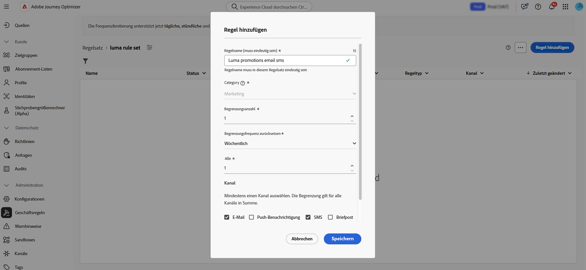
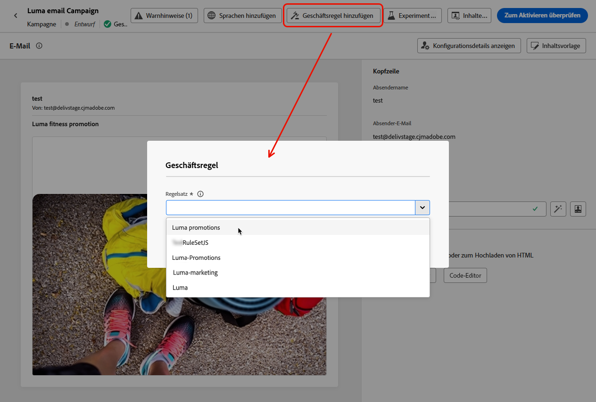
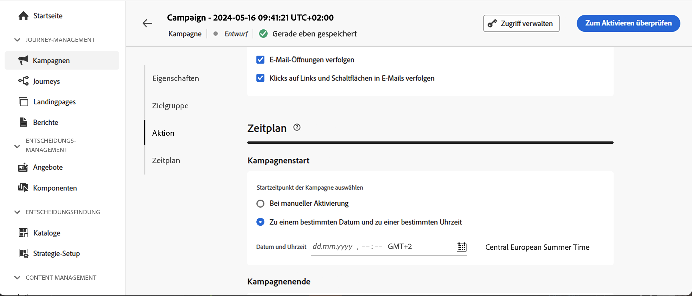

# Frequenzbegrenzung nach Kanal und Kommunikationstyp {#rule-sets}

**Kanal**-Regelsätze wenden Begrenzungsregeln für Kommunikationskanäle an. Senden Sie beispielsweise nicht mehr als eine E-Mail- oder SMS-Nachricht pro Tag.

Mithilfe von Kanalregelsätzen können Sie die Frequenzbegrenzung nach Kommunikationstyp festlegen, um zu verhindern, dass Kundinnen und Kunden zu viele ähnliche Nachrichten erhalten. Sie können zum Beispiel eine Regel festlegen, um die Anzahl der **Werbemitteilungen** zu begrenzen, die an Ihre Kundinnen und Kunden gesendet werden, und eine andere Regel, um die Anzahl der **Newsletter** zu begrenzen, die an sie gesendet werden. Je nach Kampagnentyp, den Sie erstellen, können Sie dann entweder den Regelsatz für die Werbekommunikation oder den für den Newsletter anwenden.

>[!IMPORTANT]
>
>Um zu gewährleisten, dass die Begrenzung auf Kanalebene richtig funktioniert, müssen Sie beim Erstellen einer Kampagne oder Journey den Namespace mit der höchsten Priorität auswählen. Weitere Informationen zur Namespace-Priorität finden Sie im [Handbuch zum Platform Identity Service](https://experienceleague.adobe.com/de/docs/experience-platform/identity/features/identity-graph-linking-rules/namespace-priority){target="_blank"}.

## Erstellen einer Kanal-Begrenzungsregel

>[!CONTEXTUALHELP]
>id="ajo_rule_sets_channel"
>title="Definieren der Kanäle, für die die Regel gilt"
>abstract="Wählen Sie mindestens einen Kanal aus. Die Begrenzung gilt als Gesamtanzahl für alle Kanäle."

Gehen Sie wie folgt vor, um einen Kanalregelsatz zu erstellen:

>[!NOTE]
>
>Sie können bis zu 10 aktive lokale Regelsätze für jede Kanal-Domain und für die Journey-Domain erstellen.

1. Rufen Sie die Liste **[!UICONTROL Regelsätze]** auf und klicken Sie dann auf **[!UICONTROL Regelsatz erstellen]**.

   

1. Wählen Sie den Regelsatz aus, dem Sie die Begrenzungsregel hinzufügen möchten, oder erstellen Sie einen neuen Regelsatz:

   * Um einen vorhandenen Regelsatz zu verwenden, wählen Sie ihn aus der Liste aus. Begrenzungsregeln für Kanäle können nur zu Regelsätzen mit der Domain „Kanal“ hinzugefügt werden. Sie können diese Informationen in den Regelsatzlisten in der Spalte **[!UICONTROL Domain]** überprüfen.

     

   * Um die Begrenzungsregel in einem neuen Regelsatz zu erstellen, klicken Sie auf **[!UICONTROL Regelsatz erstellen]**, geben Sie einen eindeutigen Namen für den Regelsatz ein und wählen Sie in der Dropdown-Liste **[!UICONTROL Domain des Regelsatzes]** die Option „Kanal“ aus. Klicken Sie anschließend auf **[!UICONTROL Speichern]**.

     

1. Klicken Sie im Bildschirm „Regelsatz“ auf die Schaltfläche **[!UICONTROL Regel hinzufügen]** und definieren Sie einen eindeutigen Namen für die Regel.

1. Das Feld **Kategorie** gibt die Kategorie der Nachricht an, für die die Regel gilt. Im Moment ist dieses Feld schreibgeschützt, da nur die Kategorie **[!UICONTROL Marketing]** verfügbar ist.

   

1. Legen Sie die Begrenzung für Ihre Regel im Feld **[!UICONTROL Begrenzungsanzahl]** fest, d. h. die maximale Anzahl der Nachrichten, die pro Monat, Woche, Tag oder Stunde – entsprechend Ihrer Auswahl in den folgenden Feldern – an ein individuelles Benutzerprofil gesendet werden können.

1. Legen Sie über die Dropdown-Liste **[!UICONTROL Begrenzungsfrequenz zurücksetzen]** fest, ob die Begrenzung stündlich, täglich, wöchentlich oder monatlich angewendet werden soll. Die Häufigkeitsbegrenzung basiert auf dem ausgewählten Kalenderzeitraum. Sie wird am Anfang des entsprechenden Zeitrahmens zurückgesetzt.

   Der Zähler läuft für jeden Zeitraum wie folgt ab:

   * **[!UICONTROL Stündlich]**: Die Frequenzbegrenzung ist für die ausgewählte Anzahl an Stunden gültig. Der Zähler wird zu Beginn jedes Zeitfensters automatisch zurückgesetzt. Bei einer Frequenzbegrenzung von 1 Stunde wird er jede Stunde zurückgesetzt, in Übereinstimmung mit dem Ende einer UTC-Stunde.
   * **[!UICONTROL Täglich]**: Die tägliche Frequenzbegrenzung ist für den Tag bis 23:59:59 UTC gültig und wird zu Beginn des nächsten Tages auf 0 zurückgesetzt.
   * **[!UICONTROL Wöchentlich]**: Die Frequenzbegrenzung ist bis Samstag, 23:59:59 Uhr UTC dieser Woche gültig. Das Ablaufdatum gilt unabhängig davon, wann die Regel erstellt wurde. Wenn die Regel beispielsweise am Donnerstag erstellt wird, gilt diese Regel bis Samstag um 23 Uhr:59:59.
   * **[!UICONTROL Monatlich]**: Die Frequenzbegrenzung ist bis zum letzten Tag des Monats um 23:59:59 UTC gültig. Beispielsweise beträgt die monatliche Gültigkeit für den 31.01.23:59:59 UTC.

   >[!IMPORTANT]
   >
   >* Um Genauigkeit zu gewährleisten, müssen Sie beim Erstellen einer Kampagne oder Journey den Namespace mit der höchsten Priorität auswählen. Weitere Informationen zur Namespace-Priorität finden Sie im [Handbuch zum Platform Identity Service](https://experienceleague.adobe.com/de/docs/experience-platform/identity/features/identity-graph-linking-rules/namespace-priority){target="_blank"} .
   >
   >* Der Zählerwert des Profils wird nach Versand der Nachricht aktualisiert. Seien Sie sich dessen bewusst, wenn Sie große Mengen an Nachrichten versenden, da der Durchsatz dazu führen kann, dass die Empfängerinnen und Empfänger die E-Mail erst Minuten oder sogar Stunden nach dem Beginn des Nachrichtenversands erhalten (wenn Sie beispielsweise Millionen von Nachrichten gleichzeitig versenden). Dies ist wichtig, wenn eine Person zwei Nachrichten kurz nacheinander erhält. Wir empfehlen, die Mitteilungen nach Möglichkeit im Abstand von mindestens zwei Stunden zu versenden, damit die Empfängerinnen und Empfänger genügend Zeit haben, die Mitteilung zu erhalten, und der Zählerwert entsprechend aktualisiert werden kann.

1. Mit dem Feld **[!UICONTROL Alle]** können Sie die Regeln zur Frequenzbegrenzung je nach angegebener Dauer über mehrere Stunden, Tage, Wochen oder Monate hinweg wiederholen. Beispiel: Wenden Sie die Regel zur Frequenzbegrenzung für 2 Wochen an.

   Stellen Sie sicher, dass Sie einen Wert eingeben, der dem ausgewählten Zeitdauertyp entspricht: 3–23 für „Stündlich“, 1–30 für „Täglich“, 1–4 für „Wöchentlich“ und 1–3 für „Monatlich“.

   Der Zähler wird automatisch auf 0 zurückgesetzt, wenn ein neues Zeitfenster beginnt. Bei einer Frequenzbegrenzung von 2 Tagen erfolgt dieses Zurücksetzen alle zwei Tage um Mitternacht UTC.

1. Wählen Sie den Kanal, den Sie für diese Regel verwenden möchten: **[!UICONTROL E-Mail]**, **[!UICONTROL SMS]**, **[!UICONTROL Push-Benachrichtigung]** oder **[!UICONTROL Direkt-Mail]**.

1. Wählen Sie mehrere Kanäle aus, wenn Sie für alle ausgewählten Kanäle gemeinsam eine Begrenzung festlegen möchten.

   Legen Sie beispielsweise die Begrenzung auf 5 fest und wählen Sie dann den E-Mail- und SMS-Kanal aus. Wenn ein Profil im ausgewählten Zeitraum bereits drei Marketing-E-Mails und 2 SMS erhalten hat, wird dieses Profil vom nächsten Versand einer Marketing-E-Mail oder SMS ausgeschlossen.

1. Klicken Sie auf **[!UICONTROL Speichern]**, um die Erstellung der Regel zu bestätigen. Ihre Nachricht wird dem Regelsatz mit dem Status **[!UICONTROL Entwurf]** hinzugefügt.

   

1. Wiederholen Sie die obigen Schritte, um dem Regelsatz so viele Regeln wie nötig hinzuzufügen.

1. Wenn die Begrenzungsregel für die Anwendung auf Nachrichten bereit ist, aktivieren Sie den Regelsatz und die Regel, wo sie hinzugefügt wurde. [Informationen zum Aktivieren von Regelsätzen](../conflict-prioritization/rule-sets.md#Create)

## Anwenden von Regelsätzen auf eine Nachricht {#apply-frequency-rule}

Gehen Sie wie folgt vor, um einen Regelsatz auf eine Nachricht anzuwenden:

1. Wählen Sie beim Erstellen einer Journey- oder Kampagnen-Nachricht einen der Kanäle aus, die für den Regelsatz festgelegt wurden, und bearbeiten Sie den Inhalt der Nachricht.

1. Klicken Sie im Bildschirm für die Bearbeitung von Inhalten auf die Schaltfläche **[!UICONTROL Geschäftsregel hinzufügen]**.

1. Wählen Sie den festgelegten Regelsatz aus.

   

   >[!NOTE]
   >
   >In der Liste werden nur [aktivierte](#activate-rule) Regelsätze angezeigt.

   <!--Messages where the category selected is **[!UICONTROL Transactional]** will not be evaluated against business rules.-->

1. Stellen Sie vor dem Aktivieren der Journey oder Kampagne muss sicher, dass die Ausführung mindestens 10 Minuten im Voraus geplant ist.

   Dies ermöglicht ausreichend Zeit, um die Zählerwerte im Profil für die ausgewählte Geschäftsregel zu füllen. Wenn Sie die Kampagne sofort aktivieren, werden die Zählerwerte des Regelsatzes nicht in den Profilen der Empfangenden ausgefüllt und die Nachricht wird nicht in Bezug auf die Frequenzbegrenzungsregeln für die benutzerdefinierten Regelsätze gezählt. Darüber hinaus funktioniert die Begrenzung möglicherweise nicht richtig für sofort aktivierte Journeys und Kampagnen und für durch API ausgelöste Kampagnen.

   

1. Die Anzahl der vom Versand ausgeschlossenen Profile können Sie im [Customer Journey Analytics-Bericht](../reports/report-gs-cja.md) und im [Live-Bericht](../reports/live-report.md) ansehen, wo die Häufigkeitsregeln als möglicher Grund für den Ausschluss von Benutzenden vom Versand angegeben sind.

>[!NOTE]
>
>Für denselben Kanal können mehrere Regeln angewendet werden, aber sobald die untere Begrenzung erreicht ist, wird das Profil von den nächsten Sendungen ausgeschlossen.

Beim Testen von Häufigkeitsregeln kann es hilfreich sein, mit einem neu erstellten [Testprofil](../audience/creating-test-profiles.md) zu beginnen, da es nach Erreichen der Frequenzbegrenzung eines Profils bis zur nächsten Periode nicht mehr möglich ist, den Zähler zurückzusetzen. Wenn Sie eine Regel deaktivieren, können Profile, für die die Begrenzung gilt, zwar Nachrichten empfangen, es werden aber keine Zählerschritte entfernt oder gelöscht.

>[!CAUTION]
>
>Die Regeln zur Frequenzlimitierung gelten auch für den Versand [Testsendungen](../content-management/proofs.md). Wenn ein Testprofil bereits das Häufigkeitslimit erreicht hat, werden die Testsendungen als abgeschlossen angezeigt, es wird jedoch keine E-Mail gesendet.

<!--add a new section for default priority namespace.-->

<!--
## Example: combine several rules {#frequency-rule-example}

You can combine several message frequency rules, such as described in the example below.

1. [Create a rule](#create-new-rule) called *Overall Marketing Capping*:

   * Select all channels.
   * Set capping to 12 monthly.

   

1. To further restrict the number of marketing-based push notifications that a user is sent, create a second rule called *Push Marketing Cap*:

   * Select Push channel.
   * Set capping to 4 monthly.

   

1. Save and [activate](#activate-rule) the rule.

1. [Create a message](../building-journeys/journeys-message.md) for every channel you want to communicate through and select the **[!UICONTROL Marketing]** category for each message. [Learn how to apply a frequency rule](#apply-frequency-rule)

   

In this scenario, an individual profile:
* can receive up to 12 marketing messages per month;
* but will be excluded from marketing push notifications after they have received 4 push notifications.-->

## Anleitungsvideo {#video}

>[!VIDEO](https://video.tv.adobe.com/v/3435531?quality=12)
