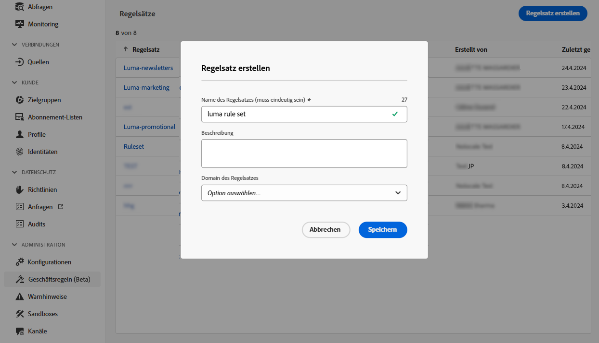
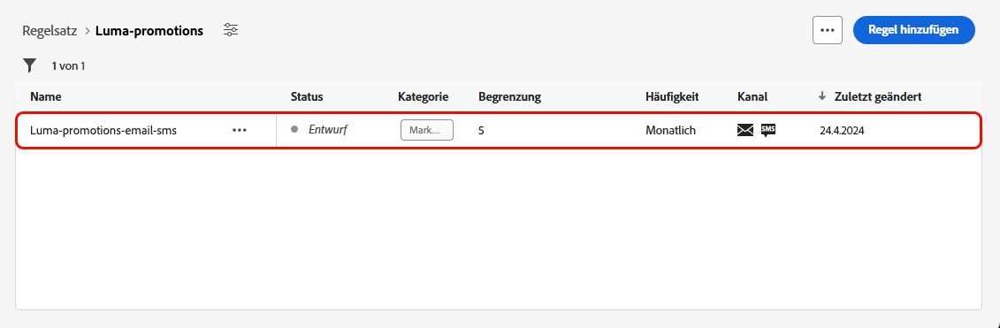

# Frequenzlimitierung nach Kanal und Kommunikationstyp {#rule-sets}

**Kanal** Regelsätze wenden Begrenzungsregeln auf Kommunikationskanäle an. Senden Sie beispielsweise nicht mehr als eine E-Mail- oder SMS-Nachricht pro Tag.

Mithilfe von Kanalregelsätzen können Sie die Frequenzlimitierung nach Kommunikationstyp festlegen, um zu verhindern, dass Kunden mit ähnlichen Nachrichten überlastet werden. Sie können zum Beispiel eine Regel festlegen, um die Anzahl der **Werbemitteilungen** zu begrenzen, die an Ihre Kundinnen und Kunden gesendet werden, und eine andere Regel, um die Anzahl der **Newsletter** zu begrenzen, die an sie gesendet werden. Je nach Kampagnentyp, den Sie erstellen, können Sie dann entweder den Regelsatz für die Werbekommunikation oder den für den Newsletter anwenden.

## Erstellen einer Kanalbegrenzungsregel

>[!CONTEXTUALHELP]
>id="ajo_rule_sets_channel"
>title="Definieren der Kanäle, für die die Regel gilt"
>abstract="Wählen Sie mindestens einen Kanal aus. Die Begrenzung gilt als Gesamtanzahl für alle Kanäle."

Gehen Sie wie folgt vor, um einen Kanalregelsatz zu erstellen:

>[!NOTE]
>
>Sie können bis zu 3 lokale Regelsätze der Kanal-Domain und bis zu 5 lokale Regelsätze der Journey-Domain erstellen.

1. Rufen Sie die Liste **[!UICONTROL Regelsätze]** auf und klicken Sie dann auf **[!UICONTROL Regelsatz erstellen]**.

   

1. Wählen Sie den Regelsatz aus, dem Sie die Begrenzungsregel hinzufügen möchten, oder erstellen Sie einen neuen Regelsatz:

   * Um einen vorhandenen Regelsatz zu verwenden, wählen Sie ihn aus der Liste aus. Regeln zur Kanalbegrenzung können nur zu Regelsätzen mit der Domain „channel“ hinzugefügt werden. Sie können diese Informationen in den Regelsatzlisten in der Spalte **[!UICONTROL Domain]** überprüfen.

     

   * Um die Begrenzungsregel in einem neuen Regelsatz zu erstellen, klicken Sie auf **[!UICONTROL Regelsatz erstellen]** geben Sie einen eindeutigen Namen für den Regelsatz an und wählen Sie „Kanal“ aus der Dropdown-Liste **[!UICONTROL Regelsatzdomäne]** aus und klicken Sie dann auf **[!UICONTROL Speichern]**.

     

1. Klicken Sie im Bildschirm Regelsatz auf die Schaltfläche **[!UICONTROL Regel hinzufügen]** und definieren Sie einen eindeutigen Namen für die Regel.

1. Das Feld **Kategorie** gibt die Kategorie der Nachricht an, für die die Regel gilt. Im Moment ist dieses Feld schreibgeschützt, da nur die Kategorie **[!UICONTROL Marketing]** verfügbar ist.

   

1. Legen Sie über die Dropdown-Liste **[!UICONTROL Dauer]** fest, ob die Begrenzung monatlich, wöchentlich oder täglich angewendet werden soll. Die Häufigkeitsbegrenzung basiert auf dem ausgewählten Kalenderzeitraum. Sie wird am Anfang des entsprechenden Zeitrahmens zurückgesetzt.

   Der Zähler läuft für jeden Zeitraum wie folgt ab:

   * **[!UICONTROL Monatlich]**: Die Häufigkeitsbegrenzung ist bis zum letzten Tag des Monats um 23:59:59 UTC gültig. Beispielsweise beträgt die monatliche Gültigkeit für den 31.01.23:59:59 UTC.

   * **[!UICONTROL Wöchentlich]**: Die Frequenzbegrenzung gilt bis Samstag 23:59:59 UTC der betreffenden Woche, da die Kalenderwoche am Sonntag beginnt. Das Ablaufdatum gilt unabhängig davon, wann die Regel erstellt wurde. Wenn die Regel beispielsweise am Donnerstag erstellt wird, gilt diese Regel bis Samstag um 23 Uhr:59:59.

   * **[!UICONTROL Täglich]**: Die tägliche Frequenzbegrenzung ist für den Tag bis 23:59:59 UTC gültig und wird zu Beginn des nächsten Tages auf 0 zurückgesetzt.

     >[!CAUTION]
     > 
     >Um die Genauigkeit der Regeln für die tägliche Frequenzbegrenzung zu gewährleisten, müssen Sie beim Erstellen einer Kampagne oder Journey den Namespace mit der höchsten Priorität auswählen. Weitere Informationen zur Namespace-Priorität finden Sie im [Handbuch zum Platform Identity Service](https://experienceleague.adobe.com/de/docs/experience-platform/identity/features/identity-graph-linking-rules/namespace-priority){target="_blank"}.

   Bitte beachten Sie, dass der Zählerwert des Profils nach Auslieferung der Mitteilung aktualisiert wird. Seien Sie sich dessen bewusst, wenn Sie große Mengen an Mitteilungen versenden, da der Durchsatz dazu führen kann, dass die Empfängerinnen und Empfänger die E-Mail erst Minuten oder sogar Stunden nach dem Beginn der Kommunikation erhalten (wenn Sie beispielsweise Millionen von Nachrichten gleichzeitig versenden).

   Dies ist wichtig, wenn eine Person zwei Mitteilungen kurz nacheinander erhält. Wir empfehlen, die Mitteilungen nach Möglichkeit im Abstand von mindestens zwei Stunden zu versenden, damit die Empfängerinnen und Empfänger genügend Zeit haben, die Mitteilung zu erhalten, und der Zählerwert entsprechend aktualisiert werden kann.

1. Legen Sie die Begrenzung für Ihre Regel fest, d. h. die maximale Anzahl der Nachrichten, die pro Monat, Woche oder Tag – entsprechend Ihrer Auswahl oben – an ein individuelles Benutzerprofil gesendet werden können.

1. Wählen Sie den Kanal, den Sie für diese Regel verwenden möchten: **[!UICONTROL E-Mail]**, **[!UICONTROL SMS]**, **[!UICONTROL Push-Benachrichtigung]** oder **[!UICONTROL Briefpost]**.

1. Wählen Sie mehrere Kanäle aus, wenn Sie für alle ausgewählten Kanäle gemeinsam eine Begrenzung festlegen möchten.

   Legen Sie beispielsweise die Begrenzung auf 5 fest und wählen Sie dann den E-Mail- und SMS-Kanal aus. Wenn ein Profil im ausgewählten Zeitraum bereits drei Marketing-E-Mails und 2 SMS erhalten hat, wird dieses Profil vom nächsten Versand einer Marketing-E-Mail oder SMS ausgeschlossen.

1. Klicken Sie auf **[!UICONTROL Speichern]**, um die Erstellung der Regel zu bestätigen. Ihre Nachricht wird dem Regelsatz mit dem Status **[!UICONTROL Entwurf]** hinzugefügt.

   

1. Wiederholen Sie die obigen Schritte, um dem Regelsatz so viele Regeln wie nötig hinzuzufügen.

1. Wenn die Begrenzungsregel für die Anwendung auf Nachrichten bereit ist, aktivieren Sie den Regelsatz und die Regel, in der er hinzugefügt wurde. [Erfahren Sie, wie Sie Regelsätze aktivieren](../conflict-prioritization/rule-sets.md#create)

## Anwenden von Regelsätzen auf eine Nachricht {#apply-frequency-rule}

Gehen Sie wie folgt vor, um einen Regelsatz auf eine Nachricht anzuwenden:

1. Wählen Sie beim Erstellen einer Journey- oder Kampagnennachricht einen der Kanäle aus, den Sie für Ihren Regelsatz definiert haben, und bearbeiten Sie den Inhalt Ihrer Nachricht

1. Klicken Sie im Bildschirm für die Bearbeitung von Inhalten auf die Schaltfläche **[!UICONTROL Geschäftsregel hinzufügen]**.

1. Wählen Sie den erstellten Regelsatz aus.

   

   >[!NOTE]
   >
   >In der Liste werden nur [aktivierte](#activate-rule) Regelsätze angezeigt.

   <!--Messages where the category selected is **[!UICONTROL Transactional]** will not be evaluated against business rules.-->

1. Bevor Sie Ihren Journey oder Ihre Kampagne aktivieren, sollten Sie sicherstellen, dass die Ausführung mindestens 20 Minuten in der Zukunft liegt.

   Dies ermöglicht ausreichend Zeit, um die Zählerwerte im Profil für die ausgewählte Geschäftsregel zu füllen. Wenn Sie die Kampagne sofort aktivieren, werden die Zählerwerte des Regelsatzes nicht in den Profilen der Empfangenden angezeigt und die Nachricht wird nicht in Bezug auf die Frequenzbegrenzungsregeln für die benutzerdefinierten Regelsätze gezählt.

   

1. Die Anzahl der vom Versand ausgeschlossenen Profile können Sie im [Customer Journey Analytics-Bericht](../reports/report-gs-cja.md) und im [Live-Bericht](../reports/live-report.md) ansehen, wo die Häufigkeitsregeln als möglicher Grund für den Ausschluss von Benutzenden vom Versand angegeben sind.

>[!NOTE]
>
>Für denselben Kanal können mehrere Regeln angewendet werden, aber sobald die untere Begrenzung erreicht ist, wird das Profil von den nächsten Sendungen ausgeschlossen.

Beim Testen von Häufigkeitsregeln kann es hilfreich sein, mit einem neu erstellten [Testprofil](../audience/creating-test-profiles.md) zu beginnen, da es nach Erreichen der Frequenzbegrenzung eines Profils bis zur nächsten Periode nicht mehr möglich ist, den Zähler zurückzusetzen. Wenn Sie eine Regel deaktivieren, können Profile, für die die Begrenzung gilt, zwar Nachrichten empfangen, es werden aber keine Zählerschritte entfernt oder gelöscht.

<!--
## Example: combine several rules {#frequency-rule-example}

You can combine several message frequency rules, such as described in the example below.

1. [Create a rule](#create-new-rule) called *Overall Marketing Capping*:

   * Select all channels.
   * Set capping to 12 monthly.

   

1. To further restrict the number of marketing-based push notifications that a user is sent, create a second rule called *Push Marketing Cap*:

   * Select Push channel.
   * Set capping to 4 monthly.

   

1. Save and [activate](#activate-rule) the rule.

1. [Create a message](../building-journeys/journeys-message.md) for every channel you want to communicate through and select the **[!UICONTROL Marketing]** category for each message. [Learn how to apply a frequency rule](#apply-frequency-rule)

   

In this scenario, an individual profile:
* can receive up to 12 marketing messages per month;
* but will be excluded from marketing push notifications after they have received 4 push notifications.-->

## Anleitungsvideo {#video}

>[!VIDEO](https://video.tv.adobe.com/v/3444735?quality=12&captions=ger)
