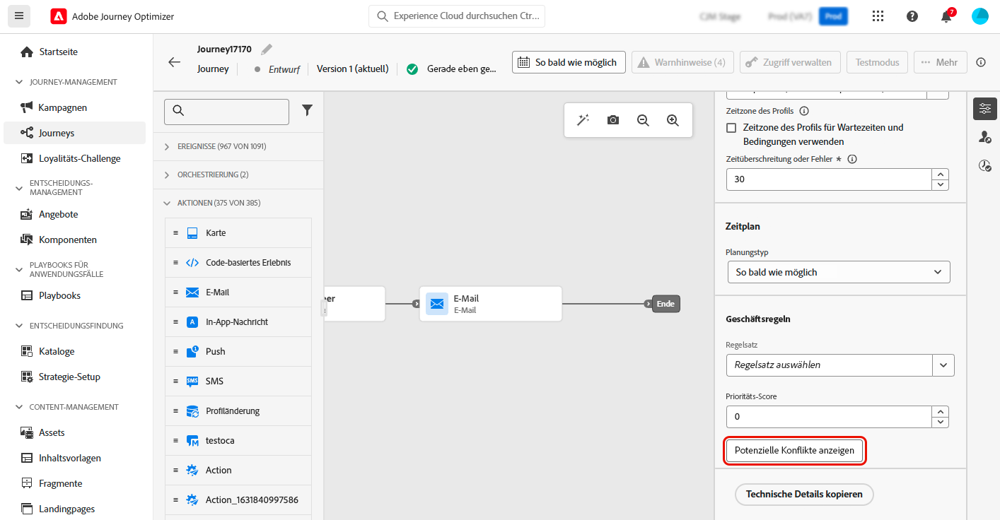
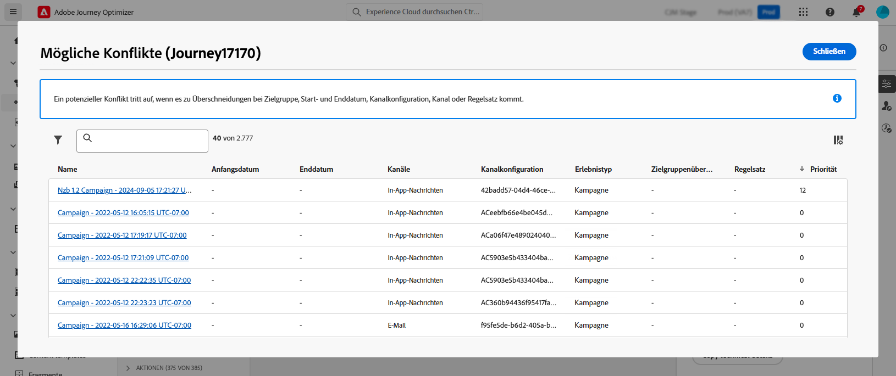

# Erkennen von potenziellen Konflikten in Journeys und Kampagnen {#conflict}

Wenn Marketing-Fachleute das Volumen von Kampagnen und Journeys in Journey Optimizer erhöhen, wird es für sie immer schwieriger festzustellen, ob sie ihre Kundschaft mit zu vielen Marketing-Interaktionen bombardieren. Daher ist es wichtig, dass sie leicht erkennen können, wann es zu Überschneidungen von Kampagnen und Journeys kommt, um so sicherzustellen, dass sie das richtige Gleichgewicht in der Marketing-Kommunikation finden und gleichzeitig das Risiko einer Ermüdung der Kundschaft minimieren.

Wichtige Bereiche, die auf mögliche Überschneidungen hin überwacht werden sollten, sind:

* **Timeline** (Start- und Enddatum): Laufen zu viele Journeys gleichzeitig?
* **Zielgruppe**: Wie viel Prozent meiner Journey-Zielgruppe sind auch Teil anderer Journeys?
* **Kanal**: Sind für denselben Zeitraum weitere Kommunikationsmaßnahmen geplant, und wenn ja, wie viele?
* **Regelwerk für Begrenzungen**: Welche Arten von Journeys werden von mir begrenzt und kommt es innerhalb dieser zu Überschneidungen?
* **Kanalkonfiguration**: Gibt es andere Journeys oder Kampagnen, die eine Kanalkonfiguration verwenden, die in derselben Journey oder Kampagne verwendet wird, was dazu führen könnte, dass die Journey oder Kampagne den Endbenutzenden nicht angezeigt wird?

➡️ [Funktion im Video kennenlernen](#video)

## So erkennt Journey Optimizer Konflikte {#detection}

Nachfolgend finden Sie eine Zusammenfassung darüber, wie Journey Optimizer potenzielle Konflikte für Journeys und Kampagnen identifiziert:

* **Umfang der Konfliktidentifizierung**: Konflikte werden nur für aktive oder geplante Kampagnen und Journeys angezeigt.
* **Unitäre Journeys**: Wenn die ausgewählte Journey unitär ist, werden andere Journeys angezeigt, die mit demselben Ereignis beginnen, da dieses Ereignis alle diese Journeys auslöst.
* **Zielgruppenqualifizierung und die Journeys „Zielgruppe lesen“/„Geschäftsereignis lesen“**: Wenn es sich bei der ausgewählten Journey entweder um eine Zielgruppenqualifizierung oder die Journey „Zielgruppe lesen“ oder „Geschäftsereignis lesen“ handelt, werden alle anderen Journeys desselben Typs mit einer gültigen Zielgruppe angezeigt, da es Überschneidungen zwischen den Zielgruppen geben kann.
* **Kampagnen**: Da alle Kampagnen auf Zielgruppen ausgerichtet sind und es kein Konzept für Ereignisse gibt, können alle Kampagnen potenziell mit segmentgesteuerten Journeys (beginnend mit der Aktivität „Zielgruppe lesen“) in Konflikt stehen.
* **Live-/Geplante Kampagnen**: Live- und geplante Kampagnen können aufgrund möglicher Überschneidungen bei den Zielgruppen miteinander in Konflikt stehen. Für jede beliebige Kampagne werden alle Live- oder geplanten Kampagnen in der Konfliktansicht aufgelistet.

## Anzeigen von erkannten Konflikten für eine bestimmte Journey oder Kampagnen {#view}

>[!CONTEXTUALHELP]
>id="ajo_campaigns_campaign_conflict"
>title="Anzeigen potenzieller Konflikte"
>abstract="Prüfen Sie dies, wann immer Überschneidungen mit anderen Kampagnen möglich sind. Konflikte werden nur für Live- und geplante Kampagnen angezeigt. Beachten Sie, dass die Schaltfläche verfügbar wird, wenn Sie eine der folgenden Einstellungen zugewiesen haben: **[!UICONTROL Start-/Enddatum]**, **[!UICONTROL Zielgruppe]**, **[!UICONTROL Kanal]**, **[!UICONTROL Kanalkonfiguration]** und **[!UICONTROL Regelsatz]**."

>[!CONTEXTUALHELP]
>id="ajo_journey_conflict"
>title="Anzeigen potenzieller Konflikte"
>abstract="Prüfen Sie dies, wann immer Überschneidungen mit anderen Journeys möglich sind. Konflikte werden nur für Live- und geplante Journeys angezeigt. Beachten Sie, dass die Schaltfläche verfügbar wird, wenn Sie eine der folgenden Einstellungen zugewiesen haben: **[!UICONTROL Start-/Enddatum]**, **[!UICONTROL Zielgruppe]**, **[!UICONTROL Kanal]**, **[!UICONTROL Kanalkonfiguration]** und **[!UICONTROL Regelsatz]**."

Wenn Sie eine Journey oder Kampagne erstellen, können Sie mit Journey Optimizer überprüfen, ob es zu Überschneidungen mit anderen Journeys oder Kampagnen kommen kann. Gehen Sie dazu wie folgt vor:

1. Klicken Sie beim Erstellen einer Journey oder Kampagne in den Eigenschaften der Journey oder Kampagne auf die Schaltfläche **[!UICONTROL Potenzielle Konflikte anzeigen]**.

   

   >[!NOTE]
   >
   >Die Schaltfläche **[!UICONTROL Potenzielle Konflikte anzeigen]** wird verfügbar, sobald Sie eine der folgenden Einstellungen zugewiesen haben: **[!UICONTROL Start-/Enddatum]**, **[!UICONTROL Zielgruppe]**, **[!UICONTROL Kanal]**, **[!UICONTROL Kanalkonfiguration]** und **[!UICONTROL Regelsatz]**. Stellen Sie sicher, dass Sie nach dem Zuweisen dieser Einstellungen **[!UICONTROL Speichern]** auswählen, da die Schaltfläche erst ausgewählt werden kann, wenn die Änderungen gespeichert wurden.

1. Es öffnet sich das Fenster **[!UICONTROL Potenzielle Konflikte]**, in dem Sie alle Elemente sehen können, die sich mit der aktuellen Journey/Kampagne überschneiden.

   Sie können eine sich überschneidende Journey oder Kampagne direkt über diesen Bildschirm öffnen, indem Sie deren Namen auswählen.

   

   >[!NOTE]
   >
   >Bei neu veröffentlichten Journeys und Kampagnen kann es aufgrund dem implementiertem Caching 3 bis 7 Minuten dauern, bis sie im Konflikt-Viewer angezeigt werden

Um die Suche nach potenziellen Überschneidungen weiter zu verfeinern, können Sie Ihre Liste der Kampagnen und Journeys nach den relevanten Feldern filtern. Wählen Sie dazu das Filtersymbol in der Ansicht „Sammlungsbestand“ aus. [Erfahren Sie, wie Sie mit Filtern arbeiten](../start/search-filter-categorize.md#filter-lists)

## Lösen von Konflikten {#resolve}

Hier sind einige Tipps, um potenzielle Konflikte zu reduzieren, sobald sie erkannt wurden:

* Passen Sie die **Start-/Enddaten** an, um überlappende Kampagnen oder Journey zu vermeiden.
* Verfeinern Sie das **Zielgruppen-Targeting**, um Überschneidungen zwischen Journeys zu minimieren.
* Implementieren Sie **Begrenzungen der Häufigkeit**, um zu verhindern, dass die Kundschaft zu viele Mitteilungen erhält.
* Reduzieren Sie die Anzahl der **aktiven Journeys**, um das Erlebnis für Ihre Kundschaft effektiver zu gestalten.
* Setzen Sie **Prioritäten** für eingehende Aktionen, um sicherzustellen, dass Ihrer Kundschaft die wichtigste Aktion angezeigt wird.

Mithilfe dieser Funktionen können Sie sicherstellen, dass Ihre Marketing-Maßnahmen aufeinander abgestimmt sind und dass Sie in Ihrer Kommunikationsstrategie das richtige Gleichgewicht wahren.

## Anleitungsvideo {#video}

>[!VIDEO](https://video.tv.adobe.com/v/3435528?quality=12)
