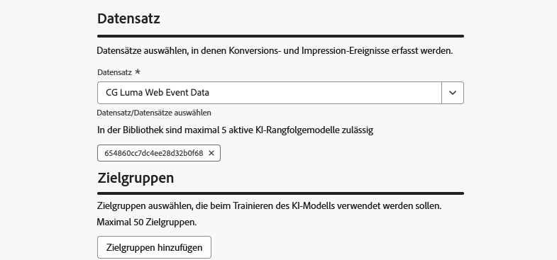
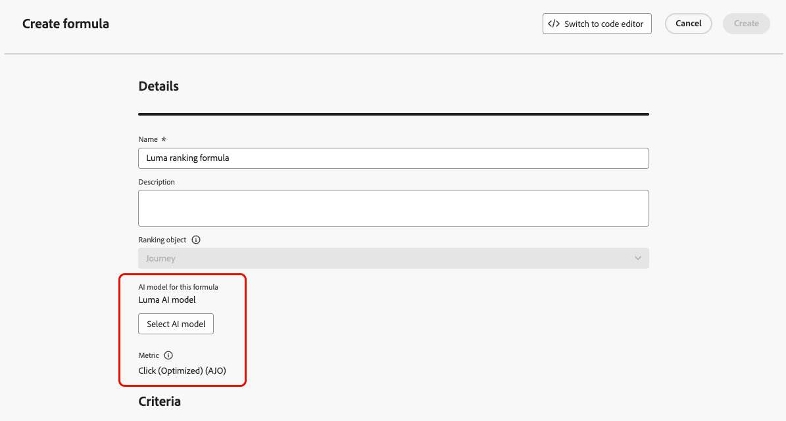

# Verwenden von KI-Modellen zum Sortieren von Journey {#journey-ai-models}

>[!AVAILABILITY]
>
>Diese Funktion ist derzeit nur eingeschränkt verfügbar. Wenden Sie sich an den Adobe-Support, um Zugriff zu erhalten.

[!DNL Adobe Journey Optimizer] können Sie steuern, welche Journey ein Profil eingeben kann, wenn diese für mehr qualifiziert sind als das System zulässt. Hierfür können Sie mithilfe von [Regelsätzen](rule-sets.md) Begrenzungen für Journey-Einträge oder gleichzeitige Zugriffe definieren. Wenn ein Profil für mehr Journey geeignet ist, als die Obergrenze zulässt, bestimmt die jedem Journey zugewiesene Priorität, welche Journey ausgewählt werden.

Anstatt Priorität zu verwenden, können Sie auch **KI-Modelle** in Ihren Rangfolgeformeln verwenden, um Journey basierend auf trainierten Modellbewertungen dynamisch zu reihen.

## Erstellen eines KI-Modells {#create-ai-model}

<!--Do you need specific permissions to create AI models?
>[!CAUTION]
>
>To create, edit, or delete AI models, you must have the **Manage Ranking Strategies** permission. [Learn more](../administration/high-low-permissions.md#manage-ranking-strategies)-->

Gehen Sie wie folgt vor, um ein KI-Modell für das Journey-Ranking zu erstellen.

1. Erstellen Sie einen Datensatz, in dem Konversionsereignisse erfasst werden. [Weitere Informationen](../experience-decisioning/data-collection/create-dataset.md)

1. Rufen Sie den Abschnitt **[!UICONTROL Orchestrierungs-Rangfolge]** auf und wählen Sie dann die Registerkarte **[!UICONTROL KI-Modelle]** aus. Die Liste der zuvor erstellten KI-Modelle wird angezeigt.

1. Klicken Sie **[!UICONTROL KI-Modell erstellen]**.

1. Geben Sie einen eindeutigen Namen und bei Bedarf eine Beschreibung für das KI-Modell an.

   {width="80%"}

   >[!NOTE]
   >
   >Das Ranking-Objekt ist die Entität, auf die die Rangfolgenformel angewendet wird. Standardmäßig ist das Ranking-Objekt auf **[!UICONTROL Journey]** festgelegt.

<!--
1. Select the type of AI model you want to create:

    * **[!UICONTROL Auto-optimization]** optimizes based on past performance. [Learn more](../experience-decisioning/ranking/auto-optimization-model.md)
    * **[!UICONTROL Personalized optimization]** optimizes and personalizes based on audiences and performance. [Learn more](../experience-decisioning/ranking/personalized-optimization-model.md)-->

1. In der **[!UICONTROL Optimierungsmetrik]** werden alle Metriken aus Ihrer [!DNL Customer Journey Analytics] ([) &#x200B;](https://experienceleague.adobe.com/de/docs/analytics-platform/using/cja-dataviews/data-views){target="_blank"} Liste angezeigt. Wählen Sie die Metrik aus, für die Sie Ihr Modell optimieren möchten.

   {width="80%"}

   [!DNL Journey Optimizer] rangiert auf der Basis **Konversionsrate** (Konversionsrate = Gesamtzahl der Konversionsereignisse / Gesamtzahl der Impression-Ereignisse). Die Konversionsrate wird wie folgt berechnet:

   * **Impression-Ereignisse** (angezeigte Elemente)
   * **Konversionsereignisse** (Elemente, die zu Klicks oder Konversionen führen)

   Diese Ereignisse werden automatisch mit der Web-SDK oder der mobilen SDK erfasst. Weitere Informationen finden Sie im Überblick über das [Adobe Experience Platform Web SDK](https://experienceleague.adobe.com/docs/experience-platform/edge/home.html?lang=de).

1. Wählen Sie die Datensätze aus, in denen die Konversions- und Impression-Ereignisse erfasst werden. In [diesem Abschnitt](../experience-decisioning/data-collection/create-dataset.md) erfahren Sie, wie Sie solche Datensätze erstellen.

   {width="85%"}

   >[!CAUTION]
   >
   >In der Dropdown-Liste werden nur Datensätze angezeigt, die aus Schemata erstellt wurden, die mit der Feldergruppe (früher als Mixin bezeichnet) **[!UICONTROL Erlebnisereignis – Vorschlagsinteraktionen]** verknüpft sind.

1. &#x200B;<!--If you are creating a **[!UICONTROL Personalized optimization]** AI model, -->Wählen Sie die Segmente aus, die zum Trainieren des KI-Modells verwendet werden sollen.

   >[!NOTE]
   >
   >Sie können bis zu 50 Zielgruppen auswählen.

1. Speichern und aktivieren Sie das KI-Modell.

Das KI-Modell kann jetzt ausgewählt werden, wenn Sie eine Rangfolgenformel erstellen.

## KI-Modell für eine Rangfolgenformel auswählen {#select-ai-model-for-ranking-formula}

Sie können jetzt das KI-Modell als Referenz festlegen, um eine Rangfolgenformel zu erstellen. Gehen Sie wie folgt vor.

1. Erstellen Sie eine Rangfolgenformel. [Weitere Informationen](journey-ranking-formulas.md#create-journey-ranking-formula)

1. Verwenden Sie die **[!UICONTROL KI-Modell auswählen]**, um das gewünschte KI-Modell auszuwählen.

   {width="80%"}

1. Definieren Sie in mindestens einem der Abschnitte **[!UICONTROL Kriterium]** eine Bedingung und wählen Sie **[!UICONTROL KI-Modellwert]** als Rangfolgenmethode aus. Wenn die Journey beispielsweise das Tag „Promo“ aufweist, ist der Rangfolgenwert der KI-Modellwert.

   {width="60%"}

1. Klicken Sie **[!UICONTROL Erstellen]**, um Ihre Rangfolgenformel abzuschließen.

## Zuweisen des KI-Modells zu einem Regelsatz {#assign-ai-model-to-ruleset}

Um ein KI-Modell zur Rangfolge Ihrer Journey zu verwenden, müssen Sie die Formel, die auf dieses KI-Modell verweist, einem Regelsatz zuweisen.

1. Erstellen Sie im Menü **[!UICONTROL Geschäftsregeln]** einen Regelsatz, den Sie für die Journey-Schlichtung verwenden möchten. [Weitere Informationen](rule-sets.md#Create)

1. Wählen Sie unbedingt die Domain **[!UICONTROL Journey]** aus.

1. Legen Sie in den Eigenschaften des Regelsatzes die **[!UICONTROL Rangfolgenmethode]** auf **[!UICONTROL Formel]** (anstelle von **[!UICONTROL Priorität]**) fest.

1. Wählen Sie aus der Dropdown-Liste die Formel aus, die das von Ihnen erstellte KI-Modell verwendet.

1. Erstellen Sie die Journey-Begrenzungsregeln, die Sie dem Regelsatz hinzufügen möchten. [Weitere Informationen](journey-capping.md#create-rule)

1. Speichern Sie den Regelsatz.

Jetzt wird die Formel mit dem KI-Modell dem Regelsatz zugewiesen. Sie können diesen Regelsatz dann auf Ihre Journey anwenden.

## Anwenden des Regelsatzes auf eine Journey {#assign-rule-set-to-journey}

Gehen Sie wie folgt vor, um den Regelsatz einer Journey zuzuweisen.

1. Erstellen oder öffnen Sie die Journey, der Sie den Regelsatz zuweisen möchten. [Erfahren Sie, wie Sie eine Journey erstellen](../building-journeys/journey-gs.md)

1. Wählen Sie in den Journey-Eigenschaften den Regelsatz aus der Dropdown-Liste aus. [Weitere Informationen](journey-capping.md#apply-capping).

   >[!NOTE]
   >
   >Auf eine Journey kann jeweils nur ein Regelsatz angewendet werden.

1. Speichern Sie die Journey.

Alle Journey, die diesen Regelsatz verwenden, werden mit der ausgewählten Formel anhand des KI-Modells eingestuft, wenn die Begrenzung angewendet wird.
