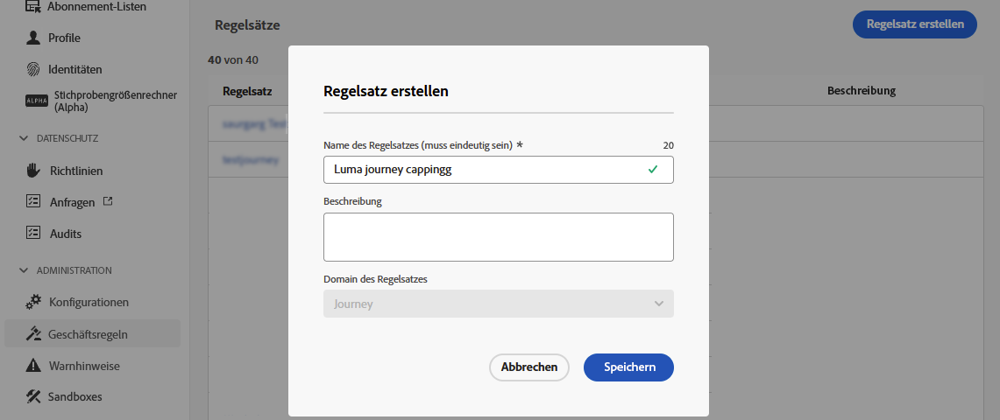

# Journey-Begrenzung und Arbitration {#journey-capping}

>[!CONTEXTUALHELP]
>id="ajo_journey_capping_rule"
>title="Anwenden des Regelsatzes auf Journeys"
>abstract="Regelsatz anwenden, damit ein Teil der Zielgruppe anhand von Regeln zur Frequenzbegrenzung von dieser Journey ausgeschlossen wird."

>[!CONTEXTUALHELP]
>id="ajo_rule_set_concurrency_prioritization"
>title="Vorschau der Priorisierung"
>abstract=" Wenn eine Journey mit höherer Priorität innerhalb des hier angegebenen Zeitraums geplant ist, wird der Eintritt der Kundin bzw. des Kunden in die Journey unterbunden. Für Situationen, in denen der Journey-Eintritt nach dem Windhundverfahren erfolgen soll, wird empfohlen, den täglichen Vorschauzeitraum auszuwählen und sicherzustellen, dass der Prioritätswert aller anderen Journeys an diesem Tag unter dem Prioritätswert für die Journey liegt. Wenn eine Journey einen Prioritätswert von 100 erhält, würde das ebenfalls einen Eintritt in die Journey sicherstellen."

>[!CONTEXTUALHELP]
>id="ajo_rule_set_prioritization"
>title="Faktor bei der Priorisierung"
>abstract="TBD"

>[!AVAILABILITY]
>
>Funktionen zur Konflikt- und Priorisierung sind derzeit in eingeschränkter Verfügbarkeit für ausgewählte Kunden verfügbar. Sie werden in Zukunft schrittweise für weitere Benutzende eingeführt. Wenden Sie sich an Ihr Accountteam, wenn Sie auf die Warteliste für diese Funktionen gesetzt werden möchten.

Mit der Journey-Begrenzung können Sie die Anzahl der Journey einschränken, in die sich ein Profil eintragen kann, wodurch eine Kommunikationsüberlastung verhindert wird. In Journey Optimizer können Sie zwei Arten von Begrenzungsregeln festlegen:

* **Einstiegsbegrenzung** begrenzt die Anzahl der Journey-Einträge für einen Profilzeitraum.
* **Parallele Begrenzungen** beschränken, wie viele Journey ein Profil gleichzeitig eingeschrieben werden kann.

Beide Arten von Journey-Begrenzungen nutzen Prioritätswerte, um Einträge zu schlichten.

➡️ [Entdecken Sie diese Funktion im Video](#video)

## Erstellen einer Journey-Begrenzungsregel {#create-rule}

Gehen Sie wie folgt vor, um eine Journey-Begrenzungsregel zu erstellen:

1. Navigieren Sie zum Menü **[!UICONTROL Geschäftsregeln (Beta)]** , um auf den Regelsatzbestand zuzugreifen.

1. Wählen Sie den Regelsatz aus, dem Sie die Begrenzungsregel hinzufügen möchten, oder erstellen Sie einen neuen Regelsatz:

   * Um einen vorhandenen Regelsatz zu verwenden, wählen Sie ihn aus der Liste aus. Journey-Begrenzungsregeln können nur zu Regelsätzen mit der Domäne &quot;Journey&quot;hinzugefügt werden. Sie können diese Informationen in den Regelsatzlisten in der Spalte **[!UICONTROL Domäne]** überprüfen.

     

   * Um die Begrenzungsregel in einem neuen Regelsatz zu erstellen, klicken Sie auf **[!UICONTROL Regelsatz erstellen]**, geben Sie einen eindeutigen Namen für den Regelsatz an und wählen Sie &quot;Journey&quot;aus der Dropdown-Liste **[!UICONTROL Regelsatzdomäne]** aus und klicken Sie dann auf **[!UICONTROL Speichern]**.

     

1. Klicken Sie im Regelsatzbildschirm auf die Schaltfläche **[!UICONTROL Regel hinzufügen]** und konfigurieren Sie dann die Regel entsprechend Ihren Anforderungen:

   

   * Geben Sie einen eindeutigen Namen für die Regel an.

   * Geben Sie in der Dropdownliste **[!UICONTROL Regeltyp]** den Begrenzungstyp für die Regel an.

      * **[!UICONTROL Journey Entry Cap]**: Beschränkt die Anzahl der Einträge in die Journey über einen bestimmten Zeitraum für ein Profil.
      * **[!UICONTROL Journey Concurrency Cap]**: Beschränkt, wie viele Journey ein Profil gleichzeitig eingeschrieben werden kann.

   * Erweitern Sie die folgenden Abschnitte, um zu erfahren, wie Sie die einzelnen Begrenzungstypen konfigurieren:

     +++Journey-Einstiegsbegrenzungsregel konfigurieren

      1. Legen Sie im Feld **[!UICONTROL Begrenzung]** die maximale Anzahl von Journey fest, die ein Profil eingeben kann.
      1. Definieren Sie im Feld **[!UICONTROL Dauer]** den zu berücksichtigenden Zeitraum. Bitte beachten Sie, dass die Dauer auf der UTC-Zeitzone basiert. Beispielsweise wird die tägliche Obergrenze um Mitternacht UTC zurückgesetzt.

     In diesem Beispiel möchten wir verhindern, dass Profile in einem Monat mehr als &quot;5&quot; Journey erreichen.

     

     >[!NOTE]
     >
     >Das System berücksichtigt die Priorität bevorstehender geplanter Journey, auf die dieselbe Regel angewendet wird.
     >
     >Wenn der Marketingspezialist in diesem Beispiel bereits vier Journey erreicht hat und in diesem Monat eine weitere geplante Journey mit höherer Priorität ansteht, werden die Kunden daran gehindert, in die Journey mit der niedrigeren Priorität einzutreten.

+++

     +++Journey-Begrenzungsregel konfigurieren

      1. Legen Sie im Feld **[!UICONTROL Begrenzung]** die maximale Anzahl von Journey fest, an denen ein Profil gleichzeitig angemeldet werden kann.

      1. Verwenden Sie das Feld **[!UICONTROL Priorization look ahead]** , um Journey-Einträge basierend auf Prioritätsbewertungen über einen ausgewählten Zeitraum (z. B. 1 Tag, 7 Tage, 30 Tage) zu schlichten. Dies hilft bei der Priorisierung der Eingabe in Journey mit höherem Wert, wenn ein Profil für mehrere Journey qualifiziert ist.

     In diesem Beispiel möchten wir die Eingabe von Profilen auf die Journey beschränken, wenn diese bereits in einer anderen Journey mit demselben Regelsatz angemeldet sind. Wenn eine weitere Journey innerhalb der nächsten sieben Tage eine höhere Priorität hat, wird das Profil diese Journey nicht eingeben.

     {width="50%" zommable="yes"}

+++

1. Wenn die Begrenzungsregel für die Anwendung auf Journey bereit ist, aktivieren Sie sie, indem Sie auf die Schaltfläche mit Auslassungspunkten neben ihrem Namen klicken.

   

1. Aktivieren Sie den gesamten Regelsatz, indem Sie in der oberen rechten Ecke des Bildschirms auf die Suchschaltfläche neben der Schaltfläche Regel hinzufügen klicken.

   

## Begrenzungsregeln auf Journey anwenden {#apply-capping}

Um eine Begrenzungsregel auf eine Journey anzuwenden, greifen Sie auf die Journey zu und öffnen Sie die zugehörigen Eigenschaften. Wählen Sie in der Dropdown-Liste **[!UICONTROL Begrenzungsregeln]** den relevanten Regelsatz aus. Sobald die Journey aktiviert ist, werden die im Regelsatz definierten Begrenzungsregeln wirksam.

>[!IMPORTANT]
>
>Wenn eine Journey sofort aktiviert wird, kann es bis zu 15 Minuten dauern, bis das System mit der Unterdrückung von Kunden beginnt. Sie können Ihre Journey so planen, dass sie mindestens 15 Minuten in die Zukunft beginnt, um dies zu verhindern.

Sobald die Journey live ist, können Sie im Journey-Bericht überprüfen, ob der Regelsatz zu einem Ausschluss vom Journey geführt hat, und zwar in der Tabelle **[!UICONTROL Journey Exclusions]** . [Erfahren Sie, wie Sie mit Journey-Berichten arbeiten](../reports/journey-global-report-cja.md)

## Anleitungsvideo {#video}

>[!VIDEO](https://video.tv.adobe.com/v/3435530?quality=12)
