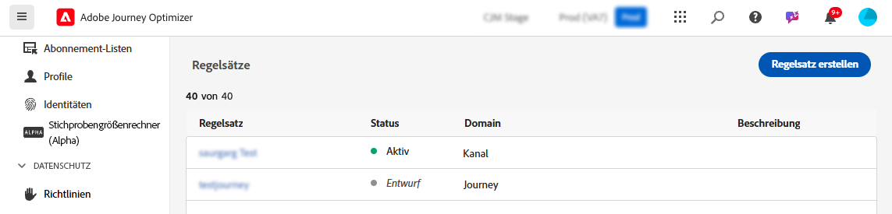
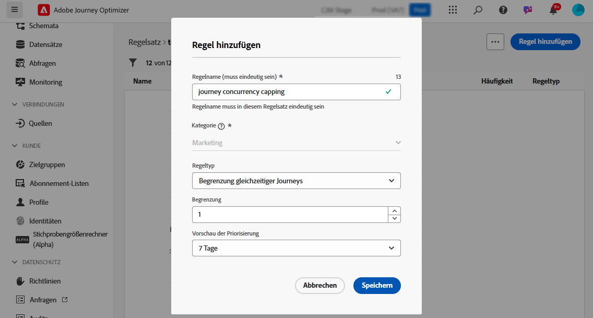

# Journey-Begrenzung und -Steuerung {#journey-capping}

Mit der Journey-Begrenzung können Sie die Anzahl der Journeys einschränken, an denen ein Profil teilnehmen kann, wodurch eine Kommunikationsüberlastung verhindert wird. In Journey Optimizer können Sie zwei Arten von Begrenzungsregeln festlegen:

* **Begrenzung für Eintritte**: Beschränkt die Anzahl der Eintritte in die Journey für ein Profil über einen bestimmten Zeitraum.
* **Begrenzung gleichzeitiger Journeys**: Beschränkt, an wie vielen Journeys ein Profil gleichzeitig teilnehmen kann.

Beide Arten von Journey-Begrenzungen nutzen Prioritätswerte, um Eintritte zu steuern.

➡️ [Funktion im Video kennenlernen](#video)

## Erstellen einer Journey-Begrenzungsregel {#create-rule}

>[!CONTEXTUALHELP]
>id="ajo_rule_set_concurrency_prioritization"
>title="Vorschau der Priorisierung"
>abstract=" Wenn eine Journey mit höherer Priorität innerhalb des hier angegebenen Zeitraums geplant ist, wird der Eintritt der Kundin bzw. des Kunden in die Journey unterbunden. Für Situationen, in denen der Journey-Eintritt nach dem Windhundverfahren erfolgen soll, wird empfohlen, den täglichen Vorschauzeitraum auszuwählen und sicherzustellen, dass der Prioritätswert aller anderen Journeys an diesem Tag unter dem Prioritätswert für die Journey liegt. Wenn eine Journey einen Prioritätswert von 100 erhält, würde das ebenfalls einen Eintritt in die Journey sicherstellen."

>[!CONTEXTUALHELP]
>id="ajo_rule_set_rule_type"
>title="Regeltyp"
>abstract="Geben Sie den Begrenzungstyp für die Regel an. Die **[!UICONTROL Begrenzung für Journey-Eintritte]** begrenzt für ein Profil die Anzahl der Eintritte in die Journey über einen bestimmten Zeitraum, während die **[!UICONTROL Begrenzung gleichzeitiger Journeys]** eingrenzt, in wie viele Journeys ein Profil gleichzeitig eingetreten sein kann."

Gehen Sie wie folgt vor, um eine Journey-Begrenzungsregel zu erstellen:

1. Navigieren Sie zum Menü **[!UICONTROL Geschäftsregeln]**, um auf den Regelsatzbestand zuzugreifen.

1. Wählen Sie den Regelsatz aus, dem Sie die Begrenzungsregel hinzufügen möchten, oder erstellen Sie einen neuen Regelsatz:

   * Um einen vorhandenen Regelsatz zu verwenden, wählen Sie ihn aus der Liste aus. Journey-Begrenzungsregeln können nur zu Regelsätzen mit der Domain „Journey“ hinzugefügt werden. Sie können diese Informationen in den Regelsatzlisten in der Spalte **[!UICONTROL Domain]** überprüfen.

     

   * Um die Begrenzungsregel in einem neuen Regelsatz zu erstellen, klicken Sie auf **[!UICONTROL Regelsatz erstellen]**, geben Sie einen eindeutigen Namen für den Regelsatz an und wählen Sie in der Dropdown-Liste **[!UICONTROL Domain des Regelsatzes]** die Option „Journey“ aus. Klicken Sie anschließend auf **[!UICONTROL Speichern]**.

     

1. Klicken Sie Bildschirm „Regelsatz“ auf die Schaltfläche **[!UICONTROL Regel hinzufügen]** und geben Sie einen eindeutigen Namen für die Regel an.

1. Geben Sie in der Dropdown-Liste **[!UICONTROL Regeltyp]** den Begrenzungstyp für die Regel an.

   * **[!UICONTROL Begrenzung für Journey-Eintritte]**: Beschränkt für ein Profil die Anzahl der Eintritte in die Journey über einen bestimmten Zeitraum.
   * **[!UICONTROL Begrenzung gleichzeitiger Journeys]**: Beschränkt, an wie vielen Journeys ein Profil gleichzeitig teilnehmen kann.

   

1. Erweitern Sie die folgenden Abschnitte, um zu erfahren, wie jeder Begrenzungstyp konfiguriert wird:

   +++Konfigurieren einer Begrenzungsregel für Journey-Eintritte

   1. Legen Sie im Feld **[!UICONTROL Begrenzung]** die maximale Anzahl von Journeys fest, in die ein Profil eintreten kann.
   1. Legen Sie im Feld **[!UICONTROL Dauer]** den zu berücksichtigenden Zeitraum fest. Bitte beachten Sie, dass die Dauer auf der UTC-Zeitzone basiert. Zum Beispiel wird die tägliche Begrenzung um Mitternacht UTC zurückgesetzt.

   In diesem Beispiel möchten wir Profile so einschränken, dass sie in einem Monat in nicht mehr als 5 Journeys eintreten können.

   

   >[!NOTE]
   >
   >Das System berücksichtigt die Priorität bevorstehender geplanter Journeys, auf die dieselbe Regel angewendet wird.
   >
   >Wenn die Marketing-Fachkraft in diesem Beispiel bereits vier Journeys eingegeben hat und in diesem Monat eine weitere geplante Journey mit höherer Priorität ansteht, wird die Kundschaft daran gehindert, in die Journey mit der niedrigeren Priorität einzutreten.

   +++

   +++Konfigurieren einer Regel für die Begrenzung gleichzeitiger Journeys 

   1. Legen Sie im Feld **[!UICONTROL Begrenzung]** die maximale Anzahl von Journeys fest, an denen ein Profil gleichzeitig teilnehmen kann.

   1. Verwenden Sie das Feld **[!UICONTROL Vorschau der Priorisierung]**, um Journey-Eintritte basierend auf Prioritätswerten über einen ausgewählten Zeitraum (z. B. 1 Tag, 7 Tage, 30 Tage) zu steuern. 

      Diese Option scannt die anstehenden geplanten Journeys vom Typ „Zielgruppe lesen“ für den Rest der Woche, um zu ermitteln, ob das Eintreten des Profils in die Journey aufgrund einer anstehenden Journey mit höherer Priorität unterdrückt werden soll. Dies hilft bei der Priorisierung des Eintritts in Journeys mit einem höheren Wert, wenn ein Profil für mehrere Journeys qualifiziert ist.

   In diesem Beispiel möchten wir Profile so einschränken, dass sie nicht in die Journey eintreten können, wenn sie bereits an einer Journey mit demselben Regelsatz teilnehmen. Wenn eine weitere Journey innerhalb der nächsten sieben Tage einen höheren Prioritätswert hat, tritt das Profil nicht in diese Journey ein.

   {width="50%" zommable="yes"}

   +++

1. Wiederholen Sie die obigen Schritte, um dem Regelsatz so viele Regeln wie nötig hinzuzufügen.

1. Wenn die Begrenzungsregel für die Anwendung auf Journeys bereit ist, aktivieren Sie die Regel und den Regelsatz, wo er hinzugefügt wurde. [Informationen zum Aktivieren von Regelsätzen](../conflict-prioritization/rule-sets.md#Create)

## Anwenden von Begrenzungsregeln auf Journeys {#apply-capping}

>[!CONTEXTUALHELP]
>id="ajo_journey_capping_rule"
>title="Anwenden des Regelsatzes auf Journeys"
>abstract="Regelsatz anwenden, damit ein Teil der Zielgruppe anhand von Regeln zur Frequenzbegrenzung von dieser Journey ausgeschlossen wird."

Um eine Begrenzungsregel auf eine Journey anzuwenden, greifen Sie auf die Journey zu und öffnen Sie die zugehörigen Eigenschaften. Wählen Sie im Dropdown **[!UICONTROL Begrenzungsregeln]** den relevanten Regelsatz aus. Sobald die Journey aktiviert ist, werden die im Regelsatz definierten Begrenzungsregeln wirksam.

>[!NOTE]
>
>Wenn eine Journey sofort aktiviert wird, kann es bis zu 10 Minuten dauern, bis das System beginnt, Kundinnen und Kunden zu unterdrücken. Daher wird eine Meldung angezeigt, wenn Sie versuchten, eine Journey mit einer Startzeit von weniger als 10 Minuten zu veröffentlichen.

## Überwachen von Regelsatzausschlüssen {#monitor}

Sobald eine Journey live ist, können Sie in der Tabelle **[!UICONTROL Journey-Ausschlüsse]** im Journey-Bericht überprüfen, ob der Regelsatz zu einem Ausschluss von der Journey geführt hat. Die Tabelle „Journey-Ausschlüsse“ enthält detaillierte Aufschlüsselungen der Ausschlüsse nach Regelsatz und Regelname, die Einblicke in die Gründe geben, warum Profile verworfen wurden. [Informationen zum Arbeiten mit Journey-Berichten](../reports/journey-global-report-cja.md)

Darüber hinaus können Sie auch den [Abfrage-Service von Adobe Experience Platform](https://experienceleague.adobe.com/docs/experience-platform/query/api/getting-started.html?lang=de){target="_blank"} zum Erstellen von Abfragen nutzen, um herauszufinden, welche Regel dazu geführt hat, dass ein Profil nicht in eine bestimmte Journey eintreten konnte. Eine Abfragebeispiel ist in [diesem Abschnitt ](../reports/query-examples.md#common-queries) verfügbar.

## Anleitungsvideo {#video}

>[!VIDEO](https://video.tv.adobe.com/v/3447624?captions=ger&quality=12)
