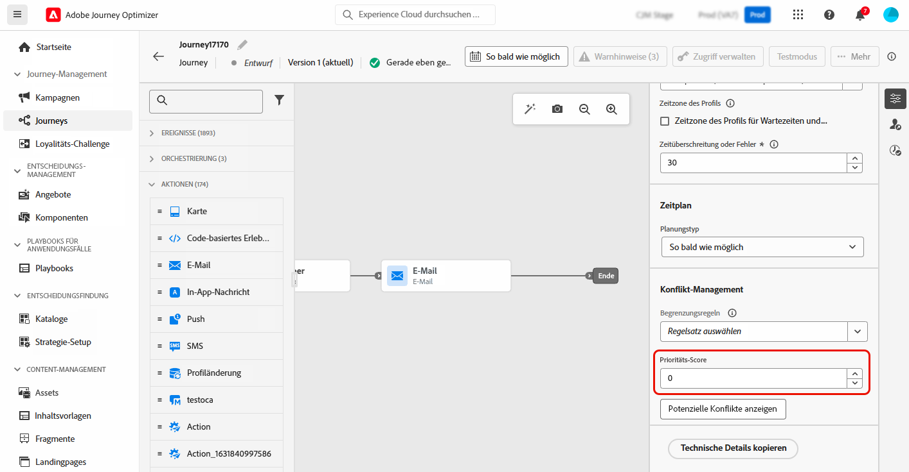
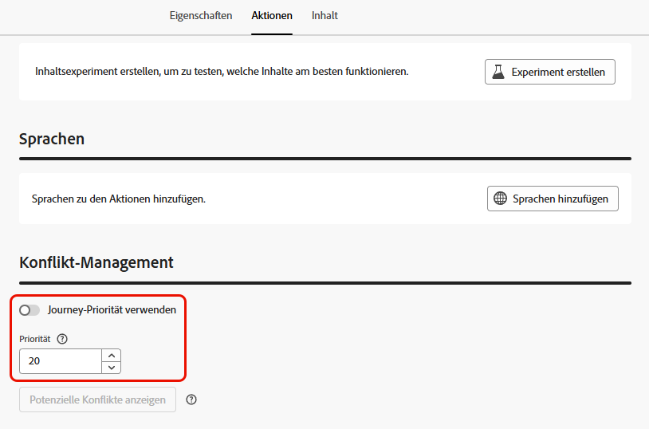

# Zuweisen von Prioritätswerten {#priority}

Mit Journey Optimizer können Sie einer Journey, einer Kampagne oder einer eingehenden Kanalaktion in der Journey-Aktivität **[!UICONTROL Aktion]** einen Prioritätswert zuweisen.

Die Priorität ist von wesentlicher Bedeutung, um eine Journey, Kampagne oder Aktion zu priorisieren, wenn eine erzwungene Begrenzung vorliegt (z. B. eine Häufigkeitsbegrenzung). 

In Situationen, in denen Ihre Kundschaft für viele Journeys, Kampagnen oder Mitteilungen infrage kommt und Sie selektiv auswählen möchten, in welche sie eintreten und welche sie erhalten soll, sollten Sie dieses Feld verwenden.

## Zuweisen von Prioritätswerten zu Journeys und Kampagnen {#priority-journey-campaign}

>[!CONTEXTUALHELP]
>id="ajo_campaigns_campaign_priority"
>title="Priorität"
>abstract="Weisen Sie der Kampagne eine Prioritätsbewertung zu. Die Priorität ist von wesentlicher Bedeutung, um eine Kampagne zu priorisieren, wenn eine erzwungene Begrenzung vorliegt, z. B. eine Frequenzbegrenzung. Geben Sie einen numerischen Wert ein (0–100). Bitte beachten Sie: Je höher die Zahl, desto höher die Priorität. Wenn zwei Kampagnen die gleiche Priorität haben, wird die Kampagne angezeigt, die zuerst aktiviert wurde."

>[!CONTEXTUALHELP]
>id="ajo_journey_priority"
>title="Priorität"
>abstract="Weisen Sie der Journey eine Prioritätsbewertung zu. Die Priorität ist von wesentlicher Bedeutung, um eine Journey zu priorisieren, wenn eine erzwungene Begrenzung vorliegt, z. B. eine Häufigkeitsbegrenzung. Geben Sie einen numerischen Wert ein (0–100). Bitte beachten Sie: Je höher die Zahl, desto höher die Priorität. Wenn zwei Kampagnen die gleiche Prioritätsbewertung haben, wird die Journey angezeigt, die zuerst aktiviert wurde."

➡️ [Funktion im Video kennenlernen](#video)

Die Zuweisung eines Prioritätswerts ist für eingehende Kommunikation wie Web, Mobile und In-App entscheidend. Wenn Sie mehrere Kampagnen haben, die dieselbe Kanalkonfiguration verwenden (z. B. ein Banner oben auf Ihrer Web-Seite), könnte dies problematisch sein, da sich nur Inhalte aus einer Kampagne anzeigen lassen. Bei dem Prioritätswert geben Sie an, welche Kampagne angezeigt werden soll, wenn die empfangende Person für mehr als eine Kampagne infrage kommt.

>[!NOTE]
>
>In Kampagnen ist der Prioritätswert nur für eingehende Web-, In-App- und Code-basierte Kanäle verfügbar.

Um einer Journey oder Kampagne einen Prioritätswert zuzuweisen, geben Sie einen numerischen Wert (von 0 bis 100) in das Feld **[!UICONTROL Prioritätswert]** ein, das sich in den Journey- oder Kampagneneigenschaften befindet. Es gilt: Je höher die Zahl, desto höher die Priorität. 

Wenn Sie diese Kampagne erstellen und sicherstellen möchten, dass der Inhalt dieser Kampagne angezeigt wird, sollten Sie ihr den Wert 100 geben.

>[!IMPORTANT]
>
>Wenn zwei Journeys oder Kampagnen den gleichen Prioritätswert haben, verfügt das System über keinen Unentschiedenheitsmechanismus. Stellen Sie sicher, dass Prioritätswerte eindeutig sind, um Konflikte zu vermeiden.

## Zuweisen von Prioritätswerten für Aktionen in Inbound-Kanälen {#priority-action}

>[!CONTEXTUALHELP]
>id="ajo_journey_action_priority"
>title="Priorität"
>abstract="Weisen Sie der Journey-Aktion eine Prioritätsbewertung zu. Die Priorität ist von wesentlicher Bedeutung, um eine eingehende Aktion zu priorisieren, wenn mehrere Journey-Aktionen oder Kampagnen dieselbe Kanalkonfiguration verwenden. Geben Sie einen numerischen Wert ein (0–100). Bitte beachten Sie: Je höher die Zahl, desto höher die Priorität. Standardmäßig wird der Prioritätswert für die Aktion vom Gesamtprioritätswert für die Journey übernommen."

Journey Optimizer ermöglicht es Ihnen zudem, den eingehenden Kanalaktionen innerhalb der Aktivität [Aktion](../building-journeys/journey-action.md) einen Prioritätswert zuzuweisen.

So können Sie eine eingehende Aktion priorisieren, wenn verschiedene Journey-Aktionen oder Kampagnen dieselbe Kanalkonfiguration verwenden.

>[!NOTE]
>
>In der Aktivität **[!UICONTROL Aktion]** ist der Prioritätswert nur für eingehende Web-, In-App- und Code-basierte Kanäle verfügbar.

Im Abschnitt **[!UICONTROL Konflikt-Management]** ist die Option **[!UICONTROL Journey-Priorität verwenden]** standardmäßig aktiviert, was bedeutet, dass der Prioritätswert für die Aktion vom Gesamtprioritätswert für die Journey übernommen wird.

Um den eingehenden Aktionen, die in der Aktivität **[!UICONTROL Aktion]** definiert sind, einen Prioritätswert zuzuweisen, deaktivieren Sie die Option **[!UICONTROL Journey-Priorität verwenden]** und geben Sie in das Feld **[!UICONTROL Priorität]** einen numerischen Wert (von 0–100) ein. Es gilt: Je höher die Zahl, desto höher die Priorität. 

{width=70%}

## Anleitungsvideo {#video}

>[!VIDEO](https://video.tv.adobe.com/v/3445010?captions=ger&quality=12)
