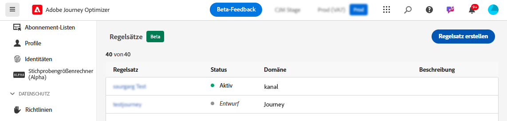
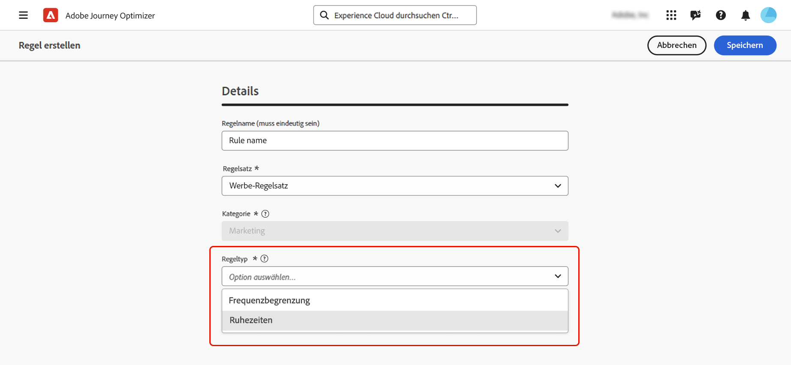
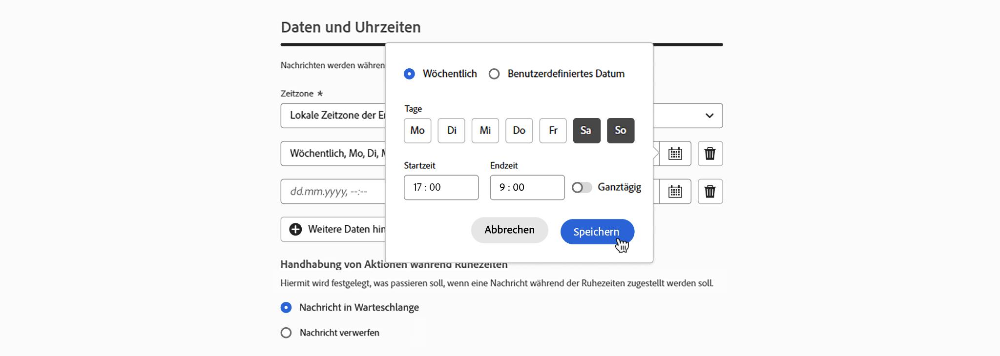
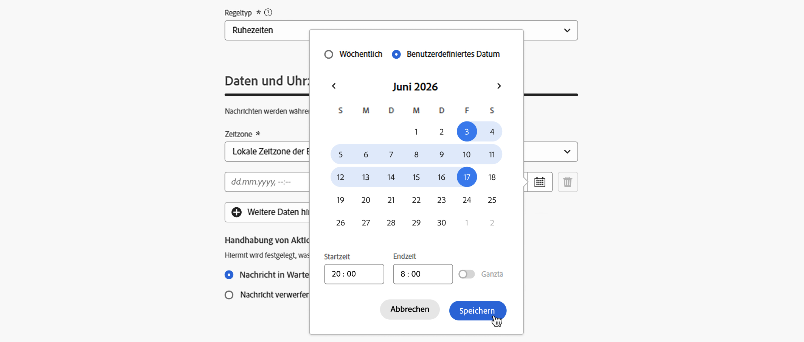
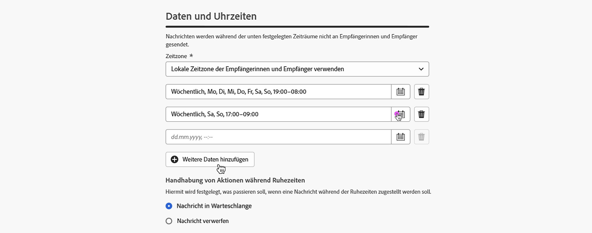
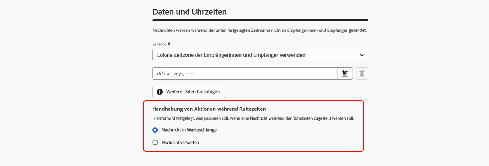
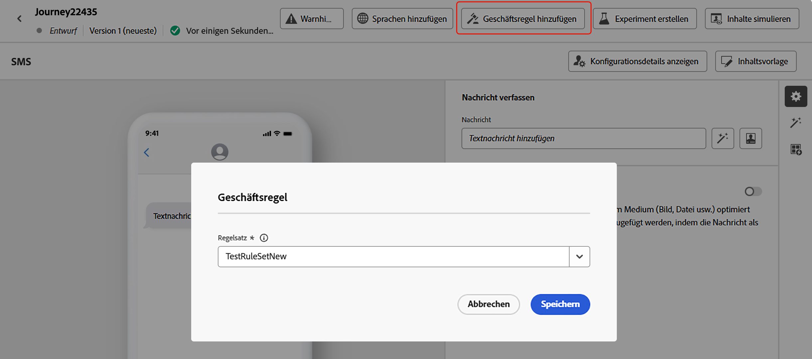
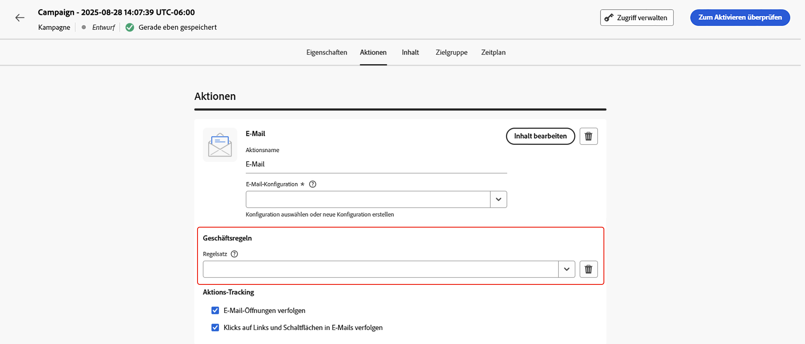
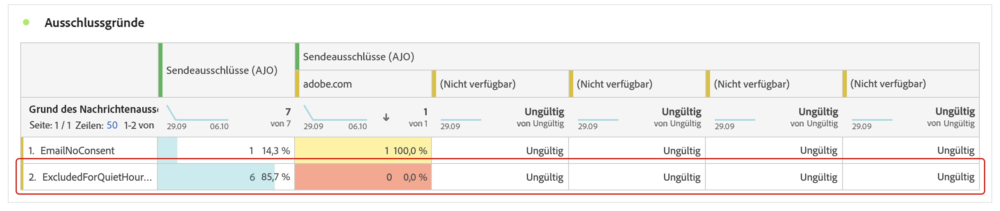
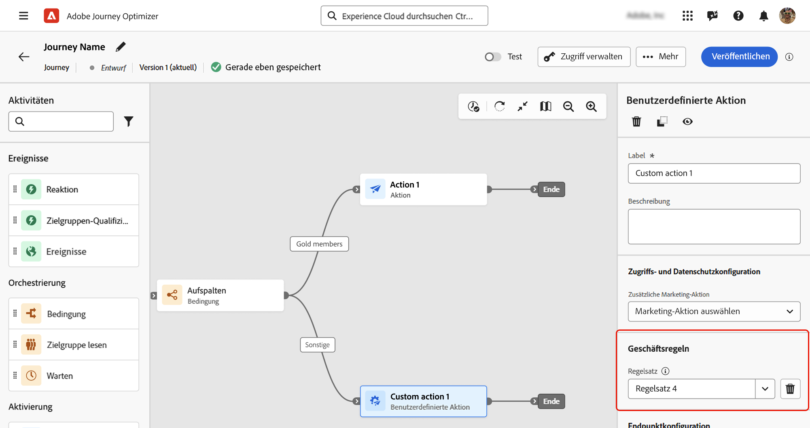

# Festlegen von Ruhezeiten {#quiet-hours}

## Was sind Ruhezeiten?

**Ruhezeiten** ermöglichen die Definition zeitbasierter Ausschlüsse für den **E-Mail**-, **SMS**-, **Push**- und **WhatsApp**-Kanal. Sie stellen sicher, dass während bestimmter Zeiträume keine Nachrichten gesendet werden, und helfen Ihnen so, Kundenpräferenzen und Compliance-Anforderungen zu erfüllen.

Ruhezeiten können über **Regelsätze** angewendet werden, die zur präzisen Steuerung Einzelaktionen in Kampagnen oder Journeys zugewiesen werden können.

Durch die Optimierung dieser Prozesse können Sie das Kundenerlebnis verbessern, Zeit sparen und die Einhaltung von Kommunikationsregeln sicherstellen:

* **Wecken Sie Ihren Kundinnen und Kunden nicht auf**: *Die richtige Person, der richtige Kanal, die richtige Zeit* ist das Mantra vieler Marketing-Fachleute. Daher ist es logisch, dass das Timing eine große Bedeutung in der Customer Journey hat. Durch das Festlegen einer Regel für Ruhezeiten erhalten Marken eine bessere Kontrolle darüber, wann Kontakte Nachrichten erhalten, und stellen sicher, dass sie sie dann erhalten, wenn sie am wahrscheinlichsten mit der Nachricht interagieren.
* **Komfort**: Fangen Sie Nachrichten in Kampagnen und Journeys ganz einfach ohne Stoppen der gesamten Journey oder Kampagne ab, wenn Sie verhindern müssen, dass eine Zielgruppe eine Nachricht erhält.
* **Zeitersparnis**: Verwalten Sie Ausschlüsse durch Erstellen einer **zeitbasierten Regel** an einem Ort, anstatt mehrere Bedingungsknoten mit benutzerdefinierten Ausdrücken hinzuzufügen.\
  <!--* **Extra Safeguard** - Benefit from an extra safeguard in case audience criteria or time-window configurations were incorrectly set, ensuring individuals are still excluded when they should be.-->

➡️ [Funktion im Video kennenlernen](#video)

## Leitlinien und Einschränkungen

* **Unterstützte Kanäle**: E-Mail, SMS, Push-Benachrichtigung und WhatsApp.
* **Orchestrierte Kampagnen** - Ruhezeiten werden für orchestrierte Kampagnen nicht unterstützt.
* **Verzögerung der Anwendung**: Es kann bis zu 12 Stunden dauern bis Aktualisierungen von Regeln für Ruhezeiten auf Kanalaktionen angewendet werden, die diese Regel bereits verwenden.
* **Latenz bei hohem Volumen**: Im Fall von Nachrichten mit hohem Volumen benötigt das System möglicherweise zusätzliche Zeit, um mit der erfolgreichen Durchsetzung von Unterdrückungen für Ruhezeiten zu beginnen.

<!--* **Custom actions** – For custom actions, only quiet hours rules are enforced. If a rule set also includes other rules (e.g., frequency capping), those rules are ignored.-->
<!--* **Pre-suppression window** – The system begins suppressing communications 30 minutes before quiet hours start, ensuring that no messages are delivered once the quiet period begins.-->

## Erstellen von Regeln für Ruhezeiten

Um Ruhezeiten festzulegen, erstellen Sie eine Regel innerhalb eines benutzerdefinierten Regelsatzes. [Erfahren Sie, wie Sie Regelsätze erstellen](../conflict-prioritization/rule-sets.md#Create). Führen Sie folgende Schritte aus:

1. Navigieren Sie zu **[!UICONTROL Geschäftsregeln]**, um auf das Regelsatzinventar zuzugreifen.

1. Wählen Sie einen vorhandenen benutzerdefinierten Regelsatz aus oder erstellen Sie einen neuen:

   +++Erstellen einer Regel für Ruhezeiten in einem vorhandenen Regelsatz

   Wählen Sie den Regelsatz aus dem Inventar aus. Regeln für Ruhezeiten können nur Regelsätzen mit der Domain „Kanal“ hinzugefügt werden. Sie können diese Informationen in der Spalte **[!UICONTROL Domain]** überprüfen.

   

   +++

   +++Erstellen einer Regel für Ruhezeiten in einem neuen Regelsatz

   Klicken Sie **[!UICONTROL Regelsatz erstellen]** geben Sie einen eindeutigen Namen ein und wählen Sie „Kanal“ aus der Dropdown-Liste **[!UICONTROL Domain des Regelsatzes]** aus.

   

   +++

   >[!NOTE]
   >
   >Ruhezeiten können nur in **benutzerdefinierten Regelsätzen** definiert werden. Der globale Regelsatz unterstützt keine Konfiguration von Ruhezeiten.

1. Klicken Sie im Bildschirm „Regelsatz“ auf die Schaltfläche **[!UICONTROL Regel hinzufügen]** und geben Sie einen eindeutigen Namen für die Regel an.

1. Das Feld **Kategorie** gibt die Kategorie der Nachricht an, für die die Regel gilt. Derzeit ist dieses Feld schreibgeschützt und standardmäßig auf **[!UICONTROL Marketing]** festgelegt.

1. Wählen Sie in der Dropdown-Liste **[!UICONTROL Regeltyp]** die Option **[!UICONTROL Ruhezeiten]** aus.

   

1. Definieren Sie Abschnitt **[!UICONTROL Datum und Uhrzeit]**, wann Ruhezeiten angewendet werden sollen:

   1. Wenden Sie in **[!UICONTROL Dropdown]** Zeitzone“ eine Standardzeitzone auf alle Empfängerinnen und Empfänger in der Zielgruppe an, unabhängig von ihrer individuellen Zeitzone.

      Um das Zeitzonenfeld jedes Profils zu verwenden, wählen Sie **[!UICONTROL Lokale Zeitzone der Empfänger verwenden]** aus. [Informationen zur Zeitzonenverwaltung in Journeys](../building-journeys/timezone-management.md#timezone-from-profiles)

      >[!IMPORTANT]
      >
      >Wenn für ein Profil kein Zeitzonenwert festgelegt ist, werden für dieses Profil keine Ruhezeiten erzwungen.

   1. Geben Sie den Zeitraum an, für den Ruhezeiten angewendet werden sollen.

      * **[!UICONTROL Wöchentlich]**: Wählen Sie bestimmte Wochentage und ein Zeitfenster aus. Sie können die Regel auch &quot;**[!UICONTROL Tag“]**.

        

      * **[!UICONTROL Benutzerdefiniertes Datum]**: Wählen Sie bestimmte Daten im Kalender und ein Zeitfenster aus. Sie können die Regel auch &quot;**[!UICONTROL Tag“]**.

        

   1. Klicken Sie auf die Schaltfläche **[!UICONTROL Weitere Daten hinzufügen]**, um bis zu 5 separate Zeiträume hinzuzufügen.

      

1. Wählen Sie im Abschnitt **[!UICONTROL Handhabung von Aktionen während Ruhezeiten]** aus, wie Nachrichten während des ausgewählten Zeitraums behandelt werden:

   

   * **[!UICONTROL Warteschlangenmeldung]**: Nachrichten werden nach Abschluss der Ruhezeit gesendet, es sei denn, sie befinden sich im Status „Pausiert“.

     >[!NOTE]
     >
     >Wenn eine Nachricht länger als 7 Tage in der Warteschlange für ein Profil bleibt, wird die Nachricht verworfen.

   * **[!UICONTROL Nachricht verwerfen]** - Nachrichten werden nie gesendet.

     >[!NOTE]
     >
     >Wenn Sie **[!UICONTROL Verwerfen]** auswählen und diese Regel auf eine Journey-Aktion anwenden, wird das Profil aus dem Nachrichtenversand entfernt und von der Journey beendet.

Die Regel wird jetzt im Regelsatz angezeigt. Sie können sie auswählen, um ihre Details im Eigenschaftenbereich anzuzeigen.

Wenn Ihre Regel bereit ist, aktivieren Sie sie und schließen Sie die Konfiguration Ihres Regelsatzes ab. [Erfahren Sie, wie Sie Regelsätze erstellen und aktivieren](../conflict-prioritization/rule-sets.md#Create)

## Anwenden von Ruhezeiten auf Journeys und Kampagnen {#apply}

Nachdem die Regel gespeichert und der Regelsatz aktiviert wurde, können Sie sie auf Aktionen in Journeys und Kampagnen anwenden. Unterstützte Kanäle: **E-Mail, SMS, Push, WhatsApp**. Weitere Details finden Sie in den Registerkarten unten.

>[!BEGINTABS]

>[!TAB Anwenden von Kanalaktionen mit Ruhezeiten in Journeys]

1. Öffnen Sie Ihre Journey, wählen Sie eine [Kanalaktion](../building-journeys/journeys-message.md) aus und bearbeiten Sie den Inhalt Ihrer Nachricht.
1. Klicken Sie auf die Schaltfläche **[!UICONTROL Geschäftsregel hinzufügen]** und wählen Sie den Regelsatz aus, der die Regel für Ruhezeiten enthält.

   

   >[!NOTE]
   >
   >In der Liste werden nur [aktivierte](#activate-rule) Regelsätze angezeigt.

1. Aktivieren Sie Ihre Journey.

>[!TAB Anwenden von Ruhezeiten auf Kampagnenaktionen]

1. Bearbeiten Sie Ihre Kampagne und rufen Sie die Registerkarte **[!UICONTROL Aktionen]** auf.
1. Wählen Sie im Abschnitt **[!UICONTROL Geschäftsregel]** den Regelsatz aus, der die Regel für Ruhezeiten enthält.

   

   >[!NOTE]
   >
   >In der Liste werden nur [aktivierte](#activate-rule) Regelsätze angezeigt.

1. Aktivieren Sie Ihre Kampagne.

>[!ENDTABS]

## Nächste Schritte

Sobald Ihre Journeys oder Kampagnen aktiviert und ausgeführt wurden, können Sie die Anzahl der vom Versand ausgeschlossenen Profile im [Customer Journey Analytics-Bericht](../reports/report-gs-cja.md) und im [Live-Bericht](../reports/live-report.md) anzeigen. Dort werden die Regeln für Ruhezeiten als möglicher Grund für den Ausschluss von Benutzenden vom Versand aufgeführt.

<!--

>[!TAB Apply Quiet hours to custom actions]

1. Open your journey and add or select a custom action in the canvas.

1. In the **[!UICONTROL Business rules]** section, select the rule set containing the Quiet hours rule.

   

   >[!NOTE]
   >
   >Only [activated](#activate-rule) rule sets display in the list.

1. Activate your journey.

-->

## Anleitungsvideo {#video}

Erfahren Sie, wie Sie die Ruhezeitenfunktion in Adobe Journey Optimizer verwenden.

>[!VIDEO](https://video.tv.adobe.com/v/3475861?captions=ger&quality=12)
