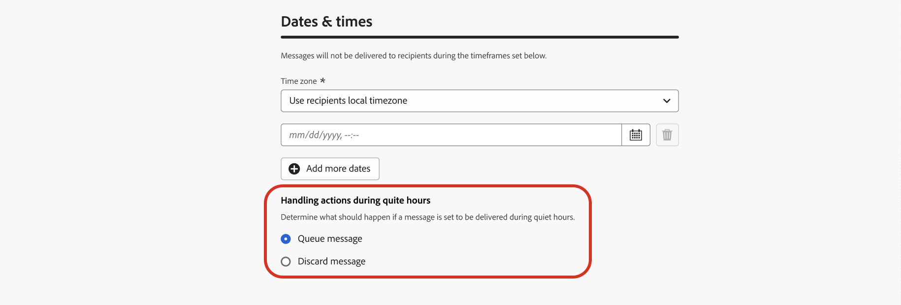

# Ruhige Stunden festlegen {#quiet-hours}

## Was sind ruhige Stunden?

**Ruhige Stunden** ermöglichen die Definition zeitbasierter Ausschlüsse für **E-Mail**, **SMS**, **Push** und **WhatsApp**-Kanäle. Sie stellen sicher, dass während bestimmter Zeiträume keine Nachrichten gesendet werden, und helfen Ihnen so, Kundenpräferenzen und Compliance-Anforderungen zu erfüllen.

Ruhestunden können über **Regelsätze** angewendet werden, die zur präzisen Steuerung Einzelaktionen in Kampagnen oder Journey zugewiesen werden können.

Durch die Optimierung dieser Prozesse können Sie das Kundenerlebnis verbessern, Zeit sparen und die Einhaltung von Kommunikationsregeln sicherstellen:

* **Wecken Sie Ihren Kunden nicht** - *Der richtige Kunde, der richtige Kanal, die richtige Zeit* ist das Mantra vieler Marketing-Fachleute, daher ist es sinnvoll, dass das Timing ein wichtiger Bestandteil des Kunden-Journey ist. Durch die Festlegung einer Regel für ruhige Stunden haben Marken eine bessere Kontrolle darüber, wann Kontakte Nachrichten erhalten, und stellen sicher, dass sie sie erhalten, wenn es wahrscheinlicher ist, dass sie Ihre Nachricht bearbeiten.
* **Komfort** - Fangen Sie ganz einfach die Kommunikation zwischen Kampagnen und Journey ab, wenn Sie verhindern müssen, dass eine Zielgruppe eine Nachricht erhält, ohne die gesamte Journey oder Kampagne stoppen zu müssen.
* **Zeiteinsparung** - Verwalten Sie Ausschlüsse an einer Stelle, indem Sie eine **zeitbasierte Regel** erstellen, anstatt mehrere Bedingungsknoten mit benutzerdefinierten Ausdrücken hinzuzufügen.\
  <!--* **Extra Safeguard** - Benefit from an extra safeguard in case audience criteria or time-window configurations were incorrectly set, ensuring individuals are still excluded when they should be.-->

>[!AVAILABILITY]
>
>Regeln für ruhige Stunden sind derzeit nur für ausgewählte Organisationen verfügbar (eingeschränkte Verfügbarkeit). Um auf die Warteliste gesetzt zu werden, bitte den Adobe-Support kontaktieren.

➡️ [Funktion im Video kennenlernen](#video)

## Leitlinien und Einschränkungen

* **Unterstützte Kanäle** - E-Mail, SMS, Push und WhatsApp.
  <!--* **Custom actions** – For custom actions, only quiet hours rules are enforced. If a rule set also includes other rules (e.g., frequency capping), those rules are ignored.-->
* **Ausbreitungsverzögerung** - Die Aktualisierung einer Regel für ruhige Stunden kann bis zu 12 Stunden dauern, bis sie auf Kanalaktionen angewendet wird, die diese Regel bereits verwenden.
  <!--* **Pre-suppression window** – The system begins suppressing communications 30 minutes before quiet hours start, ensuring that no messages are delivered once the quiet period begins.-->
* **Latenz bei hohem Volumen** - Im Fall von Kommunikation mit hohem Volumen kann das System zusätzliche Zeit benötigen, um mit der erfolgreichen Durchsetzung von Unterdrückungen für ruhige Stunden zu beginnen.

## Erstellen von Regeln für ruhige Stunden

Um ruhige Stunden festzulegen, erstellen Sie eine Regel innerhalb eines benutzerdefinierten Regelsatzes. Führen Sie folgende Schritte aus:

1. Navigieren Sie zu **[!UICONTROL Geschäftsregeln]**, um auf den Regelsatzbestand zuzugreifen.

1. Wählen Sie einen vorhandenen benutzerdefinierten Regelsatz aus oder erstellen Sie einen neuen:

   +++Erstellen einer Regel für ruhige Stunden in einem vorhandenen Regelsatz

   Wählen Sie den Regelsatz aus dem Inventar aus. Regeln für ruhige Stunden können nur Regelsätzen mit der Domain „channel“ hinzugefügt werden. Sie können diese Informationen in der Spalte **[!UICONTROL Domain]** überprüfen.

   

   +++

   +++Erstellen einer Regel für ruhige Stunden in einem neuen Regelsatz

   Klicken Sie **[!UICONTROL Regelsatz erstellen]** geben Sie einen eindeutigen Namen ein und wählen Sie „Kanal“ aus der Dropdown-Liste **[!UICONTROL Regelsatzdomäne]** aus.

   

   +++

   >[!NOTE]
   >
   >Ruhige Stunden können nur in **benutzerdefinierten Regelsätzen)** werden. Der globale Regelsatz unterstützt keine Konfiguration von ruhigen Stunden.

1. Klicken Sie im Bildschirm Regelsatz auf **[!UICONTROL Regel hinzufügen]** und geben Sie einen eindeutigen Namen für die Regel an.

1. Das Feld **Kategorie** gibt die Kategorie der Nachricht an, für die die Regel gilt. Derzeit ist dieses Feld schreibgeschützt und standardmäßig auf **[!UICONTROL Marketing]** eingestellt.

1. Wählen **[!UICONTROL in der Dropdown]** Liste „Regeltyp“ die Option **[!UICONTROL Stille Stunden]**.

   

1. Definieren Sie **[!UICONTROL Abschnitt „Datum und]**&quot;, wann ruhige Stunden angewendet werden sollen:

   1. Wählen Sie die **[!UICONTROL Zeitzone]** aus:

      * **[!UICONTROL UTC/GMT]** - Wendet ein standardmäßiges GMT-Zeitfenster auf alle Empfänger in der Zielgruppe an, unabhängig von ihrer individuellen Zeitzone.
      * **[!UICONTROL Lokale Zeitzone der Empfänger verwenden]** - Verwenden Sie das Zeitzonenfeld jedes Profils. [Erfahren Sie mehr über das Zeitzonenmanagement in Journey](../building-journeys/timezone-management.md#timezone-from-profiles)

        >[!IMPORTANT]
        >
        >Wenn ein Profil keinen Zeitzonenwert hat, werden für dieses Profil keine ruhigen Stunden erzwungen.

   1. Geben Sie den Zeitraum an, für den ruhige Stunden gelten sollen.

      * **[!UICONTROL Wöchentlich]** - Wählen Sie bestimmte Wochentage und einen Zeitrahmen aus. Sie können die Regel auch **[!UICONTROL Ganztägig]** durchsetzen (diese Option ist nur für bis zu 3 aufeinander folgende Tage verfügbar).

        

      * **[!UICONTROL Benutzerdefiniertes Datum]** - Wählen Sie bestimmte Daten im Kalender und einen Zeitschlitz aus. Sie können die Regel auch **[!UICONTROL Ganztägig]** durchsetzen (diese Option ist nur für bis zu 3 aufeinander folgende Tage verfügbar).

        

   1. Klicken Sie auf **[!UICONTROL Schaltfläche „Weitere Daten]**&quot;, um bis zu 5 separate Zeiträume hinzuzufügen.

      

1. Wählen **[!UICONTROL Abschnitt „Aktionen während ruhiger Stunden]**, wie Nachrichten während des ausgewählten Zeitraums behandelt werden:

   

   * **[!UICONTROL Warteschlangennachricht]** - Nachrichten werden nach Abschluss der Ruhezeit gesendet, es sei denn, sie befinden sich im Status Paused .

     >[!NOTE]
     >
     >Diese Option ist nur für Journey-Aktionen verfügbar. Wenn sie auf eine Kampagnenaktion angewendet wird, verhält sie sich genauso, wie wenn die Option **[!UICONTROL Nachricht verwerfen]** ausgewählt wird.

   * **[!UICONTROL Nachricht verwerfen]** - Nachrichten werden nie gesendet. Wenn Sie möchten, dass die Journey oder Kampagne, die die Nachricht enthält, mit dem Abbruch des Versands endet, wählen Sie **[!UICONTROL Verwerfen und Journey oder Kampagne beenden]**.

## Anwenden von Ruhezeiten auf Journey und Kampagnen {#apply}

Nachdem die Regel gespeichert und aktiviert wurde, können Sie sie auf Aktionen in Journey und Kampagnen anwenden. Unterstützte Kanäle: **E-Mail, SMS, Push,** App). Durchsuchen Sie die folgenden Registerkarten, um weitere Details anzuzeigen.

>[!BEGINTABS]

>[!TAB Anwenden von Ruhestunden-Kanalaktionen in Journey]

1. Öffnen Sie Ihre Journey, wählen Sie [Kanalaktion](../building-journeys/journeys-message.md) und bearbeiten Sie den Inhalt Ihrer Nachricht.
1. Klicken Sie auf **[!UICONTROL Schaltfläche „Geschäftsregel hinzufügen]** und wählen Sie den Regelsatz aus, der die Regel für ruhige Stunden enthält.

   

   >[!NOTE]
   >
   >In der Liste werden nur [aktivierte](#activate-rule) Regelsätze angezeigt.

1. Journey aktivieren.

>[!TAB Wendet ruhige Stunden auf Kampagnenaktionen an]

1. Bearbeiten Sie Ihre Kampagne und rufen Sie die Registerkarte **[!UICONTROL Aktionen]** auf.
1. Wählen **[!UICONTROL Abschnitt „Geschäftsregeln]** den Regelsatz aus, der die Regel für ruhige Stunden enthält.

   

   >[!NOTE]
   >
   >In der Liste werden nur [aktivierte](#activate-rule) Regelsätze angezeigt.

1. Kampagne aktivieren.

>[!ENDTABS]

## Nächste Schritte

Sobald Ihr Journey oder Ihre Kampagnen aktiviert und ausgeführt wurden, können Sie die Anzahl der Profile, die von der Kommunikation ausgeschlossen sind, im [Customer Journey Analytics-Bericht](../reports/report-gs-cja.md) und im [Live-Bericht](../reports/live-report.md) sehen, wo Regeln für ruhige Stunden als möglicher Grund für den Ausschluss von Benutzenden vom Versand aufgeführt sind.

<!--

>[!TAB Apply Quiet hours to custom actions]

1. Open your journey and add or select a custom action in the canvas.

1. In the **[!UICONTROL Business rules]** section, select the rule set containing the Quiet hours rule.

   

   >[!NOTE]
   >
   >Only [activated](#activate-rule) rule sets display in the list.

1. Activate your journey.

-->

## Anleitungsvideo {#video}

Erfahren Sie, wie Sie die Funktion „Ruhezeiten“ in Adobe Journey Optimizer verwenden.

>[!VIDEO](https://video.tv.adobe.com/v/3475861?captions=ger&quality=12)
