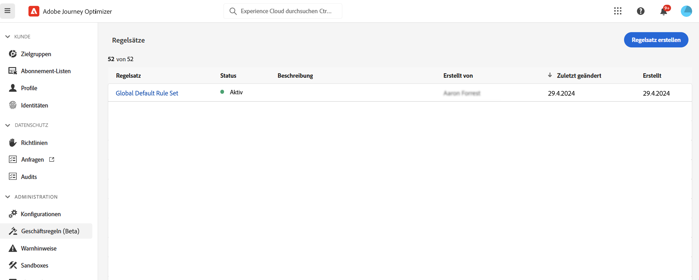
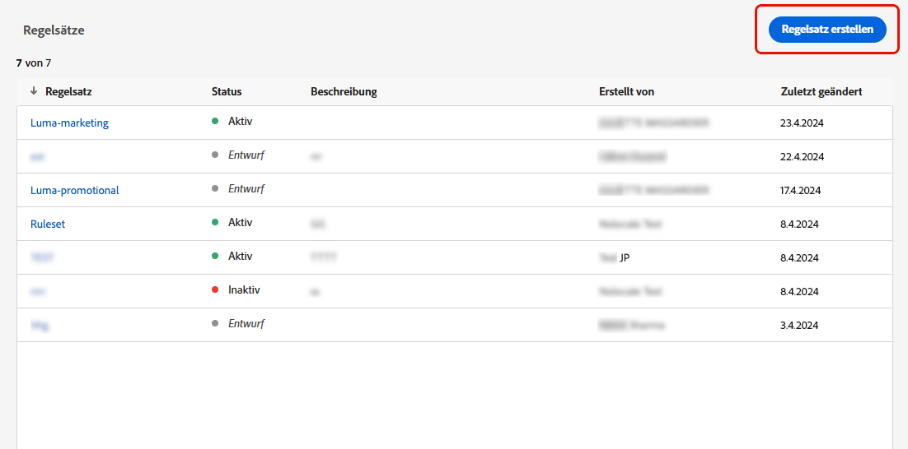
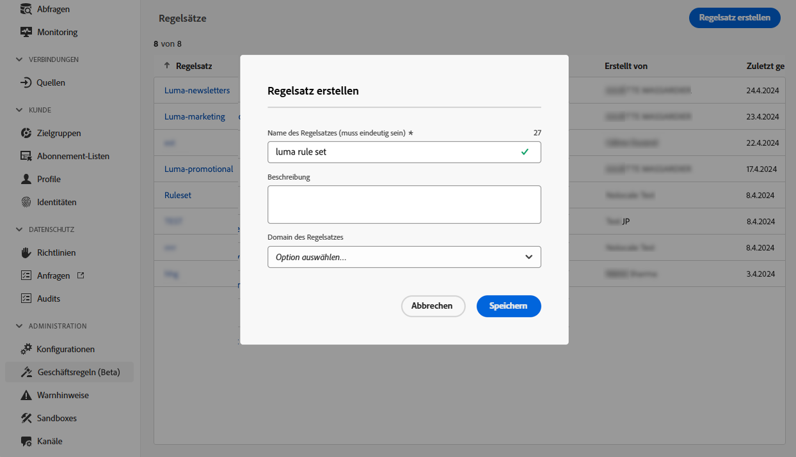
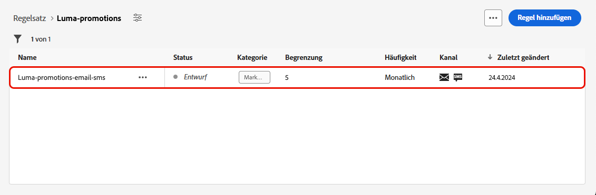
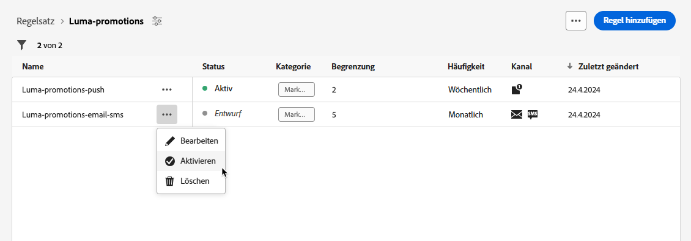
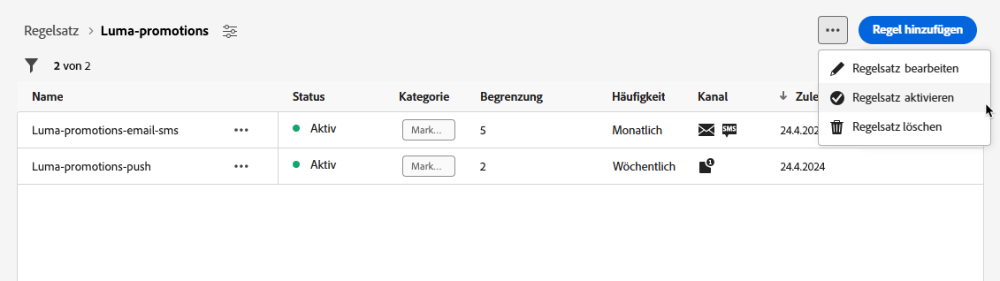
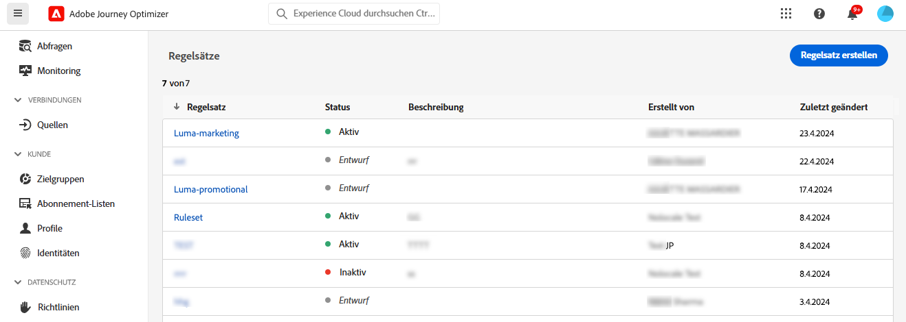
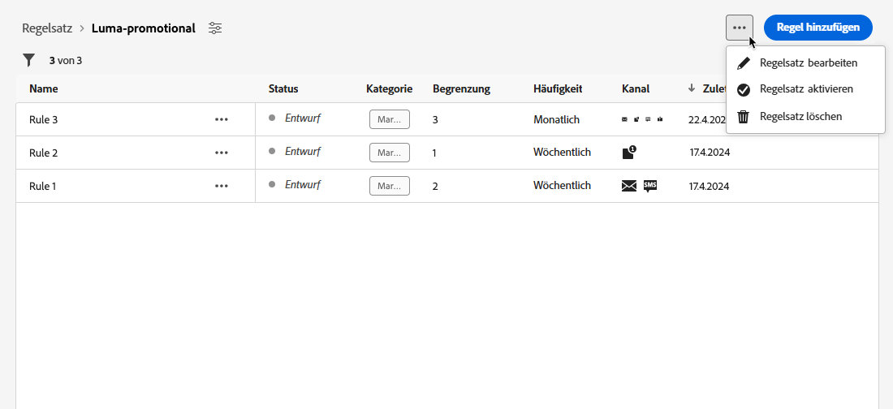
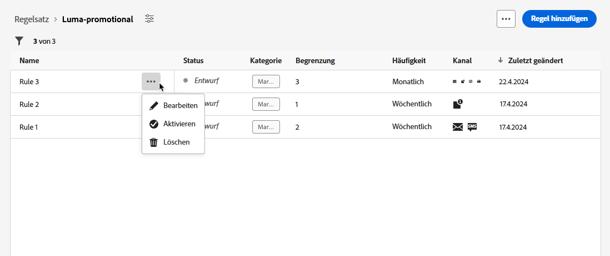
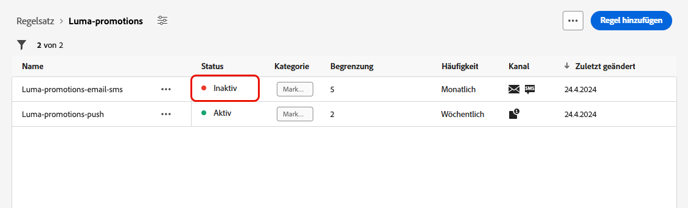

# Arbeiten mit Regelsätzen {#rule-sets}

>[!CONTEXTUALHELP]
>id="ajo_business_rules_rule_sets"
>title="Regelsätze"
>abstract="Verwenden Sie Regelsätze, um die Frequenzbegrenzung oder Regeln für Ruhezeiten auf verschiedene Arten von Marketing-Kommunikation anzuwenden. Sie können auch Regelsätze erstellen, um einen Teil der Zielgruppe anhand von Regeln zur Frequenzbegrenzung von Journeys auszuschließen."

## Erste Schritte mit Regelsätzen {#gs}

### Was sind Regelsätze? {#what}

Mit Regelsätzen können **mehrere Regeln zu Regelsätzen gruppiert** und auf die gewünschten Journeys und Kampagnen angewendet werden. Dies bietet eine verbesserte Granularität, um zu begrenzen, wie oft und in wie viele Journeys Kundinnen und Kunden innerhalb eines bestimmten Zeitrahmens eintreten können, oder mit der gesteuert wird, wie oft Benutzende je nach Kommunikationstyp eine Nachricht erhalten.

Es können zwei Arten von Regelsätzen erstellt werden:

* Regelsätze des Typs **Kanal** wenden Begrenzungsregeln auf Kommunikationskanäle an. Sie ermöglichen es Ihnen, Folgendes festzulegen:

   * **Regeln für die Frequenzbegrenzung**: *Senden Sie nicht mehr als eine E-Mail- oder SMS-Nachricht pro Tag.*
   * **Regeln für Ruhezeiten** (eingeschränkte Verfügbarkeit): *Senden Sie keine E-Mail-Nachrichten außerhalb des Zeitfensters von 8:00 bis 21:00 Uhr.*

* **Journey**-Regelsätze wenden Regeln für Eintritts- und Gleichzeitigkeitsbegrenzung auf eine Journey an. Lassen Sie Profile beispielsweise nicht in mehrere Journeys gleichzeitig eintreten.

➡️ [Funktion im Video kennenlernen](#video)

### Berechtigungen {#permissions-frequency-rules}

Um mit Geschäftsregeln arbeiten zu können, benötigen Sie die folgenden Berechtigungen:

* **[!UICONTROL Häufigkeitsregeln anzeigen]**: Zugreifen auf und Anzeigen von Geschäftsregeln.
* **[!UICONTROL Häufigkeitsregeln verwalten]**: Erstellen, Bearbeiten oder Löschen von Geschäftsregeln.

Weiterführende Informationen zu Berechtigungen finden Sie in [diesem Abschnitt](../administration/high-low-permissions.md).

### Globale und benutzerdefinierte Regelsätze {#global-custom}

Wenn Sie zum ersten Mal über das Menü **[!UICONTROL Administration]** > **[!UICONTROL Geschäftsregeln]** auf Regelsätze zugreifen, wird ein Standardregelsatz vorab erstellt und aktiviert: der **globale Standardregelsatz**.

Dieser Regelsatz enthält globale Regeln, die angewendet werden können, um zu steuern, wie oft Benutzende Nachrichten über einen oder mehrere Kanäle erhalten. Alle in diesem Regelsatz definierten Regeln gelten für alle ausgewählten Kanäle, unabhängig davon, ob Nachrichten von einer Journey oder einer Kampagne gesendet werden. 

Zusätzlich zu diesem „Globalen Standardregelsatz“ können **Regelsätze** erstellt werden, die auf jede Journey oder Kampagne angewendet werden können, um bestimmte Begrenzungsregeln anzuwenden. [Weitere Informationen zum Erstellen benutzerdefinierter Regelsätze](#create)

## Erstellen und Aktivieren von Regelsätzen {#Create}

>[!CONTEXTUALHELP]
>id="ajo_rule_set_domain"
>title="Domain des Regelsatzes"
>abstract="Beim Erstellen eines Regelsatzes müssen Sie angeben, ob die Regeln im Regelsatz Begrenzungsregeln erzwingen, die für Kommunikationskanäle oder Journeys spezifisch sind."

>[!CONTEXTUALHELP]
>id="ajo_rule_sets_category"
>title="Wählen Sie die Kategorie der Nachrichtenregel aus"
>abstract="Bei Aktivierung und Anwendung auf eine Nachricht werden alle Häufigkeitsregeln, die der ausgewählten Kategorie entsprechen, automatisch auf diese Nachricht angewendet. Derzeit ist nur die Kategorie „Marketing“ verfügbar."

<!--NOT USED?
[!CONTEXTUALHELP]
>id="ajo_rule_sets_capping"
>title="Set the capping for your rule"
>abstract="Specify the maximum number of messages sent to a customer profile within the chosen time frame. The frequency cap will be based on the selected calendar period and will be reset at the beginning of the corresponding time frame."-->

>[!CONTEXTUALHELP]
>id="ajo_rule_type"
>title="Regeltyp"
>abstract="Wählen Sie den gewünschten Regeltyp für Ihren Kanalregelsatz aus: Verwenden Sie den Typ **Frequenzbegrenzung**, um Begrenzungsregeln auf Kommunikationskanäle anzuwenden. Senden Sie beispielsweise nicht mehr als eine E-Mail- oder SMS-Nachricht pro Tag. Wählen Sie **Ruhezeiten** aus (unter „Eingeschränkte Verfügbarkeit“), um zeitbasierte Ausschlüsse zu definieren und so sicherzustellen, dass während bestimmter Zeiträume keine Nachrichten gesendet werden."

>[!CONTEXTUALHELP]
>id="ajo_rule_sets_duration"
>title="Wählen Sie die Kategorie der Nachrichtenregel aus"
>abstract="Bei Aktivierung und Anwendung auf eine Nachricht werden alle Häufigkeitsregeln, die der ausgewählten Kategorie entsprechen, automatisch auf diese Nachricht angewendet. Derzeit ist nur die Kategorie „Marketing“ verfügbar."

>[!CONTEXTUALHELP]
>id="ajo_rule_set_rule_capping"
>title="Regelbegrenzung"
>abstract="Legen Sie die Begrenzung für Ihre Regel fest.  Abhängig von der Regelsatz-Domain und der Auswahl im Feld „Regeltyp“ kann dieses Feld die maximale Anzahl an Nachrichten definieren, die an ein Profil gesendet werden können, oder die maximale Anzahl an Journeys, in die das Profil eintreten oder an denen das Profil gleichzeitig teilnehmen kann."

>[!CONTEXTUALHELP]
>id="ajo_journey_business_rules"
>title="Regelsatz"
>abstract="Wählen Sie den Regelsatz aus, der auf Ihre benutzerdefinierte Aktion angewendet werden soll."

Gehen Sie wie folgt vor, um einen Regelsatz zu erstellen:

>[!NOTE]
>
>Sie können bis zu 10 Regelsätze für die Kanaldomäne und 10 Regelsätze für die Journey-Domain erstellen, also insgesamt 20 Regelsätze.

1. Rufen Sie die Liste **[!UICONTROL Regelsätze]** auf und klicken Sie dann auf **[!UICONTROL Regelsatz erstellen]**.

   

1. Legen Sie einen eindeutigen Namen für den Regelsatz fest und fügen Sie eine Beschreibung hinzu.

1. Wählen Sie die Regelsatz-Domain aus und klicken Sie auf **[!UICONTROL Speichern]**.

   * **Kanal**-Domain: wendet Begrenzungsregeln oder Regeln für Ruhezeiten auf Kommunikationskanäle an.
   * **Journey**-Domain: wendet Regeln für Eintritts- und Gleichzeitigkeitsbegrenzung auf eine Journey an. 

   

1. Definieren Sie die Regeln, die zu diesem Regelsatz hinzugefügt werden sollen. Greifen Sie dazu auf den Regelsatz zu und klicken Sie auf **[!UICONTROL Regel hinzufügen]**.

1. Konfigurieren Sie die Regelparameter nach Bedarf. Die für die Regel verfügbaren Parameter hängen von der bei ihrer Erstellung ausgewählten Regelsatz-Domain ab.

   Detaillierte Informationen zum Konfigurieren von Journey- und Kanalregeln sind in den folgenden Abschnitten verfügbar:

   * [Journey-Begrenzung](../conflict-prioritization/journey-capping.md)
   * [Frequenzbegrenzung nach Kanal und Kommunikationstyp](../conflict-prioritization/channel-capping.md)
   * [Ruhezeiten](../conflict-prioritization/quiet-hours.md) (eingeschränkte Verfügbarkeit)

1. Klicken Sie auf **[!UICONTROL Speichern]**, um die Erstellung der Regel zu bestätigen. Ihre Nachricht wird dem Regelsatz mit dem Status **[!UICONTROL Entwurf]** hinzugefügt.

   

1. Wiederholen Sie die obigen Schritte, um dem Regelsatz so viele Regeln wie nötig hinzuzufügen.

1. Wenn eine Regel erstellt wird, verfügt sie über den Status **[!UICONTROL Entwurf]** und wirkt sich noch auf keine Nachricht aus. Um sie zu aktivieren, klicken Sie auf die Schaltfläche **[!UICONTROL Weitere Aktionen]** neben der Regel und wählen Sie **[!UICONTROL Aktivieren]**.

   

1. Aktivieren Sie den Regelsatz, um ihn auf die Journeys und Nachrichten anwenden zu können.

   

   >[!NOTE]
   >
   >Es kann bis zu 10 Minuten dauern, bis eine Regel oder ein Regelsatz vollständig aktiviert ist. Sie müssen keine Nachrichten ändern oder Journeys erneut veröffentlichen, damit eine Regel wirksam wird.

<!--Currently, once a rule set is activated, no more rules can be added to that rule set.-->

1. Ein Regelsatz kann je nach der bei der Erstellung des Regelsatzes ausgewählten Domain auf eine Nachricht oder eine Journey angewendet werden. 

   Weitere Informationen zum Anwenden von Regelsätzen sind in den folgenden Abschnitten verfügbar:

   * [Anwenden eines Regelsatzes auf eine Journey](../conflict-prioritization/journey-capping.md#apply-capping)
   * [Anwenden von Begrenzungsregeln auf Journey- und Kampagnenaktionen](../conflict-prioritization/channel-capping.md#apply-frequency-rule)
   * [Anwenden von Regeln für Ruhezeiten auf Journeys und Kampagnen](../conflict-prioritization/quiet-hours.md#apply)

## Zugriff auf und Verwaltung von Regelsätzen {#access-rule-sets}

Alle erstellten Regelsätze werden im Menü **[!UICONTROL Administration]** > **[!UICONTROL Geschäftsregeln (Beta)]** angezeigt. Sie werden nach dem Datum der letzten Änderung sortiert.

Klicken Sie auf den Namen eines Regelsatzes, um dessen Inhalt anzuzeigen und zu bearbeiten. Alle Regeln, die in diesem Regelsatz enthalten sind, werden aufgelistet. Im Kontextmenü oben rechts können der Name und die Beschreibung des Regelsatzes bearbeitet, aktiviert und gelöscht werden.

Jede Regel im Regelsatz kann mithilfe der Schaltfläche **[!UICONTROL Weitere Aktionen]** bearbeitet, aktiviert und gelöscht werden.

Um eine Regel oder einen Regelsatz zu deaktivieren, klicken Sie auf die Schaltfläche **[!UICONTROL Weitere Aktionen]** neben dem gewünschten Element und wählen Sie **[!UICONTROL Deaktivieren]**.

Der Status ändert sich in **[!UICONTROL Inaktiv]** und die Regel wird nicht mehr auf zukünftige Nachrichtenausführungen angewendet. Alle aktuell ausgeführten Nachrichten sind davon nicht betroffen.

>[!NOTE]
>
>Das Deaktivieren eines Regelsatzes wirkt sich weder auf die Zählung für einzelne Profile aus, noch wird die Zählung zurückgesetzt.

## Anleitungsvideo {#video}

>[!VIDEO](https://video.tv.adobe.com/v/3444735?captions=ger&quality=12)
