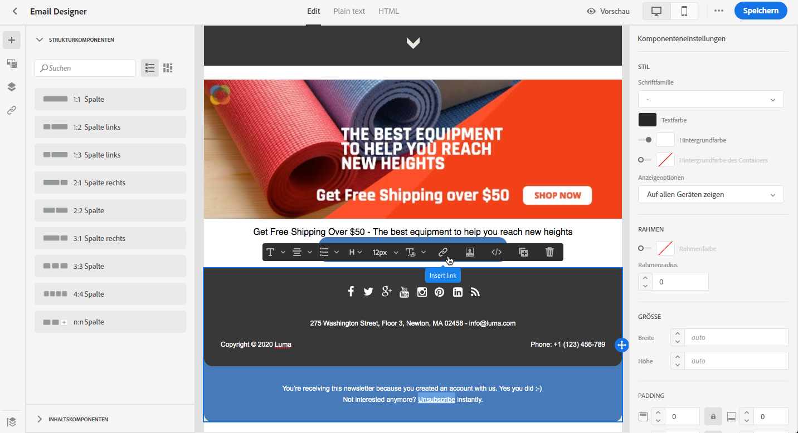
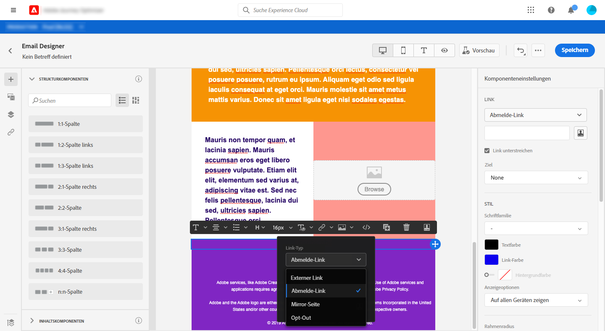
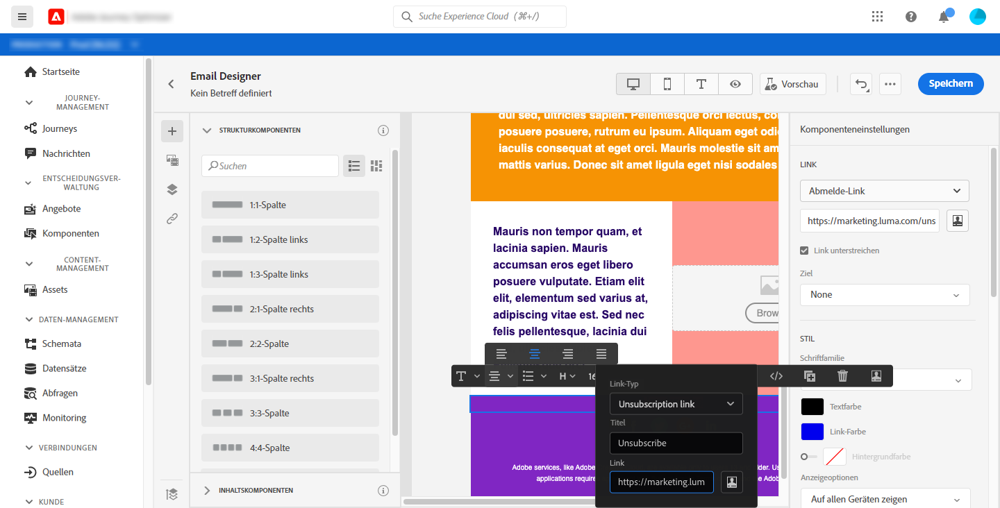
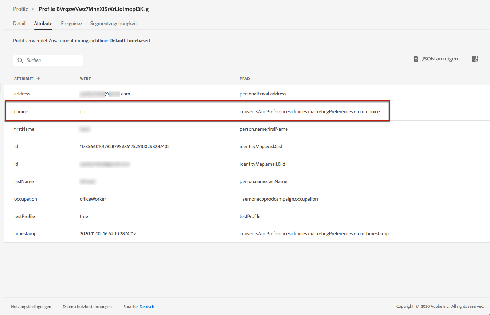

# Verwalten von Opt-out {#consent}

Verwenden Sie [!DNL Journey Optimizer], um die Zustimmung Ihrer Empfänger zur Kommunikation nachzuverfolgen und anhand der Verwaltung ihrer Voreinstellungen und Abonnements zu verstehen, wie sie mit Ihrer Marke interagieren möchten. <!--Their preferences and subscriptions are handled through Consent management.-->

Gesetzliche Bestimmungen wie die DSGVO verlangen die Erfüllung bestimmter Anforderungen, bevor Sie Informationen von betroffenen Personen verwenden können. Darüber hinaus sollten die betroffenen Personen ihre Einwilligung jederzeit ändern können.

**Warum ist das wichtig?**

* Die Nichtbeachtung dieser Vorschriften birgt rechtliche Risiken für Ihre Marke.
* Auf diese Weise vermeiden Sie das Verschicken unerwünschter Nachrichten an Empfänger, die Ihre Nachrichten als Spam kennzeichnen und Ihrem Ruf schaden könnten.

Weitere Informationen zum Verwalten des Datenschutzes und den geltenden Vorschriften finden Sie in der [Experience Platform-Dokumentation](https://experienceleague.adobe.com/docs/experience-platform/privacy/home.html?lang=de){target=&quot;_blank&quot;}.

<!--* Recipients should be able to opt-in/opt-out from receiving electronic communication through one or more channel
* Recipients expect the brand to offer preference centre capability that controls how brand should engage with them (example: channel of communication, invasive and non-invasive tracking etc). This helps to fulfil regulatory obligations and also facilitates quality engagement with recipient. 
* The third category is the capability to offer subscription to recipients (newsletter, etc)-->

## Opt-out-Verwaltung {#opt-out-management}

Die Möglichkeit für Empfänger, den Empfang von Mitteilungen einer Marke zu kündigen, ist eine gesetzliche Anforderung. Weitere Informationen zu den geltenden Rechtsvorschriften finden Sie in der [Dokumentation zur Experience Platform](https://experienceleague.adobe.com/docs/experience-platform/privacy/regulations/overview.html?lang=de#regulations){target=&quot;_blank&quot;}.

Aus diesem Grund müssen Sie in jeder E-Mail, die an Empfänger gesendet wird, immer einen **Link zur Abmeldung** einfügen:
* Durch das Klicken auf diesen Link werden die Empfänger zu einer Landingpage mit einer Schaltfläche zur Bestätigung weitergeleitet.
* Nach Bestätigung der Abmeldung durch einen Klick auf die Opt-out-Schaltfläche wird ein Adobe I/O-Aufruf ausgeführt, um die Profildaten mit dieser Information zu aktualisieren. [Weitere Informationen hierzu](#consent-service-api).

Um einen Link zur Abmeldung hinzuzufügen, gehen Sie wie folgt vor:

1. Erstellen Sie Ihre Abmeldungs-Landingpage.
1. Hosten Sie Ihre Landingpage auf einem Drittanbietersystem Ihrer Wahl.
1. [Erstellen Sie eine Nachricht](../../help/using/create-message.md) in [!DNL Journey Optimizer].

   <!--The link to your landing page should contain a static URL and the profile ID.-->

1. Wählen Sie Text in Ihrem Inhalt aus und fügen Sie einen Link mithilfe der dedizierten Symbolleiste ein.

   

1. Wählen Sie **[!UICONTROL Abmelde-Link]** aus der Dropdown-Liste **[!UICONTROL Linktyp]** aus.

   

1. Kopieren Sie den Link im Frame **[!UICONTROL URL der Abmeldeseite]** in Ihre Landingpage.

   

1. Klicken Sie auf **[!UICONTROL Speichern]**.

1. Speichern Sie den Inhalt und [veröffentlichen Sie Ihre Nachricht](../../help/using/publish-manage-message.md).

   >[!NOTE]
   >
   >Ihre Drittanbieter-Landingpage-URL enthält drei Parameter, mit denen die Voreinstellungen der Profile über einen Adobe I/O-Aufruf aktualisiert werden. &#x200B; [Weiterführende Informationen finden Sie in diesem Abschnitt](#consent-service-api).

1. Senden Sie die Nachricht mit dem Link Ihrer Landingpage über eine [Journey](building-journeys/journey.md).

1. Wenn der Empfänger nach Erhalt der Nachricht auf den Abmelde-Link klickt, wird Ihre Landingpage angezeigt.

   

1. Wenn der Empfänger auf die Opt-out-Schaltfläche der Landingpage klickt (hier die Schaltfläche **Abmelden**), werden die Profildaten über einen [Adobe I/O-Aufruf](#opt-out-api) aktualisiert.

   Der abgemeldete Empfänger wird dann zu einem Bestätigungsbildschirm weitergeleitet, der die erfolgte Abmeldung bestätigt.

   

   Ab sofort erhält dieser Benutzer keine weitere Kommunikation von Ihrer Marke, es sei denn, er meldet sich erneut an.

Um sich zu vergewissern, dass die Aktualisierung des betreffenden Profils erfolgt ist, öffnen Sie das Profil in Adobe Experience Platform, indem Sie einen Identitäts-Namespace und einen entsprechenden Identitätswert auswählen. Weitere Informationen finden Sie in der [Experience Platform-Dokumentation](https://experienceleague.adobe.com/docs/experience-platform/profile/ui/user-guide.html?lang=de#getting-started){target=&quot;_blank&quot;}.



Auf der Registerkarte **[!UICONTROL Attribute]** sehen Sie, dass der Wert für **[!UICONTROL Zustimmung]** auf **[!UICONTROL nein]** geändert wurde.

<!--The opt-out URL is resolved upon each recipient receiving the message. It is then personalized with the relevant encrypted parameters (profile ID, profile name, journey ID, sandbox ID, and message execution ID).-->

## Opt-out-API-Aufruf {#opt-out-api}

Nachdem sich der Empfänger durch einen Klick auf den Abmelde-Link abgemeldet hat, wird ein Adobe I/O-API <!--Consent service API to capture the encrypted data and-->aufgerufen, um die Voreinstellung des jeweiligen Profils zu aktualisieren.

Dieser Adobe I/O-POST-Aufruf lautet wie folgt:

Endpunkt: cjm.adobe.io/imp/consent/preferences

Abfrageparameter:
* **params**: enthält die verschlüsselte Payload
* **sig**: Signatur <!--which signature?-->
* **pid**: verschlüsselte Profil-ID

Diese Parameter werden durch den Abmelde-Link übergeben, der an Ihren Empfänger gesendet wurde, also die URL, über die Ihre Drittanbieter-Landingpage von einem bestimmten Empfänger geöffnet wird:


<!--QUESTION: How do you get the URL built for each recipient? Do you have to wait until each targeted recipient receives the unsubscribe link or can you deduce it in advance? Is it done automatically upon the API call or do you have to do something manually for each profile? In other words will the LP automatically include the 3 parameters or do you have to insert something manually? Still not completely clear-->

Header-Anforderungen:
* x-api-key
* x-gw-ims-org-id
* x-sandbox-name
* authorization (Benutzer-Token ihres technischen Accounts) <!--How do you find this information? And other header elements?-->

Hauptteil der Anfrage:

```
{
   "marketing": [
       {
            "type": "email",           
            "choice": "no",          
            "scope": "channel"       
        }
    ],
 
}
```

<!--The Consent service /-->[!DNL Journey Optimizer] will <!--decrypt and-->use these parameters to update the corresponding profile's choice. <!--and provide an answer back to the landing page.-->

## Link zum Abmelden in der Kopfzeile {#unsubscribe-email}

Wenn der E-Mail-Client des Empfängers die Anzeige eines Abmelde-Links im E-Mail-Header unterstützt, enthalten E-Mails, die mit [!DNL Journey Optimizer] gesendet werden, automatisch diesen Link.

Der Abmelde-Link wird beispielsweise in Gmail wie folgt angezeigt:


Je nach E-Mail-Client hat das Klicken auf den Abmelde-Link in der Kopfzeile einen der folgenden Auswirkungen:

* Das entsprechende Profil wird sofort abgemeldet und in Experience Platform aktualisiert. Weitere Informationen finden Sie in der [Experience Platform-Dokumentation](https://experienceleague.adobe.com/docs/experience-platform/profile/ui/user-guide.html?lang=en#getting-started){target=&quot;_blank&quot;}.

* Sie hat die gleiche Wirkung wie das Klicken auf den Abmelde-Link aus dem E-Mail-Inhalt: Der Empfänger wird zu einer Landingpage umgeleitet, die eine Schaltfläche enthält, mit der er seine Abmeldung bestätigt. Weitere Informationen zur Opt-out-Verwaltung finden Sie in [diesem Abschnitt](#opt-out-management).

## Push-Opt-out-Verwaltung {#push-opt-out-management}

Push-Empfänger können sich über ihre Geräte selbst abmelden.

Beispielsweise können sie den Versand von Benachrichtigungen beim Herunterladen oder bei der Nutzung Ihrer Mobile App deaktivieren. Ebenso können sie die Benachrichtigungseinstellungen über das mobile Betriebssystem ändern.
