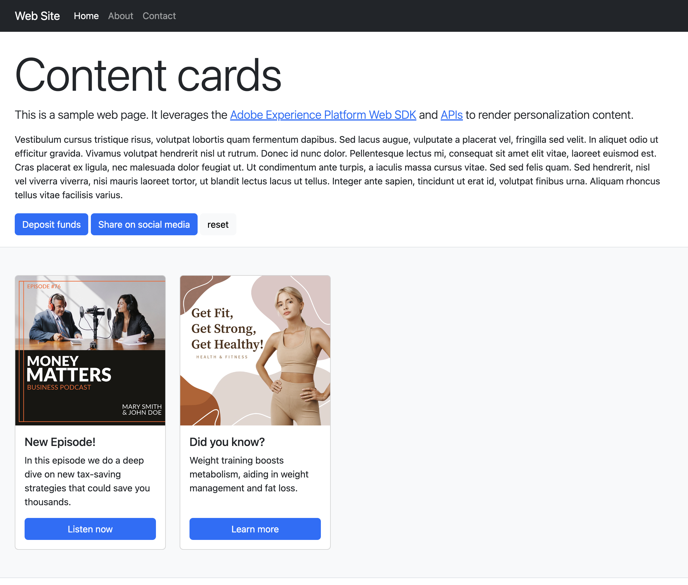

# Unterstützung für Inhaltskarten im Web SDK konfigurieren {#content-card-configuration-sdk}

>[!AVAILABILITY]
>
>Inhaltskarten sind derzeit nur für eine Reihe von Organisationen verfügbar (eingeschränkte Verfügbarkeit). Um Zugang zu erhalten, wenden Sie sich an den Adobe-Support.

In diesem Beispiel erfahren Sie, wie Sie mit Adobe Experience Platform Inhaltskarten aus Adobe Journey Optimizer (AJO) abrufen. Mit dem [Adobe Experience Platform Web SDK](https://experienceleague.adobe.com/en/docs/experience-platform/web-sdk/home) wird der Personalisierungsinhalt vollständig abgerufen und auf der Clientseite wiedergegeben.

Beim ersten Laden der Seite zeigt die Seite ihren Standardstatus an. Wenn Sie jedoch mit den Schaltflächen **Einlagenfonds** oder **In Social Media freigeben** interagieren, werden zusätzliche Inhaltskarten angezeigt. Diese Karten werden durch Client-seitige Bedingungen ausgelöst, die sicherstellen, dass sie nur angezeigt werden, wenn bestimmte Aktionen durchgeführt werden.



## Ausführen des Beispiels {#run-sample}

Voraussetzung: Sie müssen node und npm installieren. [Weitere Informationen finden Sie in dieser Dokumentation](https://docs.npmjs.com/downloading-and-installing-node-js-and-npm)

1. Einrichten lokaler SSL-Zertifikate für HTTPS. Diese Beispiele erfordern lokal signierte SSL-Zertifikate, um Inhalte über HTTPS bereitzustellen:

   1. Installieren Sie `mkcert` auf Ihrem Computer.

   1. Führen Sie nach der Installation `mkcert -install` aus, um das `mkcert root`-Zertifikat zu installieren.

1. Klonen Sie das Repository auf Ihrem lokalen Computer.

1. Öffnen Sie ein Terminal und navigieren Sie zum Ordner des Beispiels.

1. Installieren Sie die erforderlichen Abhängigkeiten, indem Sie `npm install` ausführen.

1. Starten Sie die Anwendung, indem Sie `npm start` ausführen.

1. Öffnen Sie Ihren Webbrowser und gehen Sie zu `https://localhost`.

## Funktionsweise {#setup}

1. Fügen Sie das [Web SDK](https://experienceleague.adobe.com/en/docs/experience-platform/web-sdk/home) auf der Seite ein und konfigurieren Sie es mithilfe der Einstellungen aus der Datei `.env` im Beispielordner.

   ```
   <script src="https://cdn1.adoberesources.net/alloy/2.18.0/alloy.min.js" async></script>
   alloy("configure", {
       defaultConsent: "in",
       edgeDomain: "{{edgeDomain}}",
       edgeConfigId: "{{edgeConfigId}}",
       orgId:"{{orgId}}",
       debugEnabled: false,
       personalizationStorageEnabled: true,
       thirdPartyCookiesEnabled: false
   });
   ```

1. Verwenden Sie den Befehl `sendEvent` , um personalisierten Inhalt abzurufen.

   ```
   alloy("sendEvent", {
       renderDecisions: true,
       personalization: {
           surfaces: ["web://alloy-samples.adobe.com/#content-cards-sample"],
       },
   });
   ```

1. Abonnieren Sie mit dem Befehl `subscribeRulesetItems` Inhaltskarten für eine bestimmte Oberfläche. Verarbeiten Sie jedes Mal, wenn Regelsätze ausgewertet werden, das Ergebnisobjekt im Callback, das `propositions` mit Inhaltskartendaten enthält.

   ```
   const contentCardManager = createContentCardManager("content-cards");
   
   alloy("subscribeRulesetItems", {
       surfaces: ["web://alloy-samples.adobe.com/#content-cards-sample"],
       schemas: ["https://ns.adobe.com/personalization/message/content-card"],
       callback: (result, collectEvent) => {
           const { propositions = [] } = result;
           contentCardManager.refresh(propositions, collectEvent);
       },
   });
   ```

1. Verwalten Sie das Rendering von Inhaltskarten und senden Sie `interact` - und `display` -Ereignisse mit dem in `script.js` gefundenen `contentCardsManager` -Objekt. Extrahieren, sortieren und verarbeiten Sie Inhaltskarten aus den empfangenen Vorschlägen.

   ```
   const createContentCard = (proposition, item) => {
       const { data = {}, id } = item;
       const {
           content = {},
           meta = {},
           publishedDate,
           qualifiedDate,
           displayedDate,
       } = data;
   
       return {
           id,
           ...content,
           meta,
           qualifiedDate,
           displayedDate,
           publishedDate,
           getProposition: () => proposition,
       };
   };
   
   const extractContentCards = (propositions) =>
       propositions
           .reduce((allItems, proposition) => {
           const { items = [] } = proposition;
   
           return [
               ...allItems,
               ...items.map((item) => createContentCard(proposition, item)),
           ];
       }, [])
       .sort(
           (a, b) =>
               b.qualifiedDate - a.qualifiedDate || b.publishedDate - a.publishedDate
       );
   
   const contentCards = extractContentCards(propositions);
   ```

1. Rendern Sie die Inhaltskarten anhand der für die einzelnen Kampagnen definierten Details. Jede Karte enthält einen `title`, `body`, `imageUrl` und andere benutzerdefinierte Datenwerte.

   ```
   const renderContentCards = () => {
       const contentCardsContainer = document.getElementById(containerElementId);
       contentCardsContainer.addEventListener("click", handleContentCardClick);
   
       let contents = "";
   
       contentCards.forEach((card) => {
           const { id, title, body, imageUrl, meta = {} } = card;
           const { buttonLabel = "" } = meta;
   
           contents += `
               <div class="col">
                   <div data-id="${id}" class="card h-100">
                       
                       <div class="card-body d-flex flex-column">
                           <h5 class="card-title">${title}</h5>
                           <p class="card-text">${body}</p>
                           <a href="#" class="mt-auto btn btn-primary">${buttonLabel}</a>
                       </div>
                   </div>
                </div>
            `;
       });
   
       contentCardsContainer.innerHTML = contents;
       collectEvent(
           "display",
           contentCards.map((card) => card.getProposition())
        );
   };
   ```

1. Wenn der Rückruf `subscribeRulesetItems` aufgerufen wird, wird auch eine Convenience-Funktion namens `collectEvent` bereitgestellt. Diese Funktion wird zum Senden von Experience Edge-Ereignissen verwendet, um Interaktionen, Anzeigen und andere Benutzeraktionen zu verfolgen. In diesem Beispiel verfolgt collectEvent, wenn auf eine Inhaltskarte geklickt wird. Wenn auf die Schaltfläche auf der Inhaltskarte geklickt wird, wird der Browser außerdem zu dem von der Kampagne angegebenen `actionUrl` weitergeleitet.

   ```
   const handleContentCardClick = (evt) => {
       const cardEl = evt.target.closest(".card");
   
       if (!cardEl) {
           return;
       }
   
       const isAnchor = evt.target.nodeName === "A";
       const card = contentCards.find((card) => card.id === cardEl.dataset.id);
   
       if (!card) {
           return;
       }
   
       collectEvent("interact", [card.getProposition()]);
   
       if (isAnchor) {
           evt.preventDefault();
           evt.stopImmediatePropagation();
           const { actionUrl } = card;
           if (actionUrl && actionUrl.length > 0) {
               window.location.href = actionUrl;
           }
       }
   };
   ```

## Wichtige Beobachtungen {#key-observations}

### personalizationStorageEnabled

Die Option `personalizationStorageEnabled` ist im Befehl `configure` auf `true` gesetzt. Dadurch wird sichergestellt, dass zuvor qualifizierte Inhaltskarten gespeichert und auch weiterhin über Benutzersitzungen hinweg angezeigt werden.

### Trigger

Inhaltskarten unterstützen benutzerdefinierte Trigger, die clientseitig ausgewertet werden. Wenn eine Trigger-Regel erfüllt ist, werden zusätzliche Inhaltskarten angezeigt. In diesem Beispiel werden vier verschiedene Kampagnen verwendet, eine für jede Inhaltskarte, die alle dieselbe Oberfläche aufweisen: `web://alloy-samples.adobe.com/#content-cards-sample`. In der folgenden Tabelle werden die Regeln für die Trigger der einzelnen Kampagnen und deren Erfüllung erläutert.

<table>
    <tr>
        <th>Trigger-Regel</th>
        <th>Karte</th>
        <th>Erfüllen der Trigger-Regel</th>
    </tr>
    <tr>
        <td>Keine</td>
        <td></td>
        <td>sendEvent-Befehl. Keine clientseitige Regel, die erfüllt werden muss.</td>
    </tr>
    <tr>
        <td>Keine</td>
        <td></td>
        <td>sendEvent-Befehl. Keine clientseitige Regel, die erfüllt werden muss.</td>
    </tr>
    <tr>
        <td></td>
        <td></td>
        <td></td>
    </tr>
    <tr>
        <td></td>
        <td></td>
        <td></td>
    </tr>
</table>

Der Befehl `evaluateRulesets` wird beim Klicken auf die Schaltflächen &quot;Einlagenfonds&quot;und &quot;Social Media freigeben&quot;ausgelöst. Jede Schaltfläche gibt den relevanten `decisionContext` an, um die für die jeweiligen Kampagnen definierten Regeln zu erfüllen.

```
document.getElementById("action-button-1").addEventListener("click", () => {
    alloy("evaluateRulesets", {
        renderDecisions: true,
        personalization: {
            decisionContext: {
                action: "deposit-funds",
            },
        },
    });
});

document.getElementById("action-button-2").addEventListener("click", () => {
    alloy("evaluateRulesets", {
        renderDecisions: true,
        personalization: {
            decisionContext: {
                action: "social-media",
            },
        },
    });
});
```
