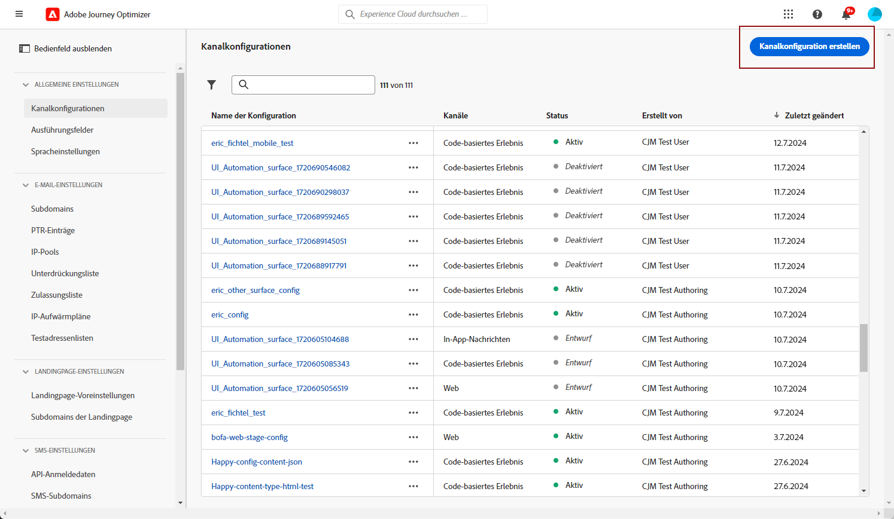
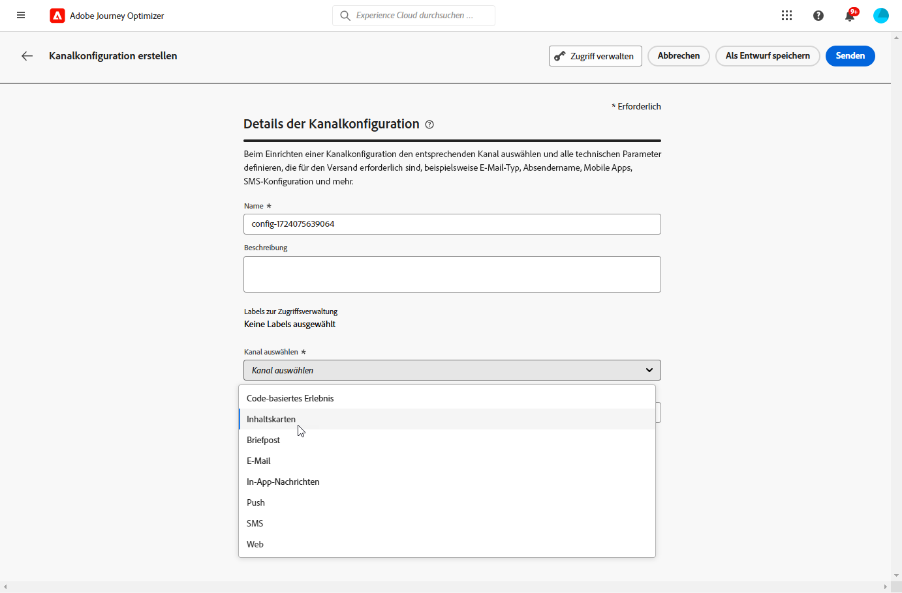
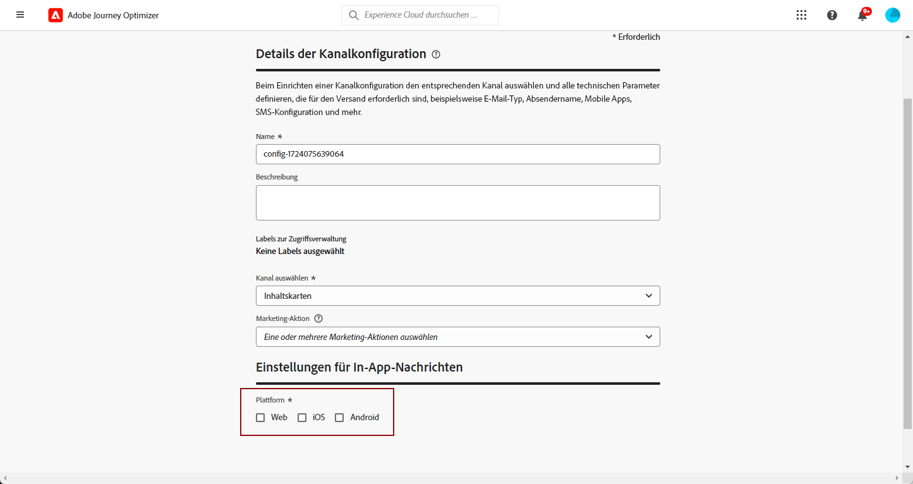

# Inhaltskarten konfigurieren {#content-card-configuration}

>[!BEGINSHADEBOX]

**Inhaltsverzeichnis**

* [Erste Schritte mit Inhaltskarten](get-started-content-card.md)
* [Voraussetzungen für Inhaltskarten](content-card-configuration-prereq.md)
* **Kanal für Inhaltskarten konfigurieren**
* [Erstellen von Inhaltskarten](create-content-card.md)
* [Inhaltskarten erstellen](design-content-card.md)
* [Inhaltskarten-Bericht](content-card-report.md)

>[!ENDSHADEBOX]

## Was ist eine Konfiguration? {#surface-definition}

Eine **Erlebniskonfiguration für Inhaltskarten** ist eine Entität, die für Benutzer- oder Systeminteraktionen entwickelt wurde und durch einen **URI** eindeutig identifiziert wird.

Mit anderen Worten, eine Oberfläche kann auf jeder Hierarchieebene als Container mit einer vorhandenen Entität (Touchpoint) betrachtet werden.

* Dabei kann es sich um eine Webseite, eine mobile App, ein Desktop-Programm, einen bestimmten Inhaltsspeicherort innerhalb einer größeren Entität (z. B. einen `div`) oder ein nicht standardmäßiges Anzeigemuster (z. B. einen Kiosk oder ein Desktop-Programm-Banner) handeln.

* Für Nicht-Anzeigen oder abstrakte Anzeigen (z. B. für Dienste bereitgestellte JSON-Blobs) kann sie auch auf bestimmte Teile von Inhalts-Containern erweitert werden.

* Es kann sich auch um eine Platzhalteroberfläche handeln, die einer Vielzahl von Client-Oberflächendefinitionen entspricht (z. B. kann die Position eines Hero-Bilds auf jeder Seite Ihrer Website in einen Oberflächen-URI wie web://mydomain.com/*#hero_image übersetzt werden).

Grundsätzlich besteht ein Oberflächen-URI aus mehreren Abschnitten:

1. **Typ**: Web, Mobile App, ATM, Kiosk, tvcd, Dienst
1. **Eigenschaft**: Seiten-URL oder App-Paket
1. **Container**: Speicherort auf der Seite/App-Aktivität

In der folgenden Tabelle sind einige beispielhafte Definitionen eines Oberflächen-URI für verschiedene Geräte aufgeführt.

**Web und Mobil**

| Typ | URI | Beschreibung |
| --------- | ----------- | ------- | 
| Web | `web://domain.com/path/page.html#element` | Stellt ein einzelnes Element innerhalb einer bestimmten Seite einer bestimmten Domain dar, bei dem ein Element wie in den folgenden Beispielen eine Bezeichnung sein kann: hero_banner, top_nav, menu, footer. |
| iOS-App | `mobileapp://com.vendor.bundle/activity#element` | Stellt ein bestimmtes Element innerhalb der Aktivität einer nativen App dar, z. B. eine Schaltfläche oder ein anderes Ansichtselement. |
| Android-App | `mobileapp://com.vendor.bundle/#element` | Stellt ein bestimmtes Element in einer nativen App dar. |

**Andere Gerätetypen**

| Typ | URI | Beschreibung |
| --------- | ----------- | ------- | 
| Desktop | `desktop://com.vendor.bundle/#element` | Stellt ein bestimmtes Element in einer Anwendung dar, z. B. eine Schaltfläche, ein Menü, ein Hero-Banner usw. |
| TV-App | `tvcd://com.vendor.bundle/#element` | Stellt ein bestimmtes Element in einer mit einem Smart TV- oder TV-Gerät verbundenen Geräteanwendung dar – Bundle-ID. |
| Service | `service://servicename/#element` | Stellt einen Server-seitigen Prozess oder eine andere manuelle Entität dar. |
| Kiosk | `kiosk://location/screen#element` | Beispiel potenzieller zusätzlicher Oberflächentypen, die leicht hinzugefügt werden können. |
| ATM | `atm://location/screen#element` | Beispiel potenzieller zusätzlicher Oberflächentypen, die leicht hinzugefügt werden können. |

**Platzhalteroberfläche**

| Typ | URI | Beschreibung |
| --------- | ----------- | ------- | 
| Platzhalter-Web | `wildcard:web://domain.com/*#element` | Platzhalteroberfläche – stellt ein einzelnes Element auf jeder Seite unter einer bestimmten Domain dar. |
| Platzhalter-Web | `wildcard:web://*domain.com/*#element` | Platzhalteroberfläche – stellt ein einzelnes Element auf jeder Seite unter allen Domains dar, die auf „domain.com“ enden. |

## Erstellen einer Inhaltskartenkonfiguration {#create-config}

1. Rufen Sie das Menü **[!UICONTROL Kanäle]** > **[!UICONTROL Branding]** > **[!UICONTROL Kanalkonfigurationen]** auf und klicken Sie dann auf **[!UICONTROL Kanalkonfiguration erstellen]**.

   

1. Geben Sie einen Namen und eine Beschreibung (optional) für die Konfiguration an.

   >[!NOTE]
   >
   > Namen müssen mit einem Buchstaben (A–Z) beginnen. Ein Name darf nur alphanumerische Zeichen enthalten. Sie können auch die Zeichen Unterstrich `_`, Punkt `.` und Bindestrich `-` verwenden.

1. Um der Konfiguration benutzerdefinierte oder grundlegende Datennutzungskennzeichnungen zuzuweisen, können Sie **[!UICONTROL Zugriff verwalten]** auswählen. [Weitere Informationen zur Zugriffssteuerung auf Objektebene (OLAC)](../administration/object-based-access.md).

1. Wählen Sie den Kanal **[!UICONTROL Inhaltskarte]** aus.

   

1. Wählen Sie eine **[!UICONTROL Marketing-Aktion]** aus, um Einverständnisrichtlinien mit den Nachrichten zu verknüpfen, die diese Konfiguration verwenden. Es werden alle mit dieser Marketing-Aktion verknüpften Einverständnisrichtlinien genutzt, um die Voreinstellungen Ihrer Kundinnen und Kunden zu respektieren. [Weitere Informationen](../action/consent.md#surface-marketing-actions)

1. Wählen Sie die Plattform aus, auf die das Erlebnis der Inhaltskarte angewendet werden soll.

   

1. Beim Web:

   * Geben Sie eine **[!UICONTROL Seiten-URL]** an, um Änderungen ausschließlich auf eine einzelne Seite anzuwenden.

   * Oder erstellen Sie eine **[!UICONTROL Regel für den Seitenabgleich]**, um mehrere URLs als Ziel festzulegen, die mit der angegebenen Regel übereinstimmen. Dies könnte beispielsweise verwendet werden, um Änderungen universell auf eine Website anzuwenden, z. B. ein Hero-Banner über alle Seiten hinweg zu aktualisieren oder ein Top-Bild hinzufügen, das auf jeder Produktseite angezeigt werden soll. [Weitere Informationen](../web/web-configuration.md)

1. Für iOS und Android:

   * Geben Sie Ihre **[!UICONTROL App-ID]**, Ihren **[!UICONTROL Standort oder Pfad innerhalb der App]** und Ihre **[!UICONTROL Vorschau-URL]** ein oder wählen Sie sie aus.

1. Senden Sie Ihre Änderungen ab.

Sie können jetzt Ihre Konfiguration beim Erstellen Ihrer Inhaltskarte auswählen.

