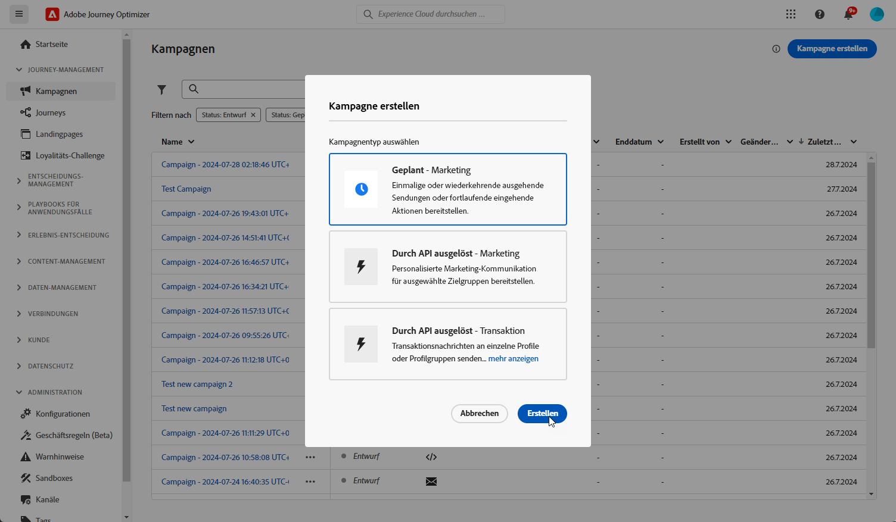

# Erstellen von Inhaltskarten {#create-content-card}

>[!IMPORTANT]
>
>Standardmäßig wird die Karte durch Klicken auf die Schaltfläche Schließen ausgeblendet. Um weitere Funktionen hinzuzufügen, können Sie manuell Regeln für Abweisungen oder Disqualifikationen definieren.

>[!BEGINTABS]

>[!TAB Hinzufügen von Inhaltskarten zu einer Journey]

Gehen Sie wie folgt vor, um eine Inhaltskarte zu einer Journey hinzuzufügen:

1. Öffnen Sie Ihre Journey und ziehen Sie eine Aktivität **[!UICONTROL Karte]** per Drag-and-Drop aus dem Bereich **[!UICONTROL Aktionen]** der Palette.

   

1. Geben Sie ein **[!UICONTROL Label]** und eine **[!UICONTROL Beschreibung]** für Ihre Nachricht ein.

1. Wählen Sie die [Inhaltskartenkonfiguration](content-card-configuration.md) aus, die verwendet werden soll.

   

1. Sie können jetzt über die Schaltfläche **[!UICONTROL Inhalt bearbeiten]** mit der Erstellung Ihrer Inhalte beginnen. [Weitere Informationen](design-content-card.md)

1. Aktivieren Sie die **[!UICONTROL Zusätzliche Versandregeln aktivieren]** und wählen Sie dann **[!UICONTROL Regeln bearbeiten]** aus, um festzulegen, wann Ihre Nachricht angezeigt, verworfen oder dauerhaft ausgeblendet werden soll.

   

   1. Klicken Sie auf **[!UICONTROL Bedingung hinzufügen]**, um Ihr Ereignis auszuwählen.

      +++Siehe verfügbares Ereignis.

      | Paket | Auslöser | Definition |
      |---|---|---|
      | Daten an Platform senden | Daten an Platform gesendet | Wird ausgelöst, wenn die Mobile App ein Edge-Erlebnisereignis ausgibt, um Daten an die Adobe Experience Platform zu senden. Normalerweise der API-Aufruf [sendEvent](https://developer.adobe.com/client-sdks/documentation/edge-network/api-reference/#sendevent) aus der AEP Edge-Erweiterung. |
      | Core-Tracking | Aktion nachverfolgen | Wird ausgelöst, wenn die in der Mobile-Code-API angebotene ältere Funktionalität [trackAction](https://developer.adobe.com/client-sdks/documentation/mobile-core/api-reference/#trackaction) aufgerufen wird. |
      | Core-Tracking | Status nachverfolgen | Wird ausgelöst, wenn die in der Mobile-Code-API angebotene ältere Funktionalität [trackState](https://developer.adobe.com/client-sdks/documentation/mobile-core/api-reference/#trackstate) aufgerufen wird. |
      | Core-Tracking | PII erfassen | Wird ausgelöst, wenn die in der Mobile-Code-API angebotene ältere Funktionalität [collectPII](https://developer.adobe.com/client-sdks/documentation/mobile-core/api-reference/#collectpii) aufgerufen wird. |
      | Anwendungslebenszyklus | Anwendungsstart | Wird bei jeder Ausführung ausgelöst, einschließlich Abstürzen und Installationen. Wird auch bei einer Wiederaufnahme aus dem Hintergrund ausgelöst, wenn das Sitzungs-Timeout des Lebenszyklus überschritten wurde. |
      | Anwendungslebenszyklus | Anwendungsinstallation | Wird beim ersten Ausführen nach einer Installation oder Neuinstallation ausgelöst. |
      | Anwendungslebenszyklus | Anwendungsaktualisierung | Wird beim ersten Start nach einem Upgrade oder bei Änderung der Versionsnummer ausgelöst. |
      | Anwendungslebenszyklus | Schließen der Anwendung | Wird ausgelöst, wenn die Anwendung geschlossen wird. |
      | Anwendungslebenszyklus | Anwendungsabsturz | Wird ausgelöst, wenn die Anwendung beim Beenden nicht im Hintergrund ausgeführt wird. Das Ereignis wird gesendet, wenn die Anwendung nach dem Absturz gestartet wird. Adobe Mobile-Absturz-Reporting implementiert keinen globalen Handler für nicht abgefangene Ausnahmen. |

      +++

   1. Wählen Sie die Bedingung **[!UICONTROL Oder]**, wenn Sie weitere **[!UICONTROL Trigger]** hinzufügen möchten, um Ihre Regel weiter zu erweitern.

   1. Wählen Sie die Bedingung **[!UICONTROL Und]**, wenn Sie **[!UICONTROL Merkmale]** hinzufügen und Ihre Regel besser anpassen möchten.

      +++Sehen Sie sich die verfügbaren Merkmale an.

      | Paket | Merkmale  | Definition |
      |---|---|---|
      | Geräteinformationen | Betreibername | Wird ausgelöst, wenn einer der Betreibernamen aus der Liste vorliegt. |
      | Geräteinformationen | Gerätename | Wird ausgelöst, wenn einer der Gerätenamen vorliegt |
      | Geräteinformationen | Gebietsschema | Wird ausgelöst, wenn eine der Sprachen aus der Liste vorliegt. |
      | Geräteinformationen | Betriebssystemversion | Wird ausgelöst, wenn eine der angegebenen Betriebssystemversionen vorliegt. |
      | Geräteinformationen | Vorherige Betriebssystemversion | Wird ausgelöst, wenn eine der angegebenen vorherigen Betriebssystemversionen vorliegt. |
      | Geräteinformationen | Betriebsmodus | Wird ausgelöst, wenn der Betriebsmodus entweder eine Anwendung oder eine Erweiterung ist. |
      | Anwendungslebenszyklus | App-ID | Wird ausgelöst, wenn die angegebene App-ID vorliegt. |
      | Anwendungslebenszyklus | Wochentag | Wird ausgelöst, wenn der angegebene Wochentag vorliegt. |
      | Anwendungslebenszyklus | Tag seit der ersten Verwendung | Wird ausgelöst, wenn die angegebene Anzahl von Tagen seit der ersten Verwendung erreicht ist. |
      | Anwendungslebenszyklus | Tag seit der letzten Verwendung | Wird ausgelöst, wenn die angegebene Anzahl von Tagen seit der letzten Verwendung erreicht ist. |
      | Anwendungslebenszyklus | Tage seit Aktualisierung | Wird ausgelöst, wenn die angegebene Anzahl von Tagen seit der letzten Aktualisierung erreicht ist. |
      | Anwendungslebenszyklus | Installationsdatum | Wird ausgelöst, wenn das angegebene Installationsdatum erreicht ist. |
      | Anwendungslebenszyklus | Starts | Wird ausgelöst, wenn die angegebene Anzahl von Starts erreicht ist. |
      | Anwendungslebenszyklus | Tageszeit | Wird ausgelöst, wenn die angegebene Tageszeit erreicht ist. |

      +++

   1. Klicken Sie auf **[!UICONTROL Gruppe erstellen]**, um Trigger zu gruppieren.

1. Schließen Sie bei Bedarf Ihren Journey-Fluss ab, indem Sie zusätzliche Aktionen oder Ereignisse per Drag-and-Drop verschieben. [Weitere Informationen](../building-journeys/about-journey-activities.md)

1. Sobald Ihre Inhaltskarte fertig ist, schließen Sie die Konfiguration ab und veröffentlichen Sie Ihre Journey, um sie zu aktivieren.

Weitere Informationen zur Konfiguration einer Journey finden Sie auf [dieser Seite](../building-journeys/journey-gs.md).

>[!TAB Hinzufügen von Inhaltskarten zu einer Kampagne]

Gehen Sie wie folgt vor, um mit der Erstellung der Inhaltskarten durch eine Kampagne zu beginnen.

1. Erstellen einer Kampagne. [Weitere Informationen](../campaigns/create-campaign.md)

1. Wählen Sie den Typ der Kampagne aus, die Sie ausführen möchten.

   * **[!UICONTROL Geplant – Marketing]**: die Kampagne wird sofort oder an einem bestimmten Datum ausgeführt. Geplante Kampagnen dienen dem Versand von Nachrichten des Typs **Marketing**. Sie werden über die Benutzeroberfläche konfiguriert und ausgeführt.

   * **[!UICONTROL API-ausgelöst – Marketing/Transaktion]**: die Kampagne wird mithilfe eines API-Aufrufs ausgeführt.  API-ausgelöste Kampagnen zielen auf den Versand von Nachrichten des Typs **Marketing** oder **Transaktion** ab. Beim Typ „Transaktion“ handelt es sich um Nachrichten, die nach einer von einem Kontakt durchgeführten Aktion verschickt werden: Zurücksetzen des Passworts, Verlassen des Warenkorbs usw. [Erfahren Sie, wie Sie eine Kampagne mithilfe von APIs auslösen](../campaigns/api-triggered-campaigns.md)

   

1. Geben Sie im Abschnitt **[!UICONTROL Eigenschaften]** einen Namen und eine Beschreibung für die Kampagne an.

1. Klicken Sie im Abschnitt **Zielgruppe** auf die Schaltfläche **[!UICONTROL Zielgruppe auswählen]**, um die Liste der verfügbaren Zielgruppen in Adobe Experience Platform anzuzeigen. [Weitere Informationen zu Zielgruppen](../audience/about-audiences.md)

1. Wählen Sie im Feld **[!UICONTROL Identity-Namespace]** den Namespace aus, der zur Identifizierung der Personen im ausgewählten Segment verwendet werden soll. [Weitere Informationen zu Namespaces](../event/about-creating.md#select-the-namespace)

1. Wählen Sie die Aktion **[!UICONTROL Inhaltskarte]** aus.

   

1. Wählen oder erstellen Sie eine neue [Inhaltskartenkonfiguration](content-card-configuration.md).

1. Um den Inhalt Ihrer Nachricht zu testen, klicken Sie auf **[!UICONTROL Experiment erstellen]**. Auf diese Weise können Sie mehrere Variablen eines Versands für Stichprobenpopulationen testen, um festzustellen, welche Behandlung die größte Auswirkung auf die Zielgruppe hat. [Weitere Informationen zu Inhaltskomponenten](../content-management/content-experiment.md)

1. Aktivieren Sie die **[!UICONTROL Zusätzliche Versandregeln aktivieren]** und wählen Sie dann **[!UICONTROL Regeln bearbeiten]** aus, um festzulegen, wann Ihre Nachricht angezeigt, verworfen oder dauerhaft ausgeblendet werden soll.

   Verwenden Sie den Regel-Builder, um bestimmte Bedingungen festzulegen, unter denen diese Aktionen Trigger haben.

   1. Klicken Sie auf **[!UICONTROL Bedingung hinzufügen]**, um Ihr Ereignis auszuwählen.

      +++Siehe verfügbares Ereignis.

      | Paket | Auslöser | Definition |
      |---|---|---|
      | Daten an Platform senden | Daten an Platform gesendet | Wird ausgelöst, wenn die Mobile App ein Edge-Erlebnisereignis ausgibt, um Daten an die Adobe Experience Platform zu senden. Normalerweise der API-Aufruf [sendEvent](https://developer.adobe.com/client-sdks/documentation/edge-network/api-reference/#sendevent) aus der AEP Edge-Erweiterung. |
      | Core-Tracking | Aktion nachverfolgen | Wird ausgelöst, wenn die in der Mobile-Code-API angebotene ältere Funktionalität [trackAction](https://developer.adobe.com/client-sdks/documentation/mobile-core/api-reference/#trackaction) aufgerufen wird. |
      | Core-Tracking | Status nachverfolgen | Wird ausgelöst, wenn die in der Mobile-Code-API angebotene ältere Funktionalität [trackState](https://developer.adobe.com/client-sdks/documentation/mobile-core/api-reference/#trackstate) aufgerufen wird. |
      | Core-Tracking | PII erfassen | Wird ausgelöst, wenn die in der Mobile-Code-API angebotene ältere Funktionalität [collectPII](https://developer.adobe.com/client-sdks/documentation/mobile-core/api-reference/#collectpii) aufgerufen wird. |
      | Anwendungslebenszyklus | Anwendungsstart | Wird bei jeder Ausführung ausgelöst, einschließlich Abstürzen und Installationen. Wird auch bei einer Wiederaufnahme aus dem Hintergrund ausgelöst, wenn das Sitzungs-Timeout des Lebenszyklus überschritten wurde. |
      | Anwendungslebenszyklus | Anwendungsinstallation | Wird beim ersten Ausführen nach einer Installation oder Neuinstallation ausgelöst. |
      | Anwendungslebenszyklus | Anwendungsaktualisierung | Wird beim ersten Start nach einem Upgrade oder bei Änderung der Versionsnummer ausgelöst. |
      | Anwendungslebenszyklus | Schließen der Anwendung | Wird ausgelöst, wenn die Anwendung geschlossen wird. |
      | Anwendungslebenszyklus | Anwendungsabsturz | Wird ausgelöst, wenn die Anwendung beim Beenden nicht im Hintergrund ausgeführt wird. Das Ereignis wird gesendet, wenn die Anwendung nach dem Absturz gestartet wird. Adobe Mobile-Absturz-Reporting implementiert keinen globalen Handler für nicht abgefangene Ausnahmen. |

      +++

   1. Wählen Sie die Bedingung **[!UICONTROL Oder]**, wenn Sie weitere **[!UICONTROL Trigger]** hinzufügen möchten, um Ihre Regel weiter zu erweitern.

   1. Wählen Sie die Bedingung **[!UICONTROL Und]**, wenn Sie **[!UICONTROL Merkmale]** hinzufügen und Ihre Regel besser anpassen möchten.

      +++Sehen Sie sich die verfügbaren Merkmale an.

      | Paket | Merkmale  | Definition |
      |---|---|---|
      | Geräteinformationen | Betreibername | Wird ausgelöst, wenn einer der Betreibernamen aus der Liste vorliegt. |
      | Geräteinformationen | Gerätename | Wird ausgelöst, wenn einer der Gerätenamen vorliegt |
      | Geräteinformationen | Gebietsschema | Wird ausgelöst, wenn eine der Sprachen aus der Liste vorliegt. |
      | Geräteinformationen | Betriebssystemversion | Wird ausgelöst, wenn eine der angegebenen Betriebssystemversionen vorliegt. |
      | Geräteinformationen | Vorherige Betriebssystemversion | Wird ausgelöst, wenn eine der angegebenen vorherigen Betriebssystemversionen vorliegt. |
      | Geräteinformationen | Betriebsmodus | Wird ausgelöst, wenn der Betriebsmodus entweder eine Anwendung oder eine Erweiterung ist. |
      | Anwendungslebenszyklus | App-ID | Wird ausgelöst, wenn die angegebene App-ID vorliegt. |
      | Anwendungslebenszyklus | Wochentag | Wird ausgelöst, wenn der angegebene Wochentag vorliegt. |
      | Anwendungslebenszyklus | Tag seit der ersten Verwendung | Wird ausgelöst, wenn die angegebene Anzahl von Tagen seit der ersten Verwendung erreicht ist. |
      | Anwendungslebenszyklus | Tag seit der letzten Verwendung | Wird ausgelöst, wenn die angegebene Anzahl von Tagen seit der letzten Verwendung erreicht ist. |
      | Anwendungslebenszyklus | Tage seit Aktualisierung | Wird ausgelöst, wenn die angegebene Anzahl von Tagen seit der letzten Aktualisierung erreicht ist. |
      | Anwendungslebenszyklus | Installationsdatum | Wird ausgelöst, wenn das angegebene Installationsdatum erreicht ist. |
      | Anwendungslebenszyklus | Starts | Wird ausgelöst, wenn die angegebene Anzahl von Starts erreicht ist. |
      | Anwendungslebenszyklus | Tageszeit | Wird ausgelöst, wenn die angegebene Tageszeit erreicht ist. |

      +++

   1. Klicken Sie auf **[!UICONTROL Gruppe erstellen]**, um Trigger zu gruppieren.

   

1. Sie können Ihre Kampagne auf ein bestimmtes Datum festlegen oder so einstellen, dass sie in regelmäßigen Abständen wiederholt werden. [Weitere Informationen](../campaigns/create-campaign.md#schedule)

1. Mit **[!UICONTROL Inhalt bearbeiten]** können Sie nun mit der Gestaltung Ihres Inhalts beginnen. [Weitere Informationen](design-content-card.md)

   

>[!ENDTABS]
