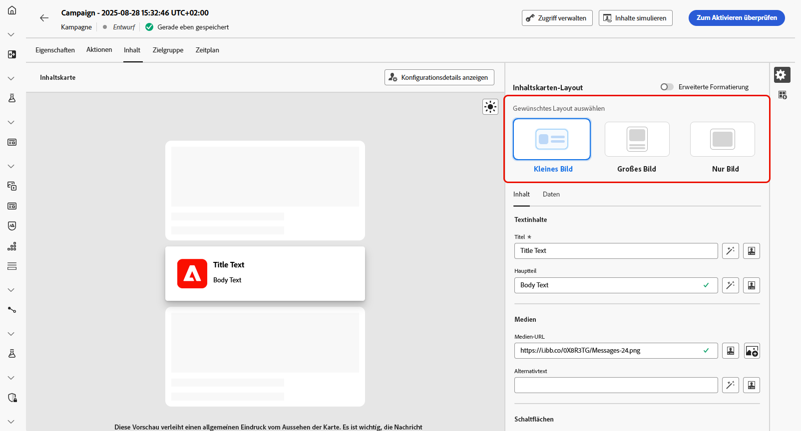

# Entwerfen von Inhalten für Inhaltskarten {#design-content-card}

Das Authoring-Konstrukt für Karten bietet ein formularbasiertes Authoring-Erlebnis, das Marketing-Fachleuten grundlegende Eingaben bereitstellt, die von Entwickelnden zur Wiedergabe verwendet werden können.

Sobald Ihr Inhalt definiert und personalisiert ist, können Sie ihn überprüfen und aktivieren. Ihre Kampagne wird entsprechend dem festgelegten Zeitplan gesendet. [Weitere Informationen finden Sie auf dieser Seite](../campaigns/review-activate-campaign.md).

## Inhaltskarten-Layout

Wählen Sie im Abschnitt **[!UICONTROL Inhaltskarten-Layout]** eine der drei Optionen für das Bild-Layout aus, je nach Ihren Messaging-Anforderungen.

* **[!UICONTROL Kleines Bild]**: Zeigt ein kompaktes Bild zusammen mit Text an, ideal für Nachrichten, bei denen Inhalt Vorrang vor Visualisierungen hat.

  Weitere Informationen finden Sie in der Adobe-Entwicklerdokumentation [für iOS](https://developer.adobe.com/client-sdks/edge/adobe-journey-optimizer/content-card-ui/iOS/templates/smallimage-template/) und [für Android](https://developer.adobe.com/client-sdks/edge/adobe-journey-optimizer/content-card-ui/Android/public-classes/state/smallimagecarduistate/).

* **[!UICONTROL Großes Bild]**: Ein hervorgehobenes Bild über oder neben dem Text, wodurch der visuelle Aspekt zum Hauptfokus Ihrer Nachricht wird.

  Weitere Informationen finden Sie in der Adobe-Entwicklerdokumentation [für iOS](https://developer.adobe.com/client-sdks/edge/adobe-journey-optimizer/content-card-ui/iOS/templates/largeimage-template/) und [für Android](https://developer.adobe.com/client-sdks/edge/adobe-journey-optimizer/content-card-ui/Android/public-classes/state/largeimagecarduistate/).

* **[!UICONTROL Nur Bild]**: Zeigt das Bild ohne begleitenden Text an, perfekt für visuell gesteuerte Nachrichten oder eigenständige Bilder.

  Weitere Informationen finden Sie in der Adobe-Entwicklerdokumentation [für iOS](https://developer.adobe.com/client-sdks/edge/adobe-journey-optimizer/content-card-ui/iOS/templates/imageonly-template/) und [für Android](https://developer.adobe.com/client-sdks/edge/adobe-journey-optimizer/content-card-ui/Android/public-classes/state/imageonlycarduistate/).

## Registerkarte „Inhalt“ {#content-tab}

Auf der Registerkarte **[!UICONTROL Inhalt]** können Sie Ihre Inhaltskarten anpassen, indem Sie Inhalte definieren und Medien- und Aktionsschaltflächen direkt auf dieser Registerkarte hinzufügen.

### Textinhalte {#title-body}

Um Ihre Nachricht zu erstellen, geben Sie Ihren Text in die Felder **[!UICONTROL Titel]** und **[!UICONTROL Nachricht]** ein.

Wenn Sie Ihre Nachricht weiter anpassen möchten, verwenden Sie das Symbol **[!UICONTROL Personalisierung]**, um personalisierte Elemente hinzuzufügen. Eine ausführliche Anleitung zur Verwendung der Personalisierungsfunktionen finden Sie in [diesem Abschnitt](../personalization/personalize.md).

### Medien {#add-media}

Im Feld **[!UICONTROL Medien]** können Sie Ihre Inhaltskarten durch Hinzufügen von Medien erweitern, wodurch Ihre Präsentation für Endnutzerinnen und -nutzer attraktiver wird.

Um Medien einzubinden, geben Sie entweder die URL der gewünschten Medien ein oder klicken Sie auf das Symbol **[!UICONTROL Assets auswählen]**, um aus den in Ihrer Assets-Bibliothek gespeicherten Assets auszuwählen. [Weitere Informationen über Asset-Management.](../integrations/assets.md)

+++Mehr Optionen mit erweiterter Formatierung

Wenn der **[!UICONTROL Modus „Erweiterte Formatierung“]** eingeschaltet ist, können Sie einen **[!UICONTROL Alternativtext]** für Bildschirmlesehilfen und ein anderes Asset in das Feld **[!UICONTROL Medien-URL für dunklen Modus]** einfügen.

+++

### Schaltflächen        {#add-buttons}

Fügen Sie Schaltflächen hinzu, über die Benutzerinnen und Benutzer mit Ihren Inhaltskarten interagieren können.

1. Klicken Sie auf **[!UICONTROL Schaltfläche hinzufügen]**, um eine neue Aktionsschaltfläche zu erstellen.

1. Bearbeiten Sie das Feld **[!UICONTROL Titel]** der Schaltfläche, um das Label festzulegen, das auf der Schaltfläche angezeigt werden soll.

1. Wählen Sie ein **[!UICONTROL Interaktionsereignis]** aus, um festzulegen, welche Aktion ausgelöst werden soll, wenn Benutzende auf die Schaltfläche klicken oder mit ihr interagieren.

1. Geben Sie in das Feld **[!UICONTROL Ziel]** die Web-URL oder den Deeplink ein, an den die Benutzenden nach der Interaktion mit der Schaltfläche weitergeleitet werden sollen.

<!--
+++More options with advanced formatting

If the **[!UICONTROL Advanced formatting mode]** is switched on, you can choose for your **[!UICONTROL Buttons]**:

* the **[!UICONTROL Font]**
* the **[!UICONTROL Pt size]**
* the **[!UICONTROL Font Color]**
* the **[!UICONTROL Alignment]**

+++
-->

### Schaltfläche „Verwerfen“ {#close-button}

Wählen Sie den **[!UICONTROL Stil]** für Ihre **[!UICONTROL Schaltfläche „Verwerfen“]**, um deren Erscheinungsbild anzupassen.

Sie können aus den folgenden Optionen auswählen:

* **[!UICONTROL Kein]**
* **[!UICONTROL Einfach]**
* **[!UICONTROL Kreis]**

<!--
+++More options with advanced formatting

If the **[!UICONTROL Advanced formatting mode]** is switched on, you can choose for your **[!UICONTROL Header]** and **[!UICONTROL Body]**:

* the **[!UICONTROL Font]**
* the **[!UICONTROL Pt size]**
* the **[!UICONTROL Font Color]**
* the **[!UICONTROL Alignment]**
+++
-->

### Verhalten bei Klick

Geben Sie in das Feld **[!UICONTROL Ziel-URL]** die Web-URL oder den Deeplink ein, die bzw. der die Benutzenden nach der Interaktion mit Ihrer Inhaltskarte an das gewünschte Ziel weiterleitet. Dabei kann es sich um eine externe Website, eine bestimmte Seite innerhalb Ihrer App oder eine andere Stelle handeln, zu der die Benutzerinnen und Benutzer nach ihrer Interaktion weitergeleitet werden sollen.

## Registerkarte „Daten“

## Benutzerspezifische Daten {#custom-data}

Klicken Sie im Abschnitt **[!UICONTROL Benutzerdefinierte Daten]** auf **[!UICONTROL Schlüssel-/Wertpaar hinzufügen]**, um benutzerdefinierte Variablen in die Payload einzubeziehen. Mit diesen Schlüssel-/Wertpaaren können Sie je nach Konfiguration zusätzliche Daten übergeben. Auf diese Weise können Sie personalisierte oder dynamische Inhalte, Tracking-Informationen oder andere für Ihre Einrichtung relevante Daten hinzufügen.
