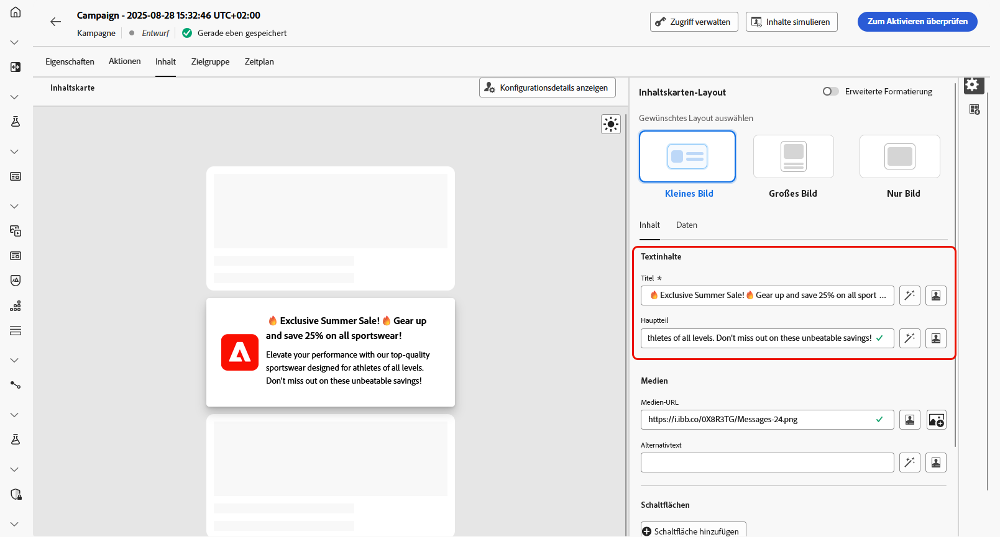

# Inhalte von Inhaltskarten erstellen {#design-content-card}

Das Authoring-Konstrukt für Karten bietet ein formularbasiertes Authoring-Erlebnis, das Marketing-Experten grundlegende Eingaben bereitstellt, die vom Entwickler zur Wiedergabe verwendet werden können.

Sobald Ihr Inhalt definiert und personalisiert wurde, können Sie ihn überprüfen und aktivieren. Ihre Kampagne wird entsprechend dem festgelegten Zeitplan gesendet. [Weiterführende Informationen finden Sie auf dieser Seite](../campaigns/review-activate-campaign.md).

## Registerkarte „Inhalt“ {#content-tab}

Auf der Registerkarte **[!UICONTROL Inhalt]** können Sie Ihre Inhaltskarten anpassen, indem Sie sowohl ihren Inhalt als auch das Design der Schaltfläche **[!UICONTROL Schließen]** definieren. Darüber hinaus können Sie Ihren Inhalt mit Medien erweitern und Aktionsschaltflächen direkt von diesem Tab aus hinzufügen.

### Schaltfläche „Schließen“ {#close-button}

Wählen Sie den **[!UICONTROL Stil]** für Ihre **[!UICONTROL Schaltfläche &quot;Schließen&quot;]** aus, um das Erscheinungsbild anzupassen.

Sie können aus den folgenden Stilen auswählen:

* **[!UICONTROL None]**
* **[!UICONTROL Einfach]**
* **[!UICONTROL Kreis]**

### Inhalt {#title-body}

Geben Sie zum Erstellen Ihrer Nachricht Ihren Text in die Felder **[!UICONTROL Titel]** und **[!UICONTROL Hauptteil]** ein.

Wenn Sie Ihre Nachricht weiter anpassen möchten, verwenden Sie das Symbol **[!UICONTROL Personalization]** , um personalisierte Elemente hinzuzufügen. Detaillierte Anweisungen zur Verwendung der Personalisierungsfunktionen finden Sie in [diesem Abschnitt](../personalization/personalize.md).

<!--
+++More options with advanced formatting

If the **[!UICONTROL Advanced formatting mode]** is switched on, you can choose for your **[!UICONTROL Header]** and **[!UICONTROL Body]**:

* the **[!UICONTROL Font]**
* the **[!UICONTROL Pt size]**
* the **[!UICONTROL Font Color]**
* the **[!UICONTROL Alignment]**
+++
-->

### Medien {#add-media}

Im Feld **[!UICONTROL Medien]** können Sie Ihre Inhaltskarten durch Hinzufügen von Medien erweitern, wodurch Ihre Präsentation für Endbenutzer attraktiver wird.

Um Medien einzubeziehen, geben Sie entweder die URL des Mediums ein, das Sie verwenden möchten, oder klicken Sie auf das Symbol **[!UICONTROL Assets auswählen]** , um aus den in Ihrer Assets-Bibliothek gespeicherten Assets auszuwählen. [Weitere Informationen über Asset-Management.](../content-management/assets.md)

<!--
+++More options with advanced formatting

If the **[!UICONTROL Advanced formatting mode]** is switched on, you can add an **[!UICONTROL Alternative text]** for screen reading applications and another asset in the **[!UICONTROL Dark Mode Media URL]** field.

+++
-->

### Schaltflächen        {#add-buttons}

Fügen Sie Schaltflächen hinzu, über die Benutzer mit Ihren Inhaltskarten interagieren können.

1. Klicken Sie auf die Schaltfläche **[!UICONTROL Hinzufügen]** , um eine neue Aktionsschaltfläche zu erstellen.

1. Bearbeiten Sie das Feld **[!UICONTROL Titel]** der Schaltfläche, um die Bezeichnung anzugeben, die auf der Schaltfläche angezeigt werden soll.

1. Wählen Sie ein **[!UICONTROL Interact-Ereignis]** aus, um festzulegen, welche Aktion ausgelöst wird, wenn Benutzer auf die Schaltfläche klicken oder mit ihr interagieren.

1. Geben Sie im Feld **[!UICONTROL Ziel]** die Web-URL oder den Deeplink ein, zu dem Benutzer weitergeleitet werden, nachdem sie mit der Schaltfläche interagiert haben.

<!--
+++More options with advanced formatting

If the **[!UICONTROL Advanced formatting mode]** is switched on, you can choose for your **[!UICONTROL Buttons]**:

* the **[!UICONTROL Font]**
* the **[!UICONTROL Pt size]**
* the **[!UICONTROL Font Color]**
* the **[!UICONTROL Alignment]**

+++
-->

### Verhalten bei Klick

Geben Sie im Feld **[!UICONTROL Ziel-URL]** die Web-URL oder den Deeplink ein, der Benutzer nach der Interaktion mit Ihrer Inhaltskarte zum gewünschten Ziel weiterleitet. Dabei kann es sich um eine externe Website, eine bestimmte Seite in Ihrer App oder einen anderen Ort handeln, zu dem Benutzer auf der Grundlage ihrer Interaktion weitergeleitet werden sollen.

## Daten-Tab

## Benutzerspezifische Daten {#custom-data}

Klicken Sie im Abschnitt **[!UICONTROL Benutzerdefinierte Daten]** auf **[!UICONTROL Schlüssel/Wert-Paar hinzufügen]** , um benutzerdefinierte Variablen in die Payload einzubeziehen. Mit diesen Schlüssel/Wert-Paaren können Sie je nach Konfiguration zusätzliche Daten übergeben. Auf diese Weise können Sie personalisierte oder dynamische Inhalte, Tracking-Informationen oder andere für Ihre Einrichtung relevante Daten hinzufügen.
