# Verwenden Sie die Inhaltskomponenten des E-Mail-Designers {#content-components}

>[!CONTEXTUALHELP]
>id="ac_content_components"
>title="Über Inhaltskomponenten"
>abstract="Inhaltskomponenten sind leere Platzhalter für Inhalte, mit denen Sie das Layout einer E-Mail erstellen können."

Wenn Sie Ihren E-Mail-Inhalt von Grund auf neu erstellen, können Sie **[!UICONTROL Inhaltskomponenten]** Ihre E-Mail mit unbearbeiteten, leeren Komponenten personalisieren, die Sie verwenden können, sobald sie in einer E-Mail platziert wurden.
Sie können so viele **[!UICONTROL Inhaltskomponenten]** hinzufügen, wie Sie in einer **[!UICONTROL Strukturkomponente]** benötigen, die das Layout Ihrer E-Mail definiert.

## Schaltfläche {#buttons}

Verwenden Sie die Komponente **[!UICONTROL Schaltfläche]**, um mehrere Schaltflächen in Ihre E-Mail-Audience einzufügen und Ihre E-Mail-Adresse auf eine andere Seite umzuleiten.

1. Ziehen Sie **[!UICONTROL Inhaltskomponenten]** und legen Sie **[!UICONTROL Schaltfläche]** in eine **[!UICONTROL Strukturkomponente]**.

   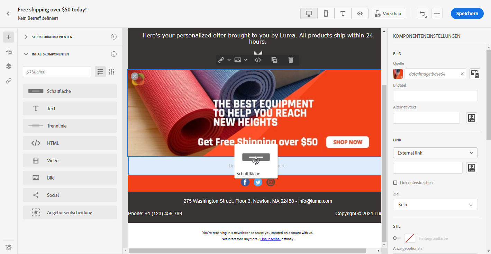

1. Klicken Sie auf die neu hinzugefügte Schaltfläche, um den Text zu personalisieren und Zugriff auf die **[!UICONTROL Komponenteneinstellungen]** im rechten Bereich des E-Mail-Designers zu haben.

   

1. Fügen Sie im Feld **[!UICONTROL Link]** der **[!UICONTROL Komponenteneinstellungen]** die URL hinzu, zu der Ihre Audience umgeleitet werden soll, wenn Sie auf die Schaltfläche klicken.

1. Wählen Sie aus, wie Ihre Audience mit der Dropdownliste **[!UICONTROL Zielgruppe]** umgeleitet werden soll:

   * **[!UICONTROL Keine]**: öffnet den Link in demselben Frame, in dem er angeklickt wurde (Standard).
   * **[!UICONTROL Leer]**: öffnet den Link in einem neuen Fenster oder auf einer neuen Registerkarte.
   * **[!UICONTROL Selbst]**: öffnet den Link in demselben Frame, in dem er angeklickt wurde.
   * **[!UICONTROL Übergeordnet]**: öffnet den Link im übergeordneten Frame.
   * **[!UICONTROL Oben]**: öffnet den Link im gesamten Textkörper des Fensters.

   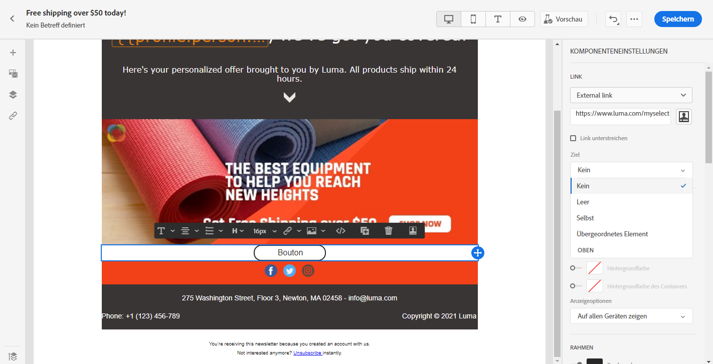

1. Sie können Ihre Schaltfläche jetzt weiter personalisieren, indem Sie beispielsweise die Optionen **[!UICONTROL Style]**, **[!UICONTROL Margin]** und **[!UICONTROL Border]** ändern.

## Text {#text}

Verwenden Sie die Komponente **[!UICONTROL Text]**, um Text in Ihre E-Mail einzufügen. Sie können die Farbe, den Stil und die Größe des Textes in den **[!UICONTROL Komponenteneinstellungen]** anpassen.

1. Ziehen Sie unter **[!UICONTROL Inhaltskomponenten]** **[!UICONTROL Text]** in eine **[!UICONTROL Strukturkomponente]**.

   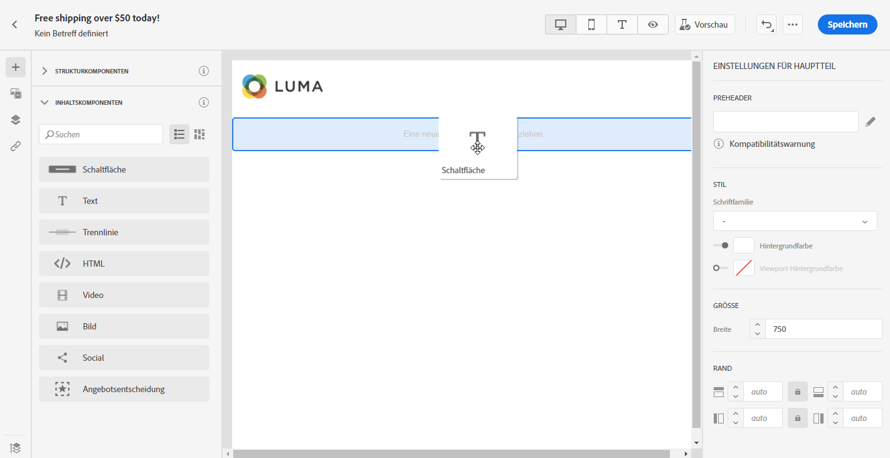

1. Klicken Sie auf die neu hinzugefügte Komponente, um den Text zu personalisieren und Zugriff auf die **[!UICONTROL Komponenteneinstellungen]** im rechten Bereich des E-Mail-Designers zu haben.

1. Ändern Sie den Text mit den folgenden Optionen in der Symbolleiste:

   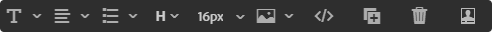

   * **[!UICONTROL Textstil]** ändern: fett, kursiv, unterstrichen oder durchgestrichen auf den Text anwenden.
   * **Ausrichtung** ändern: Wählen Sie zwischen links, rechts, zentriert oder ausgerichtet für Ihren Text aus.
   * **[!UICONTROL Liste]** erstellen: Fügen Sie dem Text eine Liste mit Aufzählungszeichen oder Nummern hinzu.
   * **[!UICONTROL Überschrift]** festlegen: bis zu sechs Überschriftenebenen zu Ihrem Text hinzufügen.
   * **Schriftgröße**: Wählen Sie die Schriftgröße des Textes in Pixel aus.
   * **[!UICONTROL Bild]** bearbeiten: Fügen Sie Ihrer Textkomponente ein Bild oder ein Asset hinzu. [Weitere Informationen zur Asset-Verwaltung](assets-essentials.md).
   * **[!UICONTROL Quellcode]** anzeigen: den Quellcode Ihres Textes anzeigen. Es kann nicht geändert werden.
   * **[!UICONTROL Duplikat]**: eine Kopie Ihrer Textkomponente hinzufügen.
   * **[!UICONTROL Löschen]**: die ausgewählte Textkomponente aus Ihrer E-Mail löschen.
   * **[!UICONTROL hinzufügen Personalisierung]**: Fügen Sie Personalisierungsfelder hinzu, um den Inhalt Ihrer Profil-Daten anzupassen. [Erfahren Sie mehr über die Personalisierung](personalization/personalize.md) von Inhalten.

1. Für eine bessere Benutzerfreundlichkeit können Sie Personalisierungsfelder zur Zielgruppe Ihrer Audience hinzufügen. Weitere Informationen hierzu finden Sie in [diesem Abschnitt](personalization/personalize.md).

1. Passen Sie die Schriftfamilie **[!UICONTROL Textfarbe]**, **[!UICONTROL Schriftfamilie]** und **[!UICONTROL Größe]** in den **[!UICONTROL Komponenteneinstellungen]** an.

   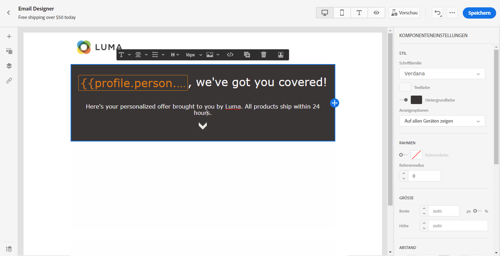

## Trennlinie {#divider}

Verwenden Sie die Komponente **[!UICONTROL Divider]**, um eine Trennlinie einzufügen, um das Layout und den Inhalt Ihrer E-Mail zu organisieren.
Sie können die Farbe, den Stil und die Größe der Trennlinie in den **[!UICONTROL Komponenteneinstellungen]** auswählen.

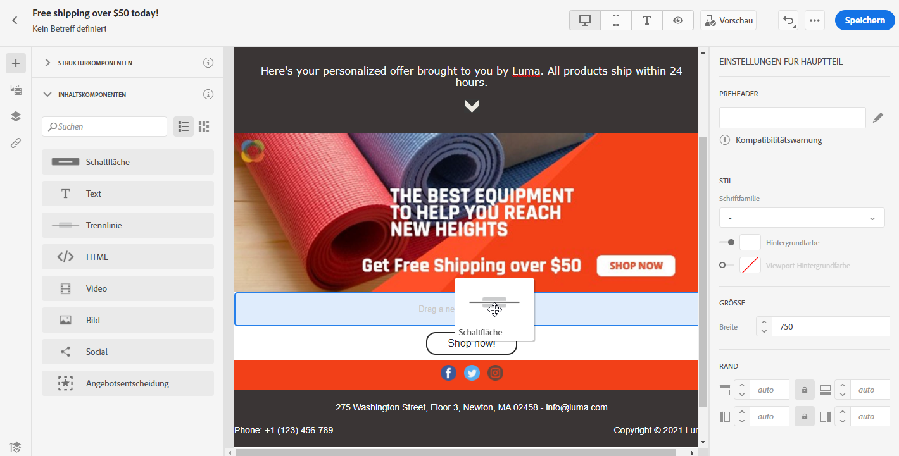

## HTML {#HTML}

Verwenden Sie **[!UICONTROL HTML]**, um die verschiedenen Teile des vorhandenen HTML zu kopieren und einzufügen. Damit können Sie kostenfrei modulare HTML-Komponenten erstellen.

Um einen externen Inhalt einfach mit dem E-Mail-Designer konform zu machen, empfiehlt Adobe, eine Nachricht von Grund auf zu erstellen und den Inhalt Ihrer vorhandenen E-Mail in Komponenten zu kopieren.

1. Ziehen Sie unter **[!UICONTROL Inhaltskomponenten]** **[!UICONTROL HTML]** in eine **[!UICONTROL Strukturkomponente]**.

   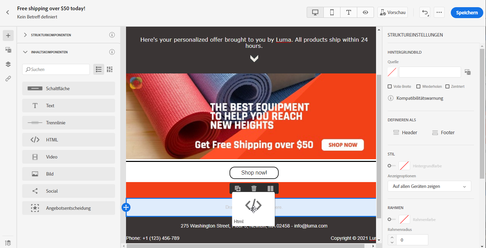

1. Klicken Sie auf die neu hinzugefügte Komponente und dann auf **[!UICONTROL Quellcode]** anzeigen, um Ihren HTML-Code hinzuzufügen.

   

1. Kopieren Sie den HTML-Code, den Sie Ihrer E-Mail hinzufügen möchten, und klicken Sie auf **[!UICONTROL Speichern]**.

   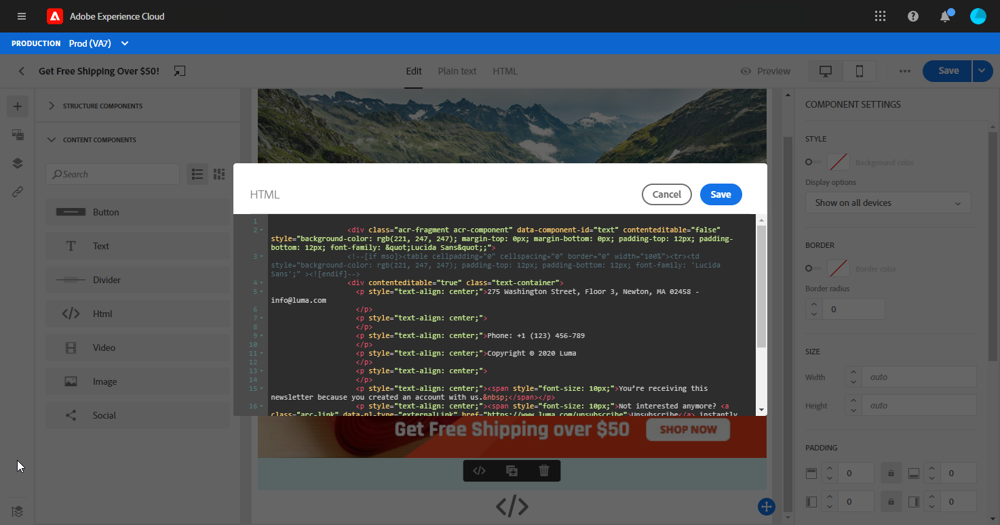

1. Sie können Ihre HTML jetzt weiter personalisieren, indem Sie die Parameter **[!UICONTROL Style]**, **[!UICONTROL Margin]** und **[!UICONTROL Border]** ändern oder z. B. einen Link hinzufügen, um Ihre Audience zu einem anderen Inhalt umzuleiten.

## Bild {#image}

Verwenden Sie die Komponente **[!UICONTROL Bild]**, um eine Bilddatei von Ihrem Computer in Ihre E-Mail einzufügen.

1. Ziehen Sie unter **[!UICONTROL Inhaltskomponenten]** **[!UICONTROL Bild]** in eine **[!UICONTROL Strukturkomponente]**.

   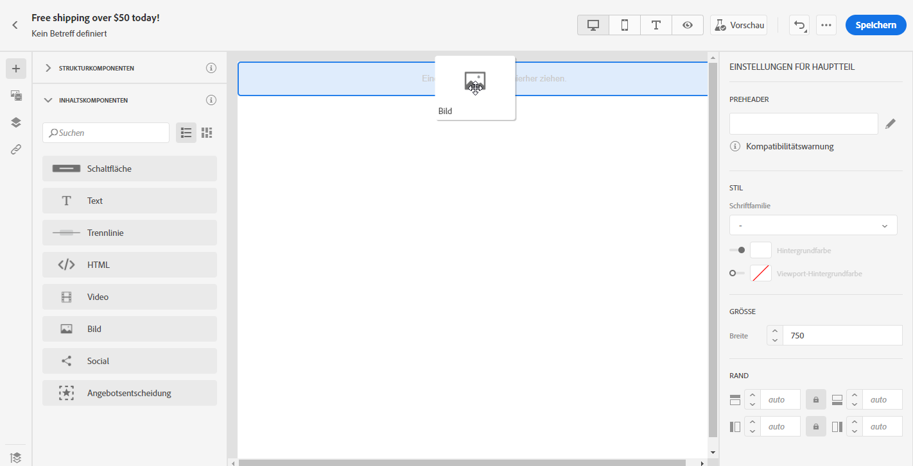

1. Klicken Sie auf **[!UICONTROL Durchsuchen]**, um eine Bilddatei von Ihrem Computer auszuwählen.

   Sie können auch auf **[!UICONTROL Asset-Auswahl]** klicken, um Ihrer E-Mail ein Asset hinzuzufügen. Weitere Informationen zu Assets finden Sie in diesem [Abschnitt](assets-essentials.md).

1. Klicken Sie auf die neu hinzugefügte Komponente, um den Beginn **[!UICONTROL Inhaltskomponenten]** zu konfigurieren und Zugriff auf die **[!UICONTROL Komponenteneinstellungen]** im rechten Bereich des E-Mail-Designers zu haben.

1. Richten Sie Ihre Bildeigenschaften ein:

   * **[!UICONTROL Mit]** den Bildtiteln können Sie einen Titel für Ihr Bild definieren.
   * **[!UICONTROL Mit alternativen]** Texten definieren Sie die Bildunterschrift, die mit Ihrem Bild verknüpft ist. Dies entspricht dem alt-HTML-Attribut.

   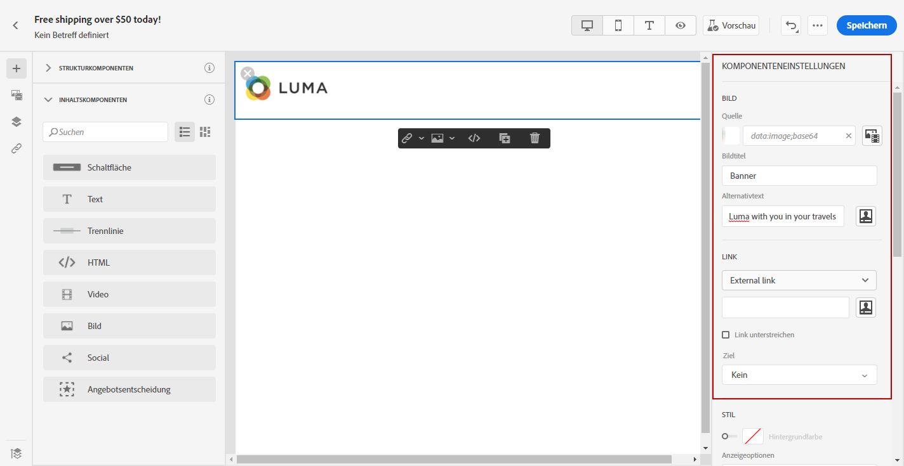

1. Sie können Ihre Audience jetzt weiter personalisieren, indem Sie beispielsweise **[!UICONTROL Style]**, **[!UICONTROL Margin]** und **[!UICONTROL Border]** ändern oder einen Link hinzufügen, um Ihre  zu einem anderen Inhalt umzuleiten.

## Video {#Video}

>[!CONTEXTUALHELP]
>id="ac_edition_video"
>title="Videoeinstellungen"
>abstract="Verwenden Sie diese Komponente, um ein Video in Ihre E-Mail einzufügen. Beachten Sie, dass Videos nicht auf allen E-Mail-Clients funktionieren. Wir empfehlen, ein Reservebild festzulegen."
>additional-url="https://www.emailonacid.com/blog/article/email-development/a_how_to_guide_to_embedding_html5_video_in_email/" text="Zusätzliche Informationen"

Verwenden Sie die Komponente **[!UICONTROL Video]**, um ein Video über einen URL-Link in Ihre E-Mail einzufügen.

1. Ziehen Sie unter **[!UICONTROL Inhaltskomponenten]** **[!UICONTROL Video]** in eine **[!UICONTROL Strukturkomponente]**.

   

1. Klicken Sie auf die neu hinzugefügte Komponente, um den Beginn **[!UICONTROL Inhaltskomponenten]** zu konfigurieren und Zugriff auf die **[!UICONTROL Komponenteneinstellungen]** im rechten Bereich des E-Mail-Designers zu haben.

1. Fügen Sie im Feld **[!UICONTROL Video-Link]** der **[!UICONTROL Komponenteneinstellungen]** Ihre Video-URL hinzu.

   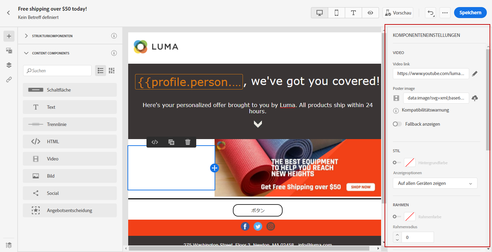

1. Sie können dem Video ein **[!UICONTROL Standbild]** hinzufügen, um ein Bild anzugeben, das angezeigt werden soll, bis Ihre Audience auf die Schaltfläche &quot;Abspielen&quot;klickt.

1. Sie können Ihr Bild jetzt weiter personalisieren, indem Sie z. B. **[!UICONTROL Style]**, **[!UICONTROL Margin]** und **[!UICONTROL Border]** ändern.

## Social {#social}

Verwenden Sie die Komponente **[!UICONTROL Social]**, um Links zu Social Media-Seiten in Ihre E-Mail einzufügen.

1. Ziehen Sie unter **[!UICONTROL Inhaltskomponenten]** **[!UICONTROL Social]** in eine **[!UICONTROL Strukturkomponente]**.

   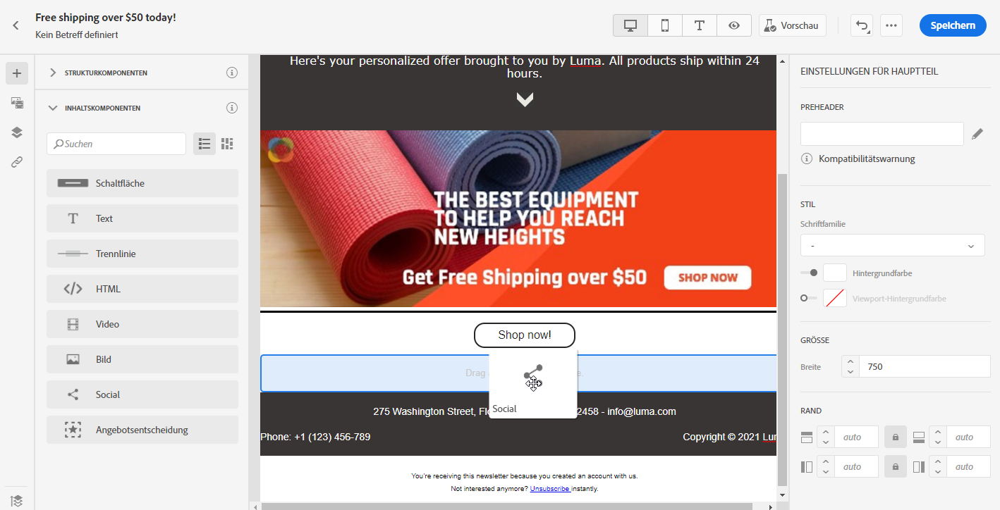

1. Klicken Sie auf die neu hinzugefügte Komponente, um den Beginn **[!UICONTROL Inhaltskomponenten]** zu konfigurieren und Zugriff auf die **[!UICONTROL Komponenteneinstellungen]** im rechten Bereich des E-Mail-Designers zu haben.

1. Wählen Sie im Feld **[!UICONTROL Social]** der **[!UICONTROL Komponenteneinstellungen]** aus, welche sozialen Medien Sie hinzufügen oder entfernen möchten.

   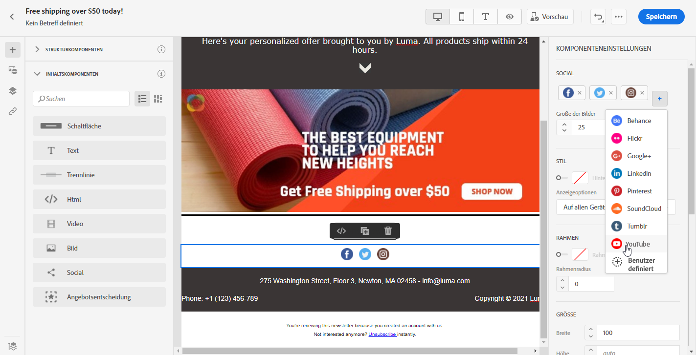

1. Wählen Sie die Größe Ihrer Symbole im Feld **[!UICONTROL Größe der Bilder]** aus.

1. Klicken Sie auf jedes Ihrer Social-Media-Symbole, um die **[!UICONTROL URL]** zu konfigurieren, zu der Ihre Audience umgeleitet wird.

   

1. Sie können bei Bedarf auch die Symbole der einzelnen sozialen Medien im Feld **[!UICONTROL Bild]** ändern.

1. Sie können Ihre Social-Media-Symbole jetzt weiter personalisieren, indem Sie die Symbole **[!UICONTROL Stil]**, **[!UICONTROL Rand]** und **[!UICONTROL Rand]** ändern.

## Angebot Decision {#offer-decision}

Verwenden Sie die Komponente **[!UICONTROL Angebot Decision]**, um Entscheidungen (früher als Angebot-Aktivitäten bezeichnet) in Ihre Nachrichten einzufügen. Entscheidungen nutzen die Entscheidungsverwaltung, um das beste Angebot für Ihre Kunden auszuwählen.

Verwandte Themen:

* [Beginnen Sie mit der Entscheidungsverwaltung](offers/get-started/starting-offer-decisioning.md).
* [hinzufügen personalisierte Angebot in Nachrichten](deliver-personalized-offers.md).

