# Zugreifen auf und Verwalten von Inhaltsvorlagen {#access-manage-templates}

## Zugreifen auf Inhaltsvorlagen {#access}

Um auf die Liste der Inhaltsvorlagen zuzugreifen, wählen Sie im linken Menü **[!UICONTROL Content-Management]** > **[!UICONTROL Inhaltsvorlagen]** aus.

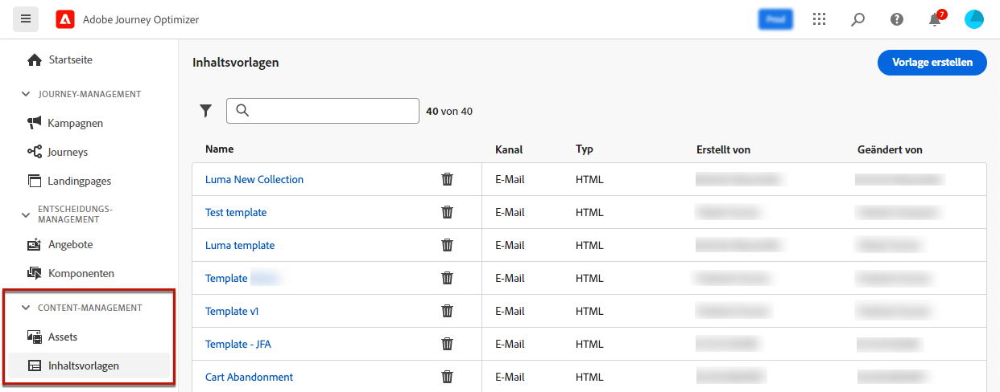

Alle in der aktuellen Sandbox erstellten Vorlagen - entweder von einer Journey oder einer Kampagne, die die Option **[!UICONTROL Als Vorlage speichern]** verwendet, oder über das Menü **[!UICONTROL Inhaltsvorlagen]** - werden angezeigt. [Erfahren Sie, wie Sie Vorlagen erstellen.](#create-content-templates)

Im Bereich auf der linken Seite können Sie Inhaltsvorlagen in Ordnern organisieren. Standardmäßig werden alle Vorlagen angezeigt. Bei der Auswahl eines Ordners werden nur die Vorlagen und Ordner angezeigt, die im ausgewählten Ordner enthalten sind. [Weitere Informationen](#folders)

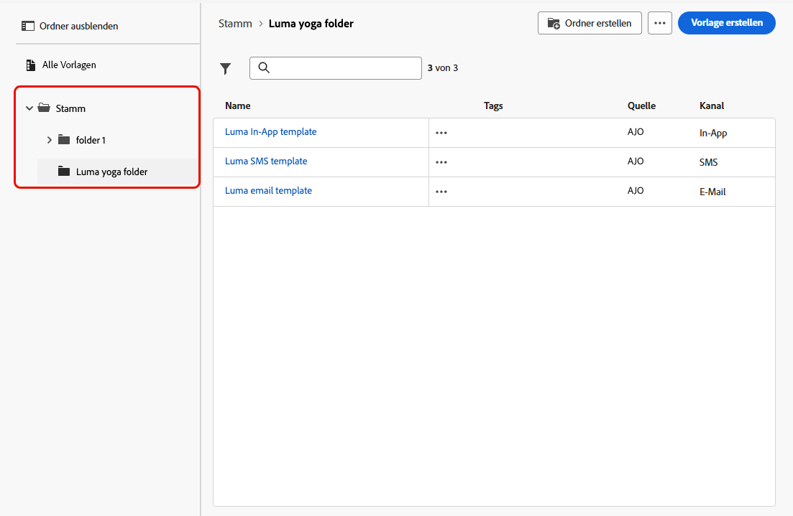

Um nach einem bestimmten Element zu suchen, geben Sie einen Namen in das Suchfeld ein. Wenn ein [Ordner](#folders) ausgewählt ist, gilt die Suche für alle Inhaltsvorlagen oder Ordner in der ersten Hierarchieebene dieses Ordners<!--(not nested items)-->.

Inhaltsvorlagen können nach folgenden Kriterien sortiert werden:

* Typ
* Kanal
* Erstellungs- oder Änderungsdatum
* Tags – [Weitere Informationen zu Tags](../start/search-filter-categorize.md#tags)

Sie können auch festlegen, dass nur die von Ihnen erstellten oder geänderten Elemente angezeigt werden sollen.

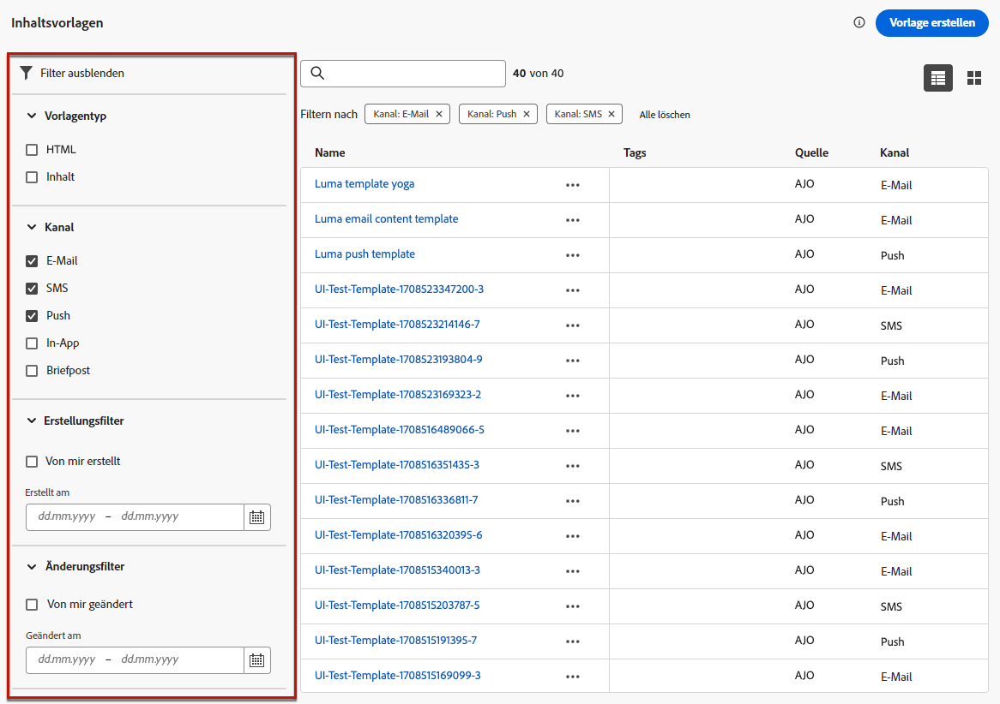

>[!NOTE]
>
>Ab März 2025 werden Inhaltsvorlagen vom Typ HTML nicht mehr unterstützt. Sie können weiterhin auf bestehende HTML-Inhaltsvorlagen zugreifen, die zuvor in [!DNL Journey Optimizer] erstellt wurden.

## Verwalten von Inhaltsvorlagen mit Ordnern {#folders}

Verwenden Sie Ordner, um Ihre Inhaltsvorlagen einfach zu navigieren und sie effektiver in einer strukturierten Hierarchie zu organisieren. Auf diese Weise können Sie die Elemente entsprechend den Anforderungen Ihres Unternehmens kategorisieren und verwalten.

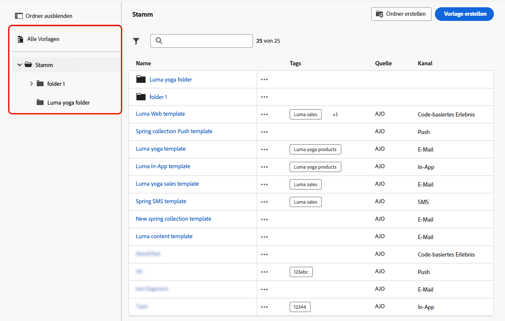

1. Klicken Sie auf **[!UICONTROL Alle Inhaltsvorlagen]**, um alle zuvor erstellten Elemente ohne Ordnergruppierung anzuzeigen.

1. Klicken Sie auf den **[!UICONTROL Stammordner]**, um alle erstellten Ordner anzuzeigen.

   >[!NOTE]
   >
   >Wenn Sie noch keine Ordner erstellt haben, werden alle Inhaltsvorlagen angezeigt.

1. Klicken Sie auf einen beliebigen Ordner im **[!UICONTROL Stammordner]**, um dessen Inhalt anzuzeigen.

1. Wenn Sie auf den **[!UICONTROL Stammordner]** oder einen anderen Ordner klicken, wird die Schaltfläche **[!DNL Create folder]** angezeigt. Wählen Sie sie aus.

   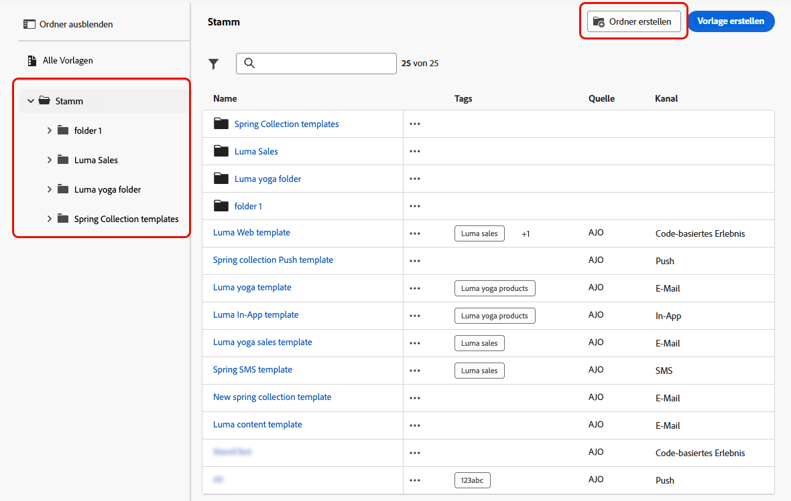

1. Geben Sie einen Namen für den neuen Ordner ein und klicken Sie auf **[!UICONTROL Speichern]**. Der neue Ordner wird über der Liste der Inhaltsvorlagen im **[!UICONTROL Stammordner]** oder im aktuell ausgewählten Ordner angezeigt.

1. Sie können auf die Schaltfläche **[!UICONTROL Weitere Aktionen]** klicken, um den Ordner umzubenennen oder zu löschen.

   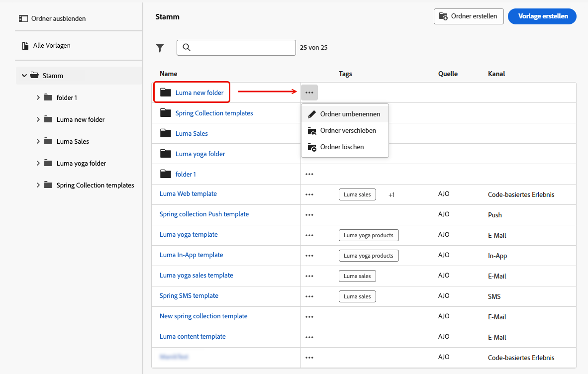

1. Mit der Schaltfläche **[!UICONTROL Weitere Aktionen]** können Sie die Inhaltsvorlage auch in einen anderen vorhandenen Ordner verschieben.

   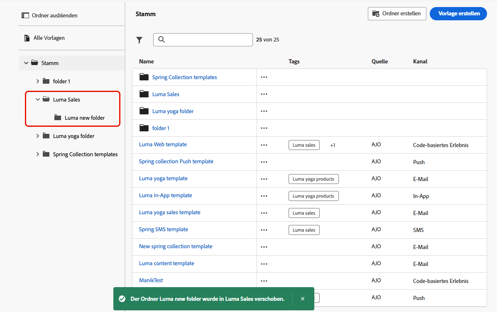

1. Navigieren Sie zu dem soeben erstellten Ordner . Jede neue Inhaltsvorlage, die Sie hier [erstellen](create-content-templates.md), wird im aktuellen Ordner gespeichert.

   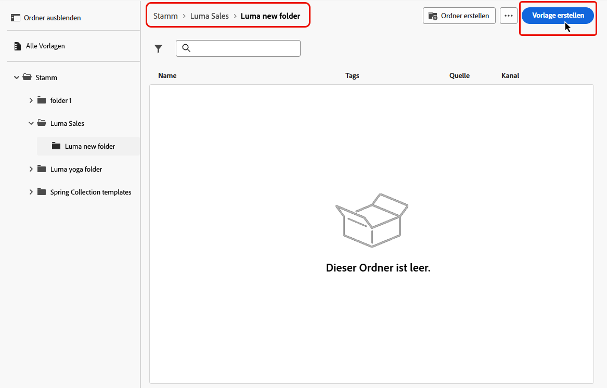

## Bearbeiten und Löschen von Inhaltsvorlagen {#edit}

* Um einen Vorlageninhalt zu bearbeiten, klicken Sie in der Liste auf das gewünschte Element und nehmen Sie die gewünschten Änderungen vor.  Sie können auch die Eigenschaften der Inhaltsvorlage bearbeiten, indem Sie auf die Schaltfläche „Bearbeiten“ neben dem Namen der Vorlage klicken.

  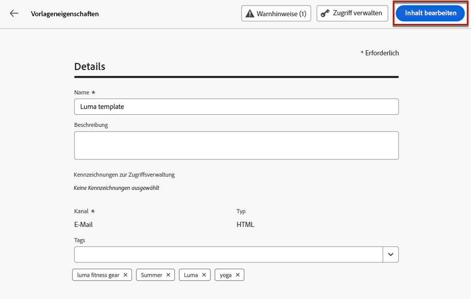

* Um eine Vorlage zu löschen, klicken Sie neben der gewünschten Vorlage auf die Schaltfläche **[!UICONTROL Weitere Aktionen]** und wählen Sie **[!UICONTROL Löschen]** aus.

  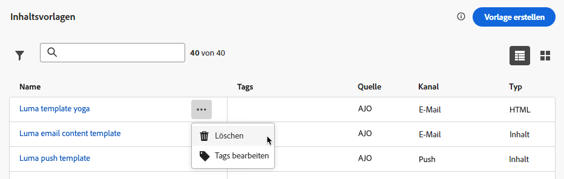

>[!NOTE]
>
>Wenn eine Vorlage bearbeitet oder gelöscht wird, sind Kampagnen oder Journeys, einschließlich mit dieser Vorlage erstellter Inhalte, nicht betroffen.

## [!BADGE Eingeschränkte Verfügbarkeit]{type=Informative} Anzeigen von Vorlagen als Miniaturansichten {#template-thumbnails}

Wählen Sie den Modus **[!UICONTROL Rasteransicht]** aus, um die einzelnen Vorlagen als Miniaturansicht anzuzeigen.

>[!AVAILABILITY]
>
>Diese Funktion wird mit begrenzter Verfügbarkeit (Limited Availability, LA) für eine kleine Gruppe von Kundinnen und Kunden veröffentlicht.

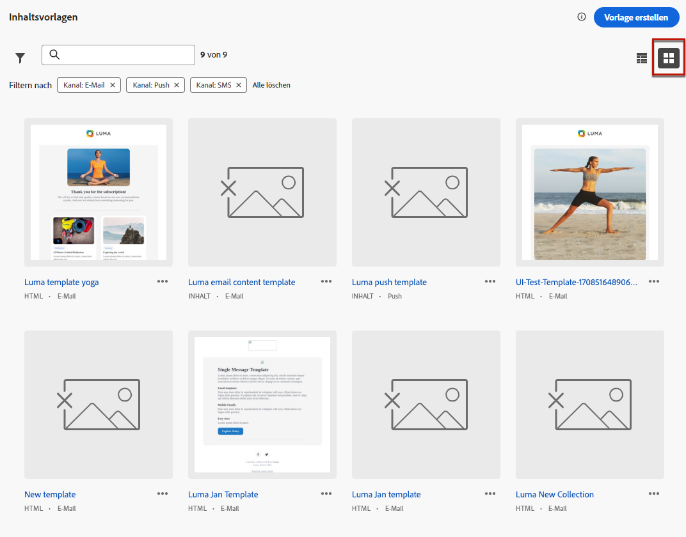

>[!NOTE]
>
>Richtige Miniaturen können nur für E-Mail-Inhaltsvorlagen vom Typ HTML generiert werden.

Warten Sie beim Aktualisieren des Inhalts einige Sekunden, bis die Änderungen in der Miniaturansicht angezeigt werden.

## Exportieren von Inhaltsvorlagen in eine andere Sandbox {#export}

Mit Journey Optimizer können Sie eine Inhaltsvorlage von einer Sandbox in eine andere kopieren. Sie können beispielsweise eine Vorlage aus Ihrer Staging-Sandbox-Umgebung in Ihre Produktions-Sandbox kopieren.

Der Kopiervorgang wird über einen **Package-Export und -Import** zwischen der Quell- und Ziel-Sandbox ausgeführt. Detaillierte Informationen zum Exportieren von Objekten und Importieren in eine Ziel-Sandbox finden Sie in diesem Abschnitt: [Objekte in eine andere Sandbox kopieren](../configuration/copy-objects-to-sandbox.md)

