# Zugreifen auf und Verwalten von Inhaltsvorlagen {#access-manage-templates}

## Voraussetzungen {#prerequisites}

Stellen Sie Folgendes sicher, um auf Inhaltsvorlagen zuzugreifen und sie zu verwalten:

* **Berechtigung für Inhaltsvorlagen** - Ihre Rolle muss die Berechtigung **[!UICONTROL Inhaltsvorlagen verwalten]** enthalten (unter der **Content-Management**-Ressource). Ohne sie ist **Menü „Inhaltsvorlagen** im linken Navigationsbereich nicht sichtbar. [Erfahren Sie, wie Sie Berechtigungen verwalten](../administration/permissions.md)
* **Sandbox-Umfang** - Inhaltsvorlagen sind Sandbox-spezifisch. In einer Sandbox erstellte Vorlagen sind in einer anderen nicht verfügbar. Vergewissern Sie sich, dass Sie sich in der richtigen Sandbox befinden, bevor Sie nach einer Vorlage suchen.
* **HTML-Vorlagen (veraltet)** - Ab März 2025 werden Inhaltsvorlagen vom Typ HTML nicht mehr unterstützt. Vorhandene HTML-Vorlagen bleiben verfügbar, neue können jedoch nicht erstellt werden.

## Zugreifen auf Inhaltsvorlagen {#access}

Um auf die Liste der Inhaltsvorlagen zuzugreifen, wählen Sie im linken Menü **[!UICONTROL Content-Management]** > **[!UICONTROL Inhaltsvorlagen]** aus.

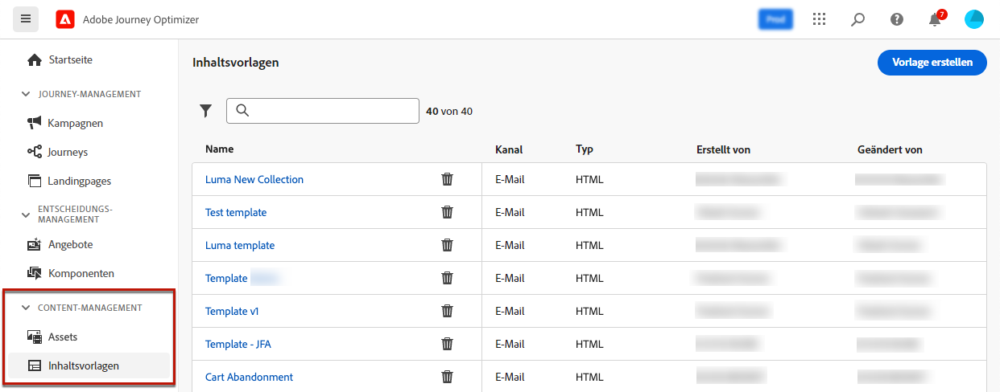

Es werden alle Vorlagen angezeigt, die in der aktuellen Sandbox erstellt wurden (entweder aus einer Journey oder einer Kampagne mithilfe der Option **[!UICONTROL Als Vorlage speichern]**, oder über das Menü **[!UICONTROL Inhaltsvorlagen]**). [Erfahren Sie, wie Sie Vorlagen erstellen.](#create-content-templates)

Im Bereich auf der linken Seite können Sie Inhaltsvorlagen in Ordnern organisieren. Standardmäßig werden alle Vorlagen angezeigt. Bei der Auswahl eines Ordners werden nur die Vorlagen und Ordner angezeigt, die im ausgewählten Ordner enthalten sind. [Weitere Informationen](#folders)

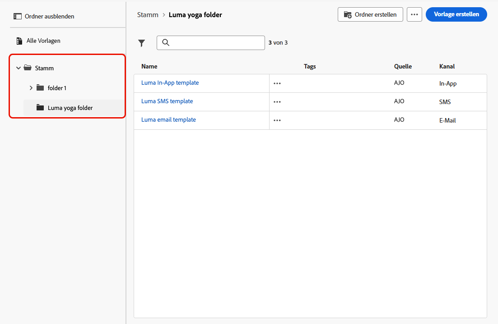

Um nach einem bestimmten Element zu suchen, geben Sie einen Namen in das Suchfeld ein. Wenn ein [Ordner](#folders) ausgewählt ist, gilt die Suche für alle Inhaltsvorlagen oder Ordner in der ersten Hierarchieebene dieses Ordners<!--(not nested items)-->.

Inhaltsvorlagen können nach folgenden Kriterien sortiert werden:

* Typ
* Kanal
* Erstellungs- oder Änderungsdatum
* Tags – [Weitere Informationen zu Tags](../start/search-filter-categorize.md#tags)

Sie können auch festlegen, dass nur die von Ihnen erstellten oder geänderten Elemente angezeigt werden.

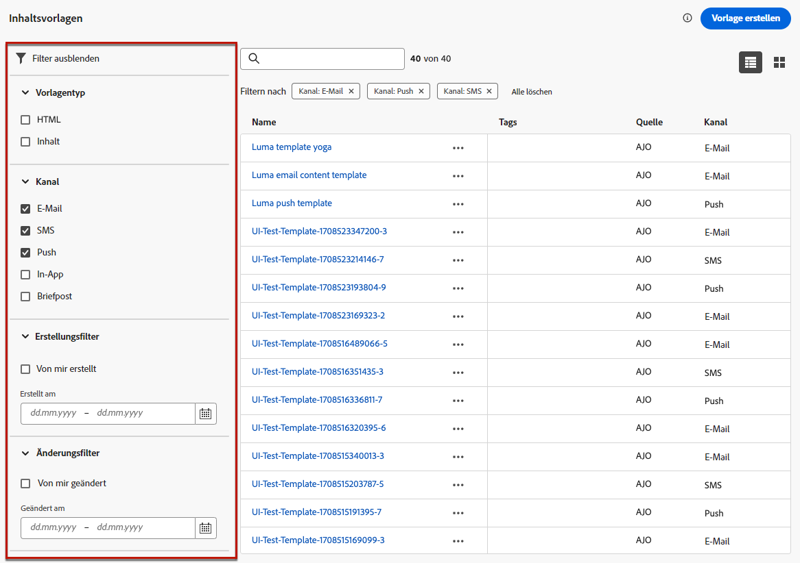

>[!NOTE]
>
>Seit März 2025 werden HTML-Inhaltsvorlagen nicht mehr unterstützt. Sie können weiterhin auf bestehende HTML-Inhaltsvorlagen zugreifen, die zuvor in [!DNL Journey Optimizer] erstellt wurden.

## Verwalten von Inhaltsvorlagen mit Ordnern {#folders}

Verwenden Sie zum einfachen Navigieren in Ihren Inhaltsvorlagen Ordner, um die Inhaltsvorlagen effektiver in einer strukturierten Hierarchie zu organisieren. Auf diese Weise können Sie die Elemente entsprechend den Anforderungen Ihrer Organisation kategorisieren und verwalten.

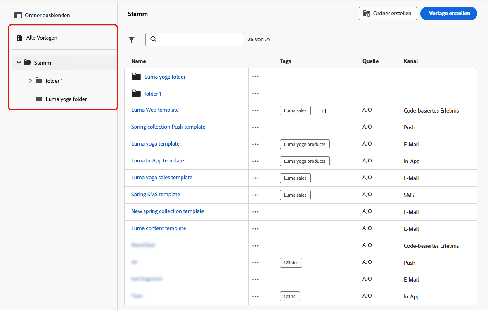

1. Klicken Sie auf die Schaltfläche **[!UICONTROL Alle Inhaltsvorlagen]**, um alle zuvor erstellten Elemente ohne Ordnergruppierung anzuzeigen.

1. Klicken Sie auf den **[!UICONTROL Stammordner]**, um alle erstellten Ordner anzuzeigen.

   >[!NOTE]
   >
   >Wenn Sie noch keine Ordner erstellt haben, werden alle Inhaltsvorlagen angezeigt.

1. Klicken Sie auf einen beliebigen Ordner im **[!UICONTROL Stammordner]**, um dessen Inhalt anzuzeigen.

1. Wenn Sie auf den **[!UICONTROL Stammordner]** oder einen anderen Ordner klicken, wird die Schaltfläche **[!DNL Create folder]** angezeigt. Wählen Sie sie aus.

   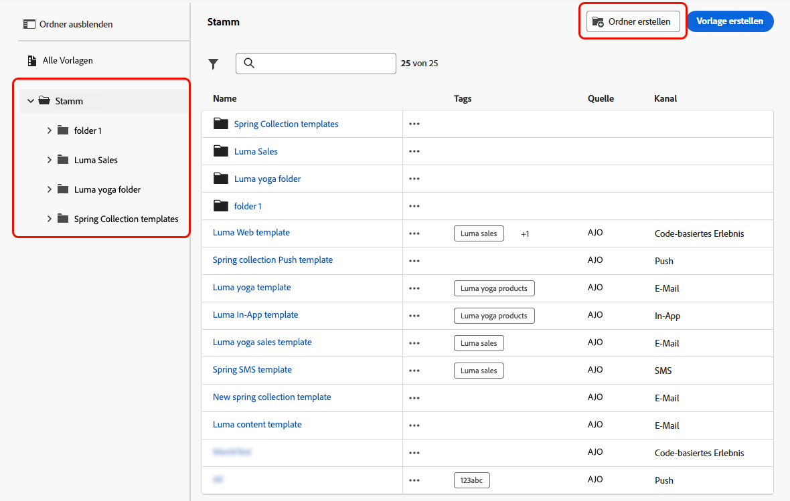

1. Geben Sie einen Namen für den neuen Ordner ein und klicken Sie auf **[!UICONTROL Speichern]**. Der neue Ordner wird über der Liste der Inhaltsvorlagen im **[!UICONTROL Stammordner]** oder im aktuell ausgewählten Ordner angezeigt.

1. Sie können auf die Schaltfläche **[!UICONTROL Weitere Aktionen]** klicken, um den Ordner umzubenennen oder zu löschen.

   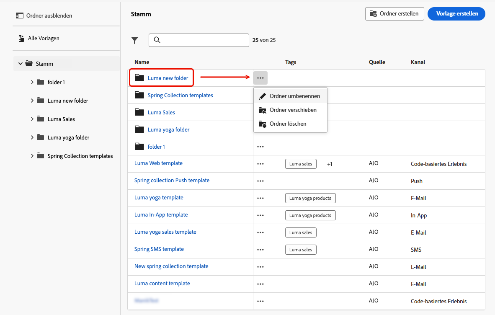

1. Mit der Schaltfläche **[!UICONTROL Weitere Aktionen]** können Sie die Inhaltsvorlage auch in einen anderen vorhandenen Ordner verschieben.

   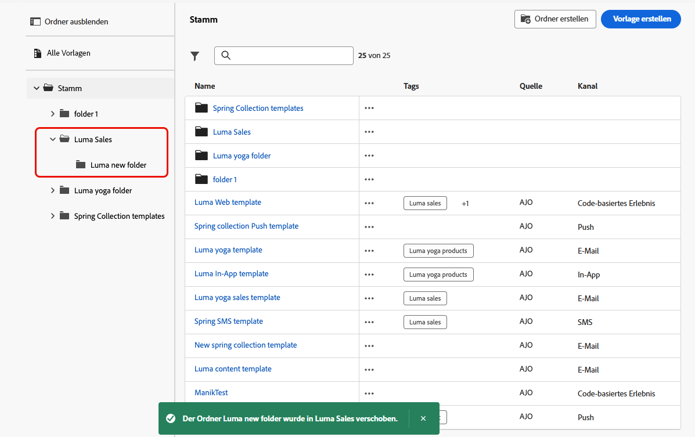

1. Navigieren Sie zum Ordner, den Sie gerade erstellt haben. Jede neue Inhaltsvorlage, die Sie hier [erstellen](create-content-templates.md), wird im aktuellen Ordner gespeichert.

   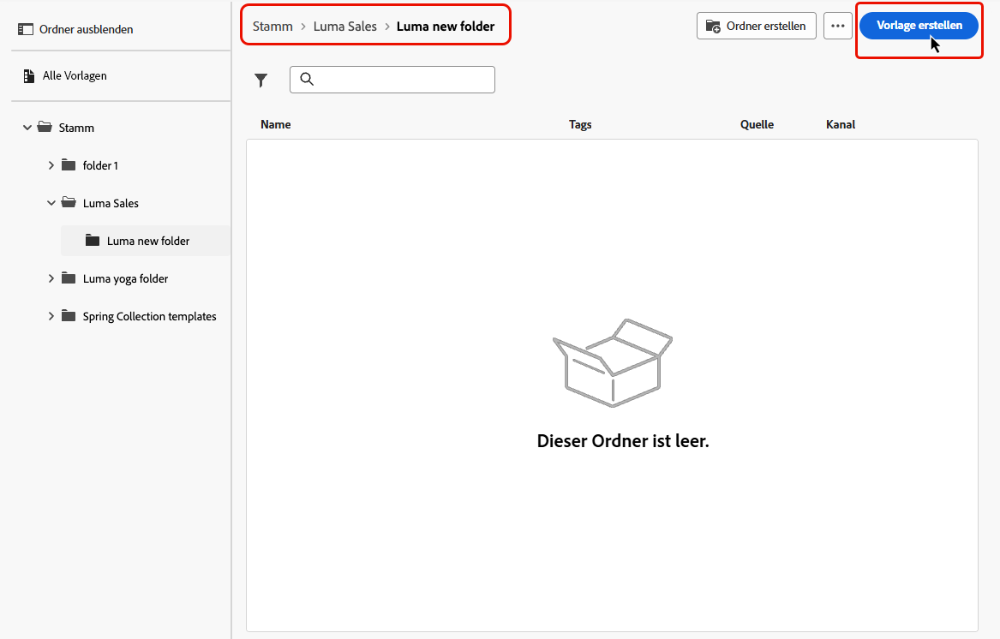

## Bearbeiten und Löschen von Inhaltsvorlagen {#edit}

* Um einen Vorlageninhalt zu bearbeiten, klicken Sie in der Liste auf das gewünschte Element und nehmen Sie die gewünschten Änderungen vor.  Sie können auch die Eigenschaften der Inhaltsvorlage bearbeiten, indem Sie auf die Schaltfläche „Bearbeiten“ neben dem Namen der Vorlage klicken.

  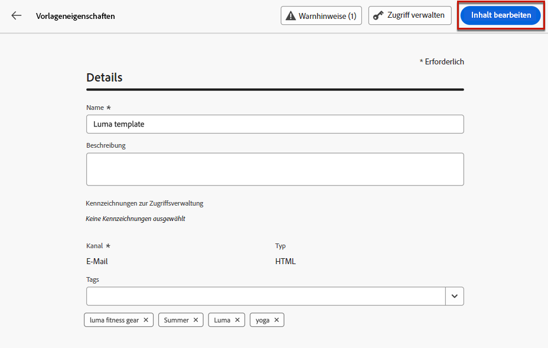

* Um eine Vorlage zu löschen, klicken Sie neben der gewünschten Vorlage auf die Schaltfläche **[!UICONTROL Weitere Aktionen]** und wählen Sie **[!UICONTROL Löschen]** aus.

  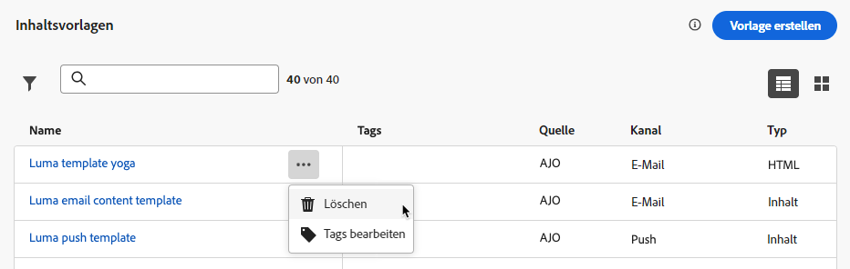

>[!NOTE]
>
>Wenn eine Vorlage bearbeitet oder gelöscht wird, sind Kampagnen oder Journeys, einschließlich mit dieser Vorlage erstellter Inhalte, nicht betroffen.

## [!BADGE Eingeschränkte Verfügbarkeit]{type=Informative} Anzeigen von Vorlagen als Miniaturansichten {#template-thumbnails}

Wählen Sie den Modus **[!UICONTROL Rasteransicht]** aus, um die einzelnen Vorlagen als Miniaturansicht anzuzeigen.

>[!AVAILABILITY]
>
>Diese Funktion wird mit begrenzter Verfügbarkeit (Limited Availability, LA) für eine kleine Gruppe von Kundinnen und Kunden veröffentlicht.

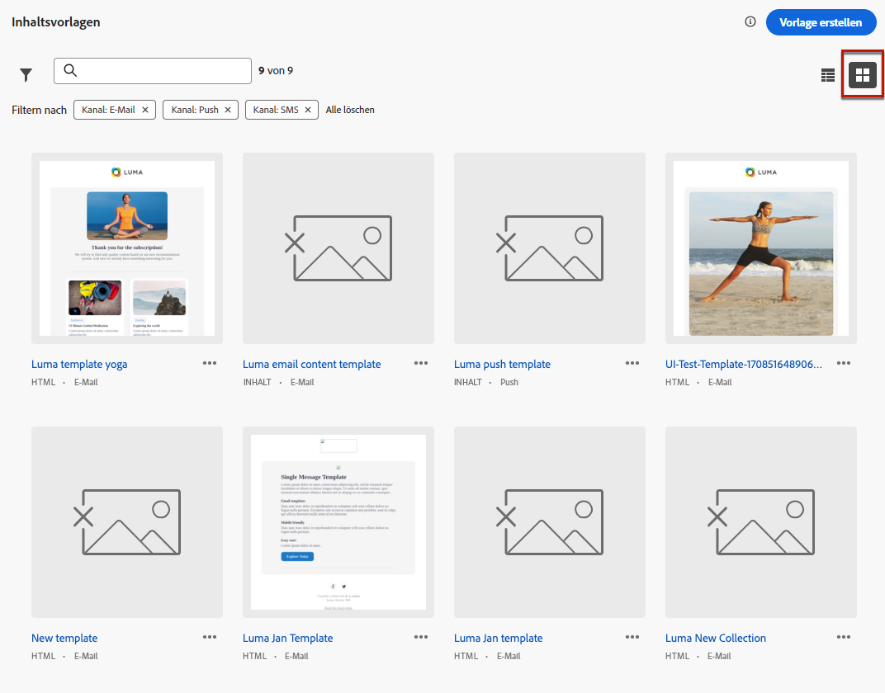

>[!NOTE]
>
>Richtige Miniaturansichten können nur für HTML-Inhaltsvorlagen von E-Mails generiert werden.

Warten Sie nach dem Aktualisieren des Inhalts einige Sekunden, bis die Änderungen in der Miniaturansicht angezeigt werden.

## Fehlerbehebung {#troubleshooting}

+++Ich kann das Menü Inhaltsvorlagen im linken Navigationsbereich nicht sehen

Ihrer Rolle fehlt die Berechtigung **Inhaltsvorlagen verwalten**. Bitten Sie Ihren Administrator, die Ressource **Content-Management** mit der Berechtigung **Inhaltsvorlagen verwalten** zu Ihrer Rolle hinzuzufügen. [Weitere Informationen](../administration/permissions.md)

+++

+++Eine von mir erstellte Vorlage wird nicht in der Liste angezeigt

Überprüfen Sie, ob Sie sich in der richtigen Sandbox befinden - Vorlagen sind Sandbox-spezifisch. Überprüfen Sie außerdem, ob ein Ordner im linken Bereich ausgewählt ist. Wenn ein Ordner ausgewählt ist, werden nur Vorlagen innerhalb dieses Ordners angezeigt. Klicken Sie **[!UICONTROL Alle Inhaltsvorlagen]**, um alle Vorlagen unabhängig vom Ordner anzuzeigen.

+++

+++Ich habe eine Vorlage bearbeitet, aber mein Kampagnen- oder Journey-Inhalt wurde nicht aktualisiert

Durch das Bearbeiten oder Löschen einer Vorlage werden Kampagnen oder Journey, die mit ihr erstellt wurden, nicht rückwirkend aktualisiert. Der Inhalt wird zum Zeitpunkt der Verwendung kopiert. Um vorhandene Inhalte zu aktualisieren, bearbeiten Sie die Kampagne oder die Journey direkt.

+++

## Exportieren von Inhaltsvorlagen in eine andere Sandbox {#export}

Mit Journey Optimizer können Sie eine Inhaltsvorlage von einer Sandbox in eine andere kopieren. Sie können beispielsweise eine Vorlage aus Ihrer Staging-Sandbox-Umgebung in Ihre Produktions-Sandbox kopieren.

Der Kopiervorgang wird über einen **Paket-Export und -Import** zwischen der Quell- und Ziel-Sandbox durchgeführt. Detaillierte Informationen darüber, wie Sie Objekte exportieren und in eine Ziel-Sandbox importieren, finden Sie in diesem Abschnitt: [Kopieren von Objekten in eine andere Sandbox](../configuration/copy-objects-to-sandbox.md)

