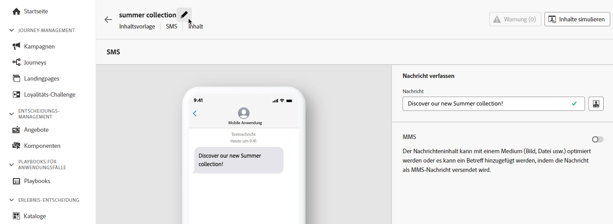
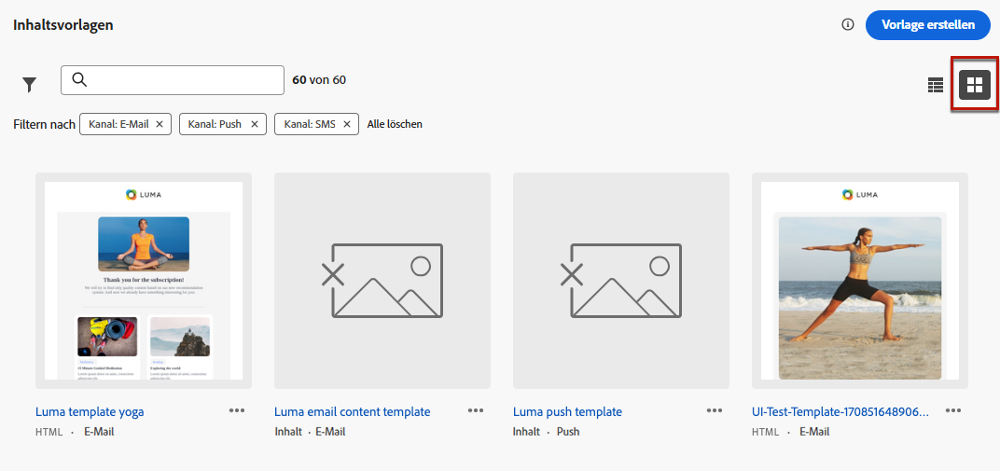

# Zugreifen auf und Verwalten von Inhaltsvorlagen {#access-manage-templates}

## Zugreifen auf Inhaltsvorlagen {#access}

Um auf die Liste der Inhaltsvorlagen zuzugreifen, wählen Sie im linken Menü **[!UICONTROL Content-Management]** > **[!UICONTROL Inhaltsvorlagen]** aus.

Es werden alle Vorlagen angezeigt, die in der aktuellen Sandbox erstellt wurden (entweder aus einer Journey oder einer Kampagne mithilfe der Option **[!UICONTROL Als Vorlage speichern]**, oder aus dem Menü **[!UICONTROL Inhaltsvorlagen]**). [Erfahren Sie, wie Sie Vorlagen erstellen.](#create-content-templates)

Im linken Bereich können Sie Inhaltsvorlagen in Ordnern organisieren. Standardmäßig werden alle Vorlagen angezeigt. Bei der Auswahl eines Ordners werden nur die im ausgewählten Ordner enthaltenen Vorlagen und Ordner angezeigt. [Weitere Informationen](#folders)

>[!NOTE]
>
>Inhaltsvorlagenordner sind nur für eine Reihe von Organisationen verfügbar (eingeschränkte Verfügbarkeit) und werden schrittweise für eine größere Anzahl von Benutzern bereitgestellt.

Um ein bestimmtes Element zu finden, geben Sie einen Namen in das Suchfeld ein. Wenn [Ordner](#folders) ausgewählt ist, gilt die Suche für alle Inhaltsvorlagen oder Ordner in der ersten Hierarchieebene dieses Ordners<!--(not nested items)-->.

Inhaltsvorlagen können nach folgenden Kriterien sortiert werden:
* Typ
* Kanal
* Erstellungs- oder Änderungsdatum
* Tags – [Weitere Informationen zu Tags](../start/search-filter-categorize.md#tags)

Sie können auch festlegen, dass nur die von Ihnen erstellten oder geänderten Elemente angezeigt werden.

## Verwenden von Ordnern zum Verwalten von Inhaltsvorlagen {#folders}

>[!AVAILABILITY]
>
>Inhaltsvorlagenordner sind nur für eine Reihe von Organisationen verfügbar (eingeschränkte Verfügbarkeit) und werden schrittweise für eine größere Anzahl von Benutzern bereitgestellt.

Um die Navigation in Ihren Inhaltsvorlagen zu erleichtern, können Sie Ordner verwenden, um sie effektiver in einer strukturierten Hierarchie zu organisieren. Auf diese Weise können Sie die Elemente entsprechend den Anforderungen Ihres Unternehmens kategorisieren und verwalten.

1. Klicken Sie auf **[!UICONTROL Alle Inhaltsvorlagen]**, um alle zuvor erstellten Elemente ohne Ordnergruppierung anzuzeigen.

1. Klicken Sie auf **[!UICONTROL Stammordner]**, um alle erstellten Ordner anzuzeigen.

   >[!NOTE]
   >
   >Wenn Sie noch keine Ordner erstellt haben, werden alle Inhaltsvorlagen angezeigt.

1. Klicken Sie auf einen beliebigen Ordner innerhalb des **[!UICONTROL Stammordners]**, um dessen Inhalt anzuzeigen.

1. Wenn Sie auf den **[!UICONTROL Stammordner]** oder einen anderen Ordner klicken, wird die Schaltfläche **[!DNL Create folder]** angezeigt. Wählen Sie sie aus.

   

1. Geben Sie einen Namen für den neuen Ordner ein und klicken Sie auf **[!UICONTROL Speichern]**. Der neue Ordner wird über der Inhaltsvorlagenliste im **[!UICONTROL Stammordner]** oder im aktuell ausgewählten Ordner angezeigt.

1. Sie können auf die Schaltfläche **[!UICONTROL Mehr Aktionen]** klicken, um den Ordner umzubenennen oder zu löschen.

   

1. Mit der Schaltfläche **[!UICONTROL Mehr Aktionen]** können Sie die Inhaltsvorlage auch in einen anderen vorhandenen Ordner verschieben.

   

1. Jetzt können Sie zu dem Ordner navigieren, den Sie gerade erstellt haben. Jede neue Inhaltsvorlage, [ Sie ](create-content-templates.md) erstellen, wird im aktuellen Ordner gespeichert.

   

## Bearbeiten und Löschen von Inhaltsvorlagen {#edit}

* Um einen Vorlageninhalt zu bearbeiten, klicken Sie in der Liste auf das gewünschte Element und nehmen Sie die gewünschten Änderungen vor.  Sie können auch die Eigenschaften der Inhaltsvorlage bearbeiten, indem Sie auf die Schaltfläche „Bearbeiten“ neben dem Namen der Vorlage klicken.

  

* Um eine Vorlage zu löschen, klicken Sie neben der gewünschten Vorlage auf die Schaltfläche **[!UICONTROL Weitere Aktionen]** und wählen Sie **[!UICONTROL Löschen]** aus.

  

>[!NOTE]
>
>Wenn eine Vorlage bearbeitet oder gelöscht wird, sind Kampagnen oder Journeys, einschließlich mit dieser Vorlage erstellter Inhalte, nicht betroffen.

## [!BADGE Eingeschränkte Verfügbarkeit]{type=Informative} Anzeigen von Vorlagen als Miniaturansichten {#template-thumbnails}

Wählen Sie den Modus **[!UICONTROL Rasteransicht]** aus, um die einzelnen Vorlagen als Miniaturansicht anzuzeigen.

>[!AVAILABILITY]
>
Diese Funktion wird mit begrenzter Verfügbarkeit (Limited Availability, LA) für eine kleine Gruppe von Kundinnen und Kunden veröffentlicht.

>[!NOTE]
>
Derzeit können geeignete Miniaturansichten nur für HTML- email Inhaltsvorlagen erstellt werden.

Wenn Sie Inhalte aktualisieren, müssen Sie möglicherweise einige Sekunden warten, bis die Änderungen in der Miniaturansicht angezeigt werden.

## Exportieren von Inhaltsvorlagen in eine andere Sandbox {#export}

Mit Journey Optimizer können Sie eine Inhaltsvorlage von einer Sandbox in eine andere kopieren. Sie können beispielsweise eine Vorlage aus Ihrer Staging-Sandbox-Umgebung in Ihre Produktions-Sandbox kopieren.

Der Kopiervorgang wird über einen **Paket-Export und -Import** zwischen der Quell- und Ziel-Sandbox durchgeführt. Detaillierte Informationen darüber, wie Sie Objekte exportieren und in eine Ziel-Sandbox importieren, finden Sie in diesem Abschnitt: [Kopieren von Objekten in eine andere Sandbox](../configuration/copy-objects-to-sandbox.md)
