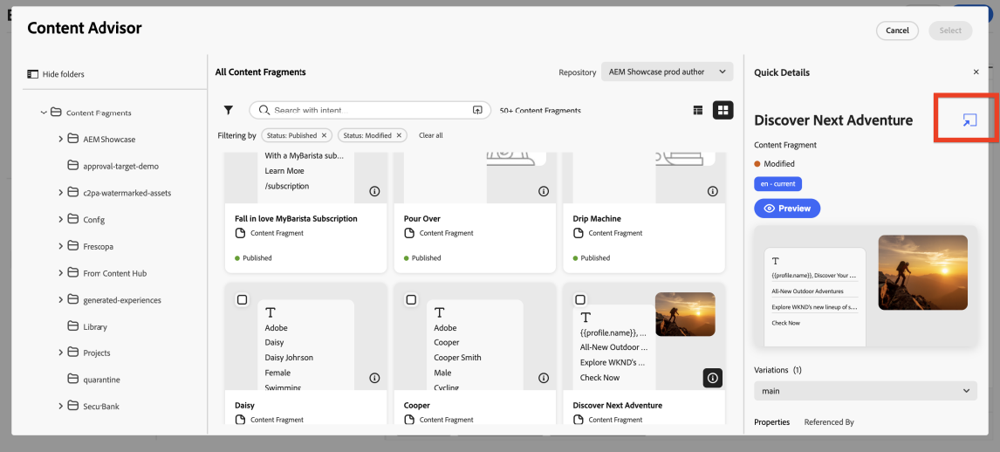

# Arbeiten mit Adobe Experience Manager Content Advisor {#aem-content-advisor}

>[!AVAILABILITY]
>
>Adobe Experience Manager Content Advisor ist nur in Workflows zur Kanalbearbeitung verfügbar.

Adobe Experience Manager Content Advisor ersetzt deterministische Erkennung durch standardisierte, absichtsgesteuerte Erkennung von einer einheitlichen Oberfläche. Es ermöglicht die einheitliche, KI-gestützte Erkennung von Assets und Inhaltsfragmenten direkt in Journey Optimizer-Authoring-Workflows und verbessert so die Marketer-Produktivität und die Kampagneneffizienz.

## Verfügbare Funktionen

### Für Assets {#asset-features}

Adobe Experience Manager Content Advisor bietet die folgenden Asset-Funktionen:

+++ KI-Semantische Suche

Suchen Sie mithilfe natürlicher Sprache nach Assets anstelle exakter Keywords oder Dateinamen. Beschreiben Sie, was Sie benötigen, in einfacher Sprache, z. B. „Kaffee in den Bergen“. Die KI findet kontextuell relevante Assets basierend auf Bedeutung und Inhalt, nicht nur Textübereinstimmungen.

{zoomable="yes"}

+++

+++ Letzter Suchverlauf

Greifen Sie auf Ihre letzten Suchvorgänge zu, um Keywords und Kontexte schnell wiederzuverwenden. Dies spart Zeit, wenn Sie an ähnlichen Kampagnen arbeiten oder frühere Suchvorgänge verfeinern müssen.

{zoomable="yes"}

+++ 

+++ Zusammenfassung hochladen

Laden Sie ein Marketing-Kurzdokument hoch, um automatisch Assets zu präsentieren, die mit Ihrem Kampagnenkontext übereinstimmen. Die KI analysiert Ihre Zusammenfassung und schlägt relevante Assets basierend auf dem Inhalt und den Anforderungen vor, die im Dokument beschrieben sind.

{zoomable="yes"}

+++

+++ Bedienfeld „Asset-Informationen“

Anzeigen detaillierter Metadaten und Eigenschaften für jedes Asset mithilfe des Symbols **Info**. Dazu gehören Asset-Dimensionen, Dateigröße, Erstellungsdatum, Tags und andere relevante Informationen, die Ihnen bei fundierten Entscheidungen helfen können.

{zoomable="yes"}

+++

+++ Dynamic Media-Bedienfeld

Zugreifen auf dynamische Ausgabedarstellungen, smartes Zuschneiden und Änderungen direkt basierend auf der Repository-Konfiguration.

{zoomable="yes"}

Das Bedienfeld „Dynamic Media“ bietet Zugriff auf dynamische Ausgabedarstellungen, smartes Zuschneiden und Änderungen direkt vor Ort. Sie können Modifikatoren direkt im Bedienfeld eingeben, um benutzerdefinierte Ausgabedarstellungen zu erstellen.

**Verfügbarkeit**

Die Verfügbarkeit von Dynamic Media hängt von Ihrer Repository-Konfiguration ab:

* **Scene7**: Verfügbar für veröffentlichte Assets (außer Video und PDF). [Weitere Informationen zu Dynamic Media Scene7-Modifikatoren](https://experienceleague.adobe.com/docs/dynamic-media-developer-resources/image-serving-api/image-serving-api/http-protocol-reference/command-reference/r-is-http-modifiers.html){target="_blank"}

* **OpenAPI**: Verfügbar für genehmigte Assets (außer Video). [Weitere Informationen zu Dynamic Media mit OpenAPI-Modifikatoren](https://experienceleague.adobe.com/docs/experience-manager-cloud-service/content/assets/dynamicmedia/image-profiles.html?lang=de){target="_blank"}

* **Sowohl Scene7 als auch OpenAPI**: Verfügbar, wenn beide Konfigurationen vorhanden sind und das Asset die Kriterien erfüllt.

**Stapelauswahl**

Die angezeigten Schaltflächen hängen von Ihrer Repository-Konfiguration ab:

* **Nur Scene7-Schaltfläche**: Das Repository verfügt über eine Scene7-Konfiguration und das Asset wird in Dynamic Media veröffentlicht.
* **Nur OpenAPI-Schaltfläche**: Repository verfügt über eine OpenAPI-Konfiguration und das Asset wird genehmigt.
* **Beide Schaltflächen**: Das Repository verfügt über beide Konfigurationen und das Asset wird sowohl veröffentlicht als auch genehmigt.
+++

### für Inhaltsfragment {#content-fragment-features}

Adobe Experience Manager Content Advisor bietet die folgenden Inhaltsfragment-Funktionen:

+++ Liste der Vorlagenansichten 

Wechseln Sie zwischen Miniatur- und Tabellenansichten, um Inhaltsfragmente in dem Format zu durchsuchen, das für Ihren Workflow am besten geeignet ist. Die Miniaturansicht bietet visuellen Kontext, während die Tabellenansicht detaillierte Informationen in einem strukturierten Format anzeigt.

{zoomable="yes"}

+++

+++ Infobereich 

Klicken Sie auf **[!UICONTROL Info]**-Symbol, um einen rechten Bereich zu öffnen, der Fragmentvarianten, Eigenschaften und Details **[!UICONTROL Referenziert von]** anzeigt. Der Abschnitt **[!UICONTROL Referenziert von]** zeigt alle Adobe Experience Manager-Entitäten, in denen das Fragment verwendet wird, mit Links, um diese Verweise direkt in Adobe Experience Manager anzuzeigen.

{zoomable="yes"}

+++

+++ In Adobe Experience Manager öffnen

Öffnen Sie schnell ein beliebiges Inhaltsfragment direkt in Adobe Experience Manager zur Bearbeitung, indem Sie das Symbol neben dem Titel verwenden. Durch diese nahtlose Integration können Sie ohne Kontextverlust zwischen Journey Optimizer und Adobe Experience Manager wechseln.

{zoomable="yes"}

+++

+++ JSON-Vorschau

Zeigen Sie eine Vorschau der JSON-Struktur von Inhaltsfragmenten in einem übersichtlichen, geordneten Tabellenformat an. Auf diese Weise können Sie die Datenstruktur des Fragments verstehen und Inhalte überprüfen, bevor Sie sie in Ihren Kampagnen verwenden.

{zoomable="yes"}

+++

## Zugriff auf Adobe Experience Manager Content Advisor {#access}

Gehen Sie wie folgt vor, um in Journey Optimizer auf Adobe Experience Manager Content Advisor zuzugreifen:

1. Erstellen Sie eine Kampagne in Adobe Journey Optimizer und fügen Sie eine Kanalaktion hinzu, z. B. E-Mail.

1. Klicken Sie **[!UICONTROL Inhalt bearbeiten]** und anschließend auf **[!UICONTROL E-Mail-Textkörper bearbeiten]**, um den Inhaltseditor zu öffnen.

1. Ziehen Sie per Drag-and-Drop eine HTML- oder Textkomponente in Ihren E-Mail-Inhalt.

1. Bewegen Sie den Mauszeiger über die Komponente und klicken Sie **[!UICONTROL Quellcode anzeigen]** (für HTML-Komponenten) oder **[!UICONTROL Personalization hinzufügen]** (für Textkomponenten).

1. Wählen Sie im Personalization-Editor Ihren Einstiegspunkt für Inhalte aus:

   * Um ein Asset hinzuzufügen, klicken Sie auf **[!UICONTROL Assets]** und dann auf **[!UICONTROL AEM Content Advisor]**.

     {zoomable="yes"}

   * Um ein Adobe Experience Manager-Inhaltsfragment hinzuzufügen, klicken Sie auf **[!UICONTROL AEM]** Inhaltsfragment und dann **[!UICONTROL AEM-Inhaltsratgeber öffnen]**.

     {zoomable="yes"}

1. Wählen Sie Ihr Adobe Experience Manager-Repository aus.

   {zoomable="yes"}

1. Suchen Sie das Asset oder Inhaltsfragment, das Sie verwenden möchten, wählen Sie es aus und fügen Sie es dann in Ihren Inhalt ein.
