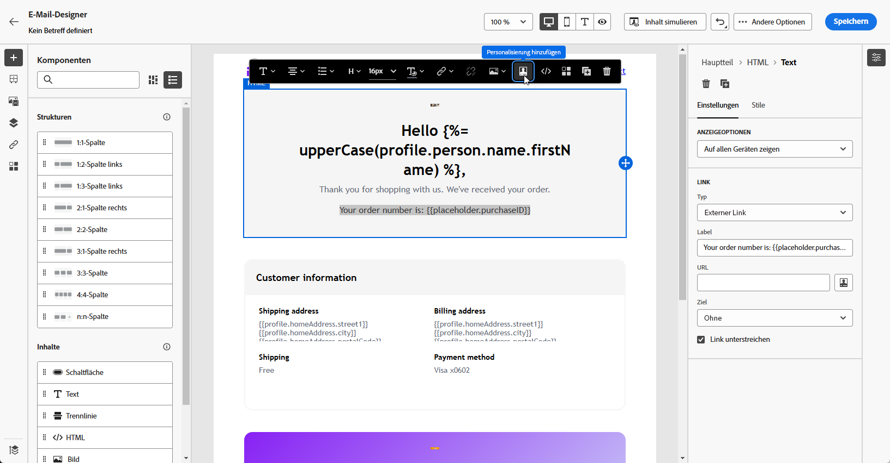
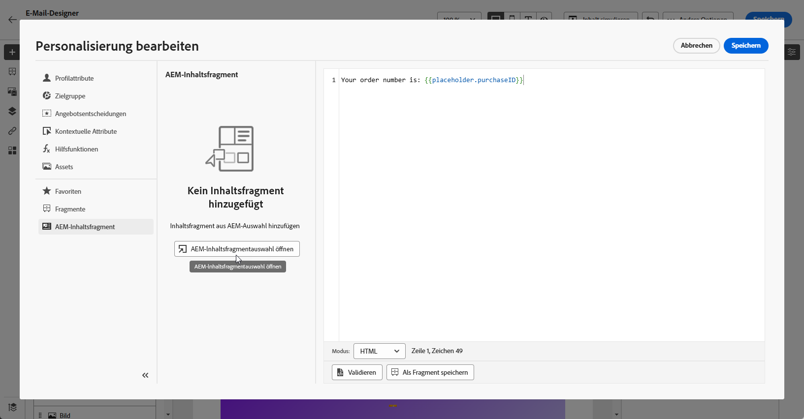
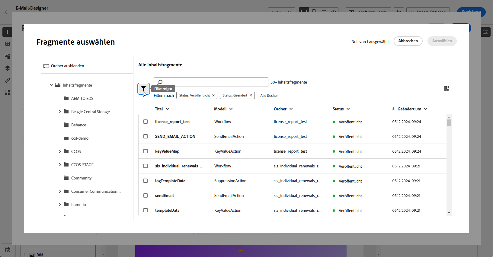
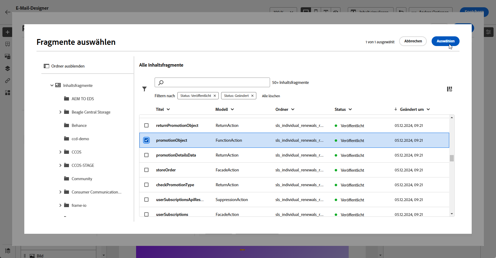
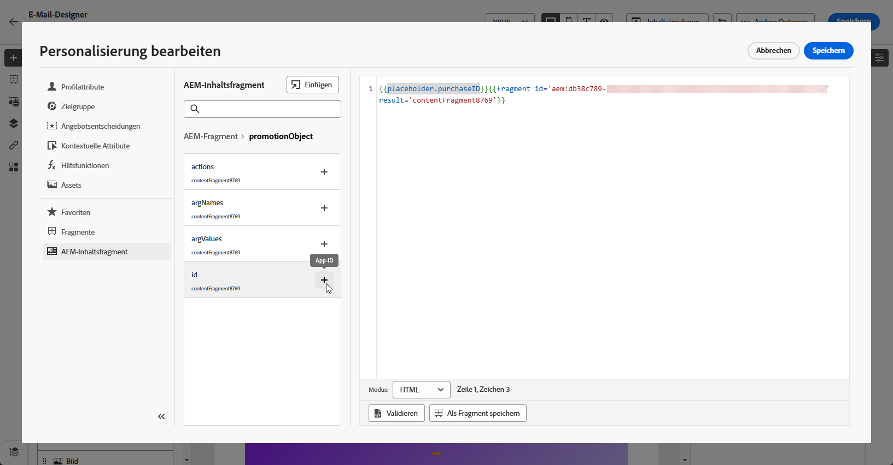

# Adobe Experience Manager-Inhaltsfragmente {#aem-fragments}

Durch die Integration von Adobe Experience Manager mit Adobe Journey Optimizer können Sie jetzt Ihre AEM-Inhaltsfragmente nahtlos in Ihre E-Mail-Inhalte von Journey Optimizer integrieren. Diese optimierte Verbindung vereinfacht den Zugriff auf und die Nutzung von AEM-Inhalten und ermöglicht die Erstellung personalisierter und dynamischer Kampagnen und Journey.

Weitere Informationen zum AEM-Inhaltsfragment finden Sie in der [Experience Manager-Dokumentation](https://experienceleague.adobe.com/en/docs/experience-manager-cloud-service/content/sites/authoring/fragments/content-fragments).

## Einschränkungen {#limitations}

* Nur für E-Mail-Kanal verfügbar.

* Benutzende können derzeit nicht zur AEM-Instanz wechseln, mit der sie verbunden sind, da jede Sandbox auf eine einzige Instanz beschränkt ist.

* Es wird empfohlen, die Anzahl der Benutzer mit Zugriff auf die Veröffentlichung von Inhaltsfragmenten zu begrenzen, um das Risiko versehentlicher Fehler in E-Mails zu reduzieren.

* Bei mehrsprachigen Inhalten wird nur der manuelle Fluss unterstützt.

* Varianten werden derzeit nicht unterstützt.

* Sie müssen ein Tag speziell für Journey Optimizer erstellen.

+++ Erfahren Sie, wie Sie Ihr Journey Optimizer-Tag erstellen

   1. Zugriff auf Ihre **Experience Manager**-Umgebung.

   1. Navigieren Sie **Menü** zur Registerkarte **Allgemein** und wählen Sie **Tagging** aus.

   1. Klicken Sie **Neues Tag erstellen**.

   1. Stellen Sie sicher, dass die ID der folgenden Syntax entspricht: `ajo-enabled:{AJO-OrgId}/{AJO-SandboxName}`.

   1. Klicken Sie auf **Erstellen**.

  Jetzt können Sie dieses Journey Optimizer-Tag Ihren Inhaltsfragmenten zuweisen.
+++

## Hinzufügen von AEM-Inhaltsfragmenten {#aem-add}

Nachdem Sie Ihre [AEM-Inhaltsfragmente](https://experienceleague.adobe.com/en/docs/experience-manager-cloud-service/content/sites/authoring/fragments/content-fragments) erstellt und personalisiert haben, können Sie sie jetzt in Ihre Journey Optimizer-Kampagne oder -Journey importieren.

1. Nachdem Sie Ihre [Kampagne](../email/create-email.md) oder [Journey](../email/create-email.md) mit einer E-Mail-Aktion erstellt haben, greifen Sie auf den E-Mail-Designer zu, um den E-Mail-Inhalt zu konfigurieren. [Weitere Informationen](../email/get-started-email-design.md)

1. Klicken Sie in einen Textblock oder in die Betreffzeile und wählen Sie **[!UICONTROL Personalization hinzufügen]** in der kontextuellen Symbolleiste aus.

   

1. Klicken Sie im Menü **[!UICONTROL AEM]** Inhaltsfragment im linken Fensterbereich auf **[!UICONTROL AEM-CF-Auswahl öffnen]**.

   

1. Wählen Sie ein **[!UICONTROL Inhaltsfragment]** aus der verfügbaren Liste aus, das in Ihren Journey Optimizer-Inhalt importiert werden soll.

   >[!IMPORTANT]
   >
   >Nur veröffentlichte **[!UICONTROL Inhaltsfragmente]** können verwendet werden.

1. Klicken Sie **[!UICONTROL Filter anzeigen]**, um Ihre Inhaltsfragmentliste zu optimieren.

   Der Inhaltsfragment-Selektor enthält vorkonfigurierte Filter:

   * **[!UICONTROL status]**: veröffentlicht, geändert
   * **[!UICONTROL Tag]**: wird automatisch basierend auf Ihrer Journey Optimizer-Umgebung definiert (Organisations-ID und Sandbox)

   

1. Nachdem Sie Ihr **[!UICONTROL Inhaltsfragment]** ausgewählt haben, klicken Sie auf **[!UICONTROL Auswählen]**, um es zu öffnen.

   

1. Wählen Sie die gewünschten Felder aus Ihrem **[!UICONTROL Inhaltsfragment]** aus, um sie zu Ihrem Inhalt hinzuzufügen.

   

1. Klicken Sie auf **[!UICONTROL Speichern]** und überprüfen Sie Ihre Nachricht in der Vorschau. Sie können nun den Inhalt Ihrer Nachricht testen und überprüfen, wie in [diesem Abschnitt](preview.md) beschrieben.

Nachdem Sie Ihre Tests und den Inhalt validiert haben, können Sie Ihre E-Mail mit Ihrer [Kampagne](../campaigns/review-activate-campaign.md) oder [Journey an Ihre Audience ](../building-journeys/publishing-the-journey.md).

