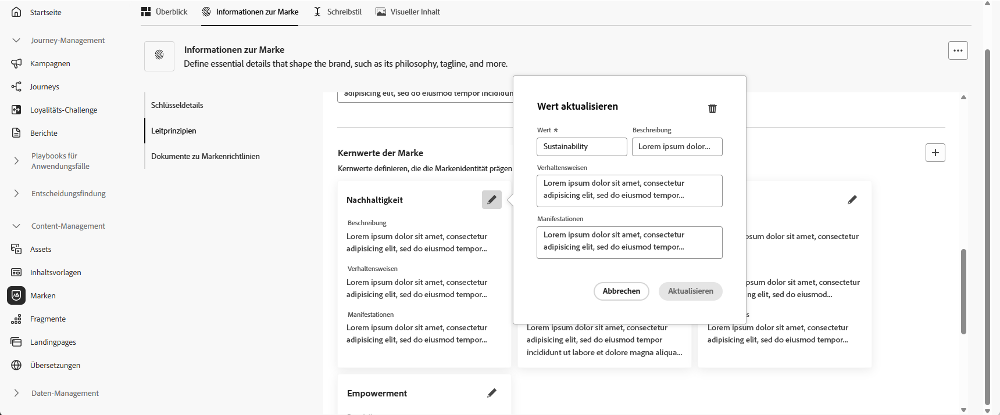
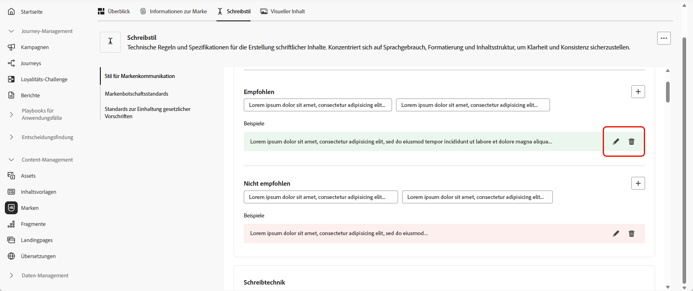

# Personalisieren Ihrer Marke {#brands-personalize}

## Informationen zur Marke {#about-brand}

Verwenden Sie die Registerkarte **[!UICONTROL Informationen zur Marke]**, um die Kernidentität Ihrer Marke festzulegen und Zweck, Persönlichkeit, Tagline und andere definierende Attribute darzulegen.

1. Füllen Sie zunächst die grundlegenden Informationen für Ihre Marke in der Kategorie **[!UICONTROL Schlüsseldetails]** aus:

   * **[!UICONTROL Marken-Kit-Name]**: Geben Sie den Namen Ihres Marken-Kits ein.

   * **[!UICONTROL Verwendung]**: Geben Sie Szenarien oder Kontexte an, in denen dieses Marken-Kit verwendet werden soll.

   * **[!UICONTROL Markenname]**: Geben Sie den offiziellen Namen der Marke ein.

   * **[!UICONTROL Markenbeschreibung]**: Geben Sie einen Überblick darüber, wofür diese Marke steht.

   * **[!UICONTROL Standard-Tagline]**: Fügen Sie die primäre Tagline für die Marke hinzu.

     

1. Spezifizieren Sie in der Kategorie **[!UICONTROL Leitprinzipien]** die Kernausrichtung und -philosophie Ihrer Marke:

   * **[!UICONTROL Mission]**: Beschreiben Sie den Zweck Ihrer Marke.

   * **[!UICONTROL Vision]**: Beschreiben Sie das langfristige Ziel oder den gewünschten zukünftigen Status.

   * **[!UICONTROL Marktpositionierung]**: Erklären Sie, wie Ihre Marke auf dem Markt positioniert ist.

     

1. Klicken Sie in der Kategorie **[!UICONTROL Kernwerte der Marke]** auf , um die Kernwerte der Marke hinzuzufügen und Details auszufüllen:

   * **[!UICONTROL Wert]**: Benennen Sie einen Kernwert der Marke.

   * **[!UICONTROL Beschreibung]**: Erklären Sie, was dieser Wert für Ihre Marke bedeutet.

   * **[!UICONTROL Verhaltensweisen]**: Beschreiben Sie Aktionen oder Haltungen, die diesen Wert in der Praxis widerspiegeln.

   * **[!UICONTROL Manifestationen]**: Geben Sie Beispiele dafür, wie dieser Wert beim realen Branding ausgedrückt wird.

     

1. Klicken Sie bei Bedarf auf das Symbol , um einen der Kernwerte Ihrer Marke zu aktualisieren oder zu löschen.

   

Nun können Sie Ihre Marke weiter personalisieren oder [veröffentlichen](brands.md#create-brand-kit).

## Schreibstil {#writing-style}

>[!CONTEXTUALHELP]
>id="ajo_brand_writing_style"
>title="Ausrichtungswert „Schreibstil“"
>abstract="Im Abschnitt „Schreibstil“ werden Standards für Sprache, Formatierung und Struktur definiert, um klare, konsistente Inhalte sicherzustellen. Der Ausrichtungswert, von hoch bis niedrig, zeigt, wie gut Ihr Inhalt diesen Richtlinien entspricht, und hebt Bereiche hervor, die verbessert werden müssen."

Im Abschnitt **[!UICONTROL Schreibstil]** werden die Standards zum Verfassen von Inhalten beschrieben. Es wird festgelegt, wie Sprache, Formatierung und Struktur verwendet werden sollten, um Klarheit, Kohärenz und Konsistenz in allen Materialien sicherzustellen.

+++ Verfügbare Kategorien und Beispiele

<table>
  <thead>
    <tr>
      <th>Kategorie</th>
      <th>Unterkategorie</th>
      <th>Beispiel für Richtlinien</th>
      <th>Beispiel für Ausschlüsse</th>
    </tr>
  </thead>
  <tbody>
    <tr>
      <td rowspan="4">Inhaltserstellungsstandards</td>
      <td>Markenbotschaftsstandards</td>
      <td>Heben Sie Innovation und die Bedeutung der Kundinnen und Kunden hervor.</td>
      <td>Versprechen Sie nicht zu viel in Bezug auf Produktfunktionen.</td>
    </tr>
    <tr>
      <td>Tagline-Nutzung</td>
      <td>Platzieren Sie die Tagline unter dem Logo auf allen Digital-Marketing-Assets.</td>
      <td>Verändern oder übersetzen Sie die Tagline nicht.</td>
    </tr>
    <tr>
      <td>Kernbotschaften</td>
      <td>Betonen Sie den Hauptvorteil betonen, z. B. verbesserte Produktivität.</td>
      <td>Verwenden Sie keine Werteversprechen ohne Bezug.</td>
    </tr>
    <tr>
      <td>Benennungsstandards</td>
      <td>Verwenden Sie einfache, beschreibende Namen verwenden, z. B. „ProScheduler“.</td>
      <td>Verwenden Sie keine komplexen Begriffe und Sonderzeichen.</td>
    </tr>
    <tr>
      <td rowspan="5">Stil für Markenkommunikation</td>
      <td>Eigenschaften der Markenpersönlichkeit</td>
      <td>Freundlich und zugänglich.</td>
      <td>Seien Sie nicht pessimistisch.</td>
    </tr>
    <tr>
      <td>Schreibtechnik</td>
      <td>Formulieren Sie kurze und prägnante Sätze.</td>
      <td>Verwenden Sie nicht übermäßig viel Jargon.</td>
    </tr>
    <tr>
      <td>Situationsbezogener Ton</td>
      <td>Behalten Sie einen professionellen Tonfall in der Kommunikation in Krisensituationen bei.</td>
      <td>Seien Sie bei Support-Interaktionen nicht herablassend.</td>
    </tr>
    <tr>
      <td>Richtlinien zur Wortwahl</td>
      <td>Verwenden Sie Wörter wie „innovativ“ und „intelligent“.</td>
      <td>Vermeiden Sie Wörter wie „billig“ oder „Hack“.</td>
    </tr>
    <tr>
      <td>Sprachstandards</td>
      <td>Befolgen Sie die Konventionen von amerikanischem Englisch.</td>
      <td>Vermischen Sie britische und amerikanische Rechtschreibung nicht.</td>
    </tr>
    <tr>
      <td rowspan="3">Standards zur Einhaltung gesetzlicher Vorschriften</td>
      <td>Markenzeichenstandards</td>
      <td>Verwenden Sie die Symbole ™ oder ® immer.</td>
      <td>Lassen Sie rechtliche Symbole nicht weg, wenn sie erforderlich sind.</td>
    </tr>
    <tr>
      <td>Copyright-Standards</td>
      <td>Geben Sie Urheberrechtsvermerke auf Marketing-Materialen an.</td>
      <td>Verwenden Sie Inhalte von Dritten nicht ohne Berechtigung.</td>
    </tr>
    <tr>
      <td>Haftungsausschlussstandards</td>
      <td>Zeigen Sie Haftungsausschlüsse deutlich lesbar auf digitalen Assets an.</td>
      <td>Verstecken Sie Haftungsausschlüsse nicht in nicht sichtbaren Bereichen.</td>
    </tr>
</table>

+++

 

So personalisieren Sie Ihren **[!UICONTROL Schreibstil]**:

1. Klicken Sie auf der Registerkarte **[!UICONTROL Schreibstil]** auf , um eine Richtlinie, eine Ausnahme oder einen Ausschluss hinzuzufügen.

1. Geben Sie die Richtlinie, die Ausnahme oder den Ausschluss ein. Sie können auch **[!UICONTROL Beispiele]** hinzufügen, um die Anwendung besser zu veranschaulichen.

   

1. Geben Sie den **Verwendungskontext** für die Richtlinie, die Ausnahme oder den Ausschluss an:

   * **[!UICONTROL Kanaltyp]**: Wählen Sie aus, wo die Richtlinie, die Ausnahme oder der Ausschluss gelten soll. Beispielsweise soll möglicherweise ein bestimmter Schreibstil nur in E-Mail-, Mobile-, Print- oder anderen Kommunikationskanälen verwendet werden.

   * **[!UICONTROL Elementtyp]**: Geben Sie an, für welches Inhaltselement die Regel gilt. Das können Elemente wie Überschriften, Schaltflächen, Links oder andere Komponenten in Ihrem Inhalt sein.

     

1. Nachdem Sie die Richtlinie, die Ausnahme oder den Ausschluss eingerichtet haben, klicken Sie auf **[!UICONTROL Hinzufügen]**.

1. Wählen Sie bei Bedarf eine Richtlinie oder einen Ausschluss zum Aktualisieren oder Löschen aus.

1. Klicken Sie auf , um Ihr Beispiel zu bearbeiten, oder klicken Sie auf das Symbol , um es zu löschen.

   

Nun können Sie Ihre Marke weiter personalisieren oder [veröffentlichen](#create-brand-kit).

## Visueller Inhalt {#visual-content}

>[!CONTEXTUALHELP]
>id="ajo_brand_imagery"
>title="Ausrichtungswert „Visueller Inhalt“"
>abstract="Der Ausrichtungswert „Visueller Inhalt“ gibt an, wie gut Ihr Inhalt Ihren konfigurierten Markenrichtlinien entspricht. Mit diesem hohen bis niedrigen Wert können Sie die Ausrichtung auf einen Blick beurteilen. Erkunden Sie die verschiedenen Kategorien, um Bereiche mit Verbesserungspotenzial zu identifizieren und Elemente zu bestimmen, die möglicherweise nicht markenkonform sind."

Im Abschnitt **[!UICONTROL Visueller Inhalt]** werden die Standards für Bilder und Design definiert. Darin werden die Spezifikationen beschrieben, die für einen einheitlichen und konsistenten Look der Marke erforderlich sind.

+++ Verfügbare Kategorien und Beispiele

<table>
  <thead>
    <tr>
      <th>Kategorie</th>
      <th>Beispiel für Richtlinien</th>
      <th>Beispiel für Ausschlüsse</th>
    </tr>
  </thead>
  <tbody>
    <tr>
      <td>Fotografiestandards</td>
      <td>Verwenden Sie natürliches Licht für Außenaufnahmen.</td>
      <td>Vermeiden Sie stark bearbeitete oder verpixelte Bilder.</td>
    </tr>
    <tr>
      <td>Illustrationsstandards</td>
      <td>Verwenden Sie klare und minimalistische Stile.</td>
      <td>Vermeiden Sie zu komplexe Veranschaulichungen.</td>
    </tr>
    <tr>
      <td>Symbolstandards</td>
      <td>Verwenden Sie ein konsistentes 24-px-Rastersystem.</td>
      <td>Vermischen Sie keine Symbolabmessungen, verwenden Sie keine inkonsistenten Strichstärken und weichen Sie nicht von Rasterregeln ab.</td>
    </tr>
    <tr>
      <td>Nutzungsrichtlinien</td>
      <td>Wählen Sie Lifestyle-Bilder, die reale Kundinnen und Kunden widerspiegeln, die das Produkt in professionellen Umgebungen verwenden.</td>
      <td>Verwendne Sie keine Bilder, die dem Ton der Marke widersprechen oder anscheinend aus dem Zusammenhang gerissen sind.</td>
    </tr>
</table>

+++

 

So personalisieren Sie Ihren **[!UICONTROL visuellen Inhalt]**:

1. Klicken Sie auf der Registerkarte **[!UICONTROL Visueller Inhalt]** auf , um eine Richtlinie, einen Ausschluss oder ein Beispiel hinzuzufügen.

1. Geben Sie die Richtlinie, den Ausschluss oder das Beispiel ein. 

   

1. Geben Sie den **Verwendungskontext** für die Richtlinie oder den Ausschluss an:

   * **[!UICONTROL Kanaltyp]**: Wählen Sie aus, wo die Richtlinie, die Ausnahme oder der Ausschluss gelten soll. Beispielsweise soll möglicherweise ein bestimmter Schreibstil nur in E-Mail-, Mobile-, Print- oder anderen Kommunikationskanälen verwendet werden.

   * **[!UICONTROL Elementtyp]**: Geben Sie an, für welches Inhaltselement die Regel gilt. Das können Elemente wie Überschriften, Schaltflächen, Links oder andere Komponenten in Ihrem Inhalt sein.

     

1. Nachdem Sie die Richtlinie, die Ausnahme oder den Ausschluss eingerichtet haben, klicken Sie auf **[!UICONTROL Hinzufügen]**.

1. Um ein Bild zum Veranschaulichen der korrekten Verwendung hinzuzufügen, wählen Sie **[!UICONTROL Beispiel]** und klicken Sie auf **[!UICONTROL Bild auswählen]**. Sie können auch ein Bild zur Veranschaulichung der inkorrekten Verwendung als Ausschlussbeispiel hinzufügen.

   

1. Wählen Sie bei Bedarf eine Richtlinie oder einen Ausschluss zum Aktualisieren oder Löschen aus.

1. Wählen Sie ein Beispiel aus, um es zu aktualisieren, ersetzen Sie das Bild oder klicken Sie auf das Symbol , um es zu löschen.

   

Nun können Sie Ihre Marke weiter personalisieren oder [veröffentlichen](brands.md#create-brand-kit).

<!--
## Colors {#colors}

The **[!UICONTROL Colors]** section the standards for your brand's color system, outlining how colors are selected, organized, and applied across experiences. It ensures consistent use of primary, secondary, accent, and neutral colors to maintain a cohesive, accessible, and recognizable brand identity.

+++ Available categories and examples

<table>
  <thead>
    <tr>
      <th>Category</th>
      <th>Guidelines Example</th>
      <th>Exclusions Example</th>
    </tr>
  </thead>
  <tbody>
    <tr>
      <td>Primary colors</td>
      <td>Use primary brand colors for logos, headers, and main call-to-action elements.</td>
      <td>Do not substitute or modify primary brand colors.</td>
    </tr>
    <tr>
      <td>Secondary colors</td>
      <td>Use secondary colors to support layouts, illustrations, and UI components.</td>
      <td>Do not let secondary colors overpower primary brand colors.</td>
    </tr>
    <tr>
      <td>Accent colors</td>
      <td>Use accent colors sparingly for buttons, links, and alerts.</td>
      <td>Do not use accent colors for large background areas.</td>
    </tr>
    <tr>
      <td>Neutral colors</td>
      <td>Use neutral colors for text, dividers, borders, and subtle UI elements.</td>
      <td>Avoid using neutrals with poor contrast or heavy color casts.</td>
    </tr>
    <tr>
      <td>Background colors</td>
      <td>Use light or neutral backgrounds to ensure readability and visual clarity.</td>
      <td>Do not place text or logos on low-contrast backgrounds.</td>
    </tr>
    <tr>
      <td>Additional colors</td>
      <td>Use additional colors only for data visualization or approved campaigns.</td>
      <td>Do not introduce unapproved or off-brand colors.</td>
    </tr>
    <tr>
      <td>Color scales</td>
      <td>Use approved tints and shades for UI states such as hover, active, and disabled.</td>
      <td>Do not create unofficial shades or gradients.</td>
    </tr>
    <tr>
      <td>Usage guidelines</td>
      <td>Maintain consistent color usage and accessible contrast across all assets.</td>
      <td>Do not mix conflicting palettes or apply colors inconsistently.</td>
    </tr>
</table>

+++

 

To personalize your **[!UICONTROL Colors]**:

1. From the **[!UICONTROL Colors]** tab, click  to add a color, guideline or exclusion. 

1. Enter your color information to define it accurately:

    * **Color name**: Provide a clear, descriptive name to identify the color within your brand system.

    * **Color value**: Choose your color using the hue picker or enter precise values using RGB, HEX, or Pantone name/code to ensure consistency across digital and print assets.

    

1. Review your selection to confirm accuracy and visual consistency and click **[!UICONTROL Add]** to save your color.

1. Then, enter your guideline or exclusion.

1. Specify the Usage context for your guideline or exclusion:

    * **[!UICONTROL Channel type]**: Choose where this guideline, exception, or exclusion should apply. For example, you may want a specific writing style to appear only in Email, Mobile, Prints, or other communication channels.

    * **[!UICONTROL Element type]**: Specify which content element the rule applies to. This could include elements such as Headings, Buttons, Links, or other components within your content.

      
  
1. Once your guideline, exception, or exclusion is set up, click **[!UICONTROL Add]**. 

1. If needed, select one of your guideline or exclusion to update or delete.

1. Select one your guideline or exclusion to update it. Click the icon to delete it. 

    

1. Click **[!UICONTROL Add group]** to define additional colors for your brand or to add a color scale group.

You can now further personalize your brand or [publish your brand](brands.md#create-brand-kit).

-->