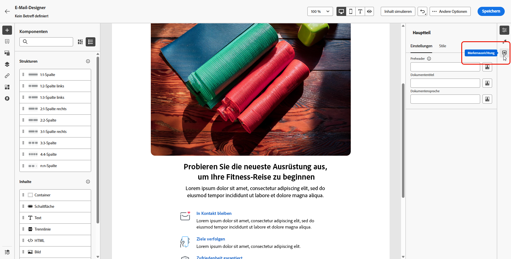
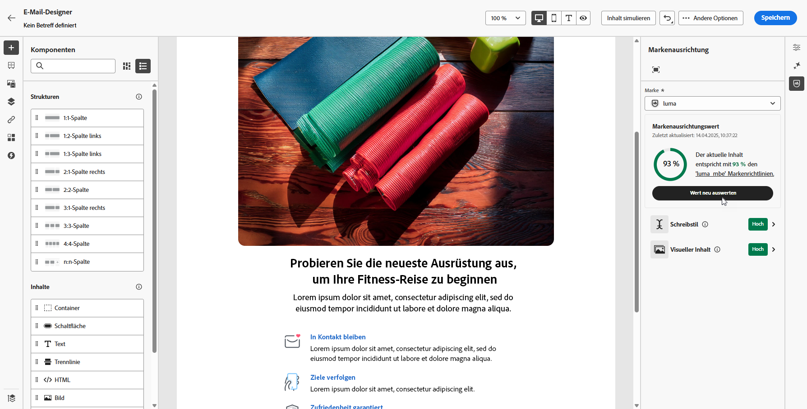
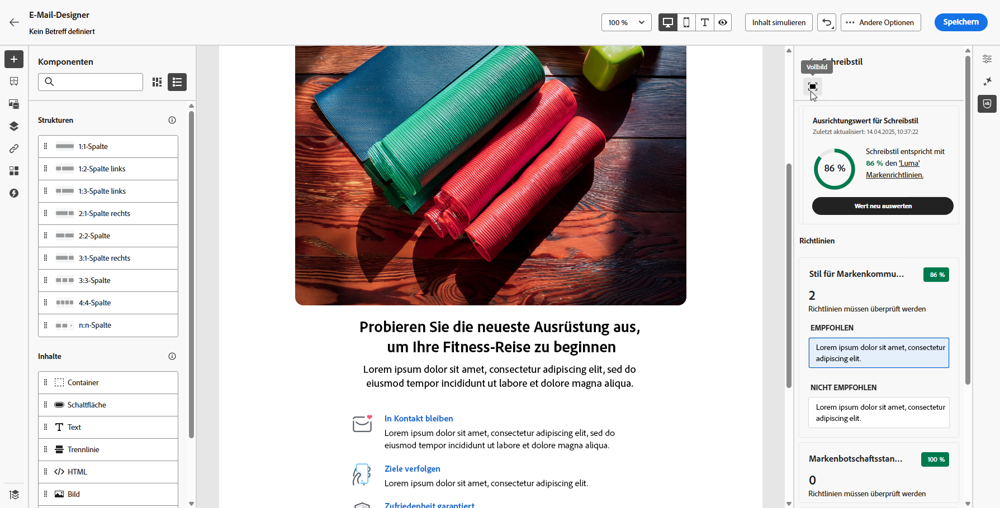
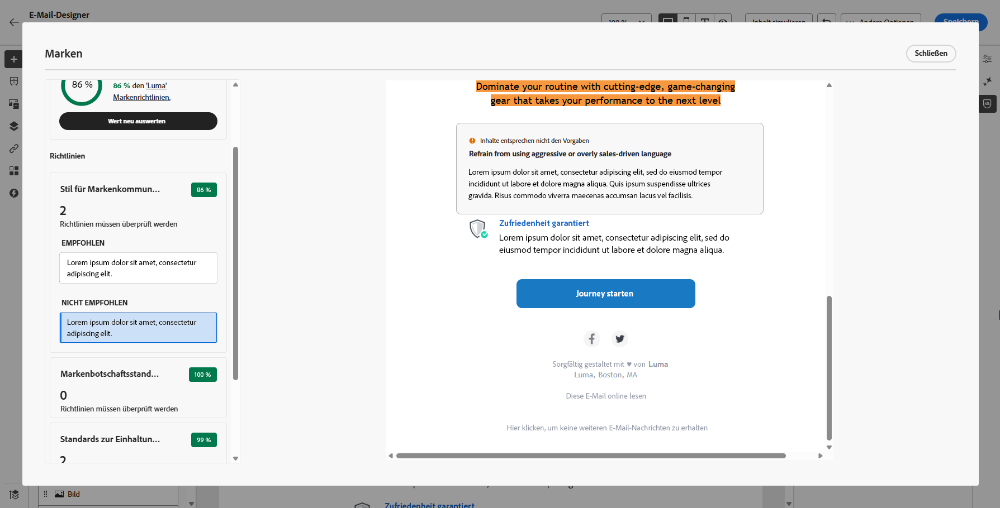

# Markenausrichtung {#brands-score}

>[!CONTEXTUALHELP]
>id="ajo_brand_score"
>title="Markenausrichtungswert"
>abstract="Der Markenausrichtungswert misst, wie gut Ihr Inhalt den Richtlinien Ihrer Marke entspricht, um Konsistenz bei Farben, Schriftarten, Logo, Bildern und Schreibstil sicherzustellen."

>[!CONTEXTUALHELP]
>id="ajo_brand_colors"
>title="Farbwert"
>abstract="Farbwert"

>[!CONTEXTUALHELP]
>id="ajo_brand_fonts"
>title="Schriftartenwert"
>abstract="Schriftartenwert"

>[!CONTEXTUALHELP]
>id="ajo_brand_logos"
>title="Logowert"
>abstract="Logowert"

>[!AVAILABILITY]
>
>Sie müssen der [Benutzervereinbarung](https://www.adobe.com/de/legal/licenses-terms/adobe-dx-gen-ai-user-guidelines.html){target="_blank"} zustimmen, damit Sie den KI-Assistenten in Adobe Journey Optimizer verwenden können. Weitere Informationen erhalten Sie beim Adobe-Support.

Die Funktion „Markenausrichtung“ hilft Ihnen dabei, Inhalte zu erstellen, zu überprüfen und zu verwalten, die Ihren Markenrichtlinien entsprechen. Sie sorgt für Konsistenz bei Ton, Messaging und visueller Identität in all Ihren E-Mail-Kampagnen und dient gleichzeitig zur Qualitätsprüfung vor der Live-Schaltung Ihres Inhalts.

## Validieren von Inhalten mit Markenausrichtung {#validate-content}

Sobald [Ihre Marke eingerichtet und veröffentlicht wurde](brands.md) beurteilen Sie den Markenausrichtungswert direkt in Ihrer E-Mail-Kampagne, um sicherzustellen, dass Ihr Inhalt mit Ihren Markenrichtlinien übereinstimmt:

1. Erstellen Sie Ihre [E-Mail-Kampagne](../campaigns/create-campaign.md).

1. Öffnen Sie im E-Mail-Designer das Menü **[!UICONTROL Markenausrichtung]**.

   Ihre Inhalte werden automatisch mit Ihrer Standardmarke abgeglichen. [Erfahren Sie, wie Sie eine Standardmarke zuweisen](brands.md).

   

1. Um eine andere Marke auszuwerten, wählen Sie diese aus dem Dropdown-Menü **[!UICONTROL Marke]** aus und klicken Sie auf **[!UICONTROL Wert neu auswerten]**.

   

1. Gehen Sie den **Markenausrichtungswert** („Hoch“, „Mittel“, „Niedrig“) durch und prüfen Sie das detaillierte Feedback.

1. Klicken Sie auf das Symbol , um weitere Erkenntnisse zu Ihrem Wert zu erhalten.

   

1. Wählen Sie eine gekennzeichnete Richtlinie aus, um spezifisches Feedback und Vorschläge anzuzeigen.

   

1. Bearbeiten Sie Ihre Inhalte auf der Grundlage der Empfehlungen, um die Markenausrichtung zu verbessern.

1. Werten Sie den Inhalt manuell neu aus, nachdem Sie Änderungen vorgenommen haben, um Ihren Ausrichtungswert zu aktualisieren.

## Anleitungsvideo {#video}

Das folgende Video veranschaulicht, wie Sie Ihre eigenen Marken erstellen und anpassen können, um Ihre visuelle und verbale Identität in der gesamten Kommunikation klar zu definieren.

+++ Video ansehen

>[!VIDEO](https://video.tv.adobe.com/v/3470555/?captions=ger&learn=on)

+++
