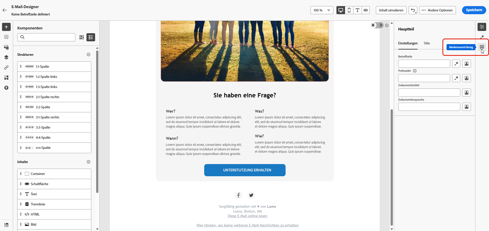
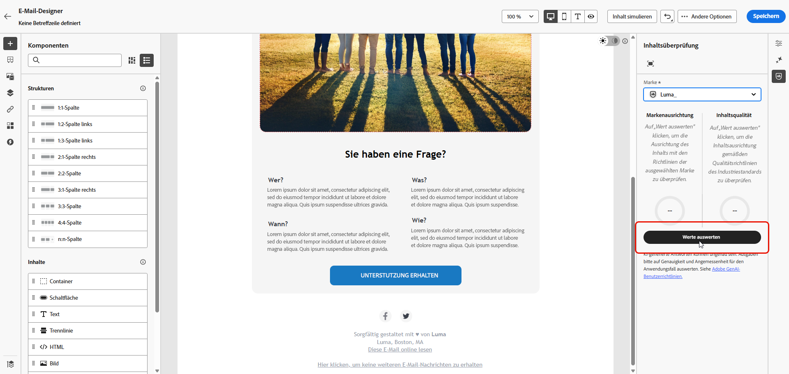
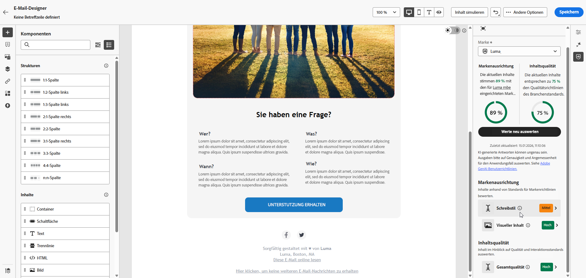
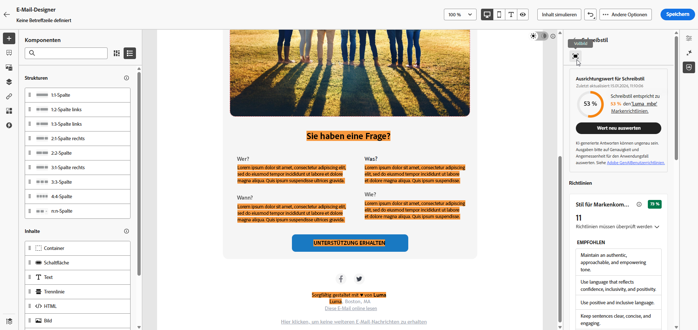
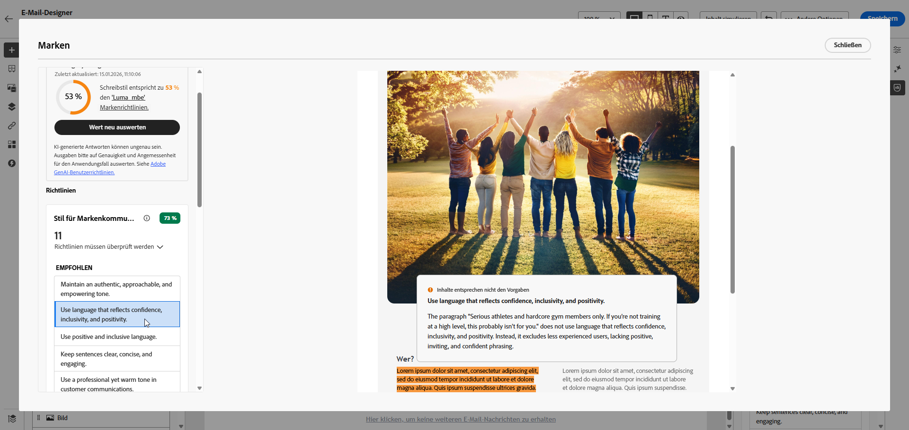
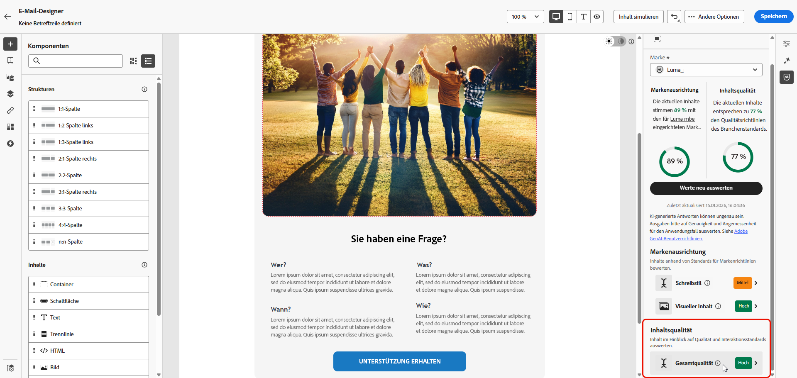
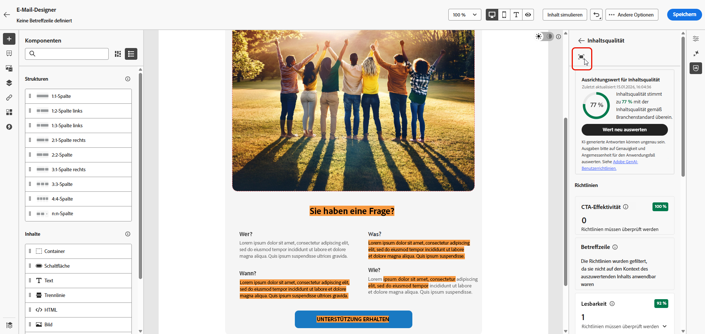
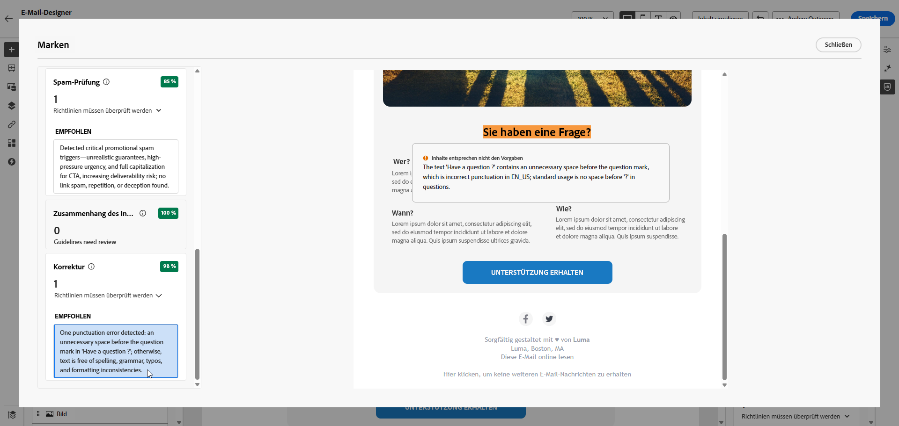

# Markenausrichtung {#brands-score}

>[!BEGINSHADEBOX]

**Auf dieser Seite** Erfahren Sie, wie Sie Ihren E-Mail-Inhalt anhand Ihrer Markenrichtlinien überprüfen und die Gesamtqualität des Inhalts anhand der Bewertungen für die Markenausrichtung in Adobe Journey Optimizer bewerten können.

>[!ENDSHADEBOX]

>[!CONTEXTUALHELP]
>id="ajo_brand_score"
>title="Markenausrichtungswert"
>abstract="Der Markenausrichtungswert misst, wie gut Ihr Inhalt den Richtlinien Ihrer Marke entspricht, um Konsistenz bei Farben, Schriftarten, Logo, Bildern und Schreibstil sicherzustellen."

>[!CONTEXTUALHELP]
>id="ajo_brand_colors"
>title="Farbwert"
>abstract="Farbwert"

>[!CONTEXTUALHELP]
>id="ajo_brand_fonts"
>title="Schriftartenwert"
>abstract="Schriftartenwert"

>[!CONTEXTUALHELP]
>id="ajo_brand_logos"
>title="Logowert"
>abstract="Logowert"

>[!AVAILABILITY]
>
>Sie müssen der [Benutzervereinbarung](https://www.adobe.com/de/legal/licenses-terms/adobe-dx-gen-ai-user-guidelines.html){target="_blank"} zustimmen, damit Sie den KI-Assistenten in Adobe Journey Optimizer verwenden können. Weitere Informationen erhalten Sie beim Adobe-Support.

Die Funktion „Markenausrichtung“ hilft Ihnen dabei, Inhalte zu erstellen, zu überprüfen und zu verwalten, die Ihren Markenrichtlinien entsprechen. Sie sorgt für Konsistenz bei Ton, Messaging und visueller Identität in all Ihren E-Mail-Kampagnen und dient gleichzeitig zur Qualitätsprüfung vor der Live-Schaltung Ihres Inhalts.

## Validieren von Inhalten mit Markenausrichtung {#validate-content}

Sobald [Ihre Marke eingerichtet und veröffentlicht wurde](brands.md) beurteilen Sie den Markenausrichtungswert direkt in Ihrer E-Mail-Kampagne, um sicherzustellen, dass Ihr Inhalt mit Ihren Markenrichtlinien übereinstimmt:

1. Erstellen Sie Ihre [E-Mail-Kampagne](../campaigns/create-campaign.md).

1. Öffnen Sie im E-Mail-Designer das Menü **[!UICONTROL Markenausrichtung]**.

   Ihre Inhalte werden automatisch mit Ihrer Standardmarke abgeglichen. [Erfahren Sie, wie Sie eine Standardmarke zuweisen](brands.md).

   

1. Um eine andere Marke zu verwenden, wählen Sie diese aus dem Dropdown-Menü **[!UICONTROL Marke]** und klicken Sie auf **[!UICONTROL Bewertung auswerten]**.

   

1. Durchsuchen Sie den **[!UICONTROL Schreibstil]** oder **[!UICONTROL visuelle Inhalte]** um mehr Einblicke in Ihre Punktzahl zu erhalten.

   

1. Klicken Sie auf das Symbol , um weitere Erkenntnisse zu Ihrem Wert zu erhalten.

   

1. Wählen Sie eine gekennzeichnete Richtlinie aus, um spezifisches Feedback und Vorschläge anzuzeigen. Brand Alignment bewertet die folgenden Kategorien:

   * **[!UICONTROL Schreibstil]**:
      * **[!UICONTROL Brand Communication Style]**: Definiert die Persönlichkeit und den emotionalen Ton, um eine konsistente Markensprache über alle Kanäle hinweg sicherzustellen.
      * **[!UICONTROL Markenbotschaftsstandards]**: Struktur- und Formatierungsregeln für effektiven Marketing- und Werbetext.
      * **[!UICONTROL Legal Compliance Standards]**: Stellt sicher, dass alle Kommunikationen den rechtlichen Anforderungen entsprechen, einschließlich Textplatzierungs- und Compliance-Checklisten.

   * **[!UICONTROL Visueller Inhalt]**:
      * **[!UICONTROL Fotografiestandards]**: Anforderungen an fotografische Inhalte, einschließlich Auflösung, Komposition, Beleuchtung und Dateiformaten.
      * **[!UICONTROL Illustrationsstandards]**: Stilparameter, Zeilengewichte, Farbverwendung und Dateiformatanforderungen für Illustrationen.
      * **[!UICONTROL Icon-Standards]**: Spezifikationen für die Icon-Gestaltung, einschließlich Gittersystemen, Strichgewichten und Dimensionierung für Einheitlichkeit.
      * **[!UICONTROL Nutzungsrichtlinien]**: Best Practices für Bildauswahl, Platzierung und Kontext, um die Markenidentität zu wahren.

   

1. Bearbeiten Sie Ihre Inhalte auf der Grundlage der Empfehlungen, um die Markenausrichtung zu verbessern.

1. Werten Sie den Inhalt manuell neu aus, nachdem Sie Änderungen vorgenommen haben, um Ihren Ausrichtungswert zu aktualisieren.

## Validieren der Inhaltsqualität {#validate-quality}

>[!NOTE]
>
>Die Bewertung der Inhaltsqualität ist unabhängig von den Markenrichtlinien. Auch wenn eine Marke im Dropdown-Menü ausgewählt wird, werden ihre Richtlinien nicht auf die Qualitätsprüfung angewendet. Die Markenauswahl ist nur für die Bewertung der Markenausrichtung relevant.

Zusätzlich zur Markenausrichtung können Sie die allgemeine Inhaltsqualität bewerten, um potenzielle Probleme mit Lesbarkeit, Inhaltskohärenz und Effektivität zu identifizieren, unabhängig von Ihren Markenrichtlinien.

So bewerten Sie die Qualität Ihrer Inhalte:

1. Erstellen Sie Ihre [E-Mail-Kampagne](../campaigns/create-campaign.md).

1. Öffnen Sie im E-Mail-Designer das Menü **[!UICONTROL Markenausrichtung]**.

   

1. Klicken Sie **[!UICONTROL Bewertung auswerten]**, um sowohl die Markenausrichtung als auch die Inhaltsqualitätswerte zu generieren.

   

1. Navigieren Sie zur Registerkarte **[!UICONTROL Gesamtqualität]**, um Einblicke und Empfehlungen zur Inhaltsqualität zu erhalten.

   

1. Klicken Sie auf das , um eine detaillierte Ansicht Ihrer Qualitätsbewertung zu erhalten.

   

1. Wählen Sie ein markiertes Element aus, um spezifisches Feedback und umsetzbare Verbesserungsvorschläge anzuzeigen. Die Bewertungen basieren auf den folgenden Kategorien:

   * **[!UICONTROL Effektivität von CTA]**: Wertet aus, wie gut Ihr call-to-action Ihre Leser dazu motiviert, die gewünschte Aktion durchzuführen.
   * **[!UICONTROL Betreffzeile]**: Bewertet Klarheit, Relevanz und Aufmerksamkeit erregende Qualität, um E-Mail-Öffnungen zu fördern.
   * **[!UICONTROL Lesbarkeit]**: Misst, wie einfach und ansprechend Ihre Inhalte für Leser sind.
   * **[!UICONTROL Spam-Prüfung]**: Identifiziert gängige Spam-Trigger, die die Zustellbarkeit beeinträchtigen können.
   * **[!UICONTROL Inhaltskohärenz]**: Stellt sicher, dass Ihre Inhalte reibungslos fließen und auf dem Thema bleiben.
   * **[!UICONTROL Korrekturlesen]**: Überprüft Rechtschreibung, Grammatik und Klarheit.

   

1. Bearbeiten Sie Ihre Inhalte anhand der Empfehlungen, um die Lesbarkeit, Inhaltskohärenz und Gesamtqualität zu verbessern.

1. Klicken Sie **[!UICONTROL Bewertung erneut bewerten]**, nachdem Sie Änderungen vorgenommen haben, um Ihren Qualitätswert zu aktualisieren.

## Anleitungsvideo {#video}

Das folgende Video veranschaulicht, wie Sie Ihre eigenen Marken erstellen und anpassen können, um Ihre visuelle und verbale Identität in der gesamten Kommunikation klar zu definieren.

+++ Video ansehen

>[!VIDEO](https://video.tv.adobe.com/v/3470544/?learn=on)

+++
