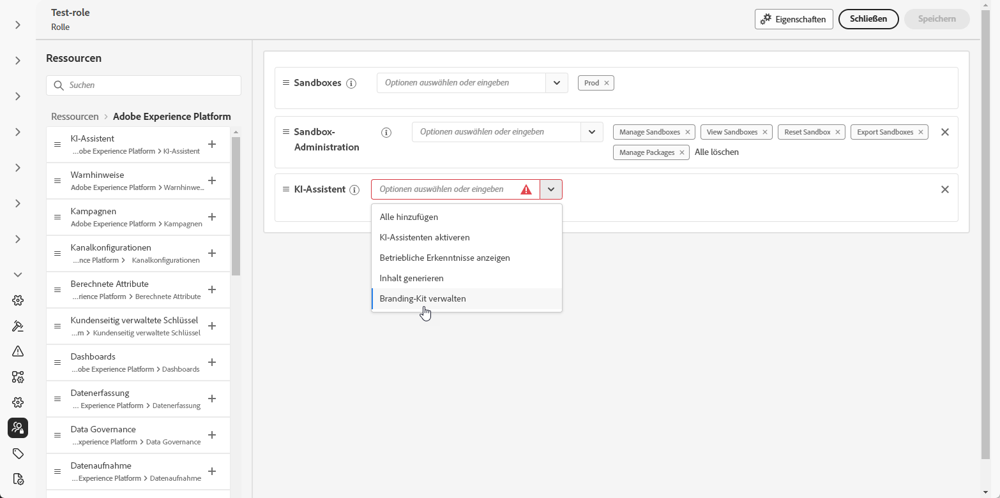
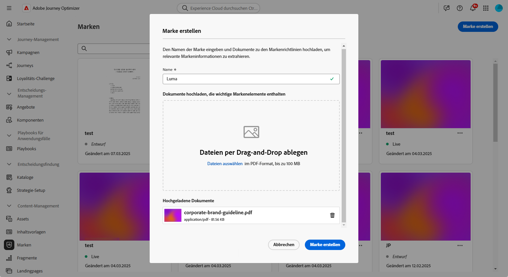
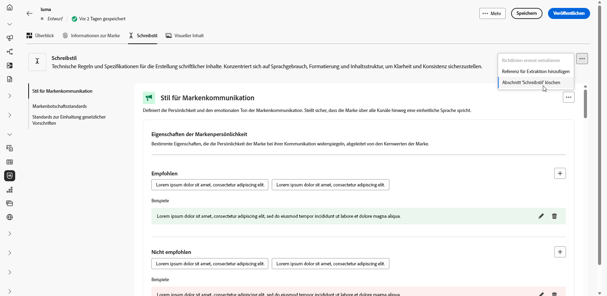
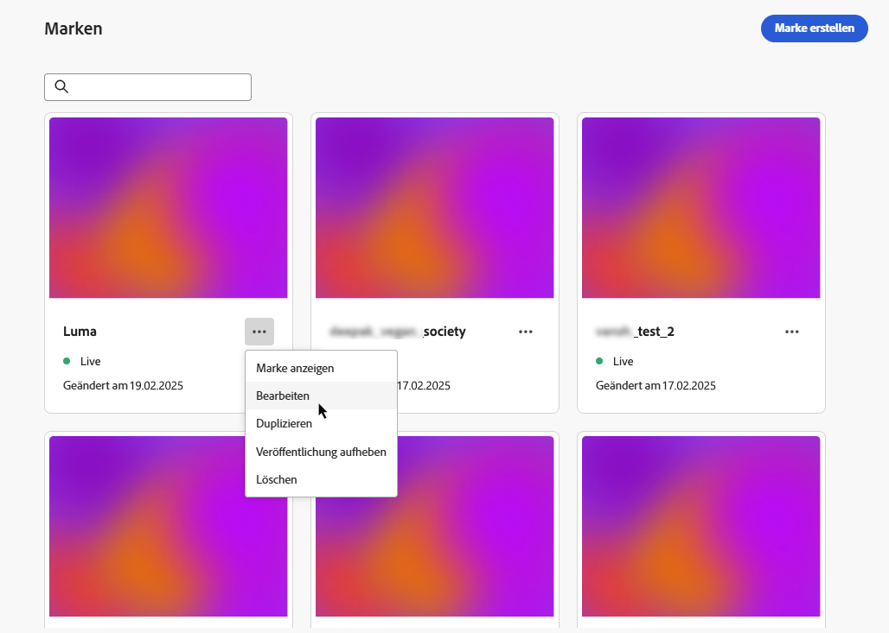
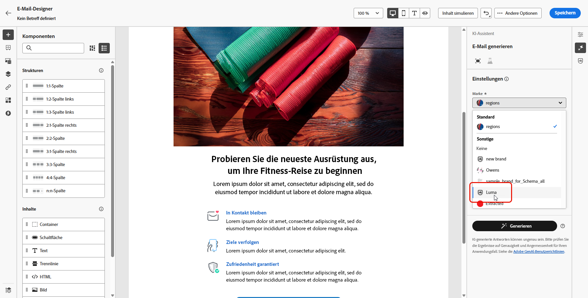
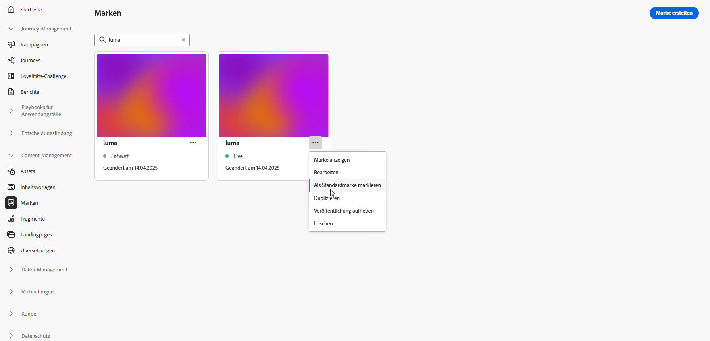

# Erstellen und Verwalten Ihrer Marken {#brands}

>[!CONTEXTUALHELP]
>id="ajo_brand_overview"
>title="Erste Schritte mit Marken"
>abstract="Erstellen Sie Ihre eigenen Marken und passen Sie diese an, um Ihre einzigartige visuelle und verbale Identität zu definieren. Gleichzeitig können Sie das Generieren von Content vereinfachen, der dem Stil und der Stimme Ihrer Marke entspricht."

>[!CONTEXTUALHELP]
>id="ajo_brand_ai_menu"
>title="Auswählen Ihrer Marke"
>abstract="Wählen Sie Ihre Marke, um sicherzustellen, dass der gesamte KI-generierte Content auf die Spezifikationen und Richtlinien Ihrer Marke zugeschnitten ist."

>[!CONTEXTUALHELP]
>id="ajo_brand_score_overview"
>title="Markenauswahl"
>abstract="Wählen Sie Ihre Marke aus, um sicherzustellen, dass Ihr Content in Übereinstimmung mit deren spezifischen Richtlinien, Standards und Identität erstellt wird, sodass Konsistenz und Markenintegrität gewahrt werden."

Markenrichtlinien sind ein detaillierter Satz an Regeln und Standards, die die visuelle und sprachliche Identität einer Marke festlegen. Sie dienen als Referenz, um eine konsistente Markendarstellung über alle Marketing- und Kommunikationsplattformen hinweg aufrechtzuerhalten.

In [!DNL Journey Optimizer] haben Sie jetzt die Möglichkeit, Ihre Markendetails manuell einzugeben und zu organisieren. Außerdem können Sie Dokumente zu Markenrichtlinien hochladen, um Informationen automatisch zu extrahieren.

>[!AVAILABILITY]
>
>Sie müssen der [Benutzervereinbarung](https://www.adobe.com/de/legal/licenses-terms/adobe-dx-gen-ai-user-guidelines.html){target="_blank"} zustimmen, damit Sie den KI-Assistenten in Adobe Journey Optimizer verwenden können. Weitere Informationen erhalten Sie beim Adobe-Support.

## Zugriff auf Marken {#generative-access}

Um auf das Menü **[!UICONTROL Marken]** in [!DNL Adobe Journey Optimizer] zugreifen zu können, müssen Benutzenden die Berechtigungen **[!UICONTROL Marken-Kit verwalten]** oder **[!UICONTROL KI-Assistenten aktivieren]** gewährt werden. [Weitere Informationen](../administration/permissions.md)

+++  Informationen zur Zuweisung von Markenberechtigungen

Gehen Sie wie folgt vor, um Marken Berechtigungen zuzuweisen:

1. Gehen Sie im Produkt **Berechtigungen** zur Registerkarte **Rollen** und wählen Sie die gewünschte **Rolle** aus.

1. Klicken Sie auf **Bearbeiten**, um die Berechtigungen zu ändern.

1. Fügen Sie die Ressource **KI-Assistent** hinzu und wählen Sie dann aus dem Dropdown-Menü die Option **Marken-Kit verwalten** oder **[!UICONTROL KI-Assistenten aktivieren]** aus.

   Beachten Sie, dass die Berechtigung **[!UICONTROL KI-Assistenten aktivieren]** nur schreibgeschützten Zugriff auf das Menü **[!UICONTROL Marken]** bietet.

   {zoomable="yes"}

1. Klicken Sie auf **Speichern**, um die Änderungen anzuwenden.

   Die Berechtigungen aller Benutzenden, die dieser Rolle bereits zugewiesen sind, werden automatisch aktualisiert.

1. Um diese Rolle neuen Benutzenden zuzuweisen, navigieren Sie im Dashboard **Rollen** zur Registerkarte **Benutzer** und klicken Sie auf **Benutzer hinzufügen**.

1. Geben Sie den Namen und die E-Mail-Adresse der Benutzerin oder des Benutzers ein oder wählen Sie aus der Liste aus und klicken Sie dann auf **Speichern**.

1. Wenn die Benutzerin bzw. der Benutzer vorher noch nicht erstellt wurde, lesen Sie [diese Dokumentation](https://experienceleague.adobe.com/de/docs/experience-platform/access-control/abac/permissions-ui/users).

+++

## Erstellen und Verwalten Ihrer Marke {#create-brand-kit}

>[!CONTEXTUALHELP]
>id="ajo_brands_create"
>title="Erstellen Ihrer Marke"
>abstract="Geben Sie Ihren Markennamen ein und laden Sie Ihre Datei mit den Markenrichtlinien hoch. Das Tool extrahiert automatisch wichtige Details und erleichtert so die Wahrung Ihrer Markenidentität."

Zum Erstellen und Verwalten Ihrer Markenrichtlinie können Sie die Details entweder selbst eingeben oder Ihr Dokument mit den Markenrichtlinien hochladen, damit die Informationen automatisch extrahiert werden:

1. Klicken Sie im Menü **[!UICONTROL Marken]** auf **[!UICONTROL Marke erstellen]**.

   

1. Geben Sie einen **[!UICONTROL Namen]** für Ihre Marke ein.

1. Ziehen Sie Ihre Datei per Drag-and-Drop oder wählen Sie sie aus, um Ihre Markenrichtlinien hochzuladen und relevante Markeninformationen automatisch zu extrahieren. Klicken Sie auf **[!UICONTROL Marke erstellen]**.

   Der Prozess zur Informationsextraktion beginnt jetzt. Beachten Sie, dass der Prozess mehrere Minuten in Anspruch nehmen kann.

   

1. Ihre Standards für Content und visuelle Erstellung werden jetzt automatisch ausgefüllt. Gehen Sie die verschiedenen Registerkarten durch, um die Informationen nach Bedarf anzupassen. [Weitere Informationen](#personalize)

1. Über das erweiterte Menü in jedem Abschnitt oder jeder Kategorie können Sie Verweise hinzufügen, um relevante Markeninformationen automatisch zu extrahieren, oder die Extraktion erneut ausführen, um bestehende Richtlinien zu aktualisieren.

   Um vorhandene Inhalte zu entfernen, verwenden Sie die Optionen **[!UICONTROL Abschnitt löschen]** oder **[!UICONTROL Kategorie löschen]**.

   

1. Klicken Sie **[!UICONTROL Filtern]**, um Richtlinien nach Kanal oder Elementtyp zu filtern.

   

1. Klicken Sie nach der Konfiguration auf **[!UICONTROL Speichern]** und dann auf **[!UICONTROL Veröffentlichen]**, um Ihre Markenrichtlinie im KI-Assistenten verfügbar zu machen.

1. Um Änderungen an Ihrer veröffentlichten Marke vorzunehmen, klicken Sie auf **[!UICONTROL Marke bearbeiten]**.

   >[!NOTE]
   >
   >Dadurch wird eine temporäre Kopie im Bearbeitungsmodus erstellt, die die Live-Version nach der Veröffentlichung ersetzt.

   

1. Öffnen Sie im Dashboard **[!UICONTROL Marken]** das erweiterte Menü, indem Sie auf das Symbol  klicken:

   * Marke anzeigen
   * In neuem Tab öffnen
   * Bearbeiten
   * Markieren als Standardmarke
   * Duplizieren
   * Veröffentlichen
   * Veröffentlichung aufheben
   * Löschen

   

Ihre Markenrichtlinien sind jetzt über das Dropdown **[!UICONTROL Marke]** im Menü des KI-Assistenten verfügbar, sodass Inhalte und Assets generiert werden können, die Ihren Spezifikationen entsprechen. [Weitere Informationen zum KI-Assistenten](gs-generative.md)

### Festlegen einer Standardmarke {#default-brand}

Sie können eine Standardmarke festlegen, die beim Generieren von Inhalten und Berechnen der Ausrichtungswerte während der Kampagnenerstellung automatisch angewendet wird.

Um eine Standardmarke festzulegen, gehen Sie zum Dashboard **[!UICONTROL Marken]**. Öffnen Sie das erweiterte Menü, indem Sie auf das Symbol  klicken und **[!UICONTROL Als Standardmarke markieren]** auswählen.

