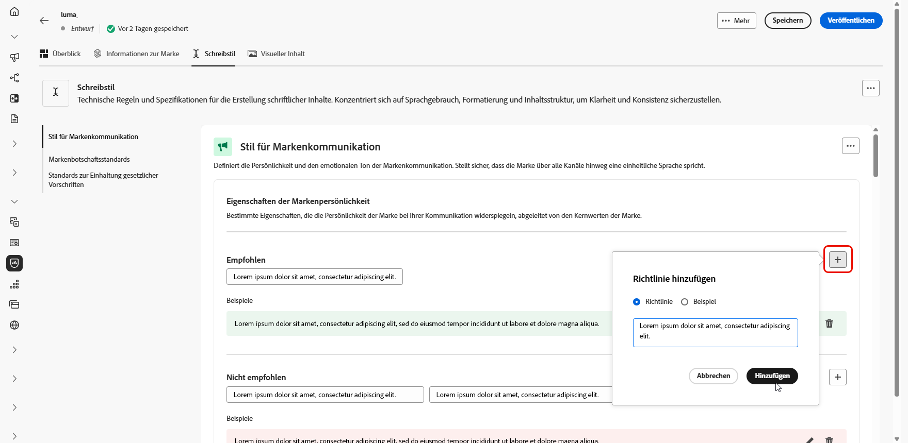

# Marken erstellen und verwalten {#brands}

>[!CONTEXTUALHELP]
>id="ajo_brand_overview"
>title="Erste Schritte mit Marken"
>abstract="Erstellen und passen Sie Ihre eigenen Marken an, um Ihre einzigartige visuelle und verbale Identität zu definieren und es gleichzeitig einfacher zu machen, Inhalte zu generieren, die dem Stil und der Stimme Ihrer Marke entsprechen."

>[!CONTEXTUALHELP]
>id="ajo_brand_ai_menu"
>title="Marke auswählen"
>abstract="Wählen Sie Ihre Marke, um sicherzustellen, dass alle KI-generierten Inhalte auf die Spezifikationen und Richtlinien Ihrer Marke zugeschnitten sind."

>[!CONTEXTUALHELP]
>id="ajo_brand_score_overview"
>title="Markenauswahl"
>abstract="Wählen Sie Ihre Marke aus, um sicherzustellen, dass Ihre Inhalte in Übereinstimmung mit den spezifischen Richtlinien, Standards und der Identität erstellt werden, wobei Konsistenz und Markenintegrität gewahrt bleiben."

>[!CONTEXTUALHELP]
>id="ajo_brand_score"
>title="Bewertung der Markenausrichtung"
>abstract="Die Bewertung Ihrer Markenausrichtung misst, wie gut Ihr Inhalt den Richtlinien Ihrer Marke entspricht, um Konsistenz in Farben, Schriftarten, Logo, Bildern und Schreibstil sicherzustellen."

>[!AVAILABILITY]
>
>Diese Funktion wird als private Betaversion veröffentlicht. Es wird in zukünftigen Versionen schrittweise für alle Kunden verfügbar sein.

Markenrichtlinien sind eine detaillierte Reihe von Regeln und Standards, die die visuelle und verbale Identität einer Marke festlegen. Sie dienen als Referenz, um eine konsistente Markendarstellung über alle Marketing- und Kommunikationsplattformen hinweg aufrechtzuerhalten.

In [!DNL Journey Optimizer] haben Sie jetzt die Möglichkeit, Ihre Markendetails manuell einzugeben und zu organisieren oder Dokumente zu Markenrichtlinien hochzuladen, um Informationen automatisch zu extrahieren.

## Zugriff auf Marken {#generative-access}

Um auf das Menü **[!UICONTROL Marken]** in [!DNL Adobe Journey Optimizer] zugreifen zu können, müssen Benutzenden die Berechtigungen **[!UICONTROL Managed Brand Kit]** oder **[!UICONTROL KI-Assistenten aktivieren]** gewährt werden. [Weitere Informationen](../administration/permissions.md)

+++  Erfahren Sie, wie Sie markenbezogene Berechtigungen zuweisen

1. Gehen Sie im Produkt **Berechtigungen** zur Registerkarte **Rollen** und wählen Sie die gewünschte **Rolle** aus.

1. Klicken Sie auf **Bearbeiten**, um die Berechtigungen zu ändern.

1. Fügen Sie die Ressource **KI-**) hinzu und wählen Sie dann **Managed Brand Kit** oder **[!UICONTROL KI-Assistent aktivieren]** aus dem Dropdown-Menü aus.

   Beachten Sie **[!UICONTROL dass die Berechtigung]** KI-Assistenten aktivieren“ nur Lesezugriff auf das Menü **[!UICONTROL Marken]** bietet.

   {zoomable="yes"}

1. Klicken Sie auf **Speichern**, um die Änderungen anzuwenden.

   Die Berechtigungen aller Benutzenden, die dieser Rolle bereits zugewiesen sind, werden automatisch aktualisiert.

1. Um diese Rolle neuen Benutzenden zuzuweisen, navigieren Sie im Dashboard **Rollen** zur Registerkarte **Benutzer** und klicken Sie auf **Benutzer hinzufügen**.

1. Geben Sie den Namen und die E-Mail-Adresse der Benutzerin oder des Benutzers ein oder wählen Sie aus der Liste aus und klicken Sie dann auf **Speichern**.

1. Wenn die Benutzerin bzw. der Benutzer vorher noch nicht erstellt wurde, lesen Sie [diese Dokumentation](https://experienceleague.adobe.com/de/docs/experience-platform/access-control/abac/permissions-ui/users).

+++

## Marke erstellen {#create-brand-kit}

>[!CONTEXTUALHELP]
>id="ajo_brands_create"
>title="Marke erstellen"
>abstract="Geben Sie Ihren Markennamen ein und laden Sie Ihre Datei mit den Markenrichtlinien hoch. Das Tool extrahiert automatisch wichtige Details, was die Pflege der Identität Ihrer Marke erleichtert."

Um Ihre Markenrichtlinien zu erstellen und zu verwalten, können Sie die Details entweder selbst eingeben oder Ihr Dokument mit den Markenrichtlinien hochladen, damit die Informationen automatisch extrahiert werden:

1. Klicken Sie im Menü **[!UICONTROL Marken]** auf **[!UICONTROL Marke erstellen]**.

   

1. Geben Sie einen **[!UICONTROL Namen]** für Ihre Marke ein.

1. Datei per Drag-and-Drop ziehen oder auswählen, um Ihre Markenrichtlinien hochzuladen und automatisch relevante Markeninformationen zu extrahieren. Klicken Sie **[!UICONTROL Marke erstellen]**.

   Der Informationsextraktionsprozess beginnt jetzt. Beachten Sie, dass dieser Vorgang mehrere Minuten dauern kann.

   

1. Ihre Standards für Inhalt und visuelle Erstellung werden jetzt automatisch ausgefüllt. Durchsuchen Sie die verschiedenen Registerkarten, um die Informationen nach Bedarf anzupassen.

1. Klicken Sie auf **[!UICONTROL Registerkarte]** Schreibstil“ auf  , um eine Richtlinie oder einen Ausschluss einschließlich Beispielen hinzuzufügen.

   

1. Klicken Sie auf der Registerkarte **[!UICONTROL Visueller]**) auf  , um eine weitere Richtlinie oder einen Ausschluss hinzuzufügen.

1. Um ein Bild hinzuzufügen, das die korrekte Verwendung zeigt, wählen Sie **[!UICONTROL Beispiel]** und klicken Sie auf **[!UICONTROL Bild auswählen]**. Sie können auch ein Bild mit falscher Verwendung als Ausschlussbeispiel hinzufügen.

   

1. Klicken Sie nach der Konfiguration auf **[!UICONTROL Speichern]** und dann auf **[!UICONTROL Veröffentlichen]**, um Ihre Markenrichtlinie im KI-Assistenten verfügbar zu machen.

1. Um Änderungen an Ihrer veröffentlichten Marke vorzunehmen, klicken Sie auf **[!UICONTROL Marke bearbeiten]**.

   >[!NOTE]
   >
   >Dadurch wird eine temporäre Kopie im Bearbeitungsmodus erstellt, die die Live-Version nach der Veröffentlichung ersetzt.

   

1. Öffnen Sie im Dashboard **[!UICONTROL Marken]** das erweiterte Menü, indem Sie auf das  klicken, um Folgendes zu tun:

   * Marke anzeigen
   * Bearbeiten
   * Duplizieren
   * Veröffentlichen Sie
   * Veröffentlichung aufheben
   * Löschen

   

Ihre Markenrichtlinien sind jetzt über die Dropdown-Liste **[!UICONTROL Marke]** im Menü KI-Assistent verfügbar, sodass Inhalte und Assets generiert werden können, die mit Ihren Spezifikationen übereinstimmen. [Weitere Informationen zum KI-Assistenten](gs-generative.md)

