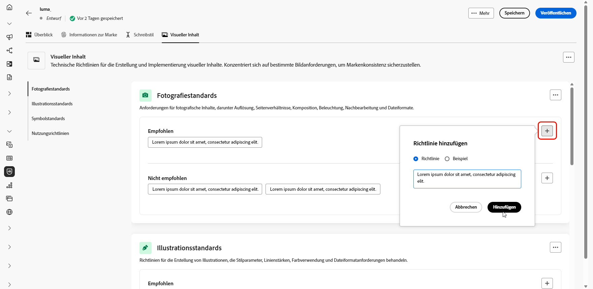

# Erstellen und Verwalten von Marken {#brands}

>[!AVAILABILITY]
>
>Diese Funktion wird als private Betaversion veröffentlicht. Es wird in zukünftigen Versionen schrittweise für alle Kunden verfügbar sein.
>

Markenrichtlinien sind eine detaillierte Reihe von Regeln und Standards, die die visuelle und verbale Identität einer Marke festlegen. Sie dienen als Referenz, um eine konsistente Markendarstellung über alle Marketing- und Kommunikationsplattformen hinweg aufrechtzuerhalten.

In Journey Optimizer haben Sie jetzt die Möglichkeit, Ihre Markendetails manuell einzugeben und zu organisieren oder Dokumente zu Markenrichtlinien hochzuladen, um die Informationen automatisch zu extrahieren.

## Zugreifen auf Marken {#generative-access}

Um auf das Markenmenü in Adobe Journey Optimizer zugreifen zu können, müssen Benutzenden die Berechtigungen **Managed Brand Kit** oder **[!UICONTROL KI-Assistenten aktivieren]** gewährt werden. [Weitere Informationen](../administration/permissions.md)

+++  Erfahren Sie, wie Sie markenbezogene Berechtigungen zuweisen

1. Gehen Sie im Produkt **Berechtigungen** zur Registerkarte **Rollen** und wählen Sie die gewünschte **Rolle** aus.

1. Klicken Sie auf **Bearbeiten**, um die Berechtigungen zu ändern.

1. Fügen Sie die Ressource **KI-**) hinzu und wählen Sie dann **Managed Brand Kit** oder **[!UICONTROL KI-Assistent aktivieren]** aus dem Dropdown-Menü aus.

   Beachten Sie **[!UICONTROL dass die Berechtigung]** KI-Assistenten aktivieren“ nur Lesezugriff auf das Menü „Marken“ bietet.

   {zoomable="yes"}

1. Klicken Sie auf **Speichern**, um die Änderungen anzuwenden.

   Die Berechtigungen aller Benutzenden, die dieser Rolle bereits zugewiesen sind, werden automatisch aktualisiert.

1. Um diese Rolle neuen Benutzenden zuzuweisen, navigieren Sie im Dashboard **Rollen** zur Registerkarte **Benutzer** und klicken Sie auf **Benutzer hinzufügen**.

1. Geben Sie den Namen und die E-Mail-Adresse der Benutzerin oder des Benutzers ein oder wählen Sie aus der Liste aus und klicken Sie dann auf **Speichern**.

1. Wenn die Benutzerin bzw. der Benutzer vorher noch nicht erstellt wurde, lesen Sie [diese Dokumentation](https://experienceleague.adobe.com/de/docs/experience-platform/access-control/abac/permissions-ui/users).

+++

## Marke erstellen {#create-brand-kit}

Um Ihre Markenrichtlinien zu erstellen und zu verwalten, können Sie die Details entweder selbst eingeben oder Ihr Dokument mit den Markenrichtlinien hochladen, damit die Informationen automatisch extrahiert werden:

1. Klicken Sie im Menü **[!UICONTROL Marken]** auf **[!UICONTROL Marke hinzufügen]**.

   

1. Geben Sie **[!UICONTROL Markenrichtlinie]** „Name“ und **[!UICONTROL &quot;]**&quot; ein.

1. Datei per Drag-and-Drop ziehen oder auswählen, um Ihre Markenrichtlinien hochzuladen und automatisch relevante Markeninformationen zu extrahieren. Klicken Sie **[!UICONTROL Marke hinzufügen]**.

   Der Informationsextraktionsprozess beginnt jetzt. Beachten Sie, dass dieser Vorgang mehrere Minuten dauern kann.

   

1. Ihre Standards für Inhalt und visuelle Erstellung werden jetzt automatisch ausgefüllt. Durchsuchen Sie die verschiedenen Registerkarten, um die Informationen nach Bedarf anzupassen.

1. Klicken Sie in **[!UICONTROL Standards zur Inhaltserstellung]** auf  , um eine weitere Richtlinie, ein Beispiel oder einen Ausschluss hinzuzufügen.

   

1. Klicken Sie **[!UICONTROL „Visuelle]**&quot; auf  , um eine weitere Richtlinie, ein Beispiel oder einen Ausschluss hinzuzufügen.

1. Um ein Bildbeispiel hinzuzufügen, klicken Sie auf **[!UICONTROL Bild auswählen]**. Sie können auch alle identifizierten falschen Einblicke hinzufügen.

   

1. Klicken Sie nach der Konfiguration auf **[!UICONTROL Speichern]** und dann **[!UICONTROL Veröffentlichen]**, um Ihre Markenrichtlinien im KI-Assistenten verfügbar zu machen.

1. Um Änderungen an Ihrer veröffentlichten Marke vorzunehmen, klicken Sie auf **[!UICONTROL Marke bearbeiten]**. Hierbei wird im Bearbeitungsmodus eine temporäre Kopie erstellt, die die Live-Version nach der Veröffentlichung ersetzt.

   

1. Öffnen Sie im Dashboard **[!UICONTROL Marken]** das erweiterte Menü, indem Sie auf das  klicken, um Folgendes zu tun:

   * Marke anzeigen
   * Bearbeiten
   * Duplizieren
   * Veröffentlichen Sie
   * Veröffentlichung aufheben
   * Löschen

   

Ihre Markenrichtlinien sind jetzt über die Dropdown-Liste Marken im Menü KI-Assistent zugänglich, sodass Inhalte und Assets generiert werden können, die mit Ihren Spezifikationen übereinstimmen. [Weitere Informationen zum KI-Assistenten](gs-generative.md)

