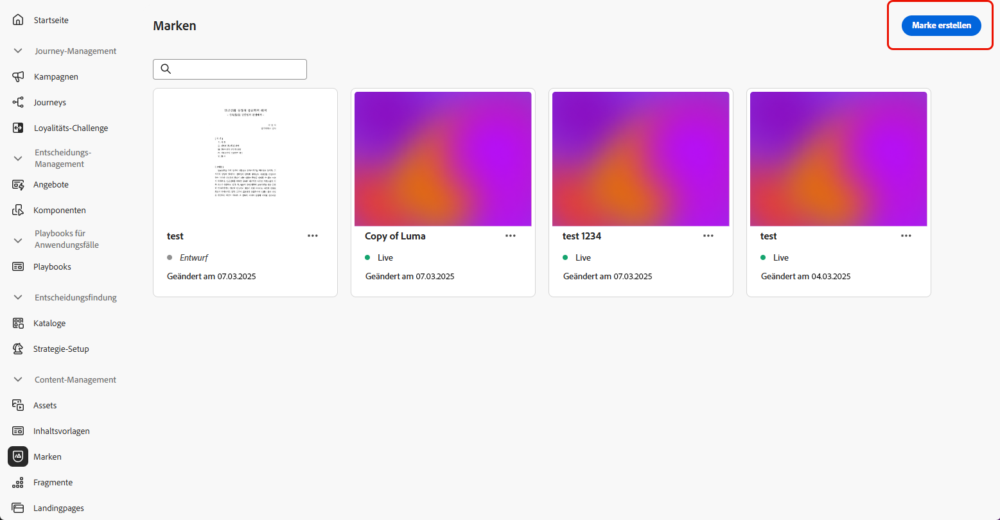
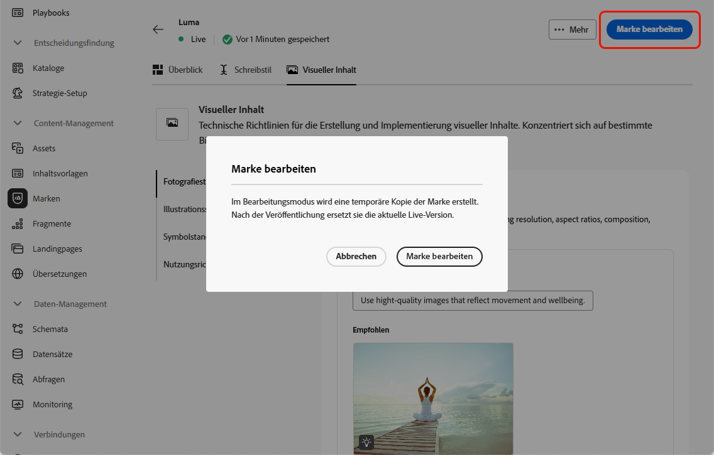

# Marken erstellen und verwalten {#brands}

>[!AVAILABILITY]
>
>Diese Funktion wird als private Betaversion veröffentlicht. Es wird in zukünftigen Versionen schrittweise für alle Kunden verfügbar sein.

Markenrichtlinien sind eine detaillierte Reihe von Regeln und Standards, die die visuelle und verbale Identität einer Marke festlegen. Sie dienen als Referenz, um eine konsistente Markendarstellung über alle Marketing- und Kommunikationsplattformen hinweg aufrechtzuerhalten.

<!--Upload feature currently behind feature flag--

In [!DNL Journey Optimizer], you now have the option to manually input and organize your brand details or upload brand guideline documents for automatic information extraction.-->

## Zugreifen auf Marken {#generative-access}

Um auf das Menü **[!UICONTROL Marken]** in [!DNL Adobe Journey Optimizer] zugreifen zu können, müssen Benutzenden die Berechtigungen **[!UICONTROL Managed Brand Kit]** oder **[!UICONTROL KI-Assistenten aktivieren]** gewährt werden. [Weitere Informationen](../administration/permissions.md)

+++  Erfahren Sie, wie Sie markenbezogene Berechtigungen zuweisen

1. Gehen Sie im Produkt **Berechtigungen** zur Registerkarte **Rollen** und wählen Sie die gewünschte **Rolle** aus.

1. Klicken Sie auf **Bearbeiten**, um die Berechtigungen zu ändern.

1. Fügen Sie die Ressource **KI-**) hinzu und wählen Sie dann **Managed Brand Kit** oder **[!UICONTROL KI-Assistent aktivieren]** aus dem Dropdown-Menü aus.

   Beachten Sie **[!UICONTROL dass die Berechtigung]** KI-Assistenten aktivieren“ nur Lesezugriff auf das Menü **[!UICONTROL Marken]** bietet.

   {zoomable="yes"}

1. Klicken Sie auf **Speichern**, um die Änderungen anzuwenden.

   Die Berechtigungen aller Benutzenden, die dieser Rolle bereits zugewiesen sind, werden automatisch aktualisiert.

1. Um diese Rolle neuen Benutzenden zuzuweisen, navigieren Sie im Dashboard **Rollen** zur Registerkarte **Benutzer** und klicken Sie auf **Benutzer hinzufügen**.

1. Geben Sie den Namen und die E-Mail-Adresse der Benutzerin oder des Benutzers ein oder wählen Sie aus der Liste aus und klicken Sie dann auf **Speichern**.

1. Wenn die Benutzerin bzw. der Benutzer vorher noch nicht erstellt wurde, lesen Sie [diese Dokumentation](https://experienceleague.adobe.com/de/docs/experience-platform/access-control/abac/permissions-ui/users).

+++

## Marke erstellen {#create-brand-kit}

Gehen Sie wie folgt vor, um Ihre Markenrichtlinien zu erstellen und zu verwalten.

<!--Upload feature currently behind feature flag--

To create and manage your Brand guideline, you can either enter the details yourself, or upload your brand guidelines document to have the information extracted automatically:-->

1. Klicken Sie im Menü **[!UICONTROL Marken]** auf **[!UICONTROL Marke erstellen]**.

   

1. Geben Sie einen **[!UICONTROL Namen]** für Ihre Marke ein<!--and a **[!UICONTROL Description]** to your brand guideline-->.

   

<!--Upload feature currently behind feature flag so hidden from doc - should be available again by EOM (Feb)--

1. Drag and drop or select your file to upload your brand guidelines and extract automatically relevant brand information. Click **[!UICONTROL Create brand]**.

    The information extraction process now begins. Note that it may take several minutes to complete.

    

1. Your Content and visual creation standards are now automatically populated. Browse through the different tabs to adapt the information as needed.

-->

1. Klicken Sie auf **[!UICONTROL Registerkarte]** Schreibstil“ auf  , um eine Richtlinie oder einen Ausschluss einschließlich Beispielen hinzuzufügen.

   

1. Klicken Sie auf der Registerkarte **[!UICONTROL Visueller]**) auf  , um eine weitere Richtlinie oder einen Ausschluss hinzuzufügen.

1. Um ein Bild hinzuzufügen, das die korrekte Verwendung zeigt, wählen Sie **[!UICONTROL Beispiel]** und klicken Sie auf **[!UICONTROL Bild auswählen]**. Sie können auch ein Bild mit falscher Verwendung als Ausschlussbeispiel hinzufügen.

   

1. Klicken Sie nach der Konfiguration auf **[!UICONTROL Speichern]** und dann auf **[!UICONTROL Veröffentlichen]**, um Ihre Markenrichtlinie im KI-Assistenten verfügbar zu machen.

1. Um Änderungen an Ihrer veröffentlichten Marke vorzunehmen, klicken Sie auf **[!UICONTROL Marke bearbeiten]**.

   >[!NOTE]
   >
   >Dadurch wird eine temporäre Kopie im Bearbeitungsmodus erstellt, die die Live-Version nach der Veröffentlichung ersetzt.

   

1. Öffnen Sie im Dashboard **[!UICONTROL Marken]** das erweiterte Menü, indem Sie auf das  klicken, um Folgendes zu tun:

   * Marke anzeigen
   * Bearbeiten
   * Duplizieren
   * Veröffentlichen Sie
   * Veröffentlichung aufheben
   * Löschen

   

Ihre Markenrichtlinien sind jetzt über die Dropdown-Liste **[!UICONTROL Marke]** im Menü KI-Assistent verfügbar, sodass Inhalte und Assets generiert werden können, die mit Ihren Spezifikationen übereinstimmen. [Weitere Informationen zum KI-Assistenten](gs-generative.md)

