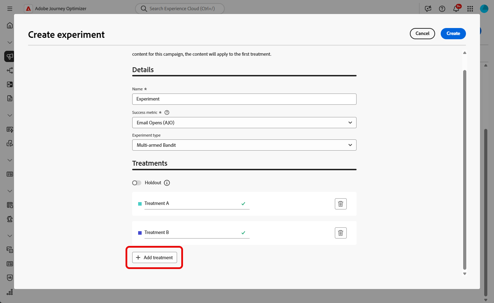

# Erstellen eines Inhaltsexperiments {#content-experiment}

>[!CONTEXTUALHELP]
>id="ajo_campaigns_content_experiment"
>title="Inhaltsexperiment"
>abstract="Sie können den Inhalt oder den Betreff der Nachricht ändern, um mehrfache Abwandlungen zu definieren und die beste Kombination für Ihre Zielgruppen zu ermitteln."

>[!NOTE]
>
>Bevor Sie mit dem Inhaltsexperiment beginnen, stellen Sie sicher, dass die Berichtskonfiguration für Ihre benutzerdefinierten Datensätze definiert ist. Weiterführende Informationen finden Sie in [diesem Abschnitt](../reports/reporting-configuration.md).

Das Inhaltsexperiment in Journey Optimizer ermöglicht es Ihnen, mehrere Versandabwandlungen zu definieren, um zu messen, welche für Ihre Zielgruppe am besten geeignet ist. Sie können den Inhalt oder den Betreff des Versands ändern. Die relevante Zielgruppe wird nach dem Zufallsprinzip jeder Abwandlung zugewiesen, um zu bestimmen, welche Abwandlung in Bezug auf die angegebene Metrik am besten funktioniert.

Im nachstehenden Beispiel wurde die Zielgruppe des Versands in zwei Gruppen aufgeteilt, die jeweils 45 % der Zielpopulation repräsentieren, und eine neutrale Gruppe von 10 %, die den Versand nicht erhalten wird.

Jede Person in der Zielgruppe erhält eine Version der E-Mail mit einer der beiden folgenden Betreffzeilen:

* In einer wird direkt ein 10-%-Angebot für die neue Kollektion beworben. Sie enthält außerdem ein Bild.
* In der anderen wird nur für ein Sonderangebot ohne Angabe des 10-%-Rabatts geworben. Sie enthält kein Bild.

Das Ziel besteht nun darin zu beobachten, welche Empfänger mit welcher E-Mail-Variante interagieren. Wir wählen daher in diesem Inhaltsexperiment **[!UICONTROL Geöffnete E-Mails]** als primäre Zielmetrik aus.

➡️ [Dieser Anwendungsfall](../experience-decisioning/experience-decisioning-uc.md) zeigt, wie Inhaltsexperimente verwendet werden, um Entscheidungen mit dem Code-basierten Erlebniskanal zu vergleichen.

## Erstellen Ihrer Inhalte {#campaign-experiment}

1. Erstellen und konfigurieren Sie zunächst Ihre [Kampagne](../campaigns/create-campaign.md) oder [Journey](../building-journeys/journeys-message.md) entsprechend Ihren Anforderungen. 

1. Beginnen Sie im Fenster **[!UICONTROL Inhalt bearbeiten]** mit der Personalisierung der Abwandlung A.

   Für diese Abwandlung geben wir das Sonderangebot direkt in der Betreffzeile an und fügen eine Personalisierung hinzu.

   

1. Erstellen oder importieren Sie Ihren ursprünglichen Inhalt und personalisieren Sie ihn nach Bedarf.

## Konfigurieren des Inhaltsexperiments {#configure-experiment}

>[!CONTEXTUALHELP]
>id="ajo_campaigns_content_experiment_dimension"
>title="Dimension"
>abstract="Wählen Sie die spezifische Dimension aus, die für Ihr Experiment nachverfolgt werden soll, z. B. spezifische Klicks oder Ansichten bestimmter Seiten."

>[!CONTEXTUALHELP]
>id="ajo_campaigns_content_experiment_success_metric"
>title="Erfolgsmetrik"
>abstract="Die Erfolgsmetrik wird verwendet, um die Abwandlung mit der besten Leistung in einem Experiment zu verfolgen und zu bewerten. Vor der Verwendung muss der Datensatz für bestimmte Metriken eingerichtet werden."

>[!AVAILABILITY]
>
>Direkt-Mail unterstützt zwar die Holdout-Funktion, derzeit jedoch keine Abwandlungen.

Für Ihr Inhaltsexperiment können Sie zwischen drei Arten von Experimenten wählen:

* **[!UICONTROL A/B-Test]**: Definieren Sie zu Beginn des Tests die Traffic-Aufspaltung zwischen Abwandlungen. Die Leistung wird anhand der von Ihnen ausgewählten primären Metrik bewertet. Experimentation Accelerator meldet dann die beobachtete Steigerung zwischen Abwandlungen.

* **[!UICONTROL Multi-Armed Bandit]**: Die Traffic-Aufspaltung zwischen Abwandlungen erfolgt automatisch. Alle 7 Tage wird die Leistung der primären Metrik überprüft und die Gewichtungen werden entsprechend angepasst. In Berichten in Experimentation Accelerator wird weiterhin die Steigerung angezeigt (wie bei A/B-Tests).

* **[!UICONTROL Bring your own Multi-Armed Bandit]**: Die Traffic-Aufspaltung zwischen Abwandlungen erfolgt automatisch. Sie können flexibel festlegen, wann und wie sie sich ändern sollte, indem Sie die Experiment-APIs nutzen, um Zuordnungen in Echtzeit anzupassen.

➡️ [Weitere Informationen über den Unterschied zwischen A/B-Tests und Multi-Armed-Bandit-Experimenten](mab-vs-ab.md)

>[!BEGINTABS]

>[!TAB A/B-Tests]

1. Wenn Ihre Nachricht personalisiert ist, klicken Sie auf der Registerkarte **[!UICONTROL Aktionen]** auf **[!UICONTROL Experiment erstellen]**, um mit der Konfiguration Ihres Inhaltsexperiments zu beginnen.

   

1. Wählen Sie die **[!UICONTROL Erfolgsmetrik]**, die Sie für Ihr Experiment festlegen möchten.

   Für unser Experiment wählen wir **[!UICONTROL E-Mail-Öffnung]**, um zu testen, ob Empfängerinnen und Empfänger ihre E-Mails öffnen, wenn sich der Promo-Code in der Betreffzeile befindet.

   

1. Beim Einrichten eines Experiments mit dem In-App- oder Web-Kanal und Auswählen der **[!UICONTROL eingehenden Klicks]**, **[!UICONTROL eindeutigen eingehenden Klicks]**, **[!UICONTROL Seitenansichten]** oder **[!UICONTROL Metriken zu individuellen Seitenansichten]** ermöglicht es Ihnen das Feld **[!UICONTROL Dimensionen]**, Klicks und Ansichten auf bestimmten Seiten genau nachzuverfolgen und zu überwachen.

   

1. Wenn Sie eine API-ausgelöste Kampagne erstellt haben, wählen Sie **[!UICONTROL A/B-Test]** aus der Dropdown-Liste **[!UICONTROL Experimenttyp]** aus.

1. Klicken Sie auf **[!UICONTROL Abwandlung hinzufügen]**, um so viele neue Abwandlungen wie nötig zu erstellen.

   

   >[!CAUTION]
   >
   >Beachten Sie beim Erstellen eines Code-basierten Experiments die folgenden Einschränkungen:
   >* **Anzahl der Behandlungen**: Die Erstellung von mehr als 3-5 Behandlungen kann zu Leistungs- und Schnittstellenproblemen führen. Wenn beim Hinzufügen von Behandlungen Fehler auftreten, reduzieren Sie die Anzahl der Behandlungen oder fügen Sie sie schrittweise hinzu, bis das Problem behoben ist.
   >* **Reservierte Keywords**: Verwenden Sie in Ihren Abwandlungsnamen keine reservierten Keywords wie „Holdout“, da dies zu Fehlern bei der Entscheidungsknotenzuordnung führen und die ordnungsgemäße Funktionsweise des Experiments verhindern kann.

1. Ändern Sie den **[!UICONTROL Titel]** Ihrer Abwandlung, um die einzelnen Abwandlungen besser unterscheiden zu können.

1. Wählen Sie aus, dass eine **[!UICONTROL neutrale]** Gruppe zu Ihrem Versand hinzugefügt werden soll. Diese Gruppe erhält keine Inhalte aus dieser Kampagne.

   Wenn Sie den Umschalter aktivieren, werden für diese Gruppe automatisch 10 % Ihrer Population genommen. Sie können diesen Prozentsatz bei Bedarf aber auch anpassen.

   >[!IMPORTANT]
   >
   >Wenn eine Holdout-Gruppe in einer Aktion für ein Inhaltsexperiment verwendet wird, gilt die Holdout-Zuweisung nur für diese spezifische Aktion. Nachdem die Aktion abgeschlossen ist, werden die Profile in der Holdout-Gruppe den Journey-Pfad fortsetzen und können Nachrichten von anderen Aktionen erhalten. Stellen Sie daher sicher, dass nachfolgende Nachrichten nicht auf den Empfang einer Nachricht durch ein Profil angewiesen sind, das sich möglicherweise in einer Holdout-Gruppe befindet. Wenn dies der Fall ist, müssen Sie die Holdout-Zuweisung möglicherweise entfernen.

   

1. Sie können dann jeder **[!UICONTROL Abwandlung]** einen bestimmten Prozentsatz zuweisen oder einfach den Umschalter **[!UICONTROL Gleichmäßig verteilen]** aktivieren.

   

1. Die Aktivierung des Experiments mit automatischer Skalierung ermöglicht die automatische Einführung der erfolgreichsten Variante Ihres Experiments. [Weitere Informationen zur Skalierung der erfolgreichsten Variante](#scale-winner)

   

1. Klicken Sie auf **[!UICONTROL Erstellen]**, wenn Ihre Konfiguration festgelegt ist.

>[!TAB Multi-Armed Bandit]

Beachten Sie, dass das Multi-Armed-Bandit-Experiment nur bei den folgenden Optionen verfügbar ist:

* Inbound-Kanäle
* Einheitliche Journeys
* API-ausgelöste Kampagnen (sowohl transaktionsbasiert als auch betrieblich)
* Outbound-Kanäle, wenn der Zeitplan wiederholt wird

1. Wenn Ihre Nachricht personalisiert ist, klicken Sie auf der Registerkarte **[!UICONTROL Aktionen]** auf **[!UICONTROL Experiment erstellen]**, um mit der Konfiguration Ihres Inhaltsexperiments zu beginnen.

   

1. Wählen Sie die **[!UICONTROL Erfolgsmetrik]**, die Sie für Ihr Experiment festlegen möchten.

   Für unser Experiment wählen wir **[!UICONTROL E-Mail-Öffnung]**, um zu testen, ob Empfängerinnen und Empfänger ihre E-Mails öffnen, wenn sich der Promo-Code in der Betreffzeile befindet.

   

1. Wenn Sie eine API-ausgelöste Kampagne erstellt haben, wählen Sie **[!UICONTROL Multi-Armed Bandit]** aus der Dropdown-Liste **[!UICONTROL Experimenttyp]** aus.

   

1. Klicken Sie auf **[!UICONTROL Abwandlung hinzufügen]**, um so viele neue Abwandlungen wie nötig zu erstellen.

   

1. Ändern Sie den **[!UICONTROL Titel]** Ihrer Abwandlung, um die einzelnen Abwandlungen besser unterscheiden zu können.

1. Wählen Sie aus, dass eine **[!UICONTROL neutrale]** Gruppe zu Ihrem Versand hinzugefügt werden soll. Diese Gruppe erhält keine Inhalte aus dieser Kampagne.

   Wenn Sie den Umschalter aktivieren, werden für diese Gruppe automatisch 10 % Ihrer Population genommen. Sie können diesen Prozentsatz bei Bedarf aber auch anpassen.

   >[!IMPORTANT]
   >
   >Wenn eine Holdout-Gruppe in einer Aktion für ein Inhaltsexperiment verwendet wird, gilt die Holdout-Zuweisung nur für diese spezifische Aktion. Nachdem die Aktion abgeschlossen ist, werden die Profile in der Holdout-Gruppe den Journey-Pfad fortsetzen und können Nachrichten von anderen Aktionen erhalten. Stellen Sie daher sicher, dass nachfolgende Nachrichten nicht auf den Empfang einer Nachricht durch ein Profil angewiesen sind, das sich möglicherweise in einer Holdout-Gruppe befindet. Wenn dies der Fall ist, müssen Sie die Holdout-Zuweisung möglicherweise entfernen.

   

>[!TAB Bring your own Multi-Armed Bandit]

Beachten Sie, dass das Experiment „Bring your own Multi-Armed Bandit“ nur bei den folgenden Optionen verfügbar ist:

* Inbound-Kanäle
* Einheitliche Journeys
* API-ausgelöste Kampagnen (sowohl transaktionsbasiert als auch betrieblich)
* Outbound-Kanäle, wenn der Zeitplan wiederholt wird

1. Wenn Ihre Nachricht personalisiert ist, klicken Sie auf der Registerkarte **[!UICONTROL Aktionen]** auf **[!UICONTROL Experiment erstellen]**, um mit der Konfiguration Ihres Inhaltsexperiments zu beginnen.

   

1. Wählen Sie die **[!UICONTROL Erfolgsmetrik]**, die Sie für Ihr Experiment festlegen möchten.

   Für unser Experiment wählen wir **[!UICONTROL E-Mail-Öffnung]**, um zu testen, ob Empfängerinnen und Empfänger ihre E-Mails öffnen, wenn sich der Promo-Code in der Betreffzeile befindet.

   

1. Wenn Sie eine API-ausgelöste Kampagne erstellt haben, wählen Sie **[!UICONTROL Bring your own Multi-Armed Bandit]** aus der Dropdown-Liste **[!UICONTROL Experimenttyp]** aus.

   

1. Klicken Sie auf **[!UICONTROL Abwandlung hinzufügen]**, um so viele neue Abwandlungen wie nötig zu erstellen.

   

1. Ändern Sie den **[!UICONTROL Titel]** Ihrer Abwandlung, um die einzelnen Abwandlungen besser unterscheiden zu können.

1. Wählen Sie aus, dass eine **[!UICONTROL neutrale]** Gruppe zu Ihrem Versand hinzugefügt werden soll. Diese Gruppe erhält keine Inhalte aus dieser Kampagne.

   Wenn Sie den Umschalter aktivieren, werden für diese Gruppe automatisch 10 % Ihrer Population genommen. Sie können diesen Prozentsatz bei Bedarf aber auch anpassen.

   >[!IMPORTANT]
   >
   >Wenn eine Holdout-Gruppe in einer Aktion für ein Inhaltsexperiment verwendet wird, gilt die Holdout-Zuweisung nur für diese spezifische Aktion. Nachdem die Aktion abgeschlossen ist, werden die Profile in der Holdout-Gruppe den Journey-Pfad fortsetzen und können Nachrichten von anderen Aktionen erhalten. Stellen Sie daher sicher, dass nachfolgende Nachrichten nicht auf den Empfang einer Nachricht durch ein Profil angewiesen sind, das sich möglicherweise in einer Holdout-Gruppe befindet. Wenn dies der Fall ist, müssen Sie die Holdout-Zuweisung möglicherweise entfernen.

   

>[!ENDTABS]

## Richten Sie das Design Ihrer Abwandlungen ein {#treatment-experiment}

1. Wählen Sie im Fenster **[!UICONTROL Inhalt bearbeiten]** Ihre Abwandlung B aus, um den Inhalt zu ändern.

   Hier wird das Angebot nicht in der **[!UICONTROL Betreffzeile]** angegeben.

   

1. Klicken Sie auf **[!UICONTROL E-Mail-Text bearbeiten]**, um Ihre Abwandlung B weiter zu personalisieren.

   

1. Nachdem Sie Ihre Abwandlungen entworfen haben, klicken Sie auf **[!UICONTROL Weitere Aktionen]**, um auf die Optionen für Ihre Abwandlungen zuzugreifen: **[!UICONTROL Umbenennen]**, **[!UICONTROL Duplizieren]** und **[!UICONTROL Löschen]**.

   

1. Rufen Sie bei Bedarf das Menü **[!UICONTROL Experimenteinstellungen]** auf, um Ihre Abwandlungskonfigurationen zu ändern.

   

1. Sobald Sie den Inhalt Ihrer Nachricht definiert haben, klicken Sie auf die Schaltfläche **[!UICONTROL Inhalt simulieren]**, um das Rendering Ihres Versands zu kontrollieren und die Personalisierungseinstellungen mit Testprofilen zu überprüfen. [Weitere Informationen](../content-management/preview-test.md)

Nach der Konfiguration Ihrer Experimente können Sie mit dem Bericht den Erfolg Ihres Versands verfolgen. [Weitere Informationen](../reports/campaign-global-report-cja-experimentation.md)

## Skalieren der erfolgreichsten Variante {#scale-winner}

>[!AVAILABILITY]
>
>Die Funktion zum Skalieren der erfolgreichsten Variante wird derzeit für die folgenden Kanäle unterstützt:
>
>* Inbound-Kanäle (z. B. Web, In-App-Nachricht, Code-basiertes Erlebnis) in einer beliebigen Journey oder Kampagne.
>* Outbound-Kanäle (z B. E-Mail, Push-Benachrichtigung, SMS) in API-ausgelösten Transaktionskampagnen.

Mit der Funktion zum Skalieren der erfolgreichsten Variante können Sie die erfolgreichste Variante eines Experiments automatisch oder manuell für Ihre gesamte Zielgruppe einführen. Diese Funktion stellt sicher, dass die Reichweite und Effektivität der erfolgreichsten Variante gesteigert wird, ohne das Experiment ständig überwachen zu müssen.

Zwei Modi stehen zur Auswahl:

* **Automatische Skalierung**: Beim Erstellen des Experiments werden die Einstellungen für die automatische Skalierung konfiguriert, entweder durch die Auswahl des Zeitpunkts und der Bedingungen für die Skalierung der erfolgreichsten Abwandlung oder einer Fallback-Option, falls keine erfolgreichste Abwandlung ermittelt wird.

* **Manuelle Skalierung** Die Experimentergebnisse werden manuell überprüft und der Rollout der erfolgreichsten Abwandlung wird mit vollständiger Kontrolle über Zeitpunkt und Entscheidungen initiiert.

### Automatische Skalierung {#autoscaling}

Bei der automatischen Skalierung legen vordefinierte Regeln fest, wann die erfolgreichste Abwandlung oder die Fallback-Option basierend auf den Ergebnissen des Experiments eingeführt wird.

Nach der automatischen Skalierung ist die manuelle Skalierung nicht mehr verfügbar.

Aktivieren der automatische Skalierung in Experimenten:

1. Richten Sie die Kampagne oder Journey ein und konfigurieren Sie das Experiment nach Bedarf. [Weitere Informationen](#configure-experiment)

1. Aktivieren Sie bei der Einrichtung des Experiments die Option der automatischen Skalierung.

   

1. Wählen Sie aus, wann die erfolgreichste Abwandlung skaliert werden soll:

   * Sobald die erfolgreichste Abwandlung gefunden ist.
   * Nachdem das Experiment für einen bestimmten Zeitraum live ist.

   Die automatische Skalierung muss vor dem Enddatum des Experiments geplant werden. Wenn sie auf einen Zeitpunkt nach dem Enddatum festgelegt ist, wird eine Validierungswarnung angezeigt und die Kampagne oder Journey wird nicht veröffentlicht.

   

1. Auswählen des Fallback-Verhaltens, wenn nach der Skalierungszeit keine erfolgreichste Abwandlung gefunden wird:

   * Setzen Sie das Experiment bis zum Ende planmäßig fort.
   * Skalieren Sie die alternative Abwandlung nach einer bestimmten Zeit.

Sobald alle Parameter erfüllt sind, wird die erfolgreichste oder die alternative Abwandlung an die Zielgruppe gesendet.

### Manuelle Skalierung {#manual-scaling}

Mit der manuellen Skalierung können Sie die Experimentergebnisse überprüfen und entscheiden, wann die erfolgreichste Abwandlung nach Ihrem eigenen Zeitplan eingeführt werden soll.

Beachten Sie, dass die automatische Skalierung abgebrochen wird, wenn die erfolgreichste Abwandlung vor der geplanten Zeit der automatischen Skalierung manuell skaliert wird.

Manuelles Skalieren der erfolgreichsten Abwandlung des Experiments:

1. Richten Sie die Kampagne oder Journey ein und konfigurieren Sie das Experiment nach Bedarf. [Weitere Informationen](#configure-experiment)

1. Das Experiment muss laufen, bis eine erfolgreichste Abwandlung identifiziert oder statistische Signifikanz erreicht wird.

1. Öffnen Sie das Kampagnen-Dashboard oder wählen Sie die Kanalaktivität der Journey aus.

   Überprüfen Sie die Ergebnisse im Menü **[!UICONTROL Inhaltsexperiment]**, um die Abwandlung mit der besten Leistung zu identifizieren.

   

1. Klicken Sie auf **[!UICONTROL Abwandlung skalieren]**, um die erfolgreichste Abwandlung an die restliche Zielgruppe zu senden.

   

1. Wählen Sie die zu skalierenden Abwandlung aus dem Dropdown-Menü aus und klicken Sie auf **[!UICONTROL Skalieren]**.

   

Beachten Sie, dass die Skalierung der Abwandlung bis zu einer Stunde dauern kann. Nach Abschluss des manuellen Skalierungsprozess erhalten Sie eine Benachrichtigung.

