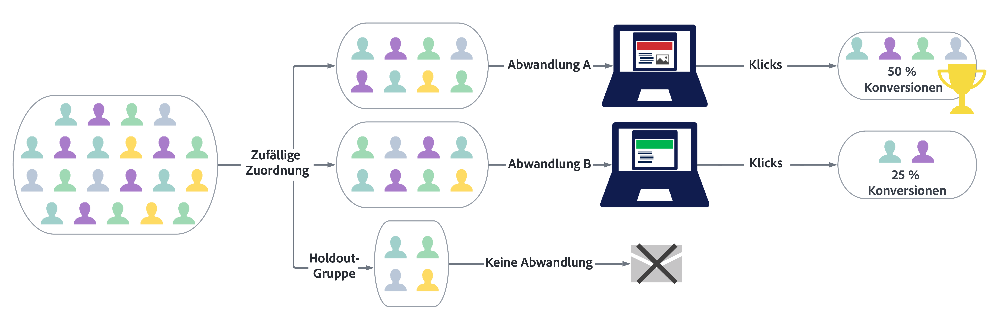
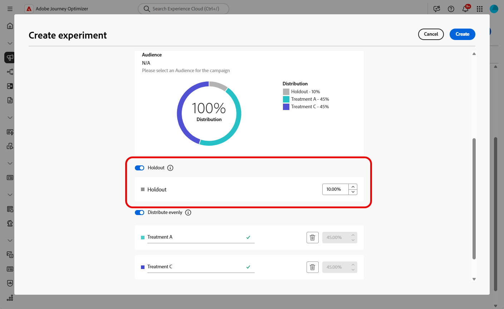

# Erstellen eines Inhaltsexperiments {#content-experiment}

>[!CONTEXTUALHELP]
>id="ajo_campaigns_content_experiment"
>title="Inhaltsexperiment"
>abstract="Sie können den Nachrichteninhalt oder den Betreff variieren, um mehrere Varianten zu definieren und die beste Kombination für Ihre Audiences zu ermitteln."

>[!NOTE]
>
>Bevor Sie mit dem Inhaltsexperiment beginnen, stellen Sie sicher, dass die Berichtskonfiguration für Ihre benutzerdefinierten Datensätze definiert ist. Weiterführende Informationen finden Sie in [diesem Abschnitt](../reports/reporting-configuration.md).

Das Journey Optimizer-Inhaltsexperiment ermöglicht es Ihnen, mehrere Versandabwandlungen zu definieren, um zu messen, welche für Ihre Zielgruppe am besten geeignet ist. Sie können Inhalt oder Betreff des Versands variieren. Die Zielgruppe wird nach dem Zufallsprinzip jeder Abwandlung zugewiesen, um zu bestimmen, welche Abwandlung in Bezug auf die angegebene Metrik am besten funktioniert.

Im nachstehenden Beispiel wurde die Zielgruppe des Versands in zwei Gruppen aufgeteilt, die jeweils 45 % der Zielpopulation repräsentieren, und eine neutrale Gruppe von 10 %, die den Versand nicht erhalten wird.

Jede Person in der Zielgruppe erhält eine Version der E-Mail mit einer der beiden folgenden Betreffzeilen:

* In einer wird direkt ein 10-%-Angebot für die neue Kollektion beworben. Sie enthält außerdem ein Bild.
* In der anderen wird nur für ein Sonderangebot ohne Angabe des 10-%-Rabatts geworben. Sie enthält kein Bild.

Das Ziel besteht nun darin zu beobachten, welche Empfänger mit welcher E-Mail-Variante interagieren. Wir wählen daher in diesem Inhaltsexperiment **[!UICONTROL Geöffnete E-Mails]** als primäre Zielmetrik aus.

➡️ In [diesem Anwendungsfall](../experience-decisioning/experience-decisioning-uc.md) erfahren Sie, wie Sie mithilfe von Inhaltsexperimenten Entscheidungen mit dem Code-basierten Erlebniskanal vergleichen.

## Erstellen Ihrer Inhalte {#campaign-experiment}

1. Erstellen und konfigurieren Sie zunächst Ihre [Kampagne](../campaigns/create-campaign.md) oder [Journey](../building-journeys/journeys-message.md) entsprechend Ihren Anforderungen. 

1. Beginnen Sie im Fenster **[!UICONTROL Inhalt bearbeiten]** mit der Personalisierung der Abwandlung A.

   Für diese Abwandlung geben wir das Sonderangebot direkt in der Betreffzeile an und fügen eine Personalisierung hinzu.

   

1. Erstellen oder importieren Sie Ihren ursprünglichen Inhalt und personalisieren Sie ihn nach Bedarf.

## Konfigurieren des Inhaltsexperiments {#configure-experiment}

>[!CONTEXTUALHELP]
>id="ajo_campaigns_content_experiment_dimension"
>title="Dimension"
>abstract="Wählen Sie die spezifische Dimension aus, die für Ihr Experiment nachverfolgt werden soll, z. B. spezifische Klicks oder Ansichten bestimmter Seiten."

>[!CONTEXTUALHELP]
>id="ajo_campaigns_content_experiment_success_metric"
>title="Erfolgsmetrik"
>abstract="Die Erfolgsmetrik wird verwendet, um die Abwandlung mit der besten Leistung in einem Experiment zu verfolgen und zu bewerten. Vor der Verwendung muss der Datensatz für bestimmte Metriken eingerichtet werden."

1. Wenn Ihre Nachricht personalisiert ist, klicken Sie auf der Übersichtsseite der Kampagne auf **[!UICONTROL Experiment erstellen]**, um mit der Konfiguration Ihres Inhaltsexperiments zu beginnen.

   

1. Wählen Sie die **[!UICONTROL Erfolgsmetrik]**, die Sie für Ihr Experiment festlegen möchten.

   Für unser Experiment wählen wir **[!UICONTROL E-Mail-Öffnung]**, um zu testen, ob Empfängerinnen und Empfänger ihre E-Mails öffnen, wenn sich der Promo-Code in der Betreffzeile befindet.

   

1. Beim Einrichten eines Experiments mit dem In-App- oder Web-Kanal und Auswählen der **[!UICONTROL eingehenden Klicks]**, **[!UICONTROL eindeutigen eingehenden Klicks]**, **[!UICONTROL Seitenansichten]** oder **[!UICONTROL Metriken zu individuellen Seitenansichten]** ermöglicht es Ihnen das Dropdown-Menü **[!UICONTROL Klickaktion]**, Klicks und Ansichten auf bestimmten Seiten genau nachzuverfolgen und zu überwachen.

   

1. Klicken Sie auf **[!UICONTROL Abwandlung hinzufügen]**, um so viele neue Abwandlungen wie nötig zu erstellen.

   

1. Ändern Sie den **[!UICONTROL Titel]** Ihrer Abwandlung, um die einzelnen Abwandlungen besser unterscheiden zu können.

1. Wählen Sie aus, dass eine **[!UICONTROL neutrale]** Gruppe zu Ihrem Versand hinzugefügt werden soll. Diese Gruppe erhält keine Inhalte aus dieser Kampagne.

   Wenn Sie den Umschalter aktivieren, werden für diese Gruppe automatisch 10 % Ihrer Population genommen. Sie können diesen Prozentsatz bei Bedarf aber auch anpassen.

   >[!IMPORTANT]
   >
   >Wenn eine Holdout-Gruppe in einer Aktion für ein Inhaltsexperiment verwendet wird, gilt die Holdout-Zuweisung nur für diese spezifische Aktion. Nachdem die Aktion abgeschlossen ist, werden die Profile in der Holdout-Gruppe den Journey-Pfad fortsetzen und können Nachrichten von anderen Aktionen erhalten. Stellen Sie daher sicher, dass nachfolgende Nachrichten nicht auf den Empfang einer Nachricht durch ein Profil angewiesen sind, das sich möglicherweise in einer Holdout-Gruppe befindet. Wenn dies der Fall ist, müssen Sie die Holdout-Zuweisung möglicherweise entfernen.

   

1. Sie können dann jeder **[!UICONTROL Abwandlung]** einen bestimmten Prozentsatz zuweisen oder einfach den Umschalter **[!UICONTROL Gleichmäßig verteilen]** aktivieren.

   

1. Klicken Sie auf **[!UICONTROL Erstellen]**, wenn Ihre Konfiguration festgelegt ist.

## Richten Sie das Design Ihrer Abwandlungen ein {#treatment-experiment}

1. Wählen Sie im Fenster **[!UICONTROL Inhalt bearbeiten]** Ihre Abwandlung B aus, um den Inhalt zu ändern.

   Hier wird das Angebot nicht in der **[!UICONTROL Betreffzeile]** angegeben.

   

1. Klicken Sie auf **[!UICONTROL E-Mail-Text bearbeiten]**, um Ihre Abwandlung B weiter zu personalisieren.

   

1. Nachdem Sie Ihre Abwandlungen entworfen haben, klicken Sie auf **[!UICONTROL Weitere Aktionen]**, um auf die Optionen für Ihre Abwandlungen zuzugreifen: **[!UICONTROL Umbenennen]**, **[!UICONTROL Duplizieren]** und **[!UICONTROL Löschen]**.

   

1. Rufen Sie bei Bedarf das Menü **[!UICONTROL Experimenteinstellungen]** auf, um Ihre Abwandlungskonfigurationen zu ändern.

   

1. Sobald Sie den Inhalt Ihrer Nachricht definiert haben, klicken Sie auf die Schaltfläche **[!UICONTROL Inhalt simulieren]**, um das Rendering Ihres Versands zu kontrollieren und die Personalisierungseinstellungen mit Testprofilen zu überprüfen. [Weitere Informationen](../content-management/preview-test.md)

Nach der Konfiguration Ihrer Experimente können Sie mit dem Bericht den Erfolg Ihres Versands verfolgen. [Weitere Informationen](../reports/campaign-global-report-cja-experimentation.md)

