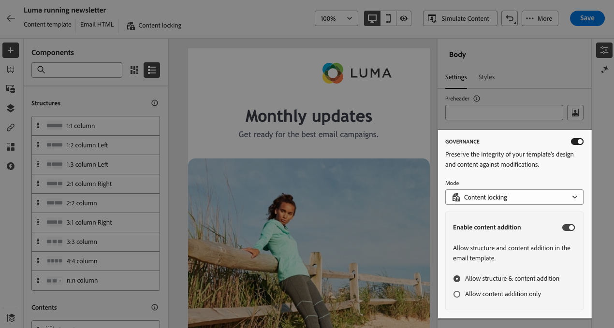
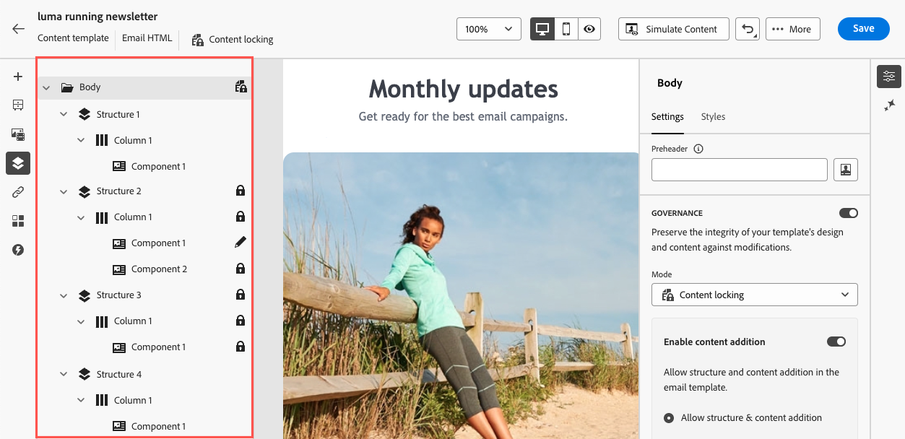

# Inhalt in E-Mail-Vorlagen sperren {#lock-content-email-templates}

Mit Journey Optimizer können Sie Inhalte in E-Mail-Vorlagen sperren, indem Sie entweder die gesamte Vorlage oder bestimmte Strukturen und Komponenten sperren. Auf diese Weise können Sie unbeabsichtigte Bearbeitungen oder Löschungen verhindern, sodass Sie das Anpassen von Vorlagen besser steuern und die Effizienz sowie Zuverlässigkeit Ihrer E-Mail-Kampagnen optimieren können.

>[!AVAILABILITY]
>
>Benutzer mit der Berechtigung zum Erstellen von Inhaltsvorlagen können die Sperrung aktivieren.

Die Inhaltssperrung kann entweder auf Ebene **Struktur** oder auf Ebene **Komponente** angewendet werden. Im Folgenden finden Sie die wichtigsten Prinzipale, die auf Struktur- und Komponentenebene beim Sperren von Inhalten in Ihrer Vorlage angewendet werden.

* Wenn eine Struktur gesperrt ist:

   * Alle Inhalte in dieser Struktur sind ebenfalls standardmäßig gesperrt.
   * Der Struktur kann kein Inhalt hinzugefügt werden.
   * Standardmäßig können Sie die Struktur nicht löschen. Sie können diese Einschränkung überschreiben, indem Sie die Option &quot;Löschen zulassen&quot;aktivieren.
   * Einzelne Inhaltskomponenten innerhalb der gesperrten Struktur können als bearbeitbar festgelegt werden.

* Wenn eine Struktur bearbeitbar ist (Struktur nicht gesperrt):

   * Einzelne Inhaltskomponenten können innerhalb dieser Struktur gesperrt werden.
   * Eine Komponente kann standardmäßig nicht gelöscht werden, wenn sie gesperrt ist oder die Option &quot;Nur bearbeitbarer Inhalt&quot; ausgewählt ist. Sie können diese Einschränkung überschreiben, indem Sie die Option &quot;Löschen zulassen&quot;aktivieren.

## E-Mail-Vorlage sperren {#define}

### Inhaltssperrung aktivieren {#enable}

Sie können die Inhaltssperrung für eine E-Mail-Vorlage direkt in der E-Mail-Designer aktivieren, unabhängig davon, ob Sie eine neue Vorlage erstellen oder eine vorhandene bearbeiten. Führen Sie folgende Schritte aus:

1. Öffnen oder erstellen Sie eine E-Mail-Vorlage und greifen Sie in Email Designer auf den Bildschirm zur Inhaltsbearbeitung zu.

1. Aktivieren Sie im Bereich **[!UICONTROL Hauptteil]** auf der rechten Seite die Option **[!UICONTROL Governance]** .

1. Wählen Sie in der Dropdownliste **[!UICONTROL Modus]** den gewünschten Sperrmodus für die Vorlage aus:

   * **[!UICONTROL Sperren des Inhalts]**: Sperrt bestimmte Abschnitte des Inhalts in der Vorlage. Standardmäßig können alle Strukturen und Komponenten bearbeitet werden. Sie können dann einzelne Elemente selektiv sperren.
   * **[!UICONTROL Schreibgeschützt]**: Sperrt den gesamten Inhalt der Vorlage, verhindert Änderungen.

   

1. Wenn Sie den Modus **[!UICONTROL Inhaltssperrung]** ausgewählt haben, können Sie weiter definieren, wie Benutzer mit der Vorlage interagieren können. Schalten Sie die Option **[!UICONTROL Inhaltsbearbeitung aktivieren]** ein und wählen Sie eine der folgenden Optionen:

   * **[!UICONTROL Hinzufügen von Struktur und Inhalt zulassen]**: Benutzer können Strukturen zwischen vorhandenen Strukturen hinzufügen und Inhaltskomponenten oder Fragmente in bearbeitbaren Strukturen hinzufügen.

   * **[!UICONTROL Nur Inhaltszusatz zulassen]**: Benutzer können Inhaltskomponenten oder Fragmente innerhalb bearbeitbarer Strukturen hinzufügen, aber keine Strukturen hinzufügen oder duplizieren.

1. Nach Auswahl des Sperrmodus können Sie festlegen, welche Strukturen und/oder Komponenten gesperrt werden sollen, wenn Sie den Modus **[!UICONTROL Sperren von Inhalten]** ausgewählt haben:

   * [Erfahren Sie, wie Sie Strukturen sperren](#lock-structures)
   * [Erfahren Sie, wie Sie Komponenten sperren](#lock-components)

   Wenn Sie den Modus **[!UICONTROL Schreibgeschützt]** auswählen, können Sie mit der Fertigstellung und Speicherung Ihrer Vorlage wie gewohnt fortfahren.

Sie können die Einstellungen für **[!UICONTROL Governance]** jederzeit beim Entwerfen Ihrer Vorlage anpassen, indem Sie den Vorlagentext auswählen. Klicken Sie dazu in der Navigationsleiste oben im rechten Fensterbereich auf den Link **[!UICONTROL Hauptteil]** .

### Sperren von Strukturen {#lock-structures}

So sperren Sie eine Struktur in Ihrer Vorlage:

1. Wählen Sie die Struktur aus, die Sie sperren möchten.

1. Wählen Sie in der Dropdownliste **[!UICONTROL Sperrtyp]** die Option **[!UICONTROL Gesperrt]** aus.

   

   >[!NOTE]
   >
   >Standardmäßig können Benutzer gesperrte Strukturen nicht löschen. Sie können diese Einschränkung überschreiben, indem Sie die Option **[!UICONTROL Löschen zulassen]** aktivieren.

Nach dem Sperren einer Struktur können keine weiteren Inhaltskomponenten oder -fragmente dupliziert oder darin hinzugefügt werden. Alle Komponenten innerhalb einer gesperrten Struktur sind ebenfalls standardmäßig gesperrt. So bearbeiten Sie eine Komponente in einer gesperrten Struktur:

1. Wählen Sie die Komponente aus, die Sie entsperren möchten.

1. Schalten Sie die Option **[!UICONTROL Spezifisches Sperren verwenden]** ein.

1. Wählen Sie in der Dropdownliste **[!UICONTROL Sperrtyp]** die Option **[!UICONTROL Bearbeitbar]** aus. Um die Inhaltsbearbeitung beim Sperren von Stilen zu ermöglichen, wählen Sie **[!UICONTROL Nur bearbeitbarer Inhalt]** aus. [Erfahren Sie, wie Sie Komponenten sperren](#lock-components)

   

### Komponenten sperren {#lock-components}

So sperren Sie eine bestimmte Komponente in einer Struktur:

1. Wählen Sie die Komponente aus und aktivieren Sie im rechten Bereich die Option **[!UICONTROL Spezifisches Sperren verwenden]** .

1. Wählen Sie in der Dropdownliste **[!UICONTROL Sperrtyp]** Ihre bevorzugte Sperroption aus:

   

   * **[!UICONTROL Nur bearbeitbare Inhaltssperre]**: Sperrt die Stile der Komponente, ermöglicht jedoch die Inhaltsbearbeitung.
   * **[!UICONTROL Gesperrt]**: Vollständig sperren Sie Inhalt und Stile der Komponente.

   >[!NOTE]
   >
   >Mit dem Sperrtyp **[!UICONTROL Bearbeitbar]** können Benutzer eine Komponente bearbeiten, selbst innerhalb einer gesperrten Struktur. [Erfahren Sie, wie Sie Strukturen sperren](#lock-structures)

1. Standardmäßig können Benutzer gesperrte Komponenten nicht löschen. Sie können das Löschen aktivieren, indem Sie die Option **[!UICONTROL Löschen zulassen]** aktivieren.

### Ermitteln gesperrter Inhalte {#identify}

Verwenden Sie den Navigationsbaum **[!UICONTROL im Menü auf der linken Seite, um gesperrte Strukturen und Komponenten in Ihrer Vorlage einfach zu identifizieren.]** Dieses Menü bietet eine visuelle Übersicht über alle Vorlagenelemente, indem gesperrte Elemente mit einem Sperrsymbol markiert und bearbeitbare Elemente mit einem Bleistiftsymbol bearbeitet werden.

Im folgenden Beispiel ist Governance für den Vorlagentext aktiviert. *Struktur 2* ist mit *Komponente 1* bearbeitbar gesperrt, während *Struktur 3* vollständig gesperrt ist.

## Verwenden von Vorlagen mit gesperrten Inhalten {#use}

Bei Verwendung einer Vorlage mit gesperrtem Inhalt wird im rechten Bereich die Meldung **[!UICONTROL Für Governance aktiviert]** angezeigt.

Je nach Typ der auf die Vorlage angewendeten Sperrung können Sie verschiedene Aktionen für die Strukturen und Komponenten der Vorlage ausführen. Um alle bearbeitbaren Bereiche in der Vorlage schnell zu identifizieren, aktivieren Sie die Optionen **[!UICONTROL Bearbeitbare Bereiche markieren]** .

In der folgenden Vorlage können beispielsweise alle Bereiche bearbeitet werden, mit Ausnahme des obersten Bildes, das gesperrt wurde. Das bedeutet, dass Sie es weder bearbeiten noch entfernen können.

Detaillierte Informationen zu den verschiedenen Arten der Sperre, die angewendet werden können, finden Sie in diesen Abschnitten:

* [Sperren von Strukturen](#lock-structures)
* [Komponenten sperren](#lock-components)

Im Folgenden finden Sie einige Beispiele für die Bearbeitung von E-Mails und die zugehörige Konfiguration für die Sperrung von Inhalten, die eingerichtet wurde:

| Content-Sperrtyp | Vorlagenkonfiguration | E-Mail-Bearbeitung |
| ------- | ------- | ------- |
| Schreibgeschützte Inhaltsvorlage | {zoomable="yes"} | {zoomable="yes"} |
| Vollständiger Inhalt kann bearbeitet werden, Benutzer können jedoch keine Struktur oder Komponente hinzufügen | {zoomable="yes"} | {zoomable="yes"} |
| Gesperrte Struktur, die nicht gelöscht werden kann | {zoomable="yes"} | {zoomable="yes"} |
| Komponente mit gesperrten Stilen, die nicht gelöscht werden können. Benutzer können nur den Inhalt ändern. | {zoomable="yes"} | {zoomable="yes"} |
| Bearbeitbare Komponente innerhalb einer gesperrten Struktur. | {zoomable="yes"} | {zoomable="yes"} |
