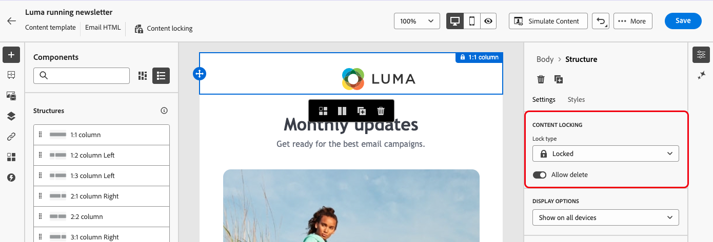

# Sperren von Inhalten in E-Mail-Vorlagen {#lock-content-email-templates}

>[!CONTEXTUALHELP]
>id="ajo_locking_governance"
>title="Governance"
>abstract="Aktivieren Sie Governance, um Inhalte in der Vorlage zu sperren, entweder durch Sperren der gesamten Vorlage oder durch Sperren bestimmter Strukturen und Komponenten. Auf diese Weise können Sie unbeabsichtigte Bearbeitungen oder Löschungen verhindern, sodass Sie das Anpassen von Vorlagen besser steuern und die Effizienz sowie Zuverlässigkeit Ihrer E-Mail-Kampagnen optimieren können."

>[!CONTEXTUALHELP]
>id="ajo_locking_mode"
>title="Modus"
>abstract="Wählen Sie den gewünschten Sperrmodus für die Vorlage aus. Mit **Inhaltssperre** können Sie bestimmte Inhaltsabschnitte in der Vorlage sperren. Mit der Funktion **Schreibgeschützt** können Sie den gesamten Inhalt der Vorlage sperren, um Änderungen zu vermeiden."

>[!CONTEXTUALHELP]
>id="ajo_locking_content_addition"
>title="Aktivieren von Inhaltszusätzen"
>abstract="Schalten Sie diese Option ein, um festzulegen, wie Benutzende mit der Vorlage interagieren können. Wählen Sie **Hinzufügen von Struktur und Inhalten zulassen** aus, damit Benutzende Strukturen zwischen vorhandenen Strukturen und Inhaltskomponenten oder Fragmente in bearbeitbaren Strukturen hinzufügen können. Mit **Nur Hinzufügen von Inhalten zulassen** können Benutzende Inhaltskomponenten oder Fragmente in bearbeitbaren Strukturen hinzufügen, ohne Strukturen hinzufügen oder duplizieren zu können."

>[!CONTEXTUALHELP]
>id="ajo_email_locking_activated"
>title="Governance aktiviert"
>abstract="Die Inhaltssperre ist aktiviert und verhindert Änderungen."

>[!CONTEXTUALHELP]
>id="ajo_email_locking_read_only"
>title="Schreibgeschützt"
>abstract="Dieser Inhalt befindet sich im schreibgeschützten Modus und kann nicht geändert werden."

Journey Optimizer ermöglicht es, Inhalte in E-Mail-Vorlagen zu sperren, entweder durch Sperren der gesamten Vorlage oder durch Sperren bestimmter Strukturen und Komponenten. Auf diese Weise werden unbeabsichtigte Bearbeitungen oder Löschungen verhindert, sodass Sie das Anpassen von Vorlagen besser steuern und die Effizienz sowie Zuverlässigkeit Ihrer E-Mail-Kampagnen optimieren können.

>[!IMPORTANT]
>
>Die Inhaltssperre ist eine Funktion auf Editor-Ebene für Autorinnen und Autoren und garantiert nicht, dass der Inhalt beim Importieren oder Erstellen über das API unbearbeitet bleibt.

Die Inhaltssperre kann entweder auf **Struktur**- oder **Komponentenebene** angewendet werden. Im Folgenden werden die wichtigsten Prinzipien beschrieben, die auf Struktur- und Komponentenebene beim Sperren von Inhalten in Ihrer Vorlage gelten:

* Wenn eine Struktur gesperrt ist:

   * Alle Inhalte in dieser Struktur sind ebenfalls standardmäßig gesperrt.
   * Der Struktur kann kein Inhalt hinzugefügt werden.
   * Standardmäßig können Sie die Struktur nicht löschen. Sie können diese Einschränkung überschreiben, indem Sie die Option „Löschen zulassen“ aktivieren.
   * Einzelne Inhaltskomponenten innerhalb der gesperrten Struktur können als bearbeitbar festgelegt werden.

* Wenn eine Struktur bearbeitbar ist (Struktur nicht gesperrt):

   * Einzelne Inhaltskomponenten können innerhalb dieser Struktur gesperrt werden.
   * Eine Komponente kann standardmäßig nicht gelöscht werden, wenn sie gesperrt ist oder die Option „Nur Sperre für bearbeitbare Inhalte“ ausgewählt ist. Sie können diese Einschränkung überschreiben, indem Sie die Option „Löschen zulassen“ aktivieren.

>[!AVAILABILITY]
>
>Benutzende mit der Berechtigung zum Erstellen von Inhaltsvorlagen können die Inhaltssperre aktivieren.

➡️ [Funktion im Video kennenlernen](#video)

## Sperren einer E-Mail-Vorlage {#define}

### Aktivieren der Inhaltssperre {#enable}

Sie können die Inhaltssperre für eine E-Mail-Vorlage direkt im E-Mail-Designer aktivieren, unabhängig davon, ob Sie eine neue Vorlage erstellen oder eine vorhandene bearbeiten. Führen Sie folgende Schritte aus:

1. Öffnen oder erstellen Sie eine E-Mail-Vorlage und rufen Sie im E-Mail-Designer den Bildschirm zur Inhaltsbearbeitung auf.

1. Aktivieren Sie im Bereich **[!UICONTROL Hauptteil]** auf der rechten Seite die Option **[!UICONTROL Governance]**.

1. Wählen Sie in der Dropdown-Liste **[!UICONTROL Modus]** den gewünschten Sperrmodus für die Vorlage aus:

   * **[!UICONTROL Inhaltssperre]**: Sperrt bestimmte Abschnitte des Inhalts in der Vorlage. Standardmäßig können alle Strukturen und Komponenten bearbeitbar werden. Sie können dann einzelne Elemente selektiv sperren.
   * **[!UICONTROL Schreibgeschützt]**: Sperrt den gesamten Inhalt der Vorlage, um Änderungen zu vermeiden.

   

1. Wenn Sie den Modus **[!UICONTROL Inhaltssperre]** ausgewählt haben, können Sie weiter definieren, wie Benutzende mit der Vorlage interagieren können. Aktivieren Sie die Option **[!UICONTROL Inhaltsbearbeitung aktivieren]** und wählen Sie eine der folgenden Optionen:

   * **[!UICONTROL Hinzufügen von Struktur und Inhalten zulassen]**: Benutzende können Strukturen zwischen vorhandenen Strukturen hinzufügen und Inhaltskomponenten oder Fragmente in bearbeitbaren Strukturen hinzufügen.

   * **[!UICONTROL Nur Hinzufügen von Inhalten zulassen]**: Benutzende können Inhaltskomponenten oder Fragmente innerhalb bearbeitbarer Strukturen hinzufügen, aber keine Strukturen hinzufügen oder duplizieren.

1. Nach Auswahl des Sperrmodus können Sie festlegen, welche Strukturen und/oder Komponenten gesperrt werden sollen, wenn Sie den Modus **[!UICONTROL Inhaltssperre]** ausgewählt haben:

   * [Erfahren Sie, wie Sie Strukturen sperren.](#lock-structures)
   * [Erfahren Sie, wie Sie Komponenten sperren.](#lock-components)

   Wenn Sie den Modus **[!UICONTROL Schreibgeschützt]** auswählen, stellen Sie Ihre Vorlage wie gewohnt fertig und speichern Sie sie.

Sie können die Einstellungen für **[!UICONTROL Governance]** jederzeit beim Entwerfen Ihrer Vorlage anpassen, indem Sie den Hauptteil der Vorlage auswählen. Klicken Sie dazu in der Navigationsleiste oben im rechten Bereich auf die Verknüpfung **[!UICONTROL Hauptteil]**.

### Sperren von Strukturen {#lock-structures}

>[!CONTEXTUALHELP]
>id="ajo_locking_structure"
>title="Inhaltssperre in Struktur"
>abstract="Um die Struktur in der Vorlage zu sperren, wählen Sie **Gesperrt** aus dem Dropdown-Menü **Sperrtyp** aus. Standardmäßig können Benutzende gesperrte Strukturen nicht löschen. Sie können diese Einschränkung überschreiben, indem Sie die Option **[!UICONTROL Löschen zulassen]** aktivieren."

So sperren Sie eine Struktur in Ihrer Vorlage:

1. Wählen Sie die Struktur aus, die gesperrt werden soll.

1. Wählen Sie in der Dropdown-Liste **[!UICONTROL Art der Sperre]** die Option **[!UICONTROL Gesperrt]** aus.

   

   >[!NOTE]
   >
   >Standardmäßig können Benutzende gesperrte Strukturen nicht löschen. Sie können diese Einschränkung überschreiben, indem Sie die Option **[!UICONTROL Löschen zulassen]** aktivieren.

Nach dem Sperren einer Struktur können keine weiteren Inhaltskomponenten oder -fragmente dupliziert oder darin hinzugefügt werden. Alle Komponenten innerhalb einer gesperrten Struktur sind ebenfalls standardmäßig gesperrt. So legen Sie eine Komponente in einer gesperrten Struktur als bearbeitbar fest:

1. Wählen Sie die Komponente aus, die entsperrt werden soll.

1. Aktivieren Sie die Option **[!UICONTROL Spezifische Sperre verwenden]**.

1. Wählen Sie in der Dropdownliste **[!UICONTROL Art der Sperre]** die Option **[!UICONTROL Bearbeitbar]** aus. Um das Bearbeiten von Inhalten beim Sperren von Stilen zu ermöglichen, wählen Sie **[!UICONTROL Nur bearbeitbare Inhalte]** aus. [Informationen zum Sperren von Komponenten](#lock-components)

   

### Sperren von Komponenten {#lock-components}

>[!CONTEXTUALHELP]
>id="ajo_locking_component"
>title="Verwenden der spezifischen Sperre in der Komponente"
>abstract="Um die Komponente in der Vorlage zu sperren, aktivieren Sie die Option **Spezifische Sperre verwenden**. Wählen Sie im Dropdown-Menü **[!UICONTROL Sperrtyp]** Ihre bevorzugte Sperroption aus: **Nur bearbeitbare Inhalte** ermöglicht es, die Stile der Komponente zu sperren, lässt jedoch die Inhaltsbearbeitung zu, während **Gesperrt** sowohl den Inhalt als auch die Stile der Komponente vollständig sperrt."

So sperren Sie eine bestimmte Komponente in einer Struktur:

1. Wählen Sie die Komponente aus und aktivieren Sie im rechten Bereich die Option **[!UICONTROL Spezifische Sperre verwenden]**.

1. Wählen Sie in der Dropdown-Liste **[!UICONTROL Art der Sperre]** Ihre bevorzugte Sperroption aus:

   

   * **[!UICONTROL Nur bearbeitbare Inhalte]**: Sperrt die Stile der Komponente, ermöglicht jedoch die Inhaltsbearbeitung.
   * **[!UICONTROL Gesperrt]**: Sperrt den Inhalt und die Stile der Komponente vollständig.

   >[!NOTE]
   >
   >Mit derSperre **[!UICONTROL Bearbeitbar]** können Benutzende eine Komponente selbst dann bearbeiten, wenn sich diese innerhalb einer gesperrten Struktur befindet. [Informationen zum Sperren von Strukturen](#lock-structures)

1. Standardmäßig können Benutzende gesperrte Komponenten nicht löschen. Sie können das Löschen aktivieren, indem Sie die Option **[!UICONTROL Löschen zulassen]** aktivieren.

### Identifizieren gesperrter Inhalte {#identify}

Verwenden Sie den **[!UICONTROL Navigationsbaum]** im Menü auf der linken Seite, um gesperrte Strukturen und Komponenten in Ihrer Vorlage einfach zu identifizieren. Dieses Menü bietet einen visuellen Überblick über alle Vorlagenelemente, indem gesperrte Elemente mit einem Sperrsymbol und bearbeitbare Elemente mit einem Bleistiftsymbol markiert sind.

Im folgenden Beispiel ist „Governance“ für den Vorlagentext aktiviert. *Struktur 2* ist gesperrt, wobei *Komponente 1* bearbeitbar ist, während *Struktur 3* vollständig gesperrt ist.

## Verwenden von Vorlagen mit gesperrten Inhalten {#use}

>[!CONTEXTUALHELP]
>id="ajo_email_editable_areas"
>title="Markieren bearbeitbarer Bereiche"
>abstract="Je nachdem, welche Art der Sperrung auf die Vorlage angewendet ist, können Sie verschiedene Aktionen für die Strukturen und Komponenten der Vorlage ausführen. Um alle bearbeitbaren Bereiche in der Vorlage schnell zu identifizieren, schalten Sie die Option **[!UICONTROL Bearbeitbare Bereiche markieren]** ein."

Bei Verwendung einer Vorlage mit gesperrtem Inhalt wird im rechten Bereich eine Meldung angezeigt.

Je nachdem, welche Art der Sperrung auf die Vorlage angewendet ist, können Sie verschiedene Aktionen für die Strukturen und Komponenten der Vorlage ausführen. Um alle bearbeitbaren Bereiche in der Vorlage schnell zu identifizieren, schalten Sie die Option **[!UICONTROL Bearbeitbare Bereiche markieren]** ein.

In der folgenden Vorlage können beispielsweise alle Bereiche bearbeitet werden, mit Ausnahme des obersten Bildes, das gesperrt wurde. Das bedeutet, dass Sie es weder bearbeiten noch entfernen können.

Ausführliche Informationen zu den verschiedenen Arten von Sperren, die angewendet werden können, sind in diesen Abschnitten verfügbar:

* [Sperren von Strukturen](#lock-structures)
* [Sperren von Komponenten](#lock-components)

Hier finden Sie einige Beispiele für die Bearbeitung von E-Mails und die zugehörigen Konfigurationen für das Sperren von Inhalten, die eingerichtet wurden:

| Art der Inhaltssperre | Vorlagenkonfiguration | Bearbeitung von E-Mails |
| ------- | ------- | ------- |
| Schreibgeschützte Inhaltsvorlage | {zoomable="yes"} | {zoomable="yes"} |
| Der gesamte Inhalt kann bearbeitet werden, aber Benutzende können keine Struktur oder Komponente hinzufügen. | {zoomable="yes"} | {zoomable="yes"} |
| Gesperrte Struktur, die nicht gelöscht werden kann | {zoomable="yes"} | {zoomable="yes"} |
| Komponente mit gesperrten Stilen, die nicht gelöscht werden können. Benutzende können nur den Inhalt ändern. | {zoomable="yes"} | {zoomable="yes"} |
| Bearbeitbare Komponente innerhalb einer gesperrten Struktur. | {zoomable="yes"} | {zoomable="yes"} |

## Anleitungsvideo {#video}

Erfahren Sie, wie Sie Inhalte in E-Mail-Vorlagen sperren.

>[!VIDEO](https://video.tv.adobe.com/v/3451591?quality=12)
