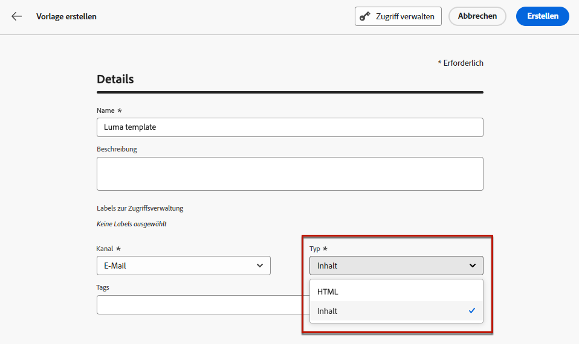

# Arbeiten mit Inhaltsvorlagen {#content-templates}

Für einen beschleunigten und verbesserten Design-Prozess können Sie eigenständige Vorlagen erstellen, um benutzerdefinierte Inhalte in [!DNL Journey Optimizer]-Kampagnen und -Journeys einfach wiederzuverwenden.

Diese Funktion ermöglicht inhaltsorientierten Benutzenden die Arbeit an Vorlagen außerhalb von Kampagnen oder Journeys. Personen, die Marketing betreiben, können diese eigenständigen Inhaltsvorlagen dann in ihren eigenen Journeys oder Kampagnen wiederverwenden und anpassen.

<!---->

>[!NOTE]
>
>Derzeit sind keine Inhaltsvorlagen für den Web-Kanal verfügbar.

Zum Beispiel: Eine Person in Ihrem Unternehmen ist nur für Inhalte zuständig und hat daher keinen Zugriff auf Kampagnen oder Journeys. Diese Person kann jedoch eine E-Mail-Vorlage erstellen, die die Marketing-Fachleute Ihrer Organisation für die Verwendung in allen E-Mails als Ausgangspunkt auswählen können.

Sie können Inhaltsvorlagen auch mithilfe von APIs erstellen und verwalten. Weiterführende Informationen finden Sie in der [Dokumentation zu Journey Optimizer-APIs](https://developer.adobe.com/journey-optimizer-apis/references/content/){target="_blank"}.

➡️ [Erfahren Sie in diesem Video, wie Sie Vorlagen definieren und verwenden](#video-templates).

>[!CAUTION]
>
>Zum Erstellen, Bearbeiten und Löschen von Inhaltsvorlagen benötigen Sie die Berechtigung **[!DNL Manage library items]** im **[!DNL Content Library Manager]**-Produktprofil. [Weitere Informationen](../administration/ootb-product-profiles.md#content-library-manager)

## Zugreifen auf und Verwalten von Vorlagen {#access-manage-templates}

Um auf die Liste der Inhaltsvorlagen zuzugreifen, wählen Sie **[!UICONTROL Content-Management]** > **[!UICONTROL Inhaltsvorlagen]** aus dem linken Menü aus.

Es werden alle Vorlagen angezeigt, die in der aktuellen Sandbox erstellt wurden (entweder aus einer Journey oder einer Kampagne mithilfe der Option **[!UICONTROL Als Vorlage speichern]**, oder aus dem Menü **[!UICONTROL Inhaltsvorlagen]**). [Erfahren Sie, wie Sie Vorlagen erstellen.](#create-content-templates)

Inhaltsvorlagen können nach folgenden Kriterien sortiert werden:
* Typ
* Kanal
* Erstellungs- oder Änderungsdatum
* Tags – [Weitere Informationen zu Tags](../start/search-filter-categorize.md#tags)

Sie können auch festlegen, dass nur die von Ihnen erstellten oder geänderten Elemente angezeigt werden.

* Um einen Vorlageninhalt zu bearbeiten, klicken Sie in der Liste auf das gewünschte Element und wählen Sie **[!UICONTROL Inhalt bearbeiten]** aus.

  

* Um eine Vorlage zu löschen, klicken Sie neben der gewünschten Vorlage auf die Schaltfläche **[!UICONTROL Weitere Aktionen]** und wählen Sie **[!UICONTROL Löschen]** aus.

  

>[!NOTE]
>
>Wenn eine Vorlage bearbeitet oder gelöscht wird, sind Kampagnen oder Journeys, einschließlich mit dieser Vorlage erstellter Inhalte, nicht betroffen.

### Vorlagen als Miniaturansichten anzeigen {#template-thumbnails}

Wählen Sie die **[!UICONTROL Rasteransicht]** -Modus, um jede Vorlage als Miniaturansicht anzuzeigen.

>[!AVAILABILITY]
>
>Diese Funktion wird mit begrenzter Verfügbarkeit (Limited Availability, LA) für eine kleine Gruppe von Kundinnen und Kunden veröffentlicht.

>[!NOTE]
>
>Derzeit können geeignete Miniaturansichten nur für E-Mail-Inhaltsvorlagen vom Typ HTML erstellt werden.

Wenn Sie einen Inhalt aktualisieren, müssen Sie möglicherweise einige Sekunden warten, bis die Änderungen in der Miniaturansicht angezeigt werden.

## Erstellen von Inhaltsvorlagen {#create-content-templates}

>[!CONTEXTUALHELP]
>id="ajo_create_template"
>title="Eigene Inhaltsvorlage definieren"
>abstract="Erstellen Sie eine komplett neue, benutzerdefinierte Vorlage, damit Sie Ihre Inhalte für mehrere Journeys und Kampagnen wiederverwenden können."

Es gibt zwei Möglichkeiten, Inhaltsvorlagen zu erstellen:

* Erstellen Sie eine neue Inhaltsvorlage mithilfe des Menüs **[!UICONTROL Inhaltsvorlagen]** in der linken Leiste. [Weitere Informationen](#create-template-from-scratch)

* Speichern Sie den Inhalt bei der Inhaltsgestaltung innerhalb einer Kampagne oder einer Journey als Vorlage. [Weitere Informationen](#save-as-template)

Nach der Speicherung ist Ihre Inhaltsvorlage für Kampagnen oder Journeys verfügbar. Unabhängig davon, ob sie von Grund auf neu oder aus vorherigen Inhalten erstellt wurden, können Sie diese Vorlage jetzt beim Erstellen von Inhalten in [!DNL Journey Optimizer] verwenden. [Weitere Informationen](#use-content-templates)

>[!NOTE]
>
>* Änderungen an Inhaltsvorlagen werden nicht an Kampagnen oder Journeys weitergegeben, unabhängig davon, ob sie live oder als Entwurf vorliegen.
>
>* Wenn Vorlagen in einer Kampagne oder einer Journey verwendet werden, wirken sich Änderungen am Kampagnen- und Journey-Inhalt ebenso nicht auf die zuvor verwendete Inhaltsvorlage aus.

### Erstellen einer Vorlage von Grund auf {#create-template-from-scratch}

Gehen Sie wie folgt vor, um eine Inhaltsvorlage von Grund auf zu erstellen.

1. Greifen Sie über das linke Menü **[!UICONTROL Content-Management]** > **[!UICONTROL Inhaltsvorlagen]** auf die Inhaltsvorlagenliste zu.

1. Wählen Sie **[!UICONTROL Vorlage erstellen]** aus.

1. Füllen Sie die Vorlagendetails aus und wählen Sie den gewünschten Kanal aus.

   

   >[!NOTE]
   >
   >Derzeit sind alle Kanäle außer Web verfügbar.

1. Wählen Sie einen **[!UICONTROL Typ]** für den ausgewählten Kanal.

   

   * Wenn Sie für **[!UICONTROL E-Mail]** die Option **[!UICONTROL Inhalt]** auswählen, können Sie den [Betreff](../email/create-email.md#define-email-content) als Teil Ihrer Vorlage definieren. Wenn Sie **[!UICONTROL HTML]** auswählen, können Sie nur den Inhalt des E-Mail-Texts definieren.

   * Für **[!UICONTROL SMS]**, **[!UICONTROL Push]**, **[!UICONTROL In-App]** und **[!UICONTROL Briefpost]** ist nur der Standardtyp für den aktuellen Kanal verfügbar. Trotzdem müssen Sie ihn auswählen.

1. Wählen oder erstellen Sie Adobe Experience Platform-Tags im Feld **[!UICONTROL Tags]**, um Ihre Vorlage für eine verbesserte Suche zu kategorisieren. [Weitere Informationen](../start/search-filter-categorize.md#tags)

1. Um der Vorlage benutzerdefinierte oder grundlegende Datennutzungskennzeichnungen zuzuweisen, können Sie **[!UICONTROL Zugriff verwalten]** auswählen. [Weitere Informationen zur Zugriffssteuerung auf Objektebene (OLAC)](../administration/object-based-access.md).

1. Klicken Sie auf **[!UICONTROL Erstellen]** und gestalten Sie den Inhalt nach Bedarf so wie bei jedem Inhalt innerhalb einer Journey oder Kampagne, je nach ausgewähltem Kanal.

   

   In den folgenden Abschnitten erfahren Sie, wie Sie Inhalte für die verschiedenen Kanäle erstellen:
   * [Definieren von E-Mail-Inhalten](../email/get-started-email-design.md)
   * [Definieren von Push-Inhalten](../push/design-push.md)
   * [Definieren von SMS-Inhalten](../sms/create-sms.md#sms-content)
   * [Definieren von Briefpost-Inhalten](../direct-mail/create-direct-mail.md)
   * [Definieren von In-App-Inhalten](../in-app/design-in-app.md)

1. Wenn Sie eine **[!UICONTROL E-Mail]**-Vorlage mit dem Typ **[!UICONTROL HTML]** erstellen, können Sie den Inhalt testen. [Weitere Informationen](#test-template)

1. Sobald Ihre Vorlage fertig ist, klicken Sie auf **[!UICONTROL Speichern]**.

1. Klicken Sie auf den Pfeil neben dem Vorlagennamen, um zum Bildschirm **[!UICONTROL Details]** zurückzukehren.

   

Diese Vorlage kann nun beim Erstellen von Inhalten in [!DNL Journey Optimizer] verwendet werden. [Weitere Informationen](#use-content-templates)

### Als Vorlage speichern {#save-as-template}

>[!CONTEXTUALHELP]
>id="ajo_messages_depecrated_inventory"
>title="Hier erfahren Sie, wie Sie Ihre Nachrichten migrieren können"
>abstract="Seit dem 25. Juli 2022 wird das Nachrichtenmenü nicht mehr angezeigt. Nachrichten werden nun direkt von einer Journey aus verfasst. Wenn Sie Ihre alten Nachrichten in Journeys wiederverwenden möchten, müssen Sie sie als Vorlagen speichern."

Beim Gestalten von Inhalten in einer Kampagne oder Journey können Sie diesen für die spätere Wiederverwendung speichern. Gehen Sie dazu wie folgt vor.

1. Klicken Sie im Nachrichtenbildschirm **[!UICONTROL Inhalt bearbeiten]** auf die Schaltfläche **[!UICONTROL Inhaltsvorlage]**.

1. Wählen Sie im Dropdown-Menü **[!UICONTROL Als Inhaltsvorlage speichern]** aus.

   

   In [E-Mail-Designer](../email/get-started-email-design.md) können Sie diese Option auch über die Dropdown-Liste **[!UICONTROL Mehr]** oben rechts auf dem Bildschirm auswählen.

   

1. Fügen Sie dieser Vorlage einen Beschriftung hinzu.

   

   >[!NOTE]
   >
   >Der aktuelle Kanal und der aktuelle Typ werden automatisch ausgefüllt und können nicht bearbeitet werden. Für E-Mail-Vorlagen, die mit [E-Mail-Designer](../email/get-started-email-design.md) erstellt wurden, wird der Typ **[!UICONTROL HTML]** automatisch ausgewählt.

1. Wählen oder erstellen Sie ein Adobe Experience Platform-Tag im Feld **Tags**, um Ihre Vorlage zu kategorisieren. [Weitere Informationen](../start/search-filter-categorize.md#tags)

1. Um der Vorlage benutzerdefinierte oder grundlegende Datennutzungskennzeichnungen zuzuweisen, können Sie **[!UICONTROL Zugriff verwalten]** auswählen. [Weitere Informationen](../administration/object-based-access.md).

1. Klicken Sie auf **[!UICONTROL Speichern]**.

1. Die Vorlage wird auf der Liste der **[!UICONTROL Inhaltsvorlagen]** gespeichert, auf die über das dedizierte [!DNL Journey Optimizer]-Menü zugegriffen werden kann. Sie wird zu einer eigenständigen Inhaltsvorlage, auf die wie jedes andere Element in der Liste zugegriffen werden kann und die bearbeitet und gelöscht werden kann. [Weitere Informationen](#access-manage-templates)

Sie können diese Vorlage nun beim Erstellen von Inhalten in [!DNL Journey Optimizer] verwenden. [Weitere Informationen](#use-content-templates)

>[!NOTE]
>
>Änderungen an dieser neuen Vorlage werden nicht an den Inhalt weitergegeben, von dem sie stammen. Wenn der ursprüngliche Inhalt innerhalb dieses Inhalts bearbeitet wird, wird die neue Vorlage ebenfalls nicht geändert.

## Testen von E-Mail-Inhaltsvorlagen {#test-template}

Sie können das Rendering einiger Ihrer E-Mail-Vorlagen testen, unabhängig davon, ob diese von Grund auf neu oder aus vorhandenen Inhalten erstellt wurde. Gehen Sie dazu wie folgt vor.

>[!CAUTION]
>
>Derzeit können Inhaltsvorlagen nur für **[!UICONTROL E-Mail]**-Vorlagen vom Typ **[!UICONTROL HTML]** getestet werden.

1. Rufen Sie die Inhaltsvorlagenliste über das Menü **[!UICONTROL Content-Management]** > **[!UICONTROL Inhaltsvorlagen]** auf und wählen Sie eine beliebige E-Mail-Vorlage aus.

1. Klicken Sie in den **[!UICONTROL Vorlageneigenschaften]** auf **[!UICONTROL Inhalt bearbeiten]**.

1. Klicken Sie auf **[!UICONTROL Inhalt simulieren]** und wählen Sie ein Testprofil aus, um Ihr Rendering zu überprüfen. [Weitere Informationen](../content-management/preview-test.md)

   

1. Sie können einen Testversand durchführen, um Ihren Inhalt zu testen und ihn von einigen internen Benutzern genehmigen zu lassen, bevor Sie ihn in einer Journey oder Kampagne verwenden.

   * Klicken Sie dazu auf die Schaltfläche **[!UICONTROL Testversand durchführen]** und folgen Sie den Schritten, die in [diesem Abschnitt](../content-management/proofs.md) beschrieben werden.

   * Vor dem Testversand müssen Sie die [E-Mail-Oberfläche](../configuration/channel-surfaces.md) auswählen, die zum Testen Ihres Inhalts verwendet wird.

     

>[!CAUTION]
>
>Derzeit wird Tracking beim Testen von E-Mail-Inhaltsvorlagen nicht unterstützt, d. h. die Nachverfolgung von Ereignissen, UTM-Parametern und Landingpage-Links ist in den Testsendungen, die von einer Vorlage gesendet werden, nicht wirksam. Um Tracking zu testen, [verwenden Sie die Inhaltsvorlage](../email/use-email-templates.md) in einer E-Mail und [führen Sie einen Testversand durch](../content-management/preview-test.md#send-proofs).

## Verwenden von Inhaltsvorlagen {#use-content-templates}

Beim Erstellen von Inhalten für einen beliebigen Kanal (außer Web) in [!DNL Journey Optimizer] können Sie eine benutzerdefinierte Vorlage verwenden, die Sie entweder:

* von Grund auf mit dem Menü **[!UICONTROL Inhaltsvorlagen]** erstellt haben. [Weitere Informationen](#create-template-from-scratch)

* oder mithilfe der Option **[!UICONTROL Als Inhaltsvorlage speichern]** aus vorhandenem Inhalt in einer Journey oder einer Kampagne gespeichert haben. [Weitere Informationen](#save-as-template)

Gehen Sie wie folgt vor, um mit der Erstellung Ihres Inhalts mit einer dieser Vorlagen zu beginnen.

1. Klicken Sie auf die Schaltfläche **[!UICONTROL Inhaltsvorlage]**, nachdem Sie in einer Kampagne oder Journey die Option **[!UICONTROL Inhalt bearbeiten]** ausgewählt haben.

1. Wählen Sie **[!UICONTROL Inhaltsvorlage anwenden]** aus.

   

1. Wählen Sie die gewünschte Vorlage aus der Liste aus. Es werden nur Vorlagen angezeigt, die mit dem ausgewählten Kanal und/oder Typ kompatibel sind.

   

   >[!NOTE]
   >
   >Von diesem Bildschirm aus können Sie auch eine neue Vorlage erstellen, indem Sie die entsprechende Schaltfläche verwenden und dadurch eine neue Registerkarte aufrufen.

1. Klicken Sie auf **[!UICONTROL Bestätigen]**. Die Vorlage wird auf Ihren Inhalt angewendet.

1. Bearbeiten Sie den Inhalt nach Bedarf weiter.

>[!NOTE]
>
>Um eine E-Mail anhand einer Inhaltsvorlage mit [E-Mail-Designer](../email/get-started-email-design.md) zu gestalten, folgen Sie den in [diesem Abschnitt](../email/use-email-templates.md) beschriebenen Schritten.

## Anleitungsvideo {#video-templates}

Erfahren Sie, wie Sie Inhaltsvorlagen in [!DNL Journey Optimizer] erstellen, bearbeiten und verwenden.

>[!VIDEO](https://video.tv.adobe.com/v/3413743/?quality=12)
