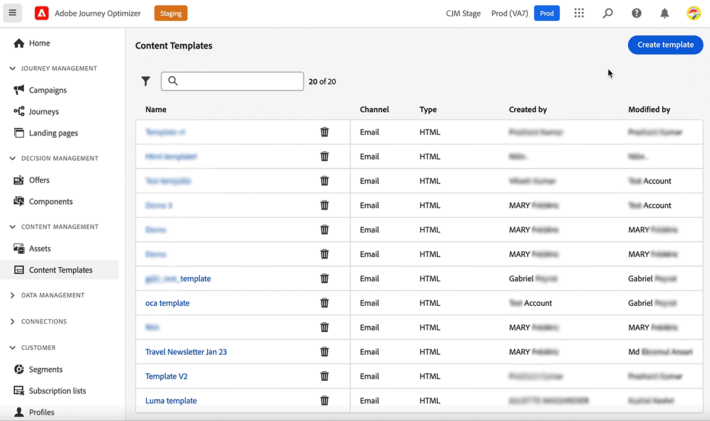

# Erste Schritte mit Inhaltsvorlagen {#content-templates}

>[!BEGINSHADEBOX]

**Auf dieser Seite:** Erste Schritte mit Inhaltsvorlagen, um eigenständige, wiederverwendbare Inhalte für die Kanäle E-Mail, Push, In-App, SMS und Briefpost zu erstellen, die Marketing-Experten in Kampagnen und Journey in Adobe Journey Optimizer wiederverwenden können.

>[!ENDSHADEBOX]

>[!NOTE]
>
>Seit März 2025 werden HTML-Inhaltsvorlagen nicht mehr unterstützt. Sie können weiterhin vorhandene HTML-Inhaltsvorlagen verwenden, die zuvor in [!DNL Journey Optimizer] erstellt wurden.

Zur Beschleunigung und Verbesserung des Design-Prozesses können Sie eigenständige Vorlagen erstellen, um benutzerdefinierte Inhalte in [!DNL Journey Optimizer]-Kampagnen und -Journeys einfach wiederzuverwenden.

Diese Funktion ermöglicht inhaltsorientierten Benutzenden die Arbeit an Vorlagen außerhalb von Kampagnen oder Journeys. Personen, die Marketing betreiben, können diese eigenständigen Inhaltsvorlagen dann in ihren eigenen Journeys oder Kampagnen wiederverwenden und anpassen.

<!---->

Nehmen wir als Beispiel an, dass eine Person in Ihrem Unternehmen nur für Inhalte zuständig ist und keinen Zugriff auf Kampagnen oder Journeys hat. Diese Person kann eine E-Mail-Vorlage erstellen, die die Marketing-Fachleute Ihres Unternehmens als Ausgangspunkt für alle E-Mails auswählen können.

Sie können Inhaltsvorlagen für die E-Mail-, Push-, In-App-, SMS- und Direkt-Mail-Kanäle erstellen.

>[!AVAILABILITY]
>
>Derzeit sind keine Inhaltsvorlagen für den Web-Kanal verfügbar.

Stellen Sie sicher, dass Sie zum Erstellen, Bearbeiten und Löschen von Inhaltsvorlagen über die Berechtigung **[!DNL Manage library items]** im **[!DNL Content Library Manager]**-Produktprofil verfügen. [Weitere Informationen](../administration/ootb-product-profiles.md#content-library-manager)

➡️ [In diesem Video erfahren Sie, wie Sie Vorlagen erstellen und verwenden](#video-templates)

>[!NOTE]
>
>Sie können Inhaltsvorlagen auch mithilfe von APIs erstellen und verwalten. Weitere Informationen finden Sie in der [API-Dokumentation zu Journey Optimizer](https://developer.adobe.com/journey-optimizer-apis/references/content){target="_blank"}.

## Anleitungsvideo {#video-templates}

Erfahren Sie, wie Sie Inhaltsvorlagen in [!DNL Journey Optimizer] erstellen, bearbeiten und verwenden.

>[!VIDEO](https://video.tv.adobe.com/v/3413743/?quality=12)
