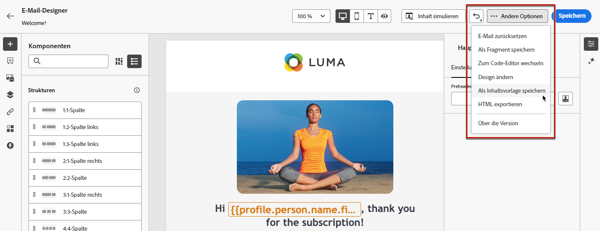
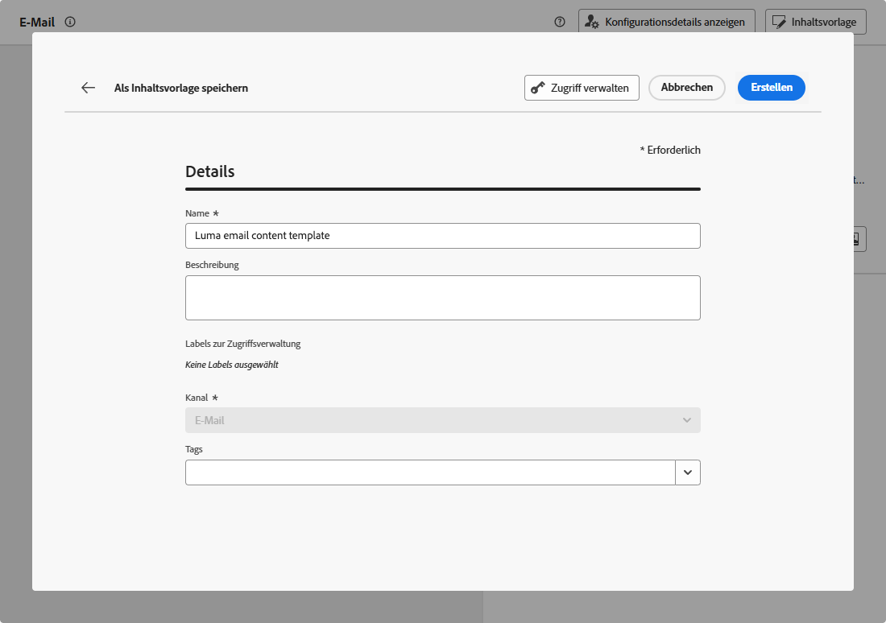
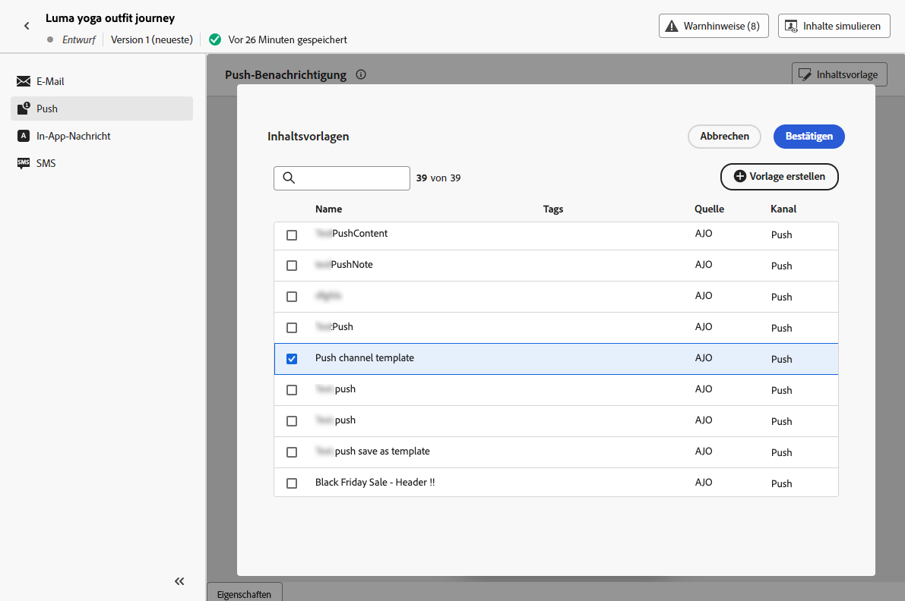

# Arbeiten mit Inhaltsvorlagen {#content-templates}

Für einen beschleunigten und verbesserten Design-Prozess können Sie eigenständige Vorlagen erstellen, um benutzerdefinierte Inhalte in [!DNL Journey Optimizer]-Kampagnen und -Journeys einfach wiederzuverwenden.

Diese Funktion ermöglicht inhaltsorientierten Benutzenden die Arbeit an Vorlagen außerhalb von Kampagnen oder Journeys. Personen, die Marketing betreiben, können diese eigenständigen Inhaltsvorlagen dann in ihren eigenen Journeys oder Kampagnen wiederverwenden und anpassen.

<!---->

>[!NOTE]
>
>Derzeit sind keine Inhaltsvorlagen für den Webkanal verfügbar.

Zum Beispiel: Eine Person in Ihrem Unternehmen ist nur für Inhalte zuständig und hat daher keinen Zugriff auf Kampagnen oder Journeys. Diese Person kann jedoch eine E-Mail-Vorlage erstellen, die die Marketing-Fachleute Ihrer Organisation für die Verwendung in allen E-Mails als Ausgangspunkt auswählen können.

Sie können Inhaltsvorlagen auch mithilfe von APIs erstellen und verwalten. Weiterführende Informationen finden Sie in der [Dokumentation zu Journey Optimizer-APIs](https://developer.adobe.com/journey-optimizer-apis/references/content/){target="_blank"}.

➡️ [Erfahren Sie in diesem Video, wie Sie Vorlagen definieren und verwenden](#video-templates).

>[!CAUTION]
>
>Zum Erstellen, Bearbeiten und Löschen von Inhaltsvorlagen benötigen Sie die Berechtigung **[!DNL Manage library items]** im **[!DNL Content Library Manager]**-Produktprofil. [Weitere Informationen](../administration/ootb-product-profiles.md#content-library-manager)

## Zugreifen auf und Verwalten von Vorlagen {#access-manage-templates}

Um auf die Liste der Inhaltsvorlagen zuzugreifen, wählen Sie **[!UICONTROL Content-Management]** > **[!UICONTROL Inhaltsvorlagen]** aus dem linken Menü aus.

Alle Vorlagen, die in der aktuellen Sandbox erstellt wurden - entweder von einer Journey oder aus einer Kampagne, die die **[!UICONTROL Als Vorlage speichern]** entweder über die **[!UICONTROL Inhaltsvorlagen]** Menü - angezeigt. [Erfahren Sie, wie Sie Vorlagen erstellen](#create-content-templates)

Inhaltsvorlagen können nach folgenden Kriterien sortiert werden:
* Typ
* Kanal
* Erstellungs- oder Änderungsdatum
* Tags - [Weitere Informationen zu Tags](../start/search-filter-categorize.md#tags)

Sie können auch festlegen, dass nur die von Ihnen erstellten oder geänderten Elemente angezeigt werden.

<!--Select the **[!UICONTROL Grid view]** mode to display each template as a thumbnail. 

>[!NOTE]
>
>Currently proper thumbnails can only be generated for HTML-type email content templates.

When you update a content, you may have to wait a few seconds before the changes are reflected in the thumbnail.

-->

* Um einen Vorlageninhalt zu bearbeiten, klicken Sie in der Liste auf das gewünschte Element und wählen Sie **[!UICONTROL Inhalt bearbeiten]** aus.

  

* Um eine Vorlage zu löschen, wählen Sie die **[!UICONTROL Mehr Aktionen]** neben der gewünschten Vorlage und wählen Sie **[!UICONTROL Löschen]**.

  

>[!NOTE]
>
>Wenn eine Vorlage bearbeitet oder gelöscht wird, sind Kampagnen oder Journey, einschließlich mit dieser Vorlage erstellter Inhalte, davon nicht betroffen.

## Erstellen von Inhaltsvorlagen {#create-content-templates}

>[!CONTEXTUALHELP]
>id="ajo_create_template"
>title="Eigene Inhaltsvorlage definieren"
>abstract="Erstellen Sie eine komplett neue, benutzerdefinierte Vorlage, damit Sie Ihre Inhalte für mehrere Journeys und Kampagnen wiederverwenden können."

Es gibt zwei Möglichkeiten, Inhaltsvorlagen zu erstellen:

* Erstellen Sie eine neue Inhaltsvorlage mithilfe des Menüs **[!UICONTROL Inhaltsvorlagen]** in der linken Leiste. [Weitere Informationen](#create-template-from-scratch)

* Speichern Sie den Inhalt bei der Inhaltserstellung in einer Kampagne oder einer Journey als Vorlage. [Weitere Informationen](#save-as-template)

Nach der Speicherung ist Ihre Inhaltsvorlage für Kampagnen oder Journeys verfügbar. Unabhängig davon, ob sie von Grund auf neu oder aus einem vorherigen Inhalt erstellt wurden, können Sie diese Vorlage jetzt beim Erstellen von Inhalten in [!DNL Journey Optimizer]. [Weitere Informationen](#use-content-templates)

>[!NOTE]
>
>* Änderungen an Inhaltsvorlagen werden nicht an Kampagnen oder Journeys weitergegeben, unabhängig davon, ob sie live oder als Entwurf vorliegen.
>
>* Wenn Vorlagen in einer Kampagne oder einer Journey verwendet werden, wirken sich Änderungen am Kampagnen- und Journey-Inhalt ebenso nicht auf die zuvor verwendete Inhaltsvorlage aus.

### Erstellen einer Vorlage von Grund auf {#create-template-from-scratch}

Gehen Sie wie folgt vor, um eine Inhaltsvorlage von Grund auf zu erstellen.

1. Greifen Sie über das linke Menü **[!UICONTROL Content-Management]** > **[!UICONTROL Inhaltsvorlagen]** auf die Inhaltsvorlagenliste zu.

1. Wählen Sie **[!UICONTROL Vorlage erstellen]** aus.

1. Füllen Sie die Vorlagendetails aus und wählen Sie den gewünschten Kanal aus.

   

   >[!NOTE]
   >
   >Derzeit sind alle Kanäle außer Web verfügbar.

1. Wählen Sie eine **[!UICONTROL Typ]** für den ausgewählten Kanal.

   

   * Für **[!UICONTROL Email]**, wenn Sie **[!UICONTROL Inhalt]**, können Sie die [Betreff](../email/create-email.md#define-email-content) als Teil Ihrer Vorlage verwenden. Wenn Sie **[!UICONTROL HTML]** können Sie nur den Inhalt des E-Mail-Textkörpers definieren.

   * Für **[!UICONTROL SMS]**, **[!UICONTROL Push]**, **[!UICONTROL In-App]** und **[!UICONTROL Briefpost]**, ist nur der Standardtyp für den aktuellen Kanal verfügbar. Sie müssen sie weiterhin auswählen.

1. Wählen oder erstellen Sie Adobe Experience Platform-Tags im Feld **[!UICONTROL Tags]**, um Ihre Vorlage für eine verbesserte Suche zu kategorisieren. [Weitere Informationen](../start/search-filter-categorize.md#tags)

1. Um der Vorlage benutzerdefinierte oder zentrale Datennutzungsbezeichnungen zuzuweisen, können Sie **[!UICONTROL Zugriff verwalten]**. [Weitere Informationen zur Zugriffssteuerung auf Objektebene (OLAC)](../administration/object-based-access.md).

1. Klicks **[!UICONTROL Erstellen]** und gestalten Sie Ihre Inhalte nach Bedarf auf die gleiche Weise wie für alle Inhalte innerhalb einer Journey oder Kampagne - je nach ausgewähltem Kanal.

   

   In den folgenden Abschnitten erfahren Sie, wie Sie Inhalte für die verschiedenen Kanäle erstellen:
   * [E-Mail-Inhalt definieren](../email/get-started-email-design.md)
   * [Push-Inhalte definieren](../push/design-push.md)
   * [SMS-Inhalt definieren](../sms/create-sms.md#sms-content)
   * [Briefpost-Inhalt definieren](../direct-mail/create-direct-mail.md)
   * [In-App-Inhalte definieren](../in-app/design-in-app.md)

1. Wenn Sie eine **[!UICONTROL Email]** Vorlage mit der **[!UICONTROL HTML]** -Typ, können Sie Ihren Inhalt testen. [Weitere Informationen](#test-template)

1. Sobald Ihre Vorlage fertig ist, klicken Sie auf **[!UICONTROL Speichern]**.

1. Klicken Sie auf den Pfeil neben dem Vorlagennamen, um zum **[!UICONTROL Details]** angezeigt.

   

Diese Vorlage kann jetzt beim Erstellen von Inhalten in verwendet werden [!DNL Journey Optimizer]. [Weitere Informationen](#use-content-templates)

### Als Vorlage speichern {#save-as-template}

>[!CONTEXTUALHELP]
>id="ajo_messages_depecrated_inventory"
>title="Hier erfahren Sie, wie Sie Ihre Nachrichten migrieren können"
>abstract="Seit dem 25. Juli 2022 wird das Nachrichtenmenü nicht mehr angezeigt. Nachrichten werden nun direkt von einer Journey aus verfasst. Wenn Sie Ihre alten Nachrichten in Journeys wiederverwenden möchten, müssen Sie sie als Vorlagen speichern."

Bei der Erstellung von Inhalten in einer Kampagne oder einer Journey können Sie diese zur späteren Wiederverwendung speichern. Gehen Sie dazu wie folgt vor.

1. In der Nachricht **[!UICONTROL Inhalt bearbeiten]** klicken Sie auf das **[!UICONTROL Inhaltsvorlage]** Schaltfläche.

1. Wählen Sie im Dropdown-Menü **[!UICONTROL Als Inhaltsvorlage speichern]** aus.

   

   Wenn Sie sich im [Email Designer](../email/get-started-email-design.md)können Sie diese Option auch über die **[!UICONTROL Mehr]** Dropdown-Liste oben rechts im Bildschirm.

   

1. Fügen Sie dieser Vorlage einen Namen hinzu.

   

   >[!NOTE]
   >
   >Der aktuelle Kanal und der aktuelle Typ werden automatisch ausgefüllt und können nicht bearbeitet werden. Für E-Mail-Vorlagen, die aus dem [Email Designer](../email/get-started-email-design.md), die **[!UICONTROL HTML]** automatisch ausgewählt.

1. Wählen oder erstellen Sie ein Adobe Experience Platform-Tag im Feld **Tags**, um Ihre Vorlage zu kategorisieren. [Weitere Informationen](../start/search-filter-categorize.md#tags)

1. Um der Vorlage benutzerdefinierte oder zentrale Datennutzungsbezeichnungen zuzuweisen, können Sie **[!UICONTROL Zugriff verwalten]**. [Weitere Informationen](../administration/object-based-access.md).

1. Klicken Sie auf **[!UICONTROL Speichern]**.

1. Die Vorlage wird auf der Liste der **[!UICONTROL Inhaltsvorlagen]** gespeichert, auf die über das dedizierte [!DNL Journey Optimizer]-Menü zugegriffen werden kann. Sie wird zu einer eigenständigen Inhaltsvorlage, auf die wie jedes andere Element in der Liste zugegriffen werden kann und die bearbeitet und gelöscht werden kann. [Weitere Informationen](#access-manage-templates)

Sie können diese Vorlage jetzt beim Erstellen von Inhalten in [!DNL Journey Optimizer]. [Weitere Informationen](#use-content-templates)

>[!NOTE]
>
>Änderungen an dieser neuen Vorlage werden nicht an den Inhalt weitergeleitet, aus dem sie stammen. Wenn der ursprüngliche Inhalt in diesem Inhalt bearbeitet wird, wird die neue Vorlage ebenfalls nicht geändert.

## E-Mail-Inhaltsvorlagen testen {#test-template}

Sie können das Rendering Ihrer E-Mail-Vorlagen testen, unabhängig davon, ob sie von Grund auf neu oder aus einem existierenden Inhalt erstellt wurden. Gehen Sie dazu wie folgt vor.

>[!CAUTION]
>
>Derzeit sind Inhaltsvorlagen nur für **[!UICONTROL Email]** Vorlagen mit **[!UICONTROL HTML]** Typ.

1. Greifen Sie über die **[!UICONTROL Content Management]** > **[!UICONTROL Inhaltsvorlagen]** und wählen Sie eine beliebige E-Mail-Vorlage aus.

1. Klicken Sie in den **[!UICONTROL Vorlageneigenschaften]** auf **[!UICONTROL Inhalt bearbeiten]**.

1. Klicks **[!UICONTROL Inhalt simulieren]** und wählen Sie ein Testprofil aus, um Ihr Rendering zu überprüfen. [Weitere Informationen](../content-management/preview-test.md)

   

1. Sie können einen Testversand durchführen, um Ihren Inhalt zu testen und ihn von einigen internen Benutzern genehmigen zu lassen, bevor Sie ihn in einer Journey oder Kampagne verwenden.

   * Klicken Sie dazu auf die Schaltfläche **[!UICONTROL Testversand durchführen]** und folgen Sie den Schritten, die in [diesem Abschnitt](../content-management/proofs.md) beschrieben werden.

   * Vor dem Testversand müssen Sie die [E-Mail-Oberfläche](../configuration/channel-surfaces.md) auswählen, die zum Testen Ihres Inhalts verwendet wird.

     

>[!CAUTION]
>
>Derzeit wird Tracking beim Testen von E-Mail-Inhaltsvorlagen nicht unterstützt, d. h. die Nachverfolgung von Ereignissen, UTM-Parametern und Landingpage-Links ist in den Testsendungen, die von einer Vorlage gesendet werden, nicht wirksam. Um Tracking zu testen, [verwenden Sie die Inhaltsvorlage](../email/use-email-templates.md) in einer E-Mail und [führen Sie einen Testversand durch](../content-management/preview-test.md#send-proofs).

## Inhaltsvorlagen verwenden {#use-content-templates}

Beim Erstellen von Inhalten für einen beliebigen Kanal (außer Web) in [!DNL Journey Optimizer]können Sie eine benutzerdefinierte Vorlage verwenden, die Sie entweder:

* von Grund auf mit dem Menü **[!UICONTROL Inhaltsvorlagen]** erstellt haben. [Weitere Informationen](#create-template-from-scratch)

* Aus einem vorhandenen Inhalt in einer Journey oder einer Kampagne gespeichert, die mithilfe der **[!UICONTROL Als Inhaltsvorlage speichern]** -Option. [Weitere Informationen](#save-as-template)

Gehen Sie wie folgt vor, um mit der Erstellung Ihres Inhalts mit einer dieser Vorlagen zu beginnen.

1. Ob in einer Kampagne oder Journey, nach Auswahl von **[!UICONTROL Inhalt bearbeiten]**, klicken Sie auf die **[!UICONTROL Inhaltsvorlage]** Schaltfläche.

1. Auswählen **[!UICONTROL Inhaltsvorlage anwenden]**.

   

1. Wählen Sie die gewünschte Vorlage aus der Liste aus. Es werden nur Vorlagen angezeigt, die mit dem ausgewählten Kanal und/oder Typ kompatibel sind.

   

   >[!NOTE]
   >
   >Von diesem Bildschirm aus können Sie auch eine neue Vorlage erstellen, indem Sie die dedizierte Schaltfläche verwenden, die eine neue Registerkarte öffnet.

1. Wählen Sie **[!UICONTROL Bestätigen]** aus. Die Vorlage wird auf Ihren Inhalt angewendet.

1. Bearbeiten Sie den Inhalt nach Bedarf weiter.

>[!NOTE]
>
>So erstellen Sie eine E-Mail aus einer Inhaltsvorlage mit dem [Email Designer](../email/get-started-email-design.md)folgen Sie den Schritten unter [diesem Abschnitt](../email/use-email-templates.md).

## Anleitungsvideo {#video-templates}

Erfahren Sie, wie Sie Inhaltsvorlagen in [!DNL Journey Optimizer] erstellen, bearbeiten und verwenden.

>[!VIDEO](https://video.tv.adobe.com/v/3413743/?quality=12)
