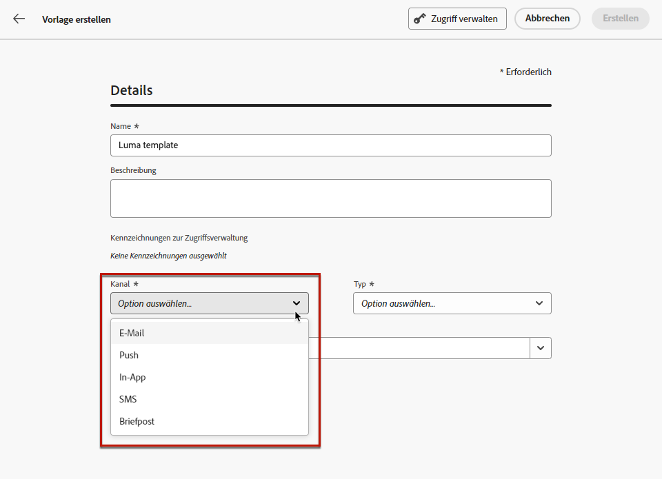
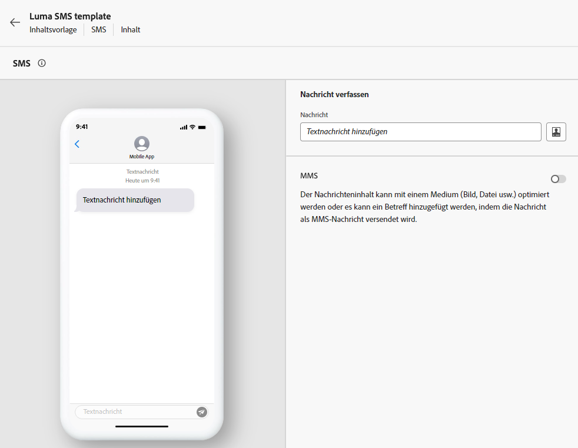
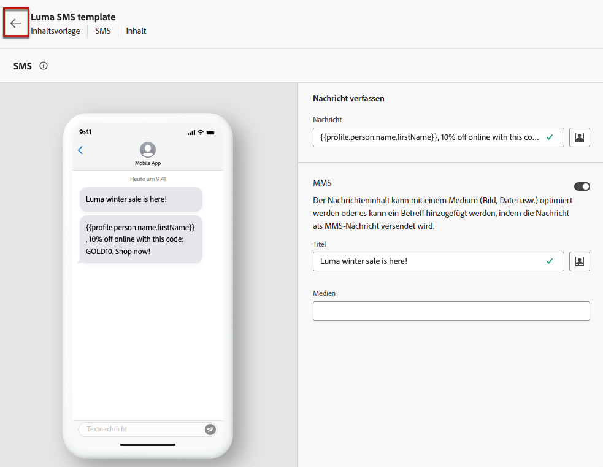
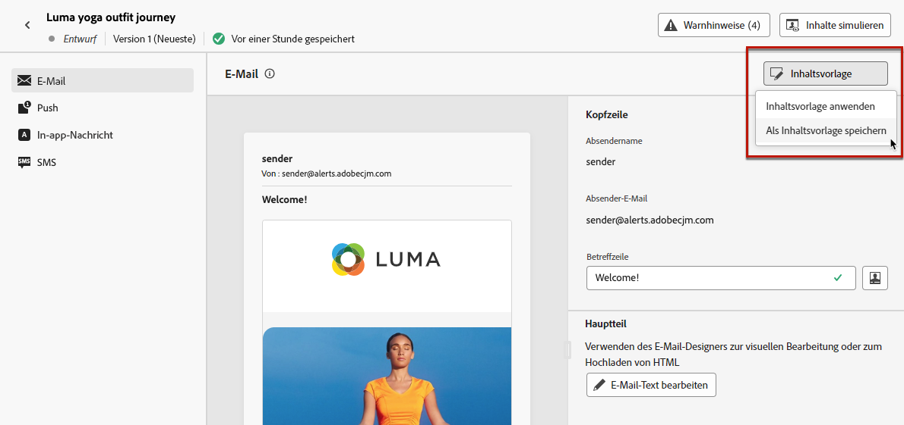
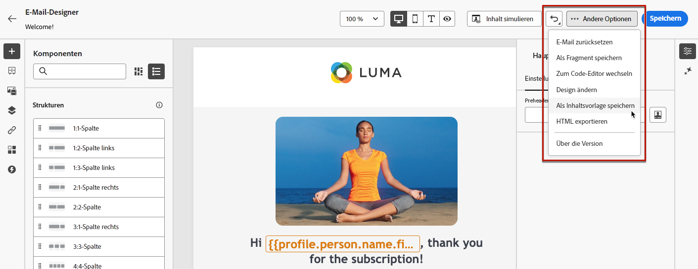
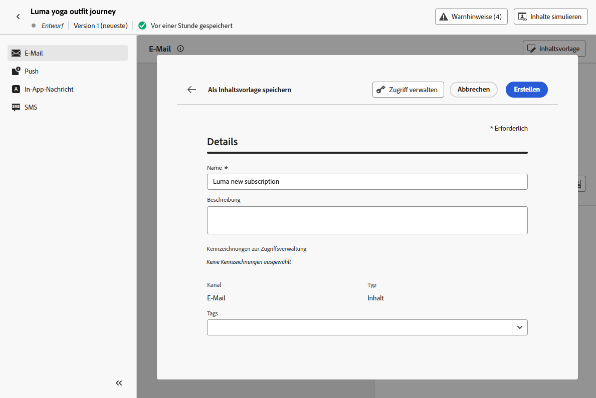

# Erstellen von Inhaltsvorlagen {#create-content-templates}

>[!CONTEXTUALHELP]
>id="ajo_create_template"
>title="Eigene Inhaltsvorlage definieren"
>abstract="Erstellen Sie eine komplett neue, benutzerdefinierte Vorlage, damit Sie Ihre Inhalte für mehrere Journeys und Kampagnen wiederverwenden können."

Es gibt zwei Möglichkeiten, Inhaltsvorlagen zu erstellen:

* Sie können eine neue Inhaltsvorlage mit dem Menü **[!UICONTROL Inhaltsvorlagen]** in der linken Leiste von Grund auf neu erstellen. [Weitere Informationen](#create-template-from-scratch)

* Speichern Sie den Inhalt bei der Inhaltsgestaltung innerhalb einer Kampagne oder einer Journey als Vorlage. [Weitere Informationen](#save-as-template)

Nach der Speicherung ist Ihre Inhaltsvorlage für Kampagnen oder Journeys verfügbar. Unabhängig davon, ob sie von Grund auf neu oder aus vorherigen Inhalten erstellt wurde, können Sie diese Vorlage beim Erstellen von Inhalten in [!DNL Journey Optimizer] verwenden. [Weitere Informationen](#use-content-templates)

>[!NOTE]
>
>* Änderungen an Inhaltsvorlagen werden nicht an Kampagnen oder Journeys weitergegeben, unabhängig davon, ob sie live oder als Entwurf vorliegen.
>
>* Wenn Vorlagen in einer Kampagne oder einer Journey verwendet werden, wirken sich Änderungen am Kampagnen- und Journey-Inhalt ebenso nicht auf die zuvor verwendete Inhaltsvorlage aus.

## Erstellen einer Vorlage von Grund auf {#create-template-from-scratch}

>[!NOTE]
>
>Seit März 2025 werden HTML-Inhaltsvorlagen nicht mehr unterstützt. Bereits vorhandene in [!DNL Journey Optimizer] erstellte HTML-Inhaltsvorlagen können weiterhin verwendet werden.

Gehen Sie wie folgt vor, um eine Inhaltsvorlage von Grund auf zu erstellen.

1. Greifen Sie über das linke Menü **[!UICONTROL Content-Management]** > **[!UICONTROL Inhaltsvorlagen]** auf die Inhaltsvorlagenliste zu.

1. Wählen Sie **[!UICONTROL Vorlage erstellen]** aus.

1. Füllen Sie die Vorlagendetails aus und wählen Sie den gewünschten Kanal aus.

   

   >[!NOTE]
   >
   >Derzeit sind alle Kanäle außer Web verfügbar.

1. Wählen oder erstellen Sie Adobe Experience Platform-Tags im Feld **[!UICONTROL Tags]**, um Ihre Vorlage für eine verbesserte Suche zu kategorisieren. [Weitere Informationen](../start/search-filter-categorize.md#tags)

1. Um der Vorlage benutzerdefinierte oder grundlegende Datennutzungs-Labels zuzuweisen, wählen Sie **[!UICONTROL Zugriff verwalten]** aus. [Erfahren Sie mehr über die Zugriffssteuerung auf Objektebene (Object Level Access Control, OLAC)](../administration/object-based-access.md).

1. Klicken Sie auf **[!UICONTROL Erstellen]** und gestalten Sie den Inhalt nach Bedarf so wie jeden Inhalt innerhalb einer Journey oder Kampagne, je nach ausgewähltem Kanal.

   

   In den folgenden Abschnitten erfahren Sie, wie Sie Inhalte für die verschiedenen Kanäle erstellen:
   * [Definieren von E-Mail-Inhalten](../email/get-started-email-design.md)
   * [Definieren von Push-Inhalten](../push/design-push.md)
   * [Definieren von SMS-Inhalten](../mobile/create-mobile-message.md#sms-content)
   * [Definieren von Briefpost-Inhalten](../direct-mail/create-direct-mail.md)
   * [Definieren von In-App-Inhalten](../in-app/design-in-app.md)
   * [Definieren von Web-Inhalten](../web/create-web.md#edit-web-content)
   * [Definieren von Code-basierten Erlebnisinhalten](../code-based/create-code-based.md)

     >[!NOTE]
     >
     >Sie können Entscheidungsrichtlinien zu Inhaltsvorlagen für Code-basierte Erlebnisse hinzufügen. [Weitere Informationen](../experience-decisioning/create-decision.md#create-decision)

1. Sie können Ihren Inhalt testen. [Weitere Informationen](#test-template)

1. Sobald Ihre Vorlage fertig ist, klicken Sie auf **[!UICONTROL Speichern]**.

1. Klicken Sie auf den Pfeil neben dem Vorlagennamen, um zum Bildschirm **[!UICONTROL Details]** zurückzukehren.

   

Diese Vorlage kann nun beim Erstellen von Inhalten in [!DNL Journey Optimizer] verwendet werden. [Weitere Informationen](#use-content-templates)

>[!NOTE]
>
>Um beim Erstellen einer E-Mail-Inhaltsvorlage schnell einen bestimmten Stil anzuwenden, der zu Ihrer Marke und Ihrem Design passt, können Sie ein Design auf Ihren Inhalt anwenden. [Weitere Informationen](../email/apply-email-themes.md)

## Speichern von Inhalten als Inhaltsvorlage {#save-as-template}

Beim Gestalten von Inhalten in einer Kampagne oder Journey können Sie diesen für die spätere Wiederverwendung speichern. Gehen Sie dazu wie folgt vor.

1. Klicken Sie im Nachrichtenbildschirm **[!UICONTROL Inhalt bearbeiten]** auf die Schaltfläche **[!UICONTROL Inhaltsvorlage]**.

1. Wählen Sie im Dropdown-Menü **[!UICONTROL Als Inhaltsvorlage speichern]** aus.

   

   Im [E-Mail-Designer](../email/get-started-email-design.md) können Sie diese Option auch über die Dropdown-Liste **[!UICONTROL Mehr]** oben rechts am Bildschirm auswählen.

   

1. Fügen Sie dieser Vorlage einen Namen und eine Beschreibung hinzu.

   

   >[!NOTE]
   >
   >Der aktuelle Kanal wird automatisch ausgefüllt und kann nicht bearbeitet werden.

1. Wählen oder erstellen Sie ein Adobe Experience Platform-Tag im Feld **Tags**, um Ihre Vorlage zu kategorisieren. [Weitere Informationen](../start/search-filter-categorize.md#tags)

1. Um der Vorlage benutzerdefinierte oder grundlegende Datennutzungs-Labels zuzuweisen, wählen Sie **[!UICONTROL Zugriff verwalten]** aus. [Weitere Informationen](../administration/object-based-access.md).

1. Klicken Sie auf **[!UICONTROL Speichern]**.

1. Die Vorlage wird auf der Liste der **[!UICONTROL Inhaltsvorlagen]** gespeichert, auf die über das dedizierte [!DNL Journey Optimizer]-Menü zugegriffen werden kann. Sie wird zu einer eigenständigen Inhaltsvorlage, auf die wie jedes andere Element in der Liste zugegriffen werden kann und die bearbeitet und gelöscht werden kann. [Weitere Informationen](#access-manage-templates)

Sie können diese Vorlage nun beim Erstellen von Inhalten in [!DNL Journey Optimizer] verwenden. [Weitere Informationen](#use-content-templates)

>[!NOTE]
>
>Änderungen an dieser neuen Vorlage werden nicht an den Inhalt weitergegeben, auf dem sie basiert. Wenn der ursprüngliche Inhalt bearbeitet wird, wird die neue Vorlage ebenfalls nicht geändert.

