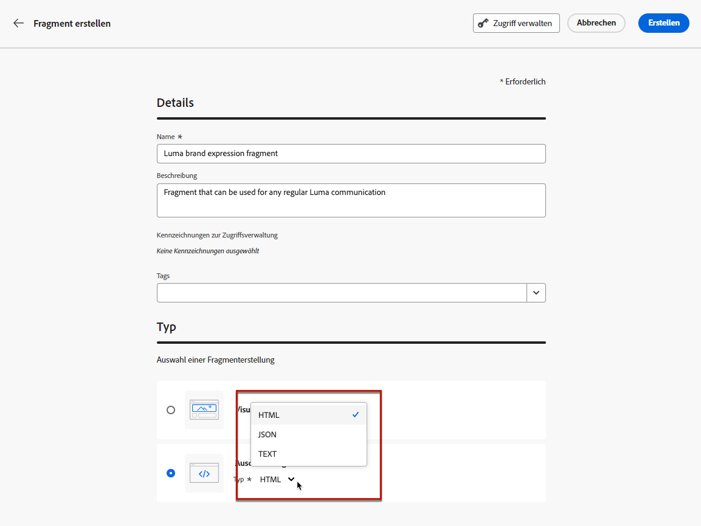
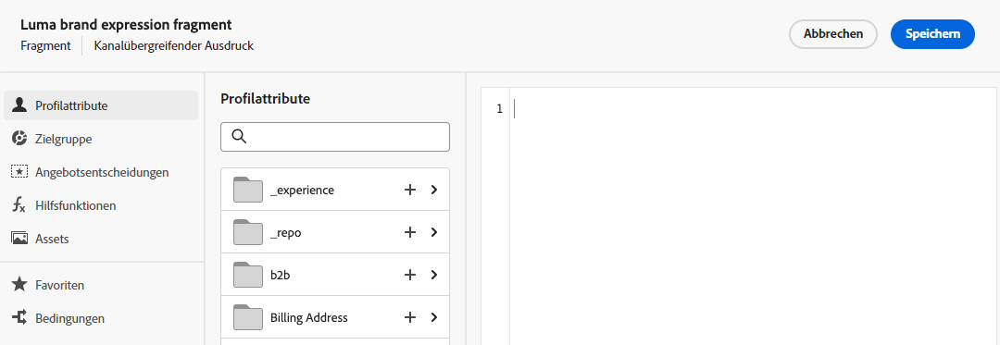

# Erstellen eines Fragments {#create-fragments}

>[!CONTEXTUALHELP]
>id="ajo_create_visual_fragment"
>title="Auswählen des visuellen Typs"
>abstract="Erstellen Sie ein eigenständiges visuelles Fragment, um Ihren Inhalt in einer E-Mail innerhalb einer Journey, einer Kampagne oder in einer Inhaltsvorlage wiederzuverwenden."
>additional-url="https://experienceleague.adobe.com/en/docs/journey-optimizer/using/email/design-email/add-content/use-visual-fragments" text="Hinzufügen visueller Fragmente zu Ihren E-Mails"

>[!CONTEXTUALHELP]
>id="ajo_create_expression_fragment"
>title="Auswählen des Ausdruckstyps"
>abstract="Erstellen Sie ein komplett neues, eigenständiges Fragment, um Ihre Inhalte für mehrere Journeys und Kampagnen wiederverwenden zu können. Bei Verwendung des Personalisierungseditors können Sie alle Ausdrucksfragmente nutzen, die in der aktuellen Sandbox erstellt wurden."
>additional-url="https://experienceleague.adobe.com/docs/journey-optimizer/using/content-management/personalization/expression-editor/use-expression-fragments.html?lang=de" text="Nutzen von Ausdrucksfragmenten"

Fragmente können über das Menü **[!UICONTROL Fragmente]** links von Grund auf neu erstellt werden. Darüber hinaus können Sie beim Entwerfen von Inhalten auch einen Teil des vorhandenen Inhalts als Fragment speichern. [Weitere Informationen](#save-as-fragment)

Nach dem Speichern ist das Fragment für die Verwendung in einer Journey, Kampagne oder Vorlage verfügbar. Sie können dieses Fragment beim Erstellen von Inhalten in Journeys und Kampagnen verwenden. Siehe [Hinzufügen visueller Fragmente](../email/use-visual-fragments.md) und [Nutzen von Ausdrucksfragmenten](../personalization/use-expression-fragments.md)

Gehen Sie wie folgt vor, um ein Fragment zu erstellen:

## Definieren der Fragmenteigenschaften {#properties}

1. Greifen Sie im Menü links über **[!UICONTROL Content-Management]** > **[!UICONTROL Fragmente]** auf die Fragmentliste zu.

1. Wählen Sie **[!UICONTROL Fragment erstellen]** aus und geben Sie bei Bedarf den Namen und eine Beschreibung des Fragments ein.

   

1. Wählen Sie Adobe Experience Platform-Tags im Feld **[!UICONTROL Tags]** aus oder erstellen Sie welche, um Ihr Fragment für eine verbesserte Suche zu kategorisieren. [Informationen zum Arbeiten mit einheitlichen Tags](../start/search-filter-categorize.md#tags)

1. Wählen Sie den Fragmenttyp aus: **Visuelles Fragment** oder **Ausdrucksfragment**. [Weitere Informationen zu visuellen Fragmenten und Ausdrucksfragmenten](../content-management/fragments.md#visual-expression)

   >[!NOTE]
   >
   >Derzeit sind visuelle Fragmente nur für den **E-Mail**-Kanal verfügbar.

1. Wenn Sie ein Ausdrucksfragment erstellen, wählen Sie den Code-Typ aus, den Sie verwenden möchten: **[!UICONTROL HTML]**, **[!UICONTROL JSON]** oder **[!UICONTROL Text]**.

   

1. Um dem Fragment benutzerdefinierte oder grundlegende Datennutzungskennzeichnungen zuzuweisen, klicken Sie oben im Bildschirm auf die Schaltfläche **[!UICONTROL Zugriff verwalten]**. [Weitere Informationen zur Zugriffssteuerung auf Objektebene (OLAC)](../administration/object-based-access.md).

1. Klicken Sie auf **[!UICONTROL Erstellen]**, um den Inhalt Ihres Fragments zu entwerfen.

## Entwerfen des Fragmentinhalts {#content}

Nachdem Sie die Eigenschaften des Fragments konfiguriert haben, wird je nach Typ des Fragments, das Sie erstellen, der E-Mail-Designer oder der Personalisierungseditor geöffnet.

* Bearbeiten Sie die Inhalte Ihrer visuellen Fragmente nach Bedarf, so wie Sie es bei jeder E-Mail innerhalb einer Journey oder einer Kampagne tun würden.  [Weitere Informationen](../email/get-started-email-design.md)

  

* Verwenden Sie für Ausdrucksfragmente den Personalisierungseditor von [!DNL Journey Optimizer] mit allen Personalisierungs- und Authoring-Funktionen zum Erstellen Ihres Fragmentinhalts. [Weitere Informationen](../personalization/personalization-build-expressions.md)

  

Wenn Ihr Inhalt fertig ist, klicken Sie auf die Schaltfläche **Speichern**. Das Fragment wird erstellt und mit dem Status **Entwurf** zur Fragmentliste hinzugefügt. Sie können eine Vorschau davon anzeigen und es veröffentlichen, um es in Journeys und Kampagnen verfügbar zu machen.

## Erstellen einer Vorschau und Veröffentlichen des Fragments {#publish}

>[!NOTE]
>
>Um ein Fragment zu veröffentlichen, muss die [Publish Fragment](../administration/ootb-product-profiles.md#content-library-manager) Benutzerberechtigungen.

Wenn Ihr Fragment für die Aktivierung bereit ist, können Sie es in der Vorschau anzeigen und veröffentlichen, um es in Ihren Journeys und Kampagnen verfügbar zu machen. Gehen Sie dazu wie folgt vor:

1. Kehren Sie nach dem Entwerfen des Inhalts zum Bildschirm für die Fragmenterstellung zurück oder öffnen Sie es in der Liste der Fragmente.

1. Eine Vorschau des Fragments finden Sie unter dem Feld **Tags**. Anhand dieser können Sie überprüfen, wie es gerendert wird. Wenn Sie Änderungen vornehmen müssen, klicken Sie oben im Bildschirm auf die Schaltfläche **Bearbeiten**, um je nach Fragmenttyp den E-Mail-Designer oder den Personalisierungseditor zu öffnen.

   

1. Klicken Sie in der oberen rechten Ecke auf **Veröffentlichen**, um das Fragment zu veröffentlichen.

   Wenn das Fragment in einer Live-Journey oder Kampagne verwendet wird, wird eine entsprechende Nachricht angezeigt. Klicken Sie auf den Link **Mehr anzeigen**, um auf die Liste der Journeys und/oder Kampagnen zuzugreifen, auf die verwiesen wird. [Informationen zum Durchsuchen von Verweisen eines Fragments](../content-management/manage-fragments.md#explore-references)

   Klicken Sie auf **Bestätigen**, um das Fragment zu veröffentlichen und in den Live-Journeys/Kampagnen zu aktualisieren, die es verwenden.

   {width="70%" align="center"}

Das Fragment ist jetzt **live** und bei der Erstellung von Inhalten im [!DNL Journey Optimizer] E-Mail-Designer oder Personalisierungseditor verfügbar:

* [Erfahren Sie, wie Sie visuelle Fragmente verwenden](../email/use-visual-fragments.md)
* [Erfahren Sie, wie Sie Ausdrucksfragmente verwenden](../personalization/use-expression-fragments.md)
