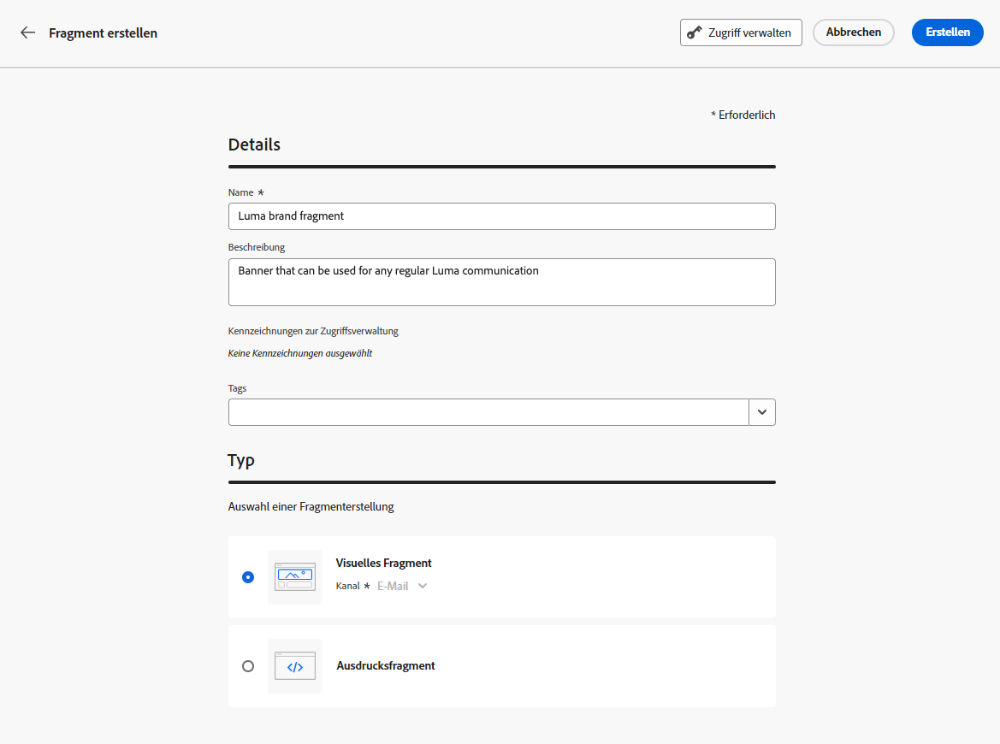
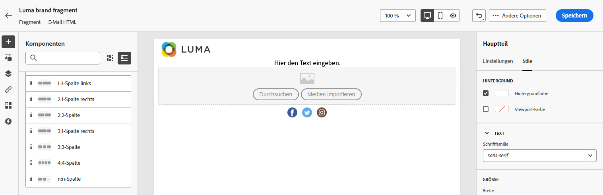

# Erstellen eines Fragments {#create-fragments}

>[!CONTEXTUALHELP]
>id="ajo_create_visual_fragment"
>title="Auswählen des visuellen Typs"
>abstract="Erstellen Sie ein eigenständiges visuelles Fragment, um Ihren Inhalt in einer E-Mail innerhalb einer Journey, einer Kampagne oder in einer Inhaltsvorlage wiederzuverwenden."
>additional-url="https://experienceleague.adobe.com/de/docs/journey-optimizer/using/channels/email/design-email/add-content/use-visual-fragments" text="Hinzufügen visueller Fragmente zu Ihren E-Mails"

>[!CONTEXTUALHELP]
>id="ajo_create_expression_fragment"
>title="Auswählen des Ausdruckstyps"
>abstract="Erstellen Sie ein komplett neues, eigenständiges Fragment, um Ihre Inhalte für mehrere Journeys und Kampagnen wiederverwenden zu können. Bei Verwendung des Personalisierungseditors können Sie alle Ausdrucksfragmente nutzen, die in der aktuellen Sandbox erstellt wurden."
>additional-url="https://experienceleague.adobe.com/de/docs/journey-optimizer/using/content-management/personalization/personalization-build-expressions" text="Arbeiten mit dem Personalisierungseditor"

Fragmente können über das Menü **[!UICONTROL Fragmente]** links von Grund auf neu erstellt werden. Darüber hinaus können Sie beim Entwerfen von Inhalten auch einen Teil des vorhandenen Inhalts als Fragment speichern. [Weitere Informationen](save-fragments.md#)

Nach dem Speichern ist das Fragment für die Verwendung in einer Journey, Kampagne oder Vorlage verfügbar. Sie können dieses Fragment beim Erstellen von Inhalten in Journeys und Kampagnen verwenden. Siehe [Hinzufügen visueller Fragmente](../email/use-visual-fragments.md) und [Nutzen von Ausdrucksfragmenten](../personalization/use-expression-fragments.md).

Gehen Sie wie folgt vor, um ein Fragment zu erstellen:

## Definieren der Fragmenteigenschaften {#properties}

1. Greifen Sie im Menü links über **[!UICONTROL Content-Management]** > **[!UICONTROL Fragmente]** auf die Fragmentliste zu.

1. Wählen Sie **[!UICONTROL Fragment erstellen]** aus und geben Sie bei Bedarf den Namen und eine Beschreibung des Fragments ein.

   

1. Wählen Sie Adobe Experience Platform-Tags im Feld **[!UICONTROL Tags]** aus oder erstellen Sie welche, um Ihr Fragment für eine verbesserte Suche zu kategorisieren. [Informationen zum Arbeiten mit einheitlichen Tags](../start/search-filter-categorize.md#tags)

1. Wählen Sie den Fragmenttyp aus: **Visuelles Fragment** oder **Ausdrucksfragment**. [Weitere Informationen](../content-management/fragments.md#visual-expression)

   >[!NOTE]
   >
   >Visuelle Fragmente sind nur für den Kanal **E-Mail** verfügbar.

1. Wenn Sie ein Ausdrucksfragment erstellen, wählen Sie den Code-Typ aus, den Sie verwenden möchten: **[!UICONTROL HTML]**, **[!UICONTROL JSON]** oder **[!UICONTROL Text]**.

   

1. Um dem Fragment benutzerdefinierte oder grundlegende Datennutzungs-Labels zuzuweisen, klicken Sie oben im Bildschirm auf die Schaltfläche **[!UICONTROL Zugriff verwalten]**. [Erfahren Sie mehr über die Zugriffssteuerung auf Objektebene (Object Level Access Control, OLAC)](../administration/object-based-access.md).

1. Klicken Sie auf **[!UICONTROL Erstellen]**, um den Inhalt Ihres Fragments zu entwerfen.

## Entwerfen des Fragmentinhalts {#content}

Nachdem Sie die Eigenschaften des Fragments konfiguriert haben, wird je nach Typ des Fragments, das Sie erstellen, der E-Mail-Designer oder der Personalisierungseditor geöffnet.

>[!NOTE]
>
>[Kontextuelle Attribute](../personalization/personalization-build-expressions.md) werden in Fragmenten nicht unterstützt.
>
>Wenn in einer Journey oder Kampagne das Tracking aktiviert ist und Sie Links zu einem Fragment hinzufügen, das in einer Nachricht verwendet wird, werden diese Links ebenso wie alle anderen in der Nachricht enthaltenen Links nachverfolgt. [Weitere Informationen über Links und Tracking](../email/message-tracking.md)

* Bearbeiten Sie die Inhalte Ihrer visuellen Fragmente nach Bedarf, so wie Sie es bei jeder E-Mail innerhalb einer Journey oder einer Kampagne tun würden.  [Weitere Informationen](../email/get-started-email-design.md)

  

  Um einen bestimmten Stil, der zu Ihrer Marke und Ihrem Design passt, schnell anzuwenden, können Sie ein [Design](../email/apply-email-themes.md) auf Ihr Fragment anwenden.

  

  >[!CAUTION]
  >
  >Fragmente sind zwischen dem Modus „Designs verwenden“ und dem Modus „Manuelle Formatierung“ nicht kreuzkompatibel. Wenn Sie ein Fragment im E-Mail-Inhalt verwenden, stellen Sie sicher, dass Sie ein Design anwenden, das Sie für dieses Fragment definiert haben. [Weitere Informationen](../email/apply-email-themes.md#leverage-themes-fragment)

* Verwenden Sie für Ausdrucksfragmente den Personalisierungseditor von [!DNL Journey Optimizer] mit allen Personalisierungs- und Authoring-Funktionen zum Erstellen Ihres Fragmentinhalts. [Weitere Informationen](../personalization/personalization-build-expressions.md)

  

Wenn Ihr Inhalt fertig ist, klicken Sie auf die Schaltfläche **[!UICONTROL Speichern]**.

>[!NOTE]
>
>Visuelle Fragmente dürfen 100 KB nicht überschreiten. Ausdrucksfragmente dürfen 200 KB nicht überschreiten.

Das Fragment wird erstellt und mit dem Status **[!UICONTROL Entwurf]** zur Fragmentliste hinzugefügt. Sie können eine Vorschau davon anzeigen und es veröffentlichen, um es in Journeys und Kampagnen verfügbar zu machen.

## Erstellen einer Vorschau und Veröffentlichen des Fragments {#publish}

>[!NOTE]
>
>Um ein Fragment veröffentlichen zu können, müssen Sie über die Benutzerberechtigung [Fragment veröffentlichen](../administration/ootb-product-profiles.md#content-library-manager) verfügen.

Wenn Ihr Fragment zur Live-Schaltung bereit ist, können Sie es in einer Vorschau anzeigen und veröffentlichen, damit es in Ihren Journeys und Kampagnen verfügbar wird. Gehen Sie dazu wie folgt vor.

1. Kehren Sie nach dem Entwerfen des Inhalts zum Bildschirm für die Fragmenterstellung zurück oder öffnen Sie es in der Liste der Fragmente.

1. Eine Vorschau des Fragments finden Sie unter dem Feld **[!UICONTROL Tags]**. Anhand dieser können Sie überprüfen, wie es gerendert wird. Wenn Sie Änderungen vornehmen müssen, klicken Sie oben im Bildschirm auf die Schaltfläche **[!UICONTROL Bearbeiten]**, um je nach Fragmenttyp den E-Mail-Designer oder den Personalisierungseditor zu öffnen. [Weitere Informationen](manage-fragments.md#edit-fragments)

   

1. Klicken Sie in der oberen rechten Ecke auf **[!UICONTROL Veröffentlichen]**, um das Fragment zu veröffentlichen.

1. Wenn das Fragment in einer Live-Journey oder Kampagne verwendet wird, wird eine entsprechende Nachricht angezeigt. Klicken Sie auf den Link **[!UICONTROL Mehr anzeigen]**, um auf die Liste der Journeys und/oder Kampagnen zuzugreifen, auf die verwiesen wird. [Informationen zum Durchsuchen von Verweisen eines Fragments](../content-management/manage-fragments.md#explore-references)

   {width="70%" align="center"}

   Klicken Sie auf **[!UICONTROL Bestätigen]**, um das Fragment zu veröffentlichen und in den Live-Journeys/Kampagnen zu aktualisieren, die es verwenden.

Das Fragment ist jetzt **[!UICONTROL live]** und bei der Erstellung von Inhalten im E-Mail-Designer oder Personalisierungseditor von [!DNL Journey Optimizer] verfügbar.

* [Erfahren Sie, wie Sie visuelle Fragmente verwenden](../email/use-visual-fragments.md)
* [Erfahren Sie, wie Sie Ausdrucksfragmente verwenden](../personalization/use-expression-fragments.md)

>[!CAUTION]
>
>Nach der Veröffentlichung können Sie einem Live-Fragment keine neuen personalisierten Attribute hinzufügen. Wenn Sie Personalisierungsattribute hinzufügen möchten, müssen Sie das Fragment duplizieren. [Weitere Informationen](manage-fragments.md#adding-new-attributes)