# Anpassbare Fragmente {#customizable-fragments}

>[!BEGINSHADEBOX]

**Auf dieser Seite** Erfahren Sie, wie Sie bestimmte Felder in visuellen und Ausdrucksfragmenten bearbeiten können, damit Benutzer sie beim Hinzufügen des Fragments zu einer Kampagne oder Journey anpassen können, ohne die Vererbung vom Originalfragment aufzuheben.

>[!ENDSHADEBOX]

Wenn Fragmente in einer Journey- oder Kampagnenaktion verwendet werden, sind sie aus Gründen der Vererbung standardmäßig gesperrt. Das bedeutet, dass alle an einem Fragment vorgenommenen Änderungen automatisch an alle Kampagnen und Journeys weitergegeben werden, in denen das Fragment verwendet wird.

Mit **anpassbaren Fragmenten** können bestimmte Felder in einem Fragment als bearbeitbar definiert werden, wenn das Fragment einer Journey- oder Kampagnenaktion hinzugefügt wird. Angenommen, Sie verfügen über ein Fragment mit einem Banner, etwas Text und einer Schaltfläche. Sie können bestimmte Felder wie das Bild oder die Ziel-URL der Schaltfläche als bearbeitbar festlegen. Auf diese Weise können Benutzende diese Elemente ändern, wenn sie das Fragment in ihre Kampagne oder Journey integrieren. So wird ein benutzerdefiniertes Erlebnis ermöglicht, ohne dass das ursprüngliche Fragment beeinträchtigt wird.

Bei anpassbaren Fragmenten muss die Fragmentvererbung nicht mehr unterbrochen werden. Dadurch wurde nämlich bislang verhindert, dass zentrale Änderungen auf Fragmentebene an die Kampagnen und Journeys weitergegeben wurden. Dieser Ansatz ermöglicht es, Inhaltsabschnitte zum Zeitpunkt der Verwendung anzupassen, und bietet zudem die Flexibilität, Standardwerte mit kontextspezifischen Details überschreiben zu können.

Durch die Nutzung anpassbarer Fragmente können Sie Ihre Inhalte effizient verwalten und personalisieren, ohne völlig neue Inhaltsbausteine erstellen oder die Vererbung vom ursprünglichen Fragment unterbrechen zu müssen. Auf diese Weise wird sichergestellt, dass alle auf Fragmentebene vorgenommenen Änderungen weiterhin übernommen werden, während gleichzeitig erforderliche Anpassungen auf Kampagnen- oder Journey-Ebene möglich sind.

Sowohl visuelle Fragmente als auch Ausdrucksfragmente können als anpassbar markiert werden. Detaillierte Anweisungen zum weiteren Vorgehen mit den einzelnen Fragmenttypen finden Sie in den folgenden Abschnitten.

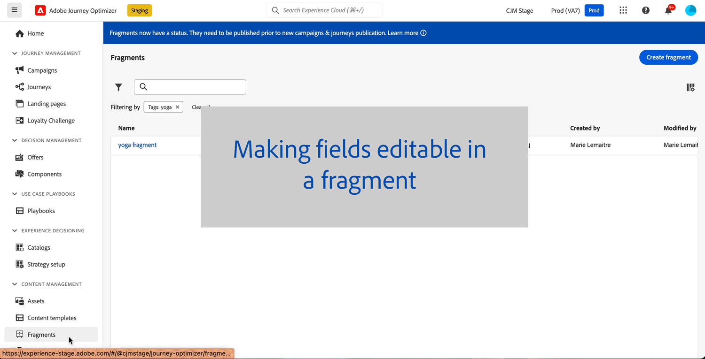

## Hinzufügen bearbeitbarer Felder zu visuellen Fragmenten {#visual}

Gehen Sie wie folgt vor, um Teile eines visuellen Fragments als bearbeitbar festzulegen:

>[!NOTE]
>
>Bearbeitbare Felder können zu **Bild**-, **Text**- und **Schaltflächenkomponenten** hinzugefügt werden. Für **HTML**-Komponenten werden bearbeitbare Felder ähnlich wie Ausdrucksfragmente mithilfe des Personalisierungseditors hinzugefügt. [Informationen zum Hinzufügen bearbeitbarer Felder in HTML-Komponenten und Ausdrucksfragmenten](#expression)

1. Öffnen Sie den Bildschirm zur Inhaltsbearbeitung von Fragmenten.

1. Wählen Sie die Komponente in Ihrem Fragment aus, für die Sie bearbeitbare Felder konfigurieren möchten.

1. Der Bereich der Komponenteneigenschaften wird auf der rechten Seite geöffnet. Wählen Sie die Registerkarte **Bearbeitbare Felder** aus und aktivieren Sie die Option **Bearbeitung aktivieren**.

1. Alle Felder, die für die ausgewählte Komponente bearbeitet werden können, werden im Bereich aufgelistet. Welche Felder zur Bearbeitung verfügbar sind, hängt vom ausgewählten Komponententyp ab.

   Im folgenden Beispiel wird es ermöglicht, die URL der Schaltfläche „Hier klicken“ zu bearbeiten.

   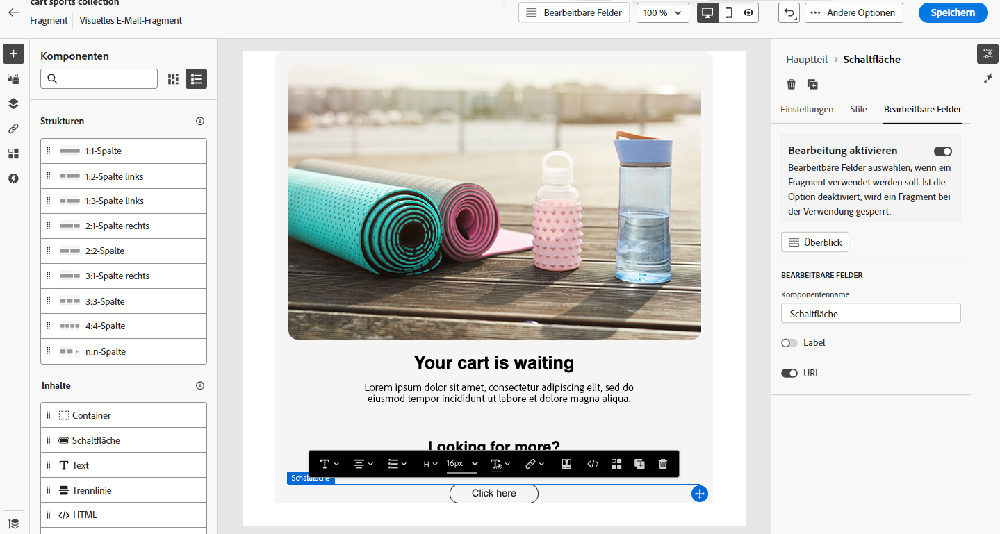

1. Klicken Sie auf **Überblick**, um alle bearbeitbaren Felder und deren Standardwerte zu überprüfen.

   In diesem Beispiel wird das Feld für die Schaltflächen-URL mit dem in der Komponente definierten Standardwert angezeigt. Dieser Wert kann von Benutzenden angepasst werden, nachdem sie das Fragment zu ihrem Inhalt hinzugefügt haben.

   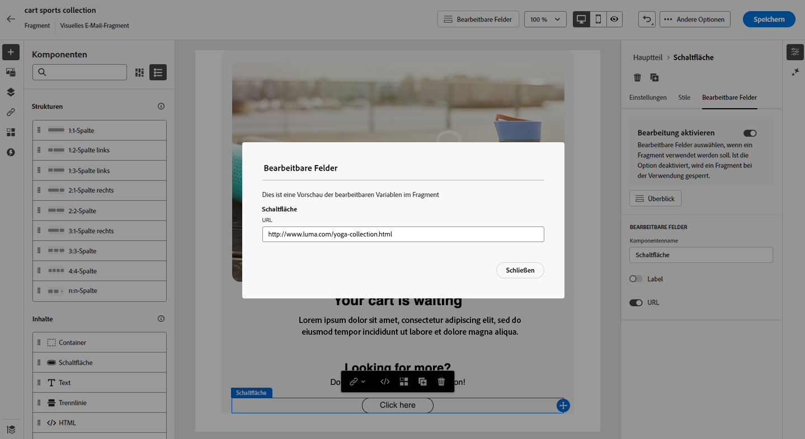

1. Wenn Sie fertig sind, speichern Sie die Änderungen, um das Fragment zu aktualisieren.

1. Nach dem Hinzufügen des Fragments zu einer E-Mail können Benutzende alle im Fragment konfigurierten bearbeitbaren Felder anpassen. [Informationen dazu, wie Sie bearbeitbare Felder in einem visuellen Fragment anpassen](../email/use-visual-fragments.md#customize-fields)

>[!CAUTION]
>
>Wenn sowohl **label** als auch **URL** einer Schaltflächenkomponente in einem Fragment bearbeitbar gemacht werden können, wird in Tracking-Berichten die URL anstelle der Schaltflächenbeschriftung angezeigt. [Weitere Informationen zum Tracking](../email/message-tracking.md)

## Aktivieren der Rich-Text-Bearbeitung in einem anpassbaren visuellen Fragment {#rich-text-visual}

>[!CONTEXTUALHELP]
>id="ajo_editable_fragment_compatibility"
>title="Veraltetes Fragment"
>abstract="Bearbeitbare Felder in diesem Fragment sind nur im Textmodus verfügbar. Dies bedeutet, Sie können nur reinen Text eingeben, wenn Sie dieses Fragment in E-Mails bearbeiten. Umfangreiche Formatierungsoptionen (wie fett, kursiv, Hyperlinks und Zeilenumbrüche) werden nicht unterstützt. Klicken Sie auf <b>Aktivieren</b>, um Rich Text in bearbeitbaren Feldern zuzulassen, wenn Sie das Fragment in einer E-Mail verwenden."

>[!CONTEXTUALHELP]
>id="ajo_editable_field_compatibility"
>title="Veraltetes Fragment"
>abstract="Dieses bearbeitbare Feld befindet sich im Nur-Text-Modus. Umfangreiche Formatierungsoptionen (zum Beispiel fett, kursiv, Hyperlinks, Zeilenumbrüche) sind erst verfügbar, nachdem das Fragment auf den Richt-Text-Modus aktualisiert wurde. Wechseln Sie zu den Einstellungen für den Fragmenttext und klicken Sie auf <b>Aktivieren</b>, um Rich Text in bearbeitbaren Feldern zu entsperren."
>additional-url="https://experienceleague.adobe.com/de/docs/journey-optimizer/using/channels/email/design-email/add-content/use-visual-fragments#customize-fields" text="Anpassen bearbeitbarer Felder in einem Fragment"

>[!CONTEXTUALHELP]
>id="ac_editable_fragment_compatibility"
>title="Veraltetes Fragment"
>abstract="Bearbeitbare Felder in diesem Fragment sind nur im Textmodus verfügbar. Umfangreiche Formatierungsoptionen (zum Beispiel fett, kursiv, Hyperlinks, Zeilenumbrüche) sind erst verfügbar, nachdem das Fragment auf den Richt-Text-Modus aktualisiert wurde. Um diesen Modus zu entsperren, öffnen Sie den Fragment-Editor und klicken Sie auf <b>Aktivieren</b>."
>additional-url="https://experienceleague.adobe.com/de/docs/journey-optimizer/using/channels/email/design-email/add-content/use-visual-fragments#customize-fields" text="Anpassen bearbeitbarer Felder in einem Fragment"

Rich-Text <!--— including bold, italic, line breaks, and hyperlinks —-->wird jetzt nativ in anpassbaren visuellen Fragmenten unterstützt.

Wenn ein anpassbares visuelles Fragment in einer E-Mail verwendet wird, können Sie vollständige Formatierungsoptionen wie fett, kursiv, Zeilenumbrüche, Aufzählungslisten und Hyperlinks direkt in jedem bearbeitbaren Feld in den **[!UICONTROL Text]**-, **[!UICONTROL Button]**- und **[!UICONTROL HTML]**-Komponenten des Fragments nutzen. [Erfahren Sie, wie Sie bearbeitbare Felder anpassen können](../email/use-visual-fragments.md#customize-fields)

Wenn Sie jedoch Fragmente erstellt und bearbeitbare Felder definiert haben, bevor die Rich-Text-Funktion eingeführt wurde, sind die bearbeitbaren Felder standardmäßig auf Nur-Text-Modus eingestellt.

* Im Fragment-Editor wird eine Kompatibilitätswarnung angezeigt.

  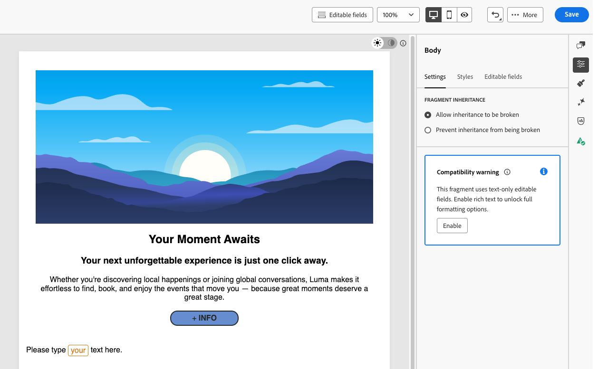

  Um den Rich-Text-Modus für diese bearbeitbaren Felder bei Verwendung des Fragments in einer E-Mail zu entsperren, klicken Sie auf die Schaltfläche **Aktivieren** und speichern Sie das Fragment.

* Nachdem Sie das Fragment zu einer E-Mail hinzugefügt haben, wird auch eine Kompatibilitätswarnung angezeigt, wenn Sie das Fragment in der E-Mail-Designer auswählen.

  

  Um das Fragment auf den Rich-Text-Modus zu aktualisieren, verwenden Sie die Schaltfläche **Fragment öffnen**, um auf den Fragment-Editor zuzugreifen, und klicken Sie auf die Schaltfläche **Aktivieren** und speichern Sie das Fragment.

Bis der Rich-Text-Modus entsperrt ist, unterstützen die veralteten anpassbaren visuellen Fragmente weiterhin nur einfachen Text. Benutzende können in die bearbeitbaren Felder dieser Fragmente keinen Rich-Text eingeben.

## Hinzufügen bearbeitbarer Felder zu HTML-Komponenten und Ausdrucksfragmenten {#expression}

Damit Teile einer HTML-Komponente oder eines Ausdrucksfragments bearbeitbar sind, müssen Sie im Ausdruckseditor eine bestimmte Syntax verwenden. Dazu gehört die Deklarierung einer **Variablen** mit einem Standardwert, den Benutzende überschreiben können, nachdem sie das Fragment zu ihrem Inhalt hinzugefügt haben.

Angenommen, Sie möchten zum einen ein Fragment erstellen, das Ihren E-Mails hinzugefügt werden soll, und zum anderen den Benutzenden ermöglichen, eine bestimmte Farbe anzupassen, die an verschiedenen Stellen verwendet wird, z. B. die Hintergrundfarbe von Rahmen oder Schaltflächen. Beim Erstellen des Fragments müssen Sie eine Variable mit einer **eindeutigen ID**, beispielsweise „Farbe“, deklarieren, und diese an den Stellen im Fragmentinhalt aufrufen, an denen diese Farbe angewendet werden soll. Beim Hinzufügen des Fragments zum Inhalt können Benutzende die Farbe anpassen, die dann überall dort verwendet wird, wo auf die Variable verwiesen wird.

Im Falle von HTML-Komponenten können nur bestimmte Elemente zu bearbeitbaren Feldern gemacht werden. Erweitern Sie den folgenden Abschnitt, um weitere Informationen zu erhalten:

+++Bearbeitbare Elemente in HTML-Komponenten:

Die folgenden Elemente können in einer HTML-Komponente zu bearbeitbaren Feldern gemacht werden:

* Textteile
* Eine vollständige URL für Links oder Bilder (funktioniert nicht mit einer Teil-URL)
* Eine vollständige CSS-Eigenschaft (funktioniert nicht mit einer Teileigenschaft)

Im folgenden Code kann beispielsweise jedes rot hervorgehobene Element zu einer Eigenschaft gemacht werden:

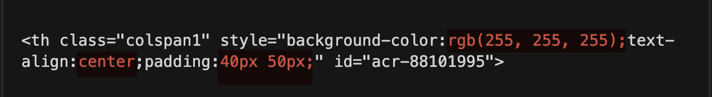{width="70%"}

+++

Gehen Sie wie folgt vor, um eine Variable zu deklarieren und sie in Ihrem Fragment zu verwenden:

1. Öffnen Sie das Ausdrucksfragment und bearbeiten Sie dann seinen Inhalt im Personalisierungseditor.

   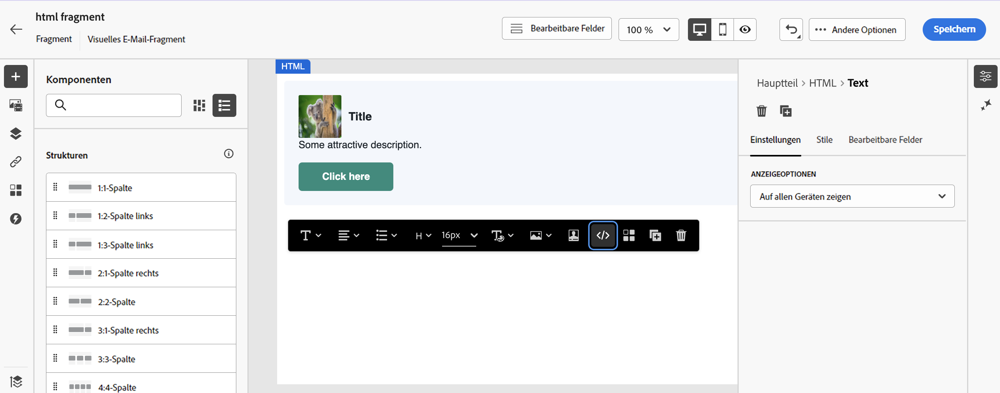

   Wählen Sie für HTML-Komponenten die Komponente im Fragment aus und klicken Sie auf die Schaltfläche **Quell-Code anzeigen**.

1. Deklarieren Sie die Variable, die benutzerseitig bearbeitet werden soll. Navigieren Sie im linken Navigationsbereich zum Menü **Hilfsfunktionen** und wählen Sie die Hilfsfunktion **inline** aus. Die Syntax zum Deklarieren und Aufrufen der Variablen wird Ihrem Inhalt automatisch hinzugefügt.

   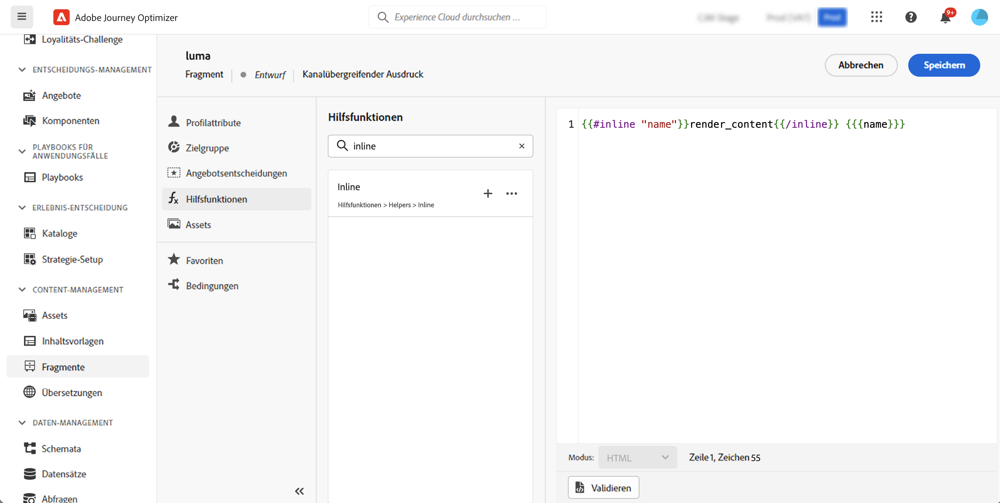

1. Ersetzen Sie `"name"` durch eine eindeutige ID, um das bearbeitbare Feld zu identifizieren.

   >[!NOTE]
   >
   >Die Feld-ID muss eindeutig sein und darf keine Leerzeichen enthalten. Diese ID sollte überall dort in Ihrem Inhalt verwendet werden, wo der Wert der Variablen angezeigt werden soll.

1. Passen Sie die Syntax an Ihre Anforderungen an, indem Sie die in der folgenden Tabelle aufgeführten Parameter hinzufügen:

   | Aktion | Parameter | Beispiel |
   | ------- | ------- | ------- |
   | Deklarieren eines bearbeitbaren Felds mit einem **Standardwert**. Wenn Sie das Fragment zu Ihrem Inhalt hinzufügen, wird dieser Standardwert verwendet, sofern Sie keine Anpassung vornehmen. | Hinzufügen des Standardwerts zwischen den Inline-Tags. | `{{#inline "editableFieldID"}}default_value{{/inline}}` |
   | Definieren eines **Labels** für das bearbeitbare Feld. Dieses Label wird beim Bearbeiten von Fragmentfeldern im E-Mail-Designer angezeigt. | `name="title"` | `{{#inline "editableFieldID" name="title"}}default_value{{/inline}}` |
   | Deklarieren eines bearbeitbaren Felds mit einer **Bildquelle**, die veröffentlicht werden soll. | `assetType="image"` | `{{#inline "editableFieldID" assetType="image"}}default_value{{/inline}}` |
   | Deklarieren eines bearbeitbaren Felds mit einer **URL**, die nachverfolgt werden soll. Beachten Sie, dass vordefinierte Bausteine vom Typ „Mirror-Seiten-URL“ und „Abmelde-Link“ nicht als bearbeitbare Felder festgelegt werden können. | `assetType="url"` | `{{#inline "editableFieldID" assetType="url"}}default_value{{/inline}}` |

1. Verwenden Sie die Syntax `{{{name}}}` in Ihrem Code überall dort, wo der Wert des bearbeitbaren Felds angezeigt werden soll. Ersetzen Sie `name` durch die eindeutige ID des zuvor definierten Felds.

   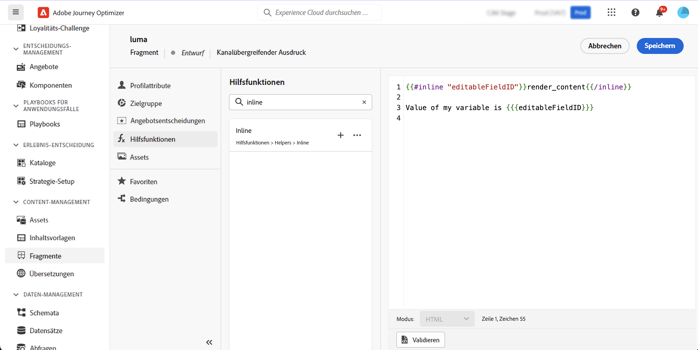

1. Speichern und veröffentlichen Sie Ihr Fragment.

Beim Hinzufügen des Fragments zu ihrem E-Mail-Inhalt können Benutzende nun die Standardwerte der Variablen mit den von ihnen gewählten Werten überschreiben:

* Für Ausdrucksfragmente wird eine bestimmte Syntax zum Überschreiben von Variablenwerten verwendet. [Informationen dazu, wie Sie bearbeitbare Felder in einem Ausdrucksfragment anpassen](../personalization/use-expression-fragments.md#customize-fields)

* Für HTML-Komponenten wird die Variable in der Liste der bearbeitbaren Felder im E-Mail-Designer angezeigt. [Informationen dazu, wie Sie bearbeitbare Felder in einem visuellen Fragment anpassen](../email/use-visual-fragments.md#customize-fields)

### Beispiel: Anpassbares Ausdrucksfragment {#example}

Im folgenden Beispiel wird ein Ausdrucksfragment zur Präsentation einer neuen Sportkollektion erstellt. Standardmäßig zeigt das Fragment diesen Inhalt an: *Sie wollen mehr? Dann sehen Sie sich unsere neueste Sportkollektion an!*

Den Benutzenden soll die Möglichkeit gegeben werden, „Sport“ in diesem Inhalt durch eine andere Sportart zu ersetzen. Beispiel: *Sie wollen mehr? Dann sehen Sie sich unsere neueste Yogakollektion an!*

Gehen Sie dazu wie folgt vor:

1. Deklarieren Sie eine „sport“-Variable mit der ID „sport“.

   Wenn Benutzende den Wert der Variablen nicht ändern, nachdem sie das Fragment zu ihren Inhalten hinzugefügt haben, wird standardmäßig der zwischen den Tags `{{#inline}}` und `{{/inline}}` definierte Wert angezeigt, d. h. „Sport“.

1. Fügen Sie die Syntax ``{{{sport}}}`` in dem Fragmentinhalt dort hinzu, wo der Variablenwert angezeigt werden soll, d. h. standardmäßig „Sport“ oder der benutzerseitig gewählte Wert.

   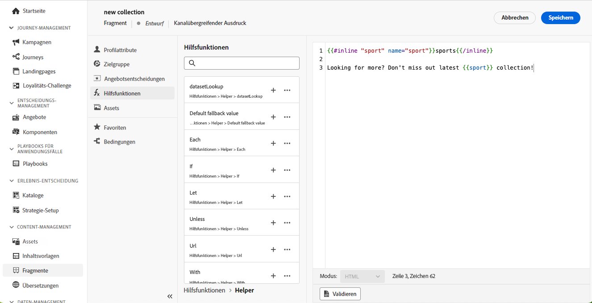

1. Wenn die Benutzenden das Ausdrucksfragment zu ihrem Inhalt hinzufügen, können sie den Wert der Variablen direkt im Ausdruckseditor wie gewünscht ändern. [Informationen dazu, wie Sie bearbeitbare Felder in einem Ausdrucksfragment anpassen](../personalization/use-expression-fragments.md#customize-fields)

   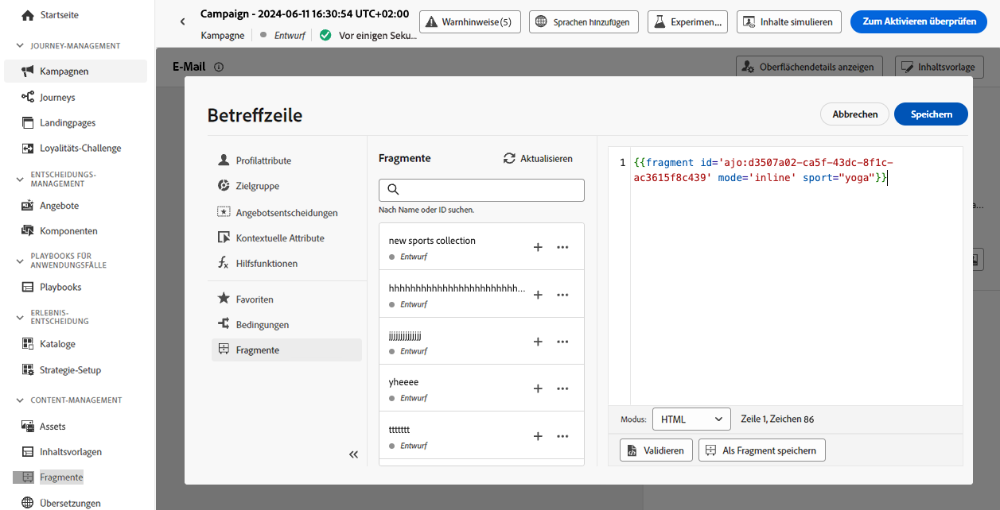

<!--
## Add rich text to a customizable fragment {#rich-text}

Rich text such as line breaks, bold, italics etc., can be added to a customizable fragment by using HTML components. To do so, follow the steps below.

➡️ [Learn how to add and use rich text in a customizable fragment in this video](#video)

### Create a fragment including rich text {#add-rich-text}

The approach below (using HTML components with inline variables) remains fully supported for advanced HTML-based scenarios??

1. Create a visual [fragment](create-fragments.md) and start adding components.

1. Add an [HTML component](../email/content-components.md#HTML) and open the HTML editor.

1. Navigate to the **[!UICONTROL Helper functions]** menu in the left navigation pane and add the **inline** helper function.

1. Replace `"name"` with the ID you want to use for your editable content, for example "EditableContent".

1. Replace `render_content` with the HTML code corresponding to the default rich content you want. You can add bold, italic, line breaks, bulleted lists, etc.

    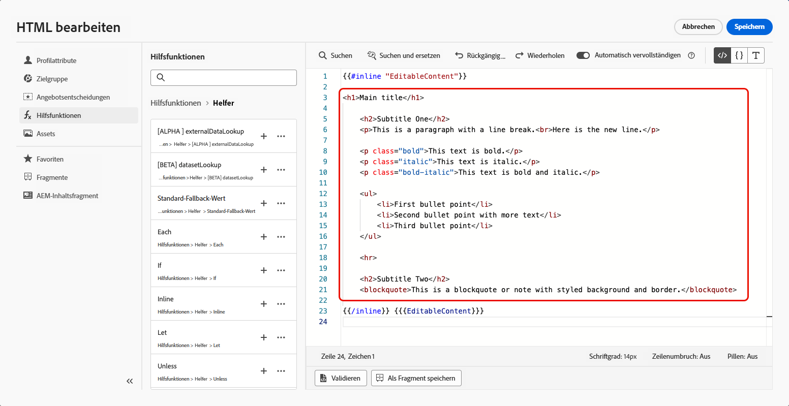

1. Within the same HTML component, add another **inline** helper function for your styling elements.

1. Replace `"name"` and `render_content` with the ID and HTML code corresponding to the default styling you want.

    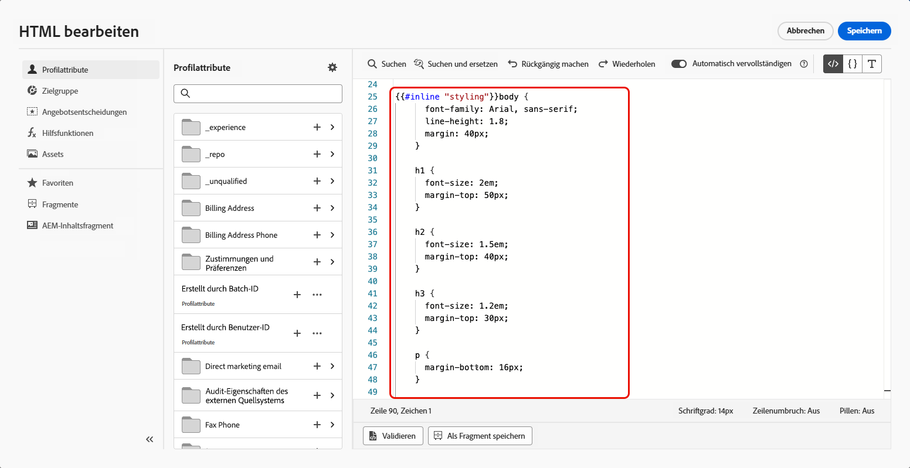

1. Save your content. The selected editable fields are displayed on the right-hand side.

    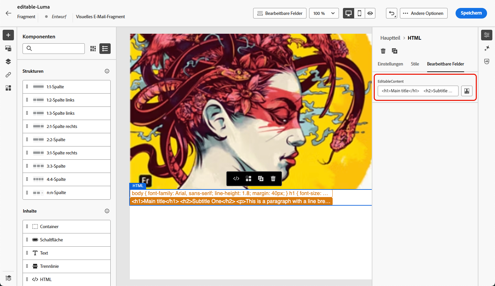

1. Save and [publish](create-fragments.md#publish) the fragment.

### Use rich text in customizable fragments {#use-rich-text}

When adding the fragment to your email, you can now edit the rich text content and styling that you created. As a marketer, follow the steps below.

1. [Create an email](../email/create-email.md) in a campaign or a journey, then add the fragment with rich text that was [created](#add-rich-text).

    You can see the two editable fields that were created on the right-hand side.

    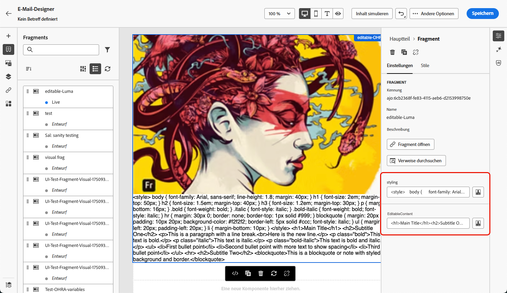

1. Use either simulation method to see how the editable content and styling render: click **[!UICONTROL Simulate content]** to test content variations with sample input data or AI auto-generation, or click **[!UICONTROL Simulate content]**, then select **[!UICONTROL Simulate content (AEP profiles)]** from the dropdown to preview with test profiles. [Learn more on previewing content](preview-test.md)

1. Select the **[!UICONTROL Add personalization]** icon next to one of the editable fields.

1. In the personalization editor that opens, update the styling and/or content as wanted by adding or removing elements of the editable field.

    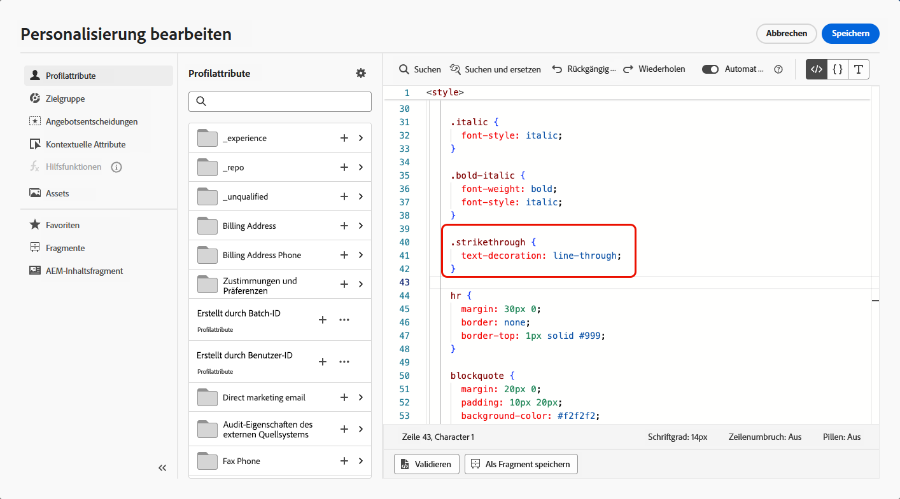

## How-to video {#video}

This video shows how to make HTML components within a fragment editable, allowing for dynamic updates to both content and styling.

>[!VIDEO](https://video.tv.adobe.com/v/3464377/?captions=ger&learn=on&#x26;enablevpops)
-->