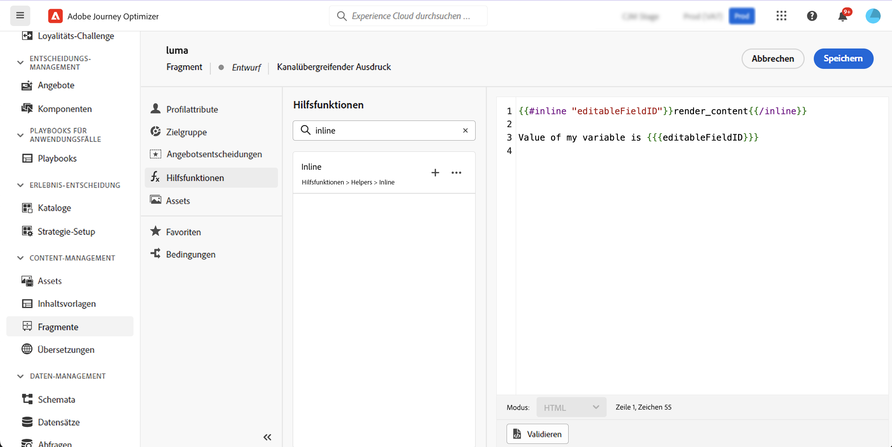
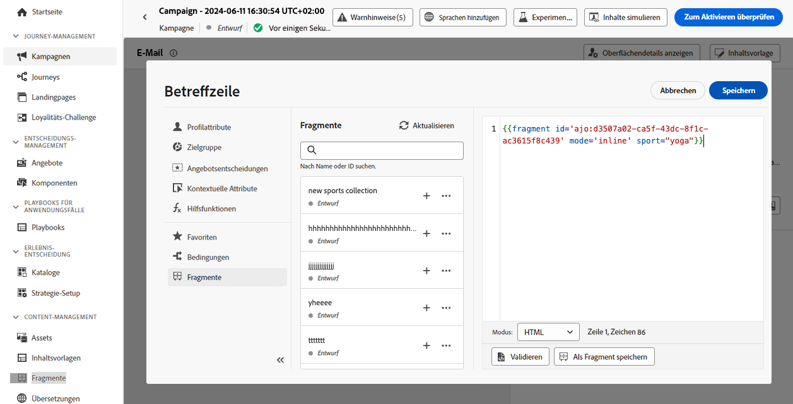
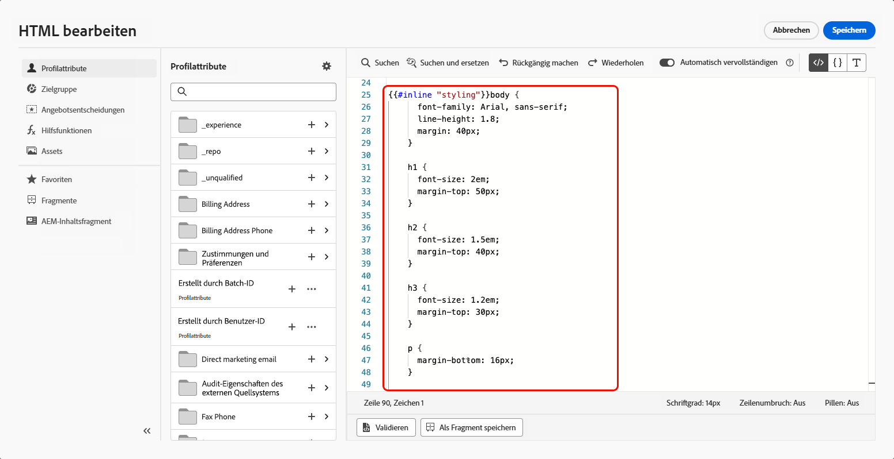

# Anpassbare Fragmente {#customizable-fragments}

Wenn Fragmente in einer Journey- oder Kampagnenaktion verwendet werden, sind sie aus Gründen der Vererbung standardmäßig gesperrt. Das bedeutet, dass alle an einem Fragment vorgenommenen Änderungen automatisch an alle Kampagnen und Journeys weitergegeben werden, in denen das Fragment verwendet wird. Mit anpassbaren Fragmenten können bestimmte Felder in einem Fragment als bearbeitbar definiert werden, wenn das Fragment einer Journey- oder Kampagnenaktion hinzugefügt wird. Angenommen, Sie verfügen über ein Fragment mit einem Banner, etwas Text und einer Schaltfläche. Sie können bestimmte Felder wie das Bild oder die Ziel-URL der Schaltfläche als bearbeitbar festlegen. Auf diese Weise können Benutzende diese Elemente ändern, wenn sie das Fragment in ihre Kampagne oder Journey integrieren. So wird ein benutzerdefiniertes Erlebnis ermöglicht, ohne dass das ursprüngliche Fragment beeinträchtigt wird.

Bei anpassbaren Fragmenten muss die Fragmentvererbung nicht mehr unterbrochen werden. Dadurch wurde nämlich bislang verhindert, dass zentrale Änderungen auf Fragmentebene an die Kampagnen und Journeys weitergegeben wurden. Dieser Ansatz ermöglicht es, Inhaltsabschnitte zum Zeitpunkt der Verwendung anzupassen, und bietet zudem die Flexibilität, Standardwerte mit kontextspezifischen Details überschreiben zu können.

Durch die Nutzung anpassbarer Fragmente können Sie Ihre Inhalte effizient verwalten und personalisieren, ohne völlig neue Inhaltsbausteine erstellen oder die Vererbung vom ursprünglichen Fragment unterbrechen zu müssen. Auf diese Weise wird sichergestellt, dass alle auf Fragmentebene vorgenommenen Änderungen weiterhin übernommen werden, während gleichzeitig erforderliche Anpassungen auf Kampagnen- oder Journey-Ebene möglich sind.

Sowohl visuelle Fragmente als auch Ausdrucksfragmente können als anpassbar markiert werden. Detaillierte Anweisungen zum weiteren Vorgehen mit den einzelnen Fragmenttypen finden Sie in den folgenden Abschnitten.


## Hinzufügen bearbeitbarer Felder zu visuellen Fragmenten {#visual}

Gehen Sie wie folgt vor, um Teile eines visuellen Fragments als bearbeitbar festzulegen:

>[!NOTE]
>
>Bearbeitbare Felder können zu **Bild**-, **Text**- und **Schaltflächenkomponenten** hinzugefügt werden. Für **HTML**-Komponenten werden bearbeitbare Felder ähnlich wie Ausdrucksfragmente mithilfe des Personalisierungseditors hinzugefügt. [Erfahren Sie, wie Sie in HTML-Komponenten und Ausdrucksfragmenten bearbeitbare Felder hinzufügen](#expression)

1. Öffnen Sie den Bildschirm zur Inhaltsbearbeitung von Fragmenten.

1. Wählen Sie die Komponente in Ihrem Fragment aus, für die Sie bearbeitbare Felder konfigurieren möchten.

1. Der Bereich „Komponenteneigenschaften“ wird auf der rechten Seite geöffnet. Wählen Sie die Registerkarte **Bearbeitbare Felder** aus und schalten Sie dann die Option **Bearbeitung aktivieren** um.

1. Alle Felder, die für die ausgewählte Komponente bearbeitet werden können, werden im Bereich aufgelistet. Welche Felder zur Bearbeitung verfügbar sind, hängt vom ausgewählten Komponententyp ab.

   Im folgenden Beispiel wird es ermöglicht, die URL der Schaltfläche „Hier klicken“ zu bearbeiten.

   

1. Klicken Sie auf **Überblick**, um alle bearbeitbaren Felder und deren Standardwerte zu überprüfen.

   In diesem Beispiel wird das Feld für die Schaltflächen-URL mit dem in der Komponente definierten Standardwert angezeigt. Dieser Wert kann von Benutzenden angepasst werden, nachdem sie das Fragment zu ihrem Inhalt hinzugefügt haben.

   

1. Wenn Sie fertig sind, speichern Sie die Änderungen, um das Fragment zu aktualisieren.

1. Nach dem Hinzufügen des Fragments zu einer E-Mail können Benutzende alle im Fragment konfigurierten bearbeitbaren Felder anpassen. [Informationen dazu, wie Sie bearbeitbare Felder in einem visuellen Fragment anpassen](../email/use-visual-fragments.md#customize-fields)

## Hinzufügen bearbeitbarer Felder zu HTML-Komponenten und Ausdrucksfragmenten {#expression}

Damit Teile einer HTML-Komponente oder eines Ausdrucksfragments bearbeitbar sind, müssen Sie im Ausdruckseditor eine bestimmte Syntax verwenden. Dazu gehört die Deklarierung einer **Variablen** mit einem Standardwert, den Benutzende überschreiben können, nachdem sie das Fragment zu ihrem Inhalt hinzugefügt haben.

Angenommen, Sie möchten zum einen ein Fragment erstellen, das Ihren E-Mails hinzugefügt werden soll, und zum anderen den Benutzenden ermöglichen, eine bestimmte Farbe anzupassen, die an verschiedenen Stellen verwendet wird, z. B. die Hintergrundfarbe von Rahmen oder Schaltflächen. Beim Erstellen des Fragments müssen Sie eine Variable mit einer **eindeutigen ID**, beispielsweise „Farbe“, deklarieren, und diese an den Stellen im Fragmentinhalt aufrufen, an denen diese Farbe angewendet werden soll. Beim Hinzufügen des Fragments zum Inhalt können Benutzende die Farbe anpassen, die dann überall dort verwendet wird, wo auf die Variable verwiesen wird.

Im Falle von HTML-Komponenten können nur bestimmte Elemente zu bearbeitbaren Feldern gemacht werden. Erweitern Sie den folgenden Abschnitt, um weitere Informationen zu erhalten:

+++Bearbeitbare Elemente in HTML-Komponenten:

Die folgenden Elemente können in einer HTML-Komponente zu bearbeitbaren Feldern gemacht werden:

* Textteile
* Eine vollständige URL für einen Link oder ein Bild (funktioniert nicht bei Teilen einer URL)
* Gesamte CSS-Eigenschaft (funktioniert nicht bei partieller Eigenschaft)

Im folgenden Code kann beispielsweise jedes rot hervorgehobene Element zu einer Eigenschaft gemacht werden:

{width="70%"}

+++

Gehen Sie wie folgt vor, um eine Variable zu deklarieren und sie in Ihrem Fragment zu verwenden:

1. Öffnen Sie Ihr Ausdrucksfragment und bearbeiten Sie dann seinen Inhalt im Personalisierungseditor.

   

   Wählen Sie für HTML-Komponenten die Komponente im Fragment aus und klicken Sie auf die Schaltfläche **Quell-Code anzeigen**.

1. Deklarieren Sie die Variable, die benutzerseitig bearbeitet werden soll. Navigieren Sie im linken Navigationsbereich zum Menü **Hilfsfunktionen** und wählen Sie die Hilfsfunktion **inline** aus. Die Syntax zum Deklarieren und Aufrufen der Variablen wird automatisch in Ihren Inhalt eingefügt.

   

1. Ersetzen Sie `"name"` durch eine eindeutige ID, um das bearbeitbare Feld zu identifizieren.

   >[!NOTE]
   >
   >Die Feld-ID muss eindeutig sein und darf keine Leerzeichen enthalten. Diese ID sollte überall dort in Ihrem Inhalt verwendet werden, wo der Wert der Variablen angezeigt werden soll.

1. Passen Sie die Syntax an Ihre Anforderungen an, indem Sie die in der folgenden Tabelle aufgeführten Parameter hinzufügen:

   | Aktion | Parameter | Beispiel |
   | ------- | ------- | ------- |
   | Deklarieren eines bearbeitbaren Felds mit einem **Standardwert**. Beim Hinzufügen des Fragments zu Ihrem Inhalt wird dieser Standardwert verwendet, wenn Sie ihn nicht anpassen. | Hinzufügen des Standardwerts zwischen den Inline-Tags. | `{{#inline "editableFieldID"}}default_value{{/inline}}` |
   | Definieren eines **Titels** für das bearbeitbare Feld. Dieser Titel wird beim Bearbeiten von Fragmentfeldern im E-Mail-Designer angezeigt. | `name="title"` | `{{#inline "editableFieldID" name="title"}}default_value{{/inline}}` |
   | Deklarieren eines bearbeitbaren Felds mit einer **Bildquelle**, die veröffentlicht werden soll. | `assetType="image"` | `{{#inline "editableFieldID" assetType="image"}}default_value{{/inline}}` |
   | Deklarieren eines bearbeitbaren Felds mit einer **URL**, die nachverfolgt werden soll.<br/>Beachten Sie, dass vordefinierte Bausteine vom Typ „Mirror-Seiten-URL“ und „Abmelde-Link“ nicht als bearbeitbare Felder festgelegt werden können. | `assetType="url"` | `{{#inline "editableFieldID" assetType="url"}}default_value{{/inline}}` |

1. Verwenden Sie die Syntax `{{{name}}}` in Ihrem Code überall dort, wo der Wert des bearbeitbaren Felds angezeigt werden soll. Ersetzen Sie `name` durch die eindeutige ID des zuvor definierten Felds.

   

1. Speichern Sie Ihr Fragment.

Beim Hinzufügen des Fragments zu ihrem E-Mail-Inhalt können Benutzende nun die Standardwerte der Variablen mit den von ihnen gewählten Werten überschreiben:

* Für Ausdrucksfragmente wird eine bestimmte Syntax zum Überschreiben von Variablenwerten verwendet. [Informationen dazu, wie Sie bearbeitbare Felder in einem Ausdrucksfragment anpassen](../personalization/use-expression-fragments.md#customize-fields)

* Für HTML-Komponenten wird die Variable in der Liste der bearbeitbaren Felder im E-Mail-Designer angezeigt. [Informationen dazu, wie Sie bearbeitbare Felder in einem visuellen Fragment anpassen](../email/use-visual-fragments.md#customize-fields)

## Beispiel für ein bearbeitbares Ausdrucksfragment {#example}

Im folgenden Beispiel wird ein Ausdrucksfragment zur Präsentation einer neuen Sportkollektion erstellt. Standardmäßig zeigt das Fragment diesen Inhalt an: *Sie wollen mehr? Dann sehen Sie sich unsere neueste Sportkollektion an!*

Den Benutzenden soll die Möglichkeit gegeben werden, „Sport“ in diesem Inhalt durch eine andere Sportart zu ersetzen. Beispiel: *Sie wollen mehr? Dann sehen Sie sich unsere neueste Yogakollektion an!*

Gehen Sie dazu wie folgt vor:

1. Deklarieren Sie eine „sport“-Variable mit der ID „sport“.

   Wenn Benutzende den Wert der Variablen nach dem Hinzufügen des Fragments in ihrem Inhalt nicht ändern, wird standardmäßig der zwischen den Tags `{{#inline}}` und `{{/inline}}` definierte Wert angezeigt, d. h. „sports“.

1. Fügen Sie die Syntax ``{{{sport}}}`` in dem Fragmentinhalt dort hinzu, wo der Variablenwert angezeigt werden soll, d. h. standardmäßig „Sport“ oder der benutzerseitig gewählte Wert.

   

1. Wenn die Benutzenden das Ausdrucksfragment zu ihrem Inhalt hinzufügen, können sie den Wert der Variablen direkt im Ausdruckseditor wie gewünscht ändern. [Informationen dazu, wie Sie bearbeitbare Felder in einem Ausdrucksfragment anpassen](../personalization/use-expression-fragments.md#customize-fields)

   

## Hinzufügen von Rich-Text zu einem anpassbaren Fragment {#rich-text}

Rich-Text wie Zeilenumbrüche, fett, kursiv usw. kann mithilfe von HTML-Komponenten zu einem bearbeitbaren Fragment hinzugefügt werden. Gehen Sie dazu wie folgt vor.

➡️ [In diesem Video erfahren Sie, wie Sie einer HTML-Komponente in einem bearbeitbaren Fragment Rich-Text hinzufügen und verwenden](#video)

### Erstellen eines Fragments mit Rich-Text {#add-rich-text}

1. Erstellen Sie ein visuelles Fragment und beginnen Sie mit dem Hinzufügen von Komponenten.

1. Fügen Sie eine [HTML-](../email/content-components.md#HTML) hinzu und öffnen Sie den HTML-Editor.

1. Navigieren Sie zum Menü **[!UICONTROL Hilfsfunktionen]** im linken Navigationsbereich und fügen Sie die Hilfsfunktion **inline** hinzu.

1. Ersetzen Sie `"name"` durch die ID, die Sie für Ihren bearbeitbaren Inhalt verwenden möchten, z. B. „EditableContent“.

1. Ersetzen Sie `render_content` durch den HTML-Code, der dem gewünschten Standardinhalt entspricht.

   
<!--
    +++For example:

    ```html

    <h1>Main title</h1>

    <h2>Subtitle One</h2>
    <p>This is a paragraph with a line break.<br>Here is the new line.</p>

    <p class="bold">This text is bold.</p>
    <p class="italic">This text is italic.</p>
    <p class="bold-italic">This text is bold and italic.</p>

    <ul>
        <li>First bullet point</li>
        <li>Second bullet point with more text</li>
        <li>Third bullet point</li>
    </ul>

    <hr>

    <h2>Subtitle Two</h2>
    <blockquote>This is a blockquote or note with styled background and border.</blockquote>

    ```

    +++
-->

1. Fügen Sie innerhalb derselben HTML-Komponente eine weitere **inline**-Hilfsfunktion für Ihre Stilelemente hinzu.

1. Ersetzen Sie `"name"` und `render_content` durch die ID und den HTML-Code, die dem gewünschten Standardstil entsprechen.

   

1. Speichern Sie Ihre Inhalte. Die ausgewählten bearbeitbaren Felder werden auf der rechten Seite angezeigt.

   

1. Veröffentlichen Sie das Fragment.

### Verwenden von bearbeitbaren Rich-Text-Fragmenten {#use-rich-text}

Beim Hinzufügen des Fragments zu ihrem E-Mail-Inhalt können Benutzerinnen und Benutzer jetzt den von Ihnen erstellten Rich-Text-Inhalt und die Formatierung bearbeiten. Gehen Sie wie folgt vor, um bearbeitbare Rich-Text-Fragmente für einen Marketing-Experten zu verwenden.

1. Erstellen Sie eine E-Mail in einer Kampagne oder einer Journey und fügen Sie dann das erstellte Fragment hinzu.

   Sie können die beiden bearbeitbaren Felder sehen, die im rechten Bereich erstellt wurden.

   

1. Sie können auf **[!UICONTROL Inhalt simulieren]** klicken, um zu sehen, wie die bearbeitbaren Inhalte und Stile gerendert werden.

1. Wählen Sie das Symbol **[!UICONTROL Personalisierung hinzufügen]** neben einem der bearbeitbaren Felder aus und bearbeiten Sie CSS-Stile und/oder Inhalte nach Bedarf.

## Anleitungsvideo {#video}

In diesem Video wird gezeigt, wie Sie HTML-Komponenten innerhalb eines Fragments bearbeitbar machen können, sodass sowohl Inhalt als auch Stil dynamisch aktualisiert werden können.

>[!VIDEO](https://video.tv.adobe.com/v/3464377/?learn=on&#x26;enablevpops&captions=ger)
