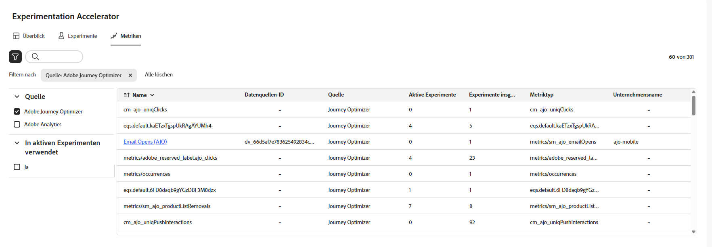
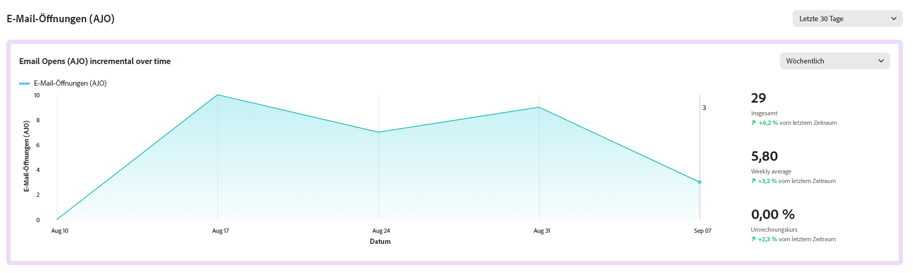

# Metriken {#experiment-accelerator-metrics}

Auf **[!UICONTROL Seite]** Metriken“ werden Erfolgsmetriken aus Journey Optimizer- und Target-Experimenten an einer Stelle angezeigt, was die Leistungsüberwachung, den Vergleich und tiefere Einblicke ermöglicht.

## Dashboard {#dashboard}

Beim Zugriff auf die Registerkarte **[!UICONTROL Metriken]** werden alle verfügbaren Erfolgsmetriken aus Journey Optimizer und Adobe Target in einer konsolidierten Ansicht aufgelistet, damit Sie die Leistung über Initiativen hinweg verfolgen, Ergebnisse vergleichen und schnell Bereiche identifizieren können, die Aufmerksamkeit erfordern.

Greifen Sie auf Filter zu, indem Sie auf  klicken. Dadurch stehen kontextspezifische Optionen zur Verfügung, z. B. nach **[!UICONTROL Source]** oder **[!UICONTROL In aktiven Experimenten verwendet]**.

Alternativ können Sie schnell nach einer Metrik suchen, indem Sie ihren Namen in die Suchleiste eingeben.

## Metrikdetails {#metric-details}

### Inkrementell im Zeitverlauf

Das Diagramm **[!UICONTROL Inkrementell im]**) bietet eine visuelle Aufschlüsselung der Entwicklung der ausgewählten Metrik über einen ausgewählten Zeitraum hinweg. Verwenden Sie das Dropdown-Menü, um zwischen der täglichen oder wöchentlichen Ansicht umzuschalten und die Granularität anzupassen.

Die folgenden Zusammenfassungswerte stehen als Kurzübersicht zur Verfügung:

* **[!UICONTROL Gesamt]**: Der kumulative Wert der ausgewählten Metrik über den Berichtszeitraum.

* **[!UICONTROL Durchschnitt]**: Der typische Wert der Metrik, der für den ausgewählten Zeitraum berechnet wird. Durch den Ausgleich von täglichen oder wöchentlichen Schwankungen liefert sie ein klareres Bild der normalen Leistung und kann als Ausgangsbasis für Vergleiche verwendet werden.

* **[!UICONTROL Konversionsrate]**: Prozentsatz der Profile, die die gewünschte Aktion (z. B. Kauf, Anmeldung) abgeschlossen haben, nachdem sie die Behandlung gesehen haben.

Jeder Wert enthält eine prozentuale Änderung gegenüber dem vorherigen Zeitraum, sodass leicht erkennbar ist, ob die Leistung sich verbessert, abnimmt oder stabil bleibt.

### Experimenteffekt

In diesem Abschnitt werden alle aktiven Experimente innerhalb des ausgewählten Zeitraums (letzte 90 Tage, letzte 30 Tage oder letzte 7 Tage) angezeigt und ihr Beitrag zur Metrik hervorgehoben.

Die folgenden Metriken sind verfügbar:

* **[!UICONTROL Steigerung]**: Messung der prozentualen Verbesserung der Konversionsrate einer bestimmten Abwandlung im Vergleich zur Baseline.

* **[!UICONTROL Konfidenz]**: Belege dafür, dass eine bestimmte Abwandlung mit der Baseline-Abwandlung identisch ist. [Weitere Informationen](../content-management/experiment-calculations.md#understand-confidence)

* **[!UICONTROL Beitrag]**: Der Anteil der Gesamtänderung der Metrik, der einem bestimmten Experiment oder einer bestimmten Behandlung zugeschrieben werden kann, sodass die Initiativen mit der größten relativen Wirkung identifiziert werden können.
