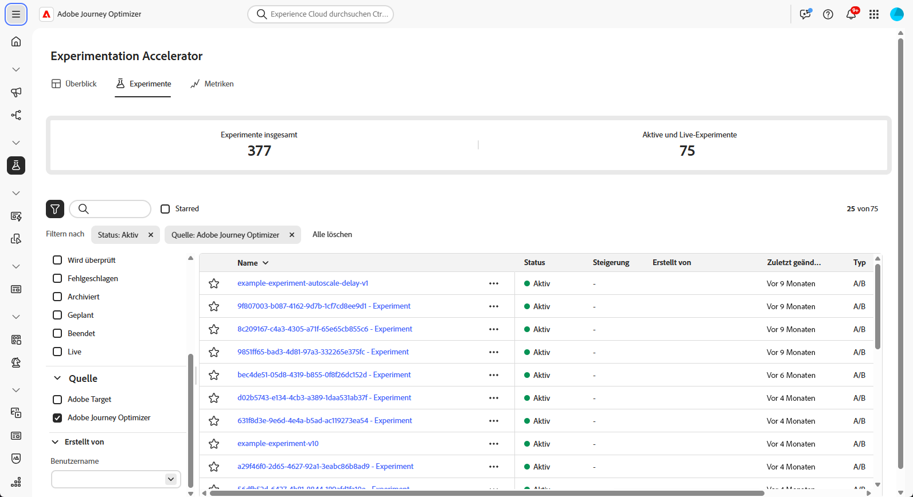
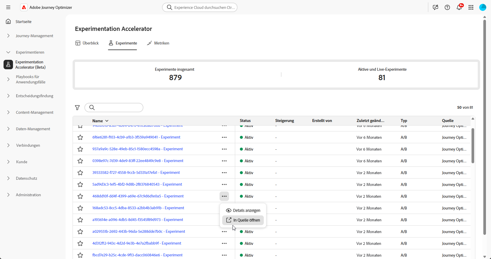
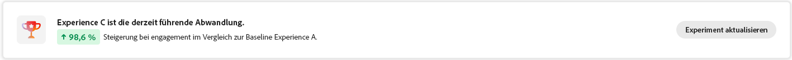
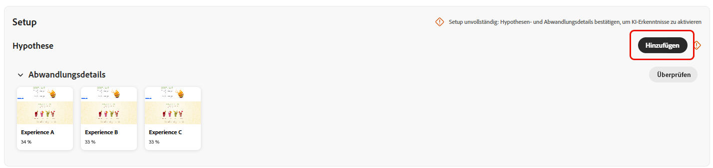
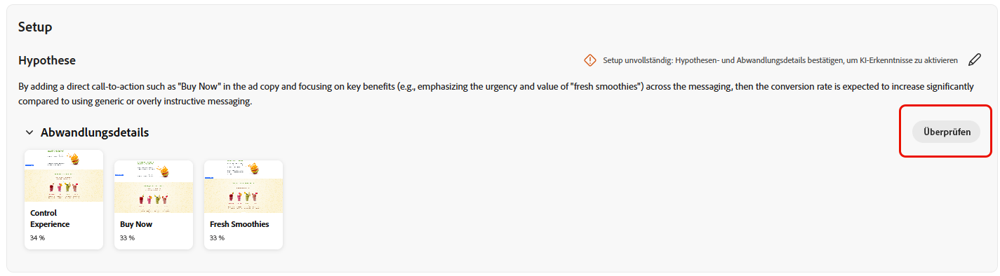
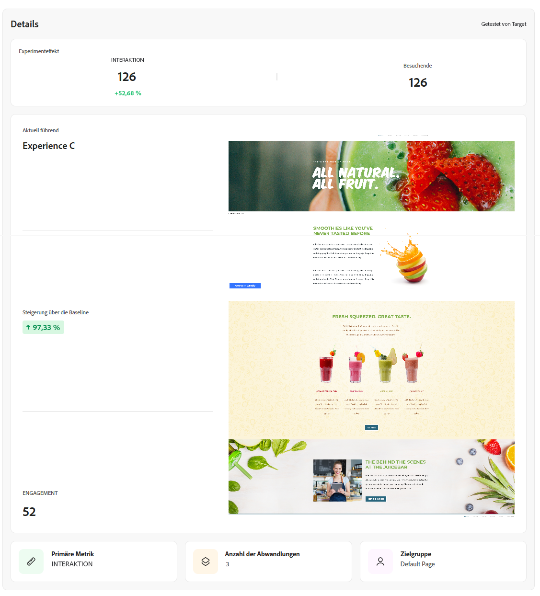
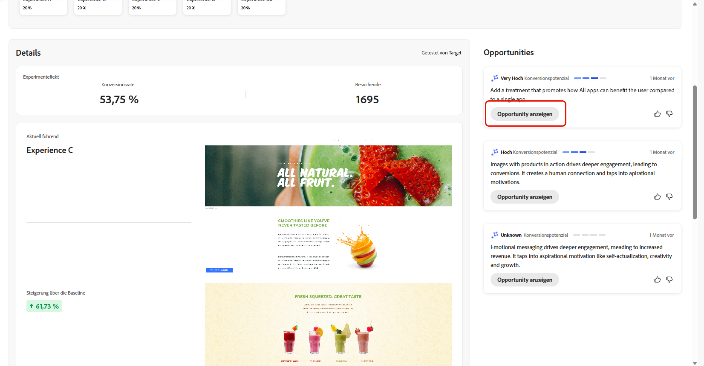
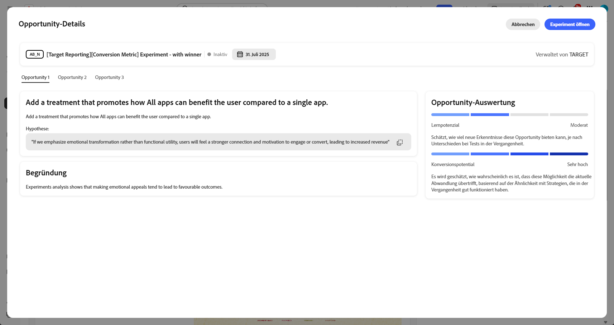
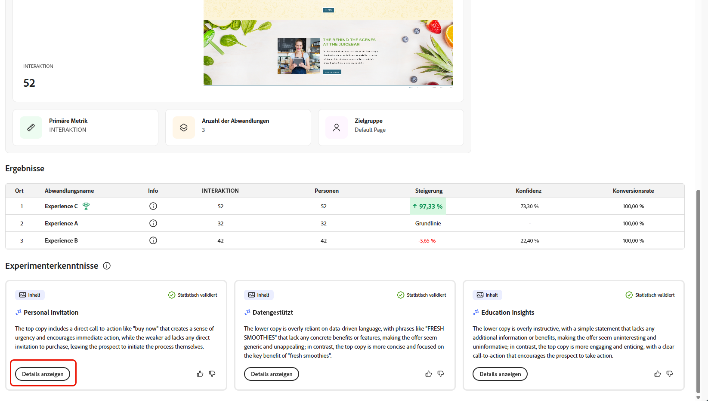

# Verfolgen von Experimenten {#monitor}

Die **[!UICONTROL Experimente]** zentralisiert das Tracking und die Analyse von Tests aus Adobe Journey Optimizer und Adobe Target. Sie können alle Experimente anzeigen, KPIs überprüfen und bestimmte Tests filtern oder suchen.

## Dashboard {#dashboard}

Beim Zugriff auf die Registerkarte Experimente werden alle verfügbaren Experimente aus Journey Optimizer und Adobe Target in einer konsolidierten Ansicht aufgelistet. Auf diese Weise können Sie Experimente auf beiden Plattformen an einem Ort schnell überprüfen und vergleichen.
Die Liste Experimente enthält:

* Journey Optimizer-Experimente, die entweder in Kampagnen oder in Journey erstellt wurden.

* In der Journey Optimizer-Produktions-Standard-Sandbox verfügbare Adobe Target-Experimente, die mit derselben IMS-Organisation verknüpft sind.

Der Abschnitt KPI enthält Schlüsselmetriken, einschließlich der Gesamtzahl der erstellten Experimente und der aktuell ausgeführten Experimente, und bietet eine Momentaufnahme der gesamten Experimentieraktivität

Greifen Sie auf Filter zu, indem Sie auf  klicken. Dort finden Sie kontextspezifische Optionen, **[!UICONTROL . B. nach Type]**, **[!UICONTROL Starred]**, **[!UICONTROL Status]** oder **[!UICONTROL Source]**. Sie können beispielsweise filtern, um nur aktive Experimente aus Journey Optimizer anzuzeigen.

Alternativ können Sie Ihr Experiment schnell finden, indem Sie seinen Namen in die Suchleiste eingeben.

## Überwachen von Experimenten {#monitor-page}

Um auf Ihre Experimente zuzugreifen und sie zu überwachen, wählen Sie Ihr zuvor konfiguriertes Experiment aus der Liste der Experimente auf der Registerkarte **[!UICONTROL Experimente]** oder verwenden Sie das erweiterte Menü, um **[!UICONTROL Details anzeigen]** oder **[!UICONTROL In Quelle öffnen]**.

Die Seite mit den Experimentdetails ist in den folgenden Abschnitt unterteilt:

* [Experimentergebnis](#experiment-outcome)
* [Hypothese](#hypothesis)
* [Details](#details)
* [Opportunitys](#opportunities)
* [Ergebnisse](#results)
* [Experimentier-Erkenntnisse](#insights)

### Ergebnis des Experiments {#experiment-outcome}

Das **[!UICONTROL Experimentergebnis]** bietet Ihnen einen schnellen Überblick über die erfolgreichste Varianz in Ihrem Experiment.

### Einrichten {#set-up}

Die **[!UICONTROL Hypothese]** erfasst die geplanten Änderungen, die getestet werden sollen, und dokumentiert die erwarteten Auswirkungen auf die primäre Metrik. Durch die Definition einer klaren **[!UICONTROL Hypothese]** wird sichergestellt, dass jedes Experiment ein messbares Ziel hat. Dies erleichtert die Bewertung der Ergebnisse und die Ermittlung, ob die Änderungen zu sinnvollen Verbesserungen führen.

Beachten Sie, [ Sie Hypothesen- und Behandlungsdetails sowie die statistische Signifikanz bestätigen müssen, um „Experimenteinblicke](#insights) zu generieren.

1. Klicken Sie **[!UICONTROL Hinzufügen]**, um eine **[!UICONTROL Hypothese]** für Ihr Experiment zu erstellen.

   

1. Geben Sie Ihre **[!UICONTROL Hypothese) ein]** indem Sie die vorgenommenen Änderungen und deren Auswirkungen auf die primäre Metrik detailliert beschreiben.

   Klicken Sie auf **[!UICONTROL Speichern]**.

1. Klicken Sie **[!UICONTROL Überprüfen]**, um das Bild für jede Variante hinzuzufügen oder zu ersetzen.

   

1. Abwandlungsbilder werden automatisch generiert. Bei Bedarf können Sie jedoch **[!UICONTROL Bild hinzufügen]** oder **[!UICONTROL Bild ersetzen]** auswählen, um einen bevorzugten Screenshot aus Ihren lokalen Dateien für Ihre **[!UICONTROL Abwandlungen]** hochzuladen.

   Beachten Sie, dass der Screenshot die gesamte Seite erfassen sollte.

1. Klicken Sie auf  Symbol, um Ihre **[!UICONTROL Hypothese]** bei Bedarf zu aktualisieren.

Sobald Sie die Konfiguration Ihrer **[!UICONTROL Hypothese]** abgeschlossen haben, erhalten Sie wertvolle [Einblicke](#insights) und [Chancen](#opportunities).

### Details {#details}

Das Widget **[!UICONTROL Experimenteffekt]** bietet eine detaillierte Ansicht des Einflusses Ihres Experiments auf die Zielgruppensegmente. Es enthält wichtige Leistungsindikatoren, mit denen Sie Interaktion und Verhalten bewerten können, darunter:

* **[!UICONTROL Erfolgsmetrik]** von Journey Optimizer oder die **[!UICONTROL Primäre]** von Adobe Target, je nachdem, was während der Experimenterstellung konfiguriert wurde.

* **[!UICONTROL Besucher]**: Die Gesamtzahl der Unique Visitors, die dem Experiment ausgesetzt waren.

Sie können auch eine Echtzeit-Momentaufnahme der Leistung der führenden Abwandlung anhand der folgenden Metriken anzeigen:

* **[!UICONTROL Aktueller Leader]**: kennzeichnet die Behandlung, die derzeit die beste Leistung liefert.

* **[!UICONTROL Steigerung über die Baseline]** misst die prozentuale Verbesserung der führenden Behandlung im Vergleich zur Kontrolle oder Baseline.

* **[!UICONTROL Erfolgsmetrik]** von Journey Optimizer oder die **[!UICONTROL Primäre]** von Adobe Target, je nachdem, was während der Experimenterstellung konfiguriert wurde.

Unten im Widget finden Sie eine kurze Zusammenfassung Ihrer Experimentkonfiguration, einschließlich:

* **[!UICONTROL Erfolgsmetrik]** von Journey Optimizer oder die **[!UICONTROL Primäre]** von Adobe Target, je nachdem, was während der Experimenterstellung konfiguriert wurde.

* **[!UICONTROL Anzahl der Behandlungen]**: Die Gesamtzahl der getesteten Varianten.

* **[!UICONTROL Audience]**: Die definierten Benutzersegmente, auf die sich das Experiment bezieht.

### Opportunitys {#opportunities}

>[!AVAILABILITY]
>
>Die Opportunities-Funktion ist auf Experimente mit textbasierten Änderungen beschränkt.

Das Bedienfeld **[!UICONTROL Opportunities]** zeigt KI-generierte Empfehlungen an, die darauf ausgelegt sind, die Testleistung zu verbessern und sie an breiter gefasste Geschäftsziele und KPIs anzupassen.

Beachten Sie, dass Sie für die Generierung von Experimentmöglichkeiten zunächst ([ und Behandlungsdetails) ](#set-up) müssen.

1. Durchsuchen Sie die vorgeschlagene Opportunity und klicken Sie auf **[!UICONTROL Opportunity anzeigen]**.

   

1. Wenn Sie eine Opportunity auswählen **wird das Fenster „Opportunity** Details“ geöffnet, in dem eine bestimmte, von Journey Optimizer Experimentation Accelerator vorgeschlagene Abwandlung oder Variante beschrieben wird. Diese Ansicht enthält:

   * **[!UICONTROL Hypothese]**: Eine KI-generierte Hypothese, die das erwartete Ergebnis der vorgeschlagenen Behandlung erklärt.

   * **[!UICONTROL Rationale]**: Eine Erklärung, warum die Journey Optimizer Experimentation Accelerator diese Möglichkeit vorgeschlagen hat.

   * **[!UICONTROL Opportunity-Evaluierung]** Eine doppelte Bewertung der Empfehlung auf der Grundlage:

      * **[!UICONTROL Lernpotenzial]**: Eine Schätzung, wie viel neues insight die Opportunity bereitstellen könnte, basierend auf der Unterschiede zu dem, was bereits zuvor getestet wurde.

      * **[!UICONTROL Konversionspotenzial]**: Eine Schätzung der Wahrscheinlichkeit, dass die Chance die aktuellen Behandlungen übertrifft, basierend auf Ähnlichkeiten mit Strategien, die in der Vergangenheit gut funktioniert haben.
   <!--
   * **[!UICONTROL New text treatment example]**: Words or phrases that demonstrate the style the AI recommends using.
   -->

   

1. Sie können es dann direkt zu Ihrem Experiment hinzufügen, indem Sie **[!UICONTROL Experiment öffnen]** auswählen.

1. Wenn das Originalexperiment in Adobe Journey Optimizer erstellt und verwaltet wurde, wird durch diese Aktion das **[!UICONTROL Bedienfeld Inhaltsexperiment]** in dieser Kampagne geöffnet.

   Bei Experimenten, die aus **[!DNL Adobe Target]** stammen, werden die vorgeschlagenen Änderungen stattdessen in den Experimentier-Workflow von **[!DNL Adobe Target]** geladen.

   ➡️ [Weitere Informationen finden Sie in der Dokumentation zu Adobe Target](https://experienceleague.adobe.com/de/docs/target/using/activities/abtest/test-ab)

1. Innerhalb der Experimentansicht können Sie auf dieselbe KI **[!UICONTROL Experimentationsmöglichkeiten]** zugreifen, die auch von der Journey Optimizer Experimentation Accelerator angezeigt wird.

   Wählen **[!UICONTROL Anzeigen]**, um die Opportunity-Details zu öffnen.

1. Um die vorgeschlagenen Änderungen anzuwenden, aktivieren Sie **[!UICONTROL Experiment ändern]** und aktivieren Sie die direkte Bearbeitung des vorhandenen Experiments.

### Ergebnisse {#results}

Die **[!UICONTROL Ergebnisse]**-Tabelle bietet eine detaillierte Leistungsaufschlüsselung der einzelnen Behandlungen in einem Experiment. Diese Indikatoren helfen bei der Bewertung der Effektivität, der Benutzerinteraktion und der Gesamtwirkung auf wichtige Geschäftsergebnisse:

* **[!UICONTROL Ort]**: Position der Abwandlung nach Leistung, wobei angegeben wird, wie sie mit anderen Abwandlungen verglichen wird.

* **[!UICONTROL Erfolgsmetrik]** von Journey Optimizer oder die **[!UICONTROL Primäre]** von Adobe Target, je nachdem, was während der Experimenterstellung konfiguriert wurde.

* **[!UICONTROL Personen]**: Anzahl der Benutzerprofile, die sich als Zielgruppenprofile für Ihre Nachrichten eignen.

* **[!UICONTROL Steigerung]**: Messung der prozentualen Verbesserung der Konversionsrate einer bestimmten Abwandlung im Vergleich zur Baseline.

* **[!UICONTROL Konfidenz]**: Belege dafür, dass eine bestimmte Abwandlung mit der Baseline-Abwandlung identisch ist. [Weitere Informationen](../content-management/experiment-calculations.md#understand-confidence)

* **[!UICONTROL Konversionsrate]**: Prozentsatz der Profile, die die gewünschte Aktion (z. B. Kauf, Anmeldung) abgeschlossen haben, nachdem sie die Behandlung gesehen haben.

### Experimenterkenntnisse {#insights}

>[!AVAILABILITY]
>
>Die Funktion Experiment Insights ist auf Experimente mit textbasierten Änderungen beschränkt.

**[!UICONTROL Experiment-Insights]** sind KI-generierte Lerninhalte, die aus diesem Experiment abgeleitet wurden. Diese Erkenntnisse werden verfügbar, sobald das Experiment statistische Signifikanz erreicht hat und bieten ein kontextuelles Verständnis dessen, was zu seinem Erfolg beigetragen hat. Sie heben die Schlüsselattribute hervor, die in der erfolgreichsten Abwandlung vorhanden sind und sich von der Kontrolle unterscheiden, die wahrscheinlich das Ergebnis beeinflusst hat.

Beachten Sie, dass Sie zum Generieren von Experimenteinblicken zunächst [Hypothese- und Behandlungsdetails bestätigen](#set-up) und statistische Signifikanz erreichen müssen.

Klicken Sie **[!UICONTROL Details anzeigen]**, um mehr über die einzelnen Einblicke zu erfahren.

 

