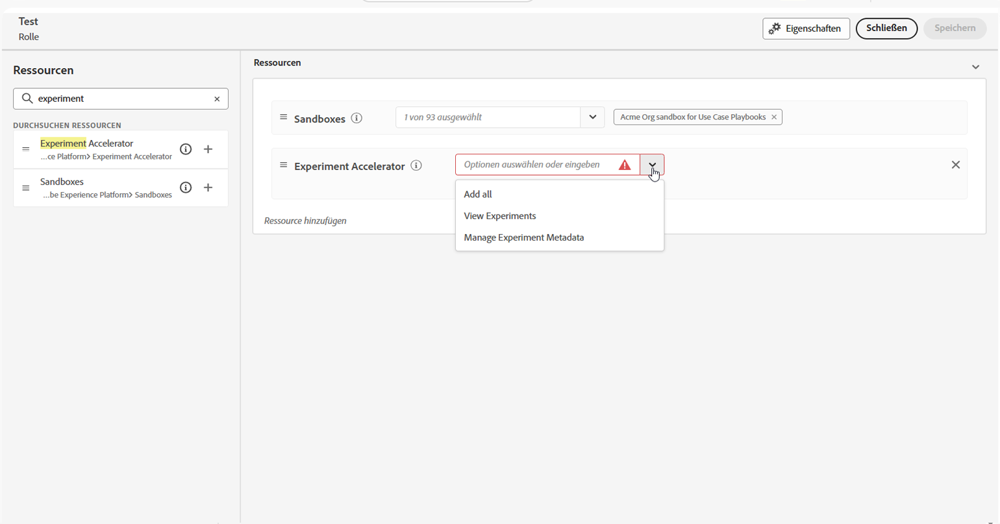

# Erste Schritte mit Journey Optimizer Experimentation Accelerator {#content-experiment}

>[!AVAILABILITY]
>
>**Journey Optimizer Experimentation Accelerator** erfordert eine gebührenpflichtige Kundenlizenz und lässt sich nahtlos mit Adobe Target oder Adobe Journey Optimizer integrieren.

**Journey Optimizer Experimentation Accelerator** ist ein leistungsstarkes Tool zur Optimierung und Verbesserung des Experimentierprozesses. Durch die Integration mit Adobe Target und Adobe Journey Optimizer bietet das Tool eine zentrale Plattform für die Verwaltung, Analyse und Optimierung von Experimenten. Durch die Nutzung KI-gesteuerter Erkenntnisse und adaptiver Tests ermöglicht Ihnen der Journey Optimizer Experimentation Accelerator datengesteuerte Entscheidungen, verbessert Marketing-Strategien und steigert messbare Ergebnisse.

Zu den wichtigsten Vorteilen gehören:

* **Schnelleres Experimentieren**: Führen Sie adaptive, immer aktive Tests mit Modellen durch, die sich im Laufe der Zeit anpassen.

* **Einheitliche Plattform**: Verwalten Sie alle Experimente aus Adobe Target und Journey Optimizer an einem Ort.

* **KI-gestützte Erkenntnisse**: Decken Sie automatisch wichtige Ergebnisse, Leistungstreiber und neue Opportunities auf.

* **Intelligenteres Targeting**: Verwenden Sie Verhaltens- und Inhaltsdaten, um Experimente mit hoher Wirkung zu priorisieren.

* **KPI-Monitoring**: Verfolgen Sie Metriken wie Steigerung und Konfidenz in allen Experimenten.

* **Nahtlose Zusammenarbeit**: Teilen Sie Ergebnisse bequem und verwalten Sie Team-Rollen mit Echtzeit-Warnhinweisen.

## Zugriff auf Journey Optimizer Experimentation Accelerator

Nachdem Sie [Experiment erstellt und konfiguriert ](content-experiment.md) und Ihre Kampagnen oder Journey an Ihre Profile gesendet haben, können Sie auf die **[!UICONTROL Journey Optimizer Experimentation Accelerator]** zugreifen, um sich eingehender mit der Leistung Ihres Experiments zu befassen.

Der Zugriff auf **[!UICONTROL Journey Optimizer Experimentation Accelerator]** entweder über das Menü links in der Dropdown-Liste [!UICONTROL Experimentieren] oder über den Apps Switcher. Beachten Sie, dass Benutzende, die nur eine Target-Lizenz haben, ausschließlich über den Anwendungsschalter darauf zugreifen können.

Die verfügbaren Experimente hängen von Ihrem Setup ab:

* **Für Benutzende, die Adobe Journey Optimizer verwenden**: Experimente, die in der Sandbox Ihrer aktivierten Organisation eingerichtet wurden, werden automatisch einbezogen.

* **Für Adobe Target-Benutzer mit Journey Optimizer**: Alle A/B-Aktivitäten in Target werden in **[!UICONTROL Journey Optimizer Experimentation Accelerator]** in der Produktions-Sandbox von Journey Optimizer angezeigt.

* **Für Benutzende, die nur Adobe Target verwenden**: Alle A/B-Aktivitäten in Ihrer Zielorganisation sind in der Produktions-Sandbox von Journey Optimizer enthalten.

Um **[!UICONTROL Journey Optimizer Experimentation Accelerator]** verwenden zu können, benötigen Sie Zugriff auf die Sandbox und die folgende zugehörige Berechtigung:

* **[!UICONTROL Experimente anzeigen]**
* **[!UICONTROL Experiment-Metada verwalten]**

+++ Erfahren Sie, wie Sie experimentbezogene Berechtigungen zuweisen

1. Wechseln Sie im **[!DNL Permissions]** Produkt zur Registerkarte **[!UICONTROL Rollen]** und wählen Sie die gewünschte **[!UICONTROL Rolle]** aus.

1. Klicken Sie auf **[!UICONTROL Bearbeiten]**, um die Berechtigungen zu ändern.

1. Fügen Sie die Ressource **[!UICONTROL Experimentbeschleuniger]** hinzu und wählen Sie dann **[!UICONTROL Experimente anzeigen]** und/oder **[!UICONTROL Experimentmetadaten verwalten]** aus dem Dropdown-Menü aus.

   

1. Klicken Sie auf **[!UICONTROL Speichern]**, um die Änderungen anzuwenden.

Die Berechtigungen aller Benutzenden, die dieser Rolle bereits zugewiesen sind, werden automatisch aktualisiert.

So weisen Sie diese Rolle neuen Benutzenden zu:

1. Navigieren Sie zur Registerkarte **[!UICONTROL Benutzer]** im Dashboard „Rollen“ und klicken Sie auf **[!UICONTROL Benutzer hinzufügen]**.

1. Geben Sie den Namen und die E-Mail-Adresse der Benutzerin oder des Benutzers ein oder wählen Sie aus der Liste aus und klicken Sie dann auf **[!UICONTROL Speichern]**.

   Wenn die Benutzerin bzw. der Benutzer vorher noch nicht erstellt wurde, lesen Sie [diese Dokumentation](https://experienceleague.adobe.com/de/docs/experience-platform/access-control/abac/permissions-ui/users).

Die Benutzerin oder der Benutzer erhält eine E-Mail mit Anweisungen zum Zugriff auf Ihre Instanz.

+++

<!--table style="table-layout:fixed"><tr style="border: 0;">
<td>

<strong><a href="experiment-accelerator-overview.md">Overview</a></strong>

</td>
<td>

<strong><a href="experiment-accelerator-monitor.md">Experiments</a></strong>

</td>
<td>

<strong><a href="experiment-accelerator-metrics.md">Metrics</a></strong>

</td>
</tr></table-->
