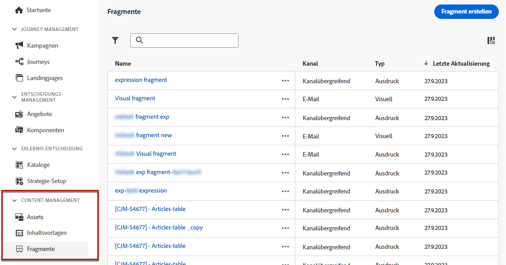

# Erste Schritte mit Fragmenten {#fragments}

>[!BEGINSHADEBOX]

**Auf dieser Seite** Erste Schritte mit visuellen und Ausdrucksinhaltsfragmenten in Adobe Journey Optimizer, wiederverwendbare Komponenten, die Sie einmal erstellen und auf mehrere E-Mails in mehreren Kampagnen und Journey verweisen können.

>[!ENDSHADEBOX]

>[!CONTEXTUALHELP]
>id="ajo_create_fragment"
>title="Definieren Ihrer eigenen Fragmente"
>abstract="Erstellen und verwalten Sie eigenständige Fragmente, um Ihre Inhalte über mehrere Journeys und Kampagnen hinweg wiederzuverwenden."
>additional-url="https://experienceleague.adobe.com/de/docs/journey-optimizer/using/content-management/fragments/create-fragments" text="Erstellen von Fragmenten"

Ein Fragment ist eine wiederverwendbare Komponente, die in einer oder mehreren E-Mails in Kampagnen und Journeys von [!DNL Journey Optimizer] referenziert werden kann. Mit dieser Funktion können Sie mehrere benutzerdefinierte Inhaltsbausteine vorab erstellen, mit denen Marketing-Fachleute E-Mail-Inhalte schnell in einem verbesserten Design-Prozess zusammenstellen können.

➡️ [In diesen Videos erfahren Sie, wie Sie Fragmente verwalten, erstellen und verwenden.](#video-fragments)

So nutzen Sie Fragmente am besten:

* **Erstellen eigener Fragmente**: Erstellen Sie visuelle Fragmente oder Ausdrucksfragmente, indem Sie sie von Grund auf neu erstellen oder Inhalte als Fragment speichern. [Erfahren Sie, wie Sie ein Fragment erstellen](create-fragments.md). Darüber hinaus können Sie Inhaltsfragmente mit der **Inhalts-REST API** von Journey Optimizer verwalten. Weiterführende Informationen finden Sie in der [Dokumentation zu Journey Optimizer-APIs](https://developer.adobe.com/journey-optimizer-apis/references/content){target="_blank"}.
* **Wiederverwenden eigener Fragmente:** Diese können beliebig oft in Ihren Inhalten verwendet werden. Siehe [Hinzufügen visueller Fragmente](../email/use-visual-fragments.md) und [Nutzen von Ausdrucksfragmenten](../personalization/use-expression-fragments.md)
* **Dynamische Fragmente verwenden** Lösen Sie auf der Grundlage von Profilattributen, Datensatzsuchen oder Kontextdaten auf, welches Fragment zur Laufzeit pro Empfänger eingefügt werden soll. [Erfahren Sie, wie Sie dynamische Fragmente verwenden](dynamic-fragments.md)

>[!NOTE]
>
>Die **[!UICONTROL Fragmente]** die auf dieser Seite beschrieben werden, sind wiederverwendbare **Inhalts** Komponenten. Sie unterscheiden sich von:
>
>* **[Journey-Fragmente](../building-journeys/journey-fragments.md)** - wiederverwendbare Sets von Journey-Knoten, die in Journey eingefügt wurden.
>* **[AEM-Inhaltsfragmente](../integrations/aem-fragments.md)** - Inhalte, die in Adobe Experience Manager verfasst und in [!DNL Journey Optimizer] verwendet werden.

## Bevor Sie beginnen {#fragment-prerequisites}

Zum Erstellen, Bearbeiten, Archivieren und Veröffentlichen von Fragmenten benötigen Sie die Berechtigungen **[!DNL Manage library items]** und **[Fragment veröffentlichen]**, die im Produktprofil des **[!DNL Content Library Manager]** enthalten sind. [Weitere Informationen](../administration/ootb-product-profiles.md#content-library-manager)

In dieser Version gelten folgende Einschränkungen:

* **Visuelle Fragmente** sind nur für den E-Mail-Kanal verfügbar.
* **Ausdrucksfragmente** sind nicht für den In-App-Kanal verfügbar.

Weitere Leitlinien für Fragmente finden Sie in [diesem Abschnitt](../start/guardrails.md#fragments-guardrails).

## Visuelle Fragmente und Ausdrucksfragmente {#visual-expression}

Es stehen zwei Arten von Fragmenten zur Verfügung:

* **Visuelle Fragmente** sind vordefinierte visuelle Bausteine, die Sie über mehrere E-Mail-Sendungen hinweg mithilfe des [E-Mail-Designers](../email/get-started-email-design.md) oder in [Inhaltsvorlagen](../email/use-email-templates.md) wiederverwenden können.
* **Ausdrucksfragmente** sind vordefinierte Ausdrücke, die über einen dedizierten Eintrag im [Personalisierungseditor](../personalization/personalization-build-expressions.md) verfügbar sind.

Alle Fragmente sind links über das Menü **[!UICONTROL Content-Management]** > **[!UICONTROL Fragmente]** zugänglich. [Informationen zum Verwalten von Fragmenten](../content-management/manage-fragments.md)

## Anleitungsvideo {#video-fragments}

Informationen zum Verwalten, Erstellen und Verwenden von **visuellen Fragmenten** in [!DNL Journey Optimizer].

>[!VIDEO](https://video.tv.adobe.com/v/3419932/?quality=12)

Informationen zum Verwalten, Erstellen und Verwenden von **Ausdrucksfragmenten** in [!DNL Journey Optimizer].

>[!VIDEO](https://video.tv.adobe.com/v/3424587/?quality=12)
