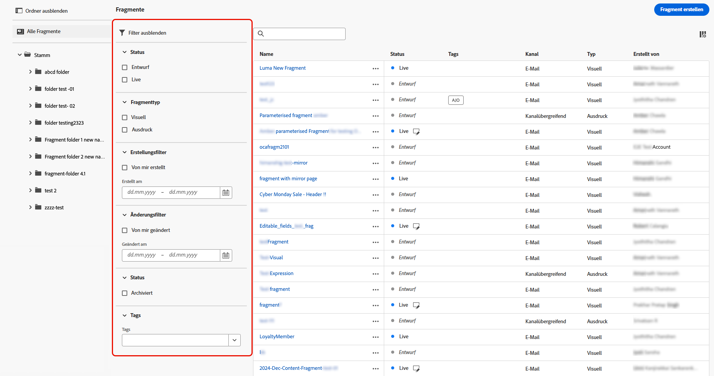

# Arbeiten mit Fragmenten {#fragments}

>[!CONTEXTUALHELP]
>id="ajo_create_fragment"
>title="Definieren Ihrer eigenen Fragmente"
>abstract="Erstellen und verwalten Sie eigenständige Fragmente, um Ihre Inhalte über mehrere Journeys und Kampagnen hinweg wiederzuverwenden."
>additional-url="https://experienceleague.adobe.com/docs/journey-optimizer/using/content-management/reusable-content/fragments.html?lang=de#create-fragments" text="Erstellen von Fragmenten"

Ein Fragment ist eine wiederverwendbare Komponente, die in einer oder mehreren [!DNL Journey Optimizer]-Kampagnen und -Journeys referenziert werden kann.

Mit dieser Funktion können Sie mehrere benutzerdefinierte Inhaltsbausteine vorab erstellen, mit denen Marketing-Fachleute E-Mail-Inhalte schnell in einem verbesserten Design-Prozess zusammenstellen können.

➡️ [In diesem Video erfahren Sie, wie Sie Fragmente verwalten, erstellen und verwenden](#video-fragments)

So nutzen Sie Fragmente am besten:

* Erstellen Sie Ihre eigenen Fragmente. Sie können visuelle Fragmente oder Ausdrucksfragmente erstellen. [Weitere Informationen](#create-fragments)

* Diese können beliebig oft in E-Mails verwendet werden. Siehe [Hinzufügen visueller Fragmente](../email/use-visual-fragments.md) und [Nutzen von Ausdrucksfragmenten](../personalization/use-expression-fragments.md)

>[!NOTE]
>
>**Visuelle Fragmente** können im [E-Mail-Designer](../email/get-started-email-design.md) verwendet werden, während **Ausdrucksfragmente** über den [Ausdruckseditor](../personalization/personalization-build-expressions.md) zugänglich sind.

Darüber hinaus können Sie Inhaltsfragmente mit der **Inhalts-REST API** von Journey Optimizer verwalten. Weiterführende Informationen finden Sie in der [Dokumentation zu Journey Optimizer-APIs](https://developer.adobe.com/journey-optimizer-apis/references/content/){target="_blank"}.

## Bevor Sie beginnen {#fragment-prerequisites}

>[!CAUTION]
>
>Zum Erstellen, Bearbeiten und Archivieren von Fragmenten benötigen Sie die Berechtigung **[!DNL Manage library items]** im **[!DNL Content Library Manager]**-Produktprofil. [Weitere Informationen](../administration/ootb-product-profiles.md#content-library-manager)

In dieser Version gelten folgende Einschränkungen:

* Visuelle Fragmente sind nur für den E-Mail-Kanal verfügbar

* Ausdrucksfragmente sind nicht für Web- und In-App-Kanäle verfügbar

## Zugreifen auf und Verwalten von Fragmenten {#access-manage-fragments}

Um auf die Fragmentliste zuzugreifen, wählen Sie im Menü links **[!UICONTROL Content-Management]** > **[!UICONTROL Fragmente]** aus.

Es werden alle in der aktuellen Sandbox entweder [über das Menü **[!UICONTROL Fragmente]** oder](#create-fragments) die Option [Als Fragment speichern](#save-as-fragment) erstellten Fragmente angezeigt. 

Fragmente können nach folgenden Kriterien gefiltert werden:

* Typ: **[!UICONTROL Visuell]** oder **[!UICONTROL Ausdruck]**
* Tags
* Erstellungs- oder Änderungsdatum

Sie können wählen, ob alle Fragmente angezeigt werden sollen oder nur die Elemente, die von der Person, die aktuell daran arbeitet, erstellt oder geändert wurden.

Sie können auch die **[!UICONTROL archivierten]** Fragmente anzeigen. [Weitere Informationen](#archive-fragments)

Über die Schaltfläche **[!UICONTROL Weitere Aktionen]** neben jedem Fragment können Sie Folgendes ausführen:

* Duplizieren Sie ein Fragment.

* Verwenden Sie die Option **[!UICONTROL Verweise erkunden]**, um die Journeys, Kampagnen oder Vorlagen anzuzeigen, in denen es verwendet wird. [Weitere Informationen](#explore-references)

* Ein Fragment in eine andere Sandbox kopieren. <!--Learn more?-->

* Archivieren Sie ein Fragment. [Weitere Informationen](#archive-fragments)

* Die [Tags](../start/search-filter-categorize.md#tags) eines Fragments bearbeiten.

### Bearbeiten von Fragmenten {#edit-fragments}

Gehen Sie wie folgt vor, um ein Fragment zu bearbeiten.

1. Klicken Sie auf das gewünschte Element in der Liste **[!UICONTROL Fragmente]**.
1. Über die Fragmenteigenschaften können Sie [Verweise erkunden](#explore-references), den [Zugriff verwalten](../administration/object-based-access.md) und die Fragmentdetails einschließlich [Tags](../start/search-filter-categorize.md#tags) aktualisieren.

   

1. Wählen Sie die entsprechende Schaltfläche aus, um den Inhalt zu bearbeiten, wie Sie es bei der kompletten Neuerstellung eines Fragments tun würden. [Weitere Informationen](#create-from-scratch)

>[!NOTE]
>
>Wenn Sie ein Fragment bearbeiten, werden die Änderungen automatisch auf alle E-Mails und Vorlagen übertragen, die dieses Fragment enthalten, mit Ausnahme der für **[!UICONTROL Live]**-Journeys und -Kampagnen verwendeten E-Mails. Sie können auch die Vererbung vom ursprünglichen Fragment unterbrechen. Weitere Informationen finden Sie unter [Hinzufügen visueller Fragmente zu Ihren E-Mails](../email/use-visual-fragments.md#break-inheritance) und [Nutzen von Ausdrucksfragmenten](../personalization/use-expression-fragments.md#break-inheritance).

### Verweise erkunden {#explore-references}

Sie können die Liste der Journeys, Kampagnen und Inhaltsvorlagen anzeigen, die derzeit ein Fragment verwenden.

Wählen Sie dazu entweder über das Menü **[!UICONTROL Mehr Aktionen]** in der Fragmentliste oder über den Bildschirm mit den Fragmenteigenschaften die Option **[!UICONTROL Verweise erkunden]** aus.

Wählen Sie eine Registerkarte aus, um zwischen Journeys, Kampagnen und Vorlagen zu wechseln. Sie können ihren Status anzeigen und auf einen Namen klicken, um zum entsprechenden Element mit dem Fragmentverweis weitergeleitet zu werden.

>[!NOTE]
>
>Wenn das Fragment in einer Journey, einer Kampagne oder einer Vorlage verwendet wird, die mit einer Kennzeichnung versehen ist, die den Zugriff darauf verhindert, wird oben auf der ausgewählten Registerkarte eine Warnmeldung angezeigt. [Weitere Informationen zur Zugriffssteuerung auf Objektebene (OLAC)](../administration/object-based-access.md)

### Archivieren von Fragmenten {#archive-fragments}

Sie können aus der Fragmentliste die Elemente löschen, die für Ihre Marke nicht mehr relevant sind.

Klicken Sie dazu auf das Symbol **[!UICONTROL Weitere Aktionen]** neben dem gewünschten Fragment und dann auf **[!UICONTROL Archivieren]**. Es wird daraufhin nicht länger in der Fragmentliste angezeigt, sodass es in zukünftigen E-Mails oder Vorlagen nicht mehr von Benutzenden verwendet werden kann.

>[!NOTE]
>
>Die Archivierung eines Fragments, das in einem Inhalt verwendet wird, <!--it will remain in the email or template, but you won't be able to select it from the fragment list to edit it-->hat keine Auswirkungen auf diesen Inhalt.

Um die Archivierung eines Fragments aufzuheben, filtern Sie nach **[!UICONTROL archivierten]** Elementen und wählen Sie aus dem Menü **[!UICONTROL Mehr Aktionen]** die Option **[!UICONTROL Archivierung aufheben]** aus. Es ist nun wieder über die Fragmentliste zugänglich und kann in jeder E-Mail oder Vorlage verwendet werden.

## Erstellen von Fragmenten {#create-fragments}

Es gibt zwei Möglichkeiten, Fragmente zu erstellen:

* Erstellen Sie ein Fragment mithilfe des Menüs für **[!UICONTROL Fragmente]** komplett neu. [Weitere Informationen](#create-from-scratch)

* Speichern Sie beim Entwerfen von Inhalten einen Teil Ihres Inhalts als Fragment. [Weitere Informationen](#save-as-fragment)

Nach dem Speichern ist das Fragment für die Verwendung in einer Journey, Kampagne oder Vorlage verfügbar. Unabhängig davon, ob es komplett neu oder aus vorhandenen Inhalten erstellt wurde, können Sie dieses Fragment jetzt verwenden, um Inhalte in [!DNL Journey Optimizer] zu erstellen. Siehe [Hinzufügen visueller Fragmente](../email/use-visual-fragments.md) und [Nutzen von Ausdrucksfragmenten](../personalization/use-expression-fragments.md)

### Neuerstellen von Fragmenten {#create-from-scratch}

Gehen Sie wie folgt vor, um ein Fragment komplett neu zu erstellen.

1. Greifen Sie im Menü links über **[!UICONTROL Content-Management]** > **[!UICONTROL Fragmente]** auf die Fragmentliste zu.

1. Wählen Sie **[!UICONTROL Fragment erstellen]** aus.

1. Füllen Sie die Fragmentdetails aus, d. h., geben Sie den Namen und (falls erforderlich) eine Beschreibung ein.

   

1. Wählen Sie den Fragmenttyp aus: [Visuelles Fragment](#create-visual-fragment) oder [Ausdrucksfragment](#create-expression-fragment).

1. Um dem Fragment benutzerdefinierte oder zentrale Datennutzungskennzeichnungen zuzuweisen, wählen Sie **[!UICONTROL Zugriff verwalten]** aus. [Weitere Informationen zur Zugriffssteuerung auf Objektebene (OLAC)](../administration/object-based-access.md).

1. Wählen oder erstellen Sie Adobe Experience Platform-Tags im Feld **[!UICONTROL Tags]** aus, um Ihr Fragment für eine verbesserte Suche zu kategorisieren. [Weitere Informationen](../start/search-filter-categorize.md#tags)

1. Klicken Sie auf **[!UICONTROL Erstellen]**.

### Erstellen eines visuellen Fragments {#create-visual-fragment}

>[!CONTEXTUALHELP]
>id="ajo_create_visual_fragment"
>title="Auswählen des visuellen Typs"
>abstract="Erstellen Sie ein eigenständiges visuelles Fragment, um Ihren Inhalt in einer E-Mail innerhalb einer Journey, einer Kampagne oder in einer Inhaltsvorlage wiederzuverwenden."
>additional-url="https://experienceleague.adobe.com/docs/journey-optimizer/using/email/design-email/add-content/use-visual-fragments.html?lang=de" text="Hinzufügen visueller Fragmente zu Ihren E-Mails"

1. Wählen Sie [Fragment erstellen](#create-from-scratch) im linken Menü **[!UICONTROL Content-Management]** > **[!UICONTROL Fragmente]** und dann den Typ **[!UICONTROL Visuelles Fragment]**.

   >[!NOTE]
   >
   >Derzeit wird für visuelle Fragmente nur der **E-Mail-Kanal** unterstützt.

1. Der [E-Mail-Designer](../email/get-started-email-design.md) wird angezeigt. Bearbeiten Sie Ihre Inhalte nach Bedarf, so wie Sie es bei jeder E-Mail innerhalb einer Journey oder einer Kampagne tun würden.

   >[!NOTE]
   >
   >Sie können Personalisierungsfelder und dynamische Inhalte hinzufügen, doch werden in Fragmenten keine kontextuellen Attribute unterstützt.

   

1. Sobald Ihr Fragment fertig ist, klicken Sie auf **[!UICONTROL Speichern]**. Er wird zur [Fragmentliste](#access-manage-fragments) hinzugefügt.

1. Klicken Sie bei Bedarf auf den Pfeil neben dem Fragmentnamen, um zum Bildschirm **[!UICONTROL Details]** zurückzukehren und das Fragment zu bearbeiten.

   

Dieses Fragment kann nun beim Erstellen von [E-Mails](../email/get-started-email-design.md) oder [Inhaltsvorlagen](content-templates.md) in [!DNL Journey Optimizer] verwendet werden. [Weitere Informationen](../email/use-visual-fragments.md)

### Erstellen eines Ausdrucksfragments {#create-expression-fragment}

>[!CONTEXTUALHELP]
>id="ajo_create_expression_fragment"
>title="Auswählen des Ausdruckstyps"
>abstract="Erstellen Sie ein komplett neues, eigenständiges Fragment, um Ihre Inhalte für mehrere Journeys und Kampagnen wiederverwenden zu können. Bei Verwendung des Ausdruckseditors können Sie alle Ausdrucksfragmente nutzen, die in der aktuellen Sandbox erstellt wurden."
>additional-url="https://experienceleague.adobe.com/docs/journey-optimizer/using/content-management/personalization/expression-editor/use-expression-fragments.html?lang=de" text="Nutzen von Ausdrucksfragmenten"

1. Wählen Sie die Option [Fragment erstellen](#create-from-scratch) im linken Menü **[!UICONTROL Content-Management]** > **[!UICONTROL Fragmente]** und dann den Typ **[!UICONTROL Ausdrucksfragment]**.

1. Wählen Sie den zu gewünschten Code-Typ aus: **[!UICONTROL HTML]**, **[!UICONTROL JSON]** oder **[!UICONTROL Text]**.

   

   <!--Expression fragments can be used in any channel.-->

1. Klicken Sie auf **[!UICONTROL Erstellen]**. Der Ausdruckseditor wird geöffnet.

1. Sie können den Ausdruckseditor von [!DNL Journey Optimizer] mit allen Personalisierungs- und Bearbeitungsfunktionen nutzen. [Weitere Informationen](../personalization/personalization-build-expressions.md)

   

1. Sobald Ihr Fragment fertig ist, klicken Sie auf **[!UICONTROL Speichern]**. Er wird zur [Fragmentliste](#access-manage-fragments) hinzugefügt.

1. Klicken Sie bei Bedarf auf den Pfeil neben dem Fragmentnamen, um zum Bildschirm **[!UICONTROL Details]** zurückzukehren und das Fragment zu bearbeiten.

Dieses Fragment kann jetzt zur Erstellung von Inhalten im Ausdruckseditor von [!DNL Journey Optimizer] verwendet werden. [Weitere Informationen](../personalization/use-expression-fragments.md)

## Speichern als Fragment {#save-as-fragment}

Beim Bearbeiten von Inhalten in [!DNL Journey Optimizer] können Sie Ihren Inhalt ganz oder teilweise als Fragment speichern, um ihn später wiederzuverwenden.

### Speichern als visuelles Fragment {#save-as-visual-fragment}

Beim Entwurf einer [Inhaltsvorlage](content-templates.md) oder [E-Mail](../email/get-started-email-design.md) in Kampagnen oder Journeys können Sie einen Teil des Inhalts zur späteren Wiederverwendung als visuelles Fragment speichern. Gehen Sie dazu wie folgt vor.

1. Klicken Sie im [E-Mail-Designer](../email/get-started-email-design.md) oben rechts im Bildschirm auf die Ellipse.

1. Wählen Sie im Dropdown-Menü die Option **[!UICONTROL Als Fragment speichern]** aus.

   

1. Der Bildschirm **[!UICONTROL Als Fragment speichern]** wird angezeigt. Hier können Sie die Elemente auswählen, die Sie in Ihr Fragment aufnehmen möchten, darunter Personalisierungsfelder und dynamische Inhalte. Beachten Sie, dass kontextuelle Attribute in Fragmenten nicht unterstützt werden.

   >[!CAUTION]
   >
   >Sie können nur nebeneinander liegende Abschnitte auswählen. Sie können keine leere Struktur und auch kein anderes Fragment auswählen.

   

1. Klicken Sie auf **[!UICONTROL Erstellen]**. Füllen Sie die Fragmentdetails aus, d. h., geben Sie den Namen und (falls erforderlich) eine Beschreibung ein.

1. Um dem Fragment benutzerdefinierte oder zentrale Datennutzungskennzeichnungen zuzuweisen, wählen Sie **[!UICONTROL Zugriff verwalten]** aus. [Weitere Informationen zur Zugriffssteuerung auf Objektebene (OLAC)](../administration/object-based-access.md).

1. Wählen oder erstellen Sie Adobe Experience Platform-Tags im Feld **Tags**, um Ihre Vorlage für eine verbesserte Suche zu kategorisieren. [Weitere Informationen](../start/search-filter-categorize.md#tags)

1. Klicken Sie erneut auf **[!UICONTROL Erstellen]**. Das Fragment wird zur [Fragmentliste](#access-manage-fragments) hinzugefügt, auf die Sie über das spezielle [!DNL Journey Optimizer]-Menü zugreifen können.

   Es wird zu einem eigenständigen Fragment, für das [Zugriff](#access-manage-fragments), [Bearbeitung](#edit-fragments) und [Archivierung](#archive-fragments) wie für jedes andere Element in dieser Liste möglich sind.

Dieses Fragment kann nun beim Erstellen von [E-Mails](../email/get-started-email-design.md) oder [Inhaltsvorlagen](content-templates.md) in [!DNL Journey Optimizer] verwendet werden. [Weitere Informationen](../email/use-visual-fragments.md)

>[!NOTE]
>
>Änderungen an diesem neuen Fragment werden nicht auf die E-Mail oder Vorlage übertragen, aus der das Fragment hervorgegangen ist. Wenn der ursprüngliche Inhalt in dieser E-Mail oder Vorlage bearbeitet wird, wird das neue Fragment ebenfalls nicht geändert.

### Speichern als Ausdrucksfragment {#save-as-expression-fragment}

>[!CONTEXTUALHELP]
>id="ajo_perso_library"
>title="Speichern als Ausdrucksfragment"
>abstract="Mit dem Ausdruckseditor von [!DNL Journey Optimizer] können Sie Inhalte als Ausdrucksfragmente speichern. Diese Ausdrücke stehen dann zur Erstellung personalisierter Inhalte zur Verfügung."

Mit dem Ausdruckseditor von [!DNL Journey Optimizer] können Sie Inhalte als Ausdrucksfragmente speichern. Diese Ausdrücke stehen dann zur Erstellung personalisierter Inhalte zur Verfügung.

Gehen Sie wie folgt vor, um Inhalte als Ausdrucksfragment zu speichern.

1. Erstellen Sie über die Benutzeroberfläche des [Ausdruckseditors](../personalization/personalization-build-expressions.md) einen Ausdruck und klicken Sie auf **[!UICONTROL Als Fragment speichern]**.

1. Geben Sie im rechten Bereich einen Titel und eine Beschreibung für den Ausdruck ein, damit Benutzende ihn leichter finden können.

   

1. Klicken Sie auf **[!UICONTROL Fragment speichern]**.

   <!--An expression fragment cannot be nested inside another fragment.-->

1. Das Ausdrucksfragment wird zur [Fragmentliste](#access-manage-fragments) hinzugefügt. Jetzt können Sie damit personalisierte Inhalte erstellen.

>[!NOTE]
>
>Ausdrücke dürfen 200 KB nicht überschreiten.

## Anleitungsvideo {#video-fragments}

Erfahren Sie, wie Sie in [!DNL Journey Optimizer] visuelle Fragmente verwalten, erstellen und verwenden können.

>[!VIDEO](https://video.tv.adobe.com/v/3419932/?quality=12)

Erfahren Sie, wie Sie in [!DNL Journey Optimizer] Ausdrucksfragmente verwalten, erstellen und verwenden können.

>[!VIDEO](https://video.tv.adobe.com/v/3424587/?quality=12)
