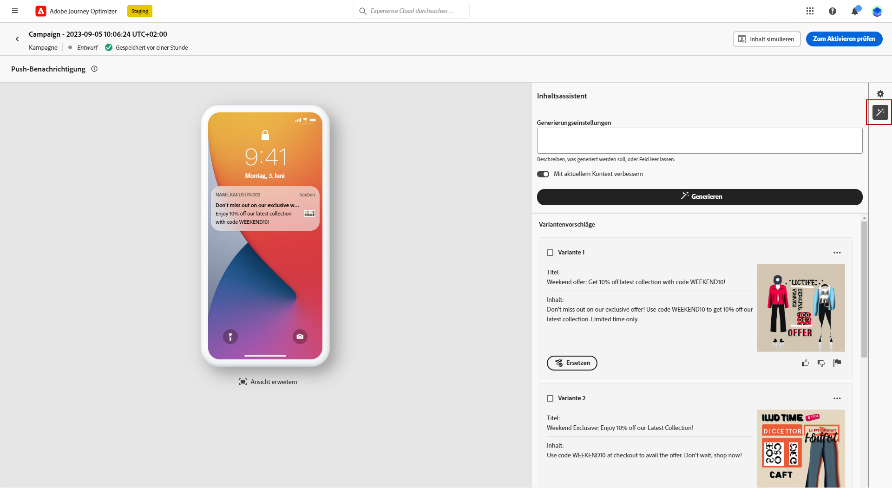
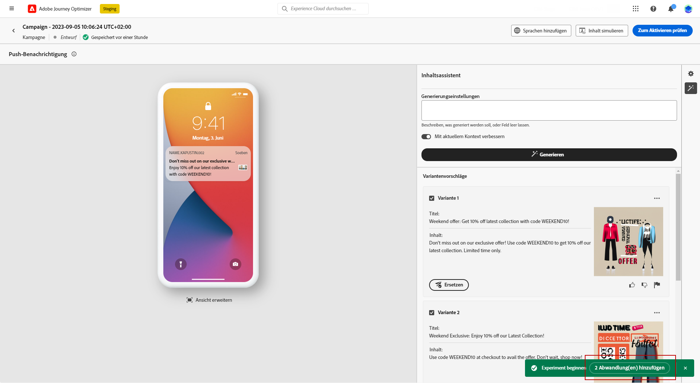
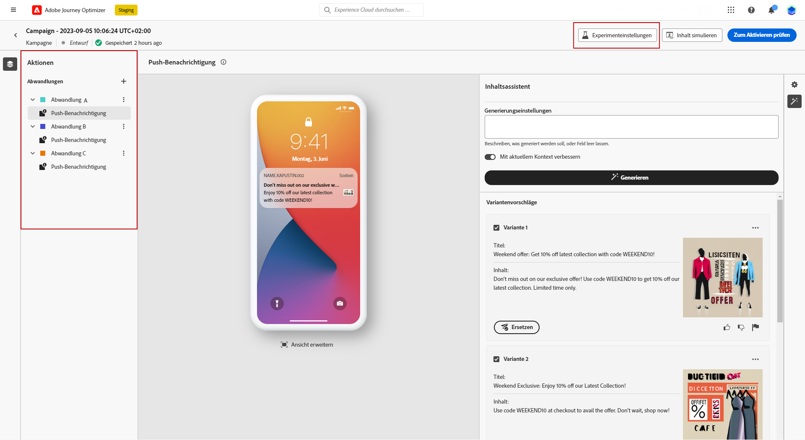

# Inhaltserstellung mit dem Content-Assistenten {#title-content-assistant}

>[!BEGINSHADEBOX]

**Inhaltsverzeichnis**

* [Erste Schritte mit dem Inhaltsassistenten](gs-generative.md)
* **[Generieren von Inhalten mit dem Inhaltsassistenten](generative-content.md)**
* [Generieren von Bildern mit dem Inhaltsassistenten](generative-image.md)

>[!ENDSHADEBOX]

Nachdem Sie Ihre Nachrichten erstellt und personalisiert haben, können Sie Ihre Inhalte mit dem Inhaltsassistenten auf die nächste Stufe bringen.

Mithilfe des Content-Assistenten können Sie die Wirkung Ihrer Nachricht durch Experimente mit unterschiedlichen Inhalten optimieren. Jede Variante wird als individuelle Behandlung betrachtet, um zu messen und zu vergleichen, welcher Inhalt effektiv mehr Klicks generiert.

In diesem speziellen Beispiel erfahren Sie, wie Sie eine ansprechende Push-Benachrichtigung mithilfe des Inhaltsexperiments senden. Führen Sie folgende Schritte aus:

1. Klicken Sie nach der Erstellung und Konfiguration Ihrer Push-Benachrichtigungs-Kampagne auf **[!UICONTROL Inhalt erstellen]**.

1. Verwenden Sie den Generierungsassistenten, um die **[!UICONTROL Titel]**.

   Klicken Sie neben dem Feld **[!UICONTROL Kopfzeile]** auf **[!UICONTROL Mit Textgenerierungsassistenten bearbeiten]**.

   

1. Wählen Sie aus dem Menü **[!UICONTROL Benutzeraktion]** die Option **[!UICONTROL Textverfeinerung]** aus:

   * **[!UICONTROL Zusammenfassen]**: Verwenden Sie diese Option, um einen Text zu kürzen und das Wesentliche beizubehalten.

   * **[!UICONTROL Elaborieren]**: Verwenden Sie diese Option, um Ihren Inhalt mit zusätzlichen kreativen Varianten aus dem Inhaltsassistenten zu erweitern.

   

1. Wählen Sie den Ton Ihrer Varianten mit dem Menü **[!UICONTROL Tonfall ändern]**.

1. Im Menü **[!UICONTROL Freiform]** können Sie auch eine Eingabeaufforderung zur besseren Feinabstimmung Ihrer Ergebnisse auswählen.

   

1. Sobald Sie die entsprechende Variante gefunden haben, klicken Sie auf **[!UICONTROL Benutzervariante]** und dann auf **[!UICONTROL Anwenden]**.

   

1. Nach der Personalisierung des **[!UICONTROL body]** Ihrer Push-Benachrichtigung, wählen Sie **[!UICONTROL Inhaltsassistent anzeigen]**.

   Hier ist bereits eine Liste mit Varianten mit Ihrem Originalinhalt verfügbar.

   

1. Passen Sie den Inhalt an, indem Sie beschreiben, was Sie generieren möchten.

   Aktivieren Sie die **[!UICONTROL Erweiterung mit aktuellem Inhalt]** die Option Inhaltsassistent verwenden, um neuen Inhalt basierend auf Ihrer Nachricht, dem Kampagnennamen und der ausgewählten Zielgruppe zu personalisieren.

1. Klicks **[!UICONTROL Ersetzen]** , um den Inhalt zu ändern oder mehrere **[!UICONTROL Variante]** erstellen **[!UICONTROL Behandlungen]** für Ihre Experimente verwenden und auf **X Behandlungen hinzufügen**.

   

1. Zugriff auf **[!UICONTROL Experimenteinstellungen]** oder **[!UICONTROL Aktionen]** Menüs zur weiteren Personalisierung Ihres Experiments. [Weitere Informationen](../campaigns/content-experiment.md)

   

1. Klicken Sie nach dem Definieren des Nachrichteninhalts auf die Schaltfläche **[!UICONTROL Inhalt simulieren]**, um das Rendern zu kontrollieren und die Personalisierungseinstellungen mit Testprofilen zu überprüfen. [Weitere Informationen](../email/preview.md)

1. Wenn Ihr Inhaltsexperiment fertig ist, können Sie auf der Seite mit der Kampagnenübersicht auf **[!UICONTROL Zum Aktivieren überprüfen]** klicken, um eine Zusammenfassung der Kampagne anzuzeigen. Es werden Warnhinweise angezeigt, wenn Parameter falsch sind oder fehlen.

1. Überprüfen Sie vor dem Start Ihrer Kampagne, ob alle Konfigurationen korrekt sind, und klicken Sie auf **[!UICONTROL Aktivieren]**.

Nach erfolgreicher Konfiguration Ihres Experiments und Ihrer Kampagne können Sie die Kampagne im Kampagnenbericht verfolgen. [Weitere Informationen](../reports/campaign-global-report.md#experimentation-report)
