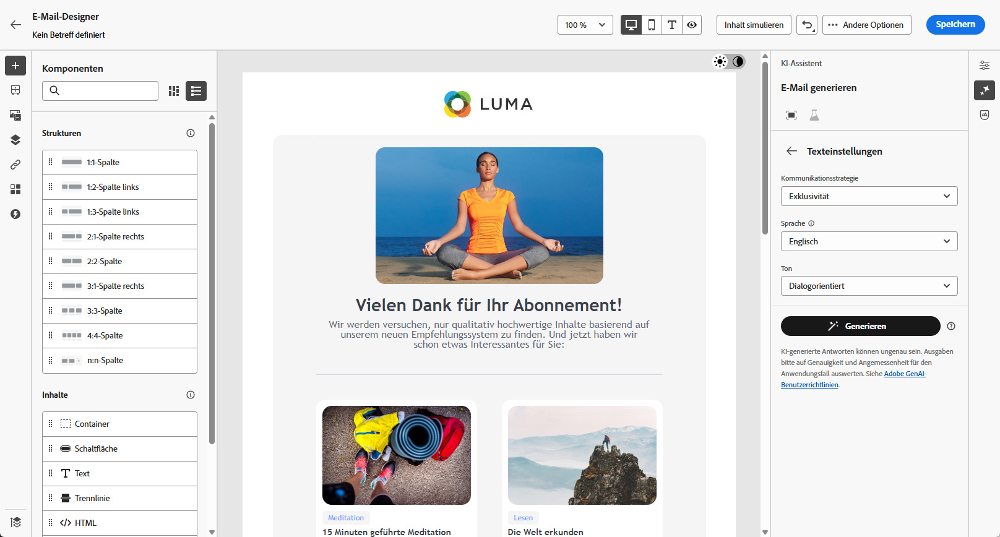
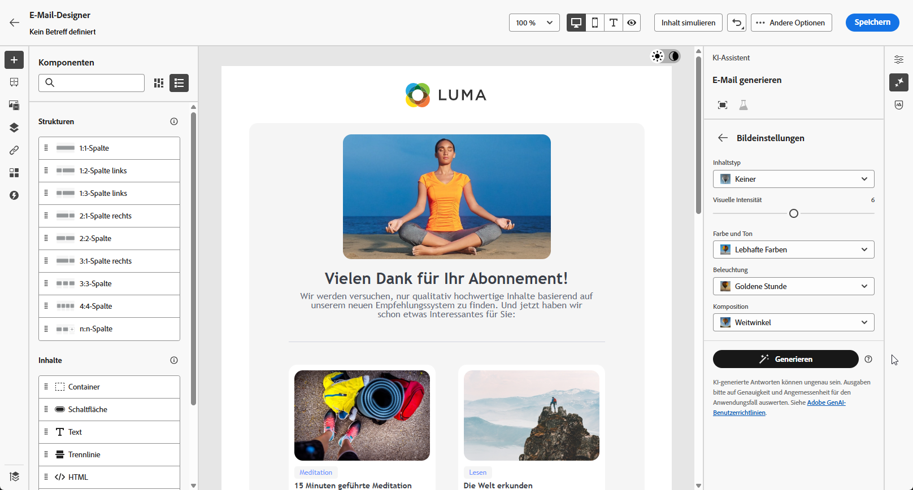
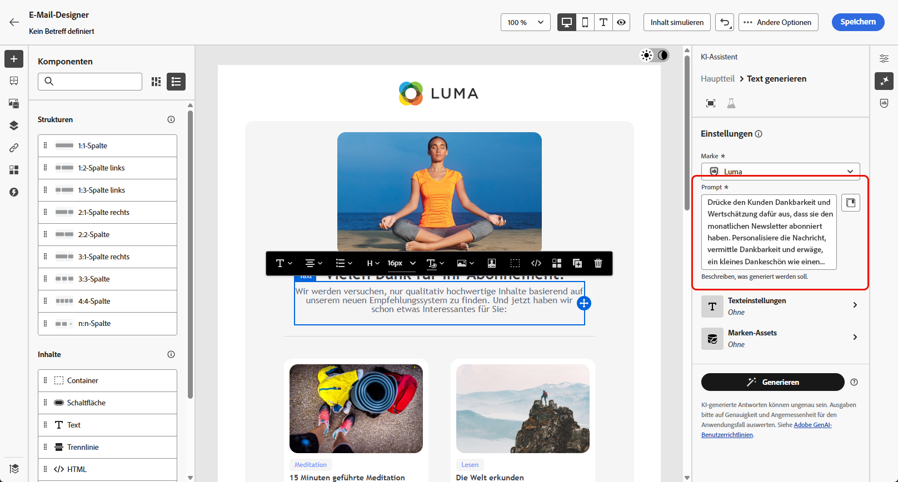
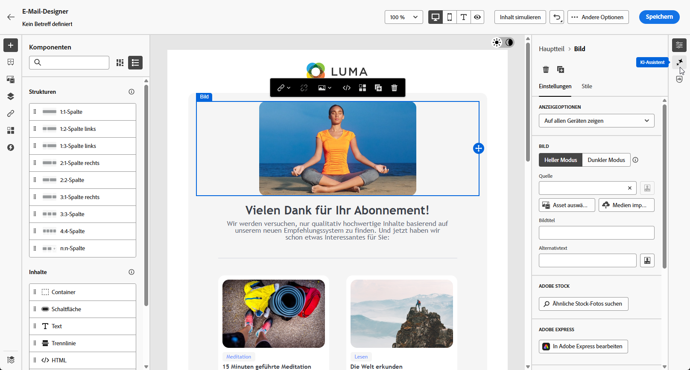

# E-Mail-Generierung mit dem AI Assistant Content Accelerator {#generative-email}

>[!IMPORTANT]
>
>Bevor Sie mit der Verwendung dieser Funktion beginnen, lesen Sie die entsprechenden Informationen zu [Schutzmechanismen und Einschränkungen](gs-generative.md#generative-guardrails).
> 
>
>Sie müssen einer [Benutzervereinbarung](https://www.adobe.com/legal/licenses-terms/adobe-dx-gen-ai-user-guidelines.html) zustimmen, bevor Sie den AI-Assistenten in Journey Optimizer für Inhaltsbeschleunigung verwenden können. Weitere Informationen erhalten Sie beim Adobe-Support.

Nachdem Sie Ihre E-Mails erstellt und angepasst haben, nutzen Sie die Funktionen des AI-Assistenten in Journey Optimizer für Inhaltsbeschleunigung, der durch generative KI unterstützt wird, um Ihre Inhalte zu verbessern.

Verwenden Sie den KI-Assistenten in Journey Optimizer for Content Acceleration, um die Effektivität Ihrer Kampagnen zu steigern, indem Sie vollständige E-Mails, maßgeschneiderte Textsnippets und benutzerdefinierte Bilder erstellen, die direkt für Ihre Zielgruppe sprechen, und so die Interaktion und Interaktion steigern.

Auf den folgenden Registerkarten erfahren Sie, wie Sie den AI-Assistenten in Journey Optimizer für Content Acceleration verwenden.

>[!BEGINTABS]

>[!TAB Vollständige E-Mail-Generierung]

Im folgenden Beispiel wird der AI-Assistent für Inhaltsbeschleunigung genutzt, um eine vorhandene E-Mail-Vorlage zu verfeinern.

1. Nachdem Sie Ihre E-Mail-Kampagne erstellt und konfiguriert haben, klicken Sie auf **[!UICONTROL Inhalt bearbeiten]**.

   Weitere Informationen zur Konfiguration Ihrer E-Mail-Kampagne finden Sie auf [dieser Seite](../campaigns/create-campaign.md).

1. Personalisieren Sie Ihr Layout nach Bedarf und greifen Sie auf das Menü **[!UICONTROL AI Assistant]** zu.

   {zoomable="yes"}

1. Aktivieren Sie die Option **[!UICONTROL Ursprünglichen Inhalt verwenden]** für den AI-Assistenten für Inhaltsbeschleunigung, um neuen Inhalt basierend auf dem ausgewählten Inhalt zu personalisieren.

1. Passen Sie den Inhalt an, indem Sie im Feld **[!UICONTROL Prompt]** beschreiben, was Sie generieren möchten.

   Wenn Sie Hilfe bei der Erstellung Ihres Prompts benötigen, finden Sie in der **[!UICONTROL Prompt-Bibliothek]** eine Vielzahl von Ideen für Prompts, mit denen Sie Ihre Kampagnen verbessern können.

   {zoomable="yes"}

1. Schalten Sie die Optionen **[!UICONTROL Betreffzeile]** und **[!UICONTROL Preheader]** ein, um sie in die Variantengenerierung einzubeziehen.

1. Passen Sie Ihre Eingabeaufforderung mit der Option **[!UICONTROL Texteinstellungen]** an:

   * **[!UICONTROL Kommunikationsstrategie]**: Wählen Sie den am besten geeigneten Kommunikationsstil für den generierten Text aus.
   * **[!UICONTROL Ton]**: Der Ton der E-Mail sollte bei Ihrer Zielgruppe ankommen. Je nachdem, ob Sie informativ, humorvoll oder überzeugend klingen möchten, kann der KI-Assistent die Nachricht entsprechend anpassen.

   {zoomable="yes"}

1. Wählen Sie Ihre **[!UICONTROL Bildeinstellungen]** aus:

   * **[!UICONTROL Inhaltstyp]**: Hiermit wird die Art des visuellen Elements kategorisiert, wobei zwischen verschiedenen Arten der visuellen Darstellung wie Fotos, Grafiken oder Kunst unterschieden wird.
   * **[!UICONTROL visuelle Intensität]**: Sie können die Wirkung des Bildes durch Anpassung seiner Intensität steuern. Durch eine niedrigere Einstellung (2) wird das Erscheinungsbild weicher, zurückhaltender dargestellt, während eine höhere Einstellung (10) das Bild lebendiger und visuell leistungsfähiger macht.
   * **[!UICONTROL Farbe und Ton]**: Die Gesamterscheinung der Farben in einem Bild und die Stimmung oder Atmosphäre, die diese vermittelt.
   * **[!UICONTROL Beleuchtung]**: Dies bezieht sich auf die Beleuchtung in einem Bild, die dessen Atmosphäre prägt und bestimmte Elemente hervorhebt.
   * **[!UICONTROL Komposition]**: Dies bezieht sich auf die Anordnung der Elemente innerhalb des Rahmens eines Bildes.

   {zoomable="yes"}

1. Klicken Sie im Menü **[!UICONTROL Marken-Assets]** auf **[!UICONTROL Marken-Asset hochladen]** , um ein Marken-Asset hinzuzufügen, das Inhalte enthält, die zusätzlichen Kontext für den AI-Assistenten bieten können, oder wählen Sie ein zuvor hochgeladenes Asset aus.

   Zuvor hochgeladene Dateien sind in der Dropdown-Liste **[!UICONTROL Hochgeladene Marken-Assets]** verfügbar. Schalten Sie einfach die Assets um, die Sie in Ihre Generierung aufnehmen möchten.

   {zoomable="yes"}

1. Wenn das Prompt fertig ist, klicken Sie auf **[!UICONTROL Generieren]**.

1. Durchsuchen Sie die generierten **[!UICONTROL Varianten]** und klicken Sie auf **[!UICONTROL Vorschau]**, um eine Vollbildversion der ausgewählten Variante anzuzeigen.

1. Navigieren Sie im Fenster **[!UICONTROL Vorschau]** zur Option **[!UICONTROL Verfeinern]**, um auf zusätzliche Anpassungsfunktionen zuzugreifen:

   * **[!UICONTROL Umformulieren]**: Der KI-Assistent kann Ihre Nachricht auf verschiedene Arten umformulieren, sodass Ihre Texte für verschiedene Zielgruppen interessant und ansprechend klingen.

   * **[!UICONTROL Einfachere Sprache verwenden]**: Nutzen Sie den KI-Assistenten, um Ihren Text zu vereinfachen, damit er für eine breitere Zielgruppe verständlich und zugänglich ist.

   Sie können auch die **[!UICONTROL Tone]** und die **[!UICONTROL Kommunikationsstrategie]** Ihres Textes ändern.

   {zoomable="yes"}

1. Klicken Sie auf **[!UICONTROL Auswählen]**, sobald Sie den passenden Inhalt gefunden haben.

   Sie können auch ein Experiment für Ihren Inhalt aktivieren. [Weitere Informationen](generative-experimentation.md)

1. Fügen Sie Personalisierungsfelder ein, um Ihre E-Mail-Inhalte auf der Grundlage von Profildaten anzupassen. Klicken Sie danach auf die Schaltfläche **[!UICONTROL Inhalte simulieren]**, um das Rendern zu steuern, und überprüfen Sie die Personalisierungseinstellungen mit Testprofilen. [Weitere Informationen](../personalization/personalize.md)

Wenn Sie Inhalt, Zielgruppe und Zeitplan definiert haben, können Sie die E-Mail-Kampagne vorbereiten. [Weitere Informationen](../campaigns/review-activate-campaign.md)

>[!TAB Nur Texterstellung]

Im folgenden Beispiel wird der KI-Assistent für Inhaltsbeschleunigung genutzt, um den Inhalt unserer E-Mail zu verbessern.

1. Nachdem Sie Ihre E-Mail-Kampagne erstellt und konfiguriert haben, klicken Sie auf **[!UICONTROL Inhalt bearbeiten]**.

   Weitere Informationen zur Konfiguration Ihrer E-Mail-Kampagne finden Sie auf [dieser Seite](../email/create-email.md).

1. Wählen Sie eine **[!UICONTROL Textkomponente]**, um nur bestimmten Inhalt zu erfassen. und rufen Sie das Menü **[!UICONTROL KI-Assistent]** auf.

   {zoomable="yes"}

1. Aktivieren Sie die Option **[!UICONTROL Ursprünglichen Inhalt verwenden]** für den AI-Assistenten für Inhaltsbeschleunigung, um neuen Inhalt basierend auf dem ausgewählten Inhalt zu personalisieren.

1. Passen Sie den Inhalt an, indem Sie im Feld **[!UICONTROL Prompt]** beschreiben, was Sie generieren möchten.

   Wenn Sie Hilfe bei der Erstellung Ihres Prompts benötigen, finden Sie in der **[!UICONTROL Prompt-Bibliothek]** eine Vielzahl von Ideen für Prompts, mit denen Sie Ihre Kampagnen verbessern können.

   {zoomable="yes"}

1. Passen Sie Ihre Eingabeaufforderung mit der Option **[!UICONTROL Texteinstellungen]** an:

   * **[!UICONTROL Kommunikationsstrategie]**: Wählen Sie den am besten geeigneten Kommunikationsstil für den generierten Text aus.
   * **[!UICONTROL Ton]**: Der Ton der E-Mail sollte bei Ihrer Zielgruppe ankommen. Je nachdem, ob Sie informativ, humorvoll oder überzeugend klingen möchten, kann der KI-Assistent die Nachricht entsprechend anpassen.
   * **Textlänge**: Wählen Sie mit dem Schieberegler die gewünschte Länge des Textes aus.

   {zoomable="yes"}

1. Klicken Sie im Menü **[!UICONTROL Marken-Assets]** auf **[!UICONTROL Marken-Asset hochladen]** , um ein Marken-Asset hinzuzufügen, das Inhalte enthält, die zusätzlichen Kontext für den AI-Assistenten bieten können, oder wählen Sie ein zuvor hochgeladenes Asset aus.

   Zuvor hochgeladene Dateien sind in der Dropdown-Liste **[!UICONTROL Hochgeladene Marken-Assets]** verfügbar. Schalten Sie einfach die Assets um, die Sie in Ihre Generierung aufnehmen möchten.

   {zoomable="yes"}

1. Wenn das Prompt fertig ist, klicken Sie auf **[!UICONTROL Generieren]**.

1. Durchsuchen Sie die generierten **[!UICONTROL Varianten]** und klicken Sie auf **[!UICONTROL Vorschau]**, um eine Vollbildversion der ausgewählten Variante anzuzeigen.

1. Navigieren Sie zur Option **[!UICONTROL Verfeinern]** im Fenster **[!UICONTROL Vorschau]**, um auf zusätzliche Anpassungsfunktionen zuzugreifen:

   * **[!UICONTROL Als Referenzinhalt verwenden]**: Die gewählte Variante dient hierbei als Referenzinhalt für die Generierung anderer Ergebnisse.

   * **[!UICONTROL Weiter ausführen]**: Der KI-Assistent kann Ihnen dabei helfen, genauer auf bestimmte Themen einzugehen und zusätzliche Details zum besseren Verständnis und für mehr Interaktion zu liefern.

   * **[!UICONTROL Zusammenfassen]**: Zu ausführliche Informationen können die Empfangenden einer E-Mail überfordern. Nutzen Sie den KI-Assistenten, um die wichtigsten Punkte in klaren, prägnanten Aussagen zusammenzufassen, die die Aufmerksamkeit der Leserinnen und Leser wecken und sie zum Weiterlesen anregen.

   * **[!UICONTROL Umformulieren]**: Der KI-Assistent kann Ihre Nachricht auf verschiedene Arten umformulieren, sodass Ihr Text frisch und für verschiedene Zielgruppen ansprechend bleibt.

   * **[!UICONTROL Einfachere Sprache verwenden]**: Nutzen Sie den KI-Assistenten, um Ihren Text zu vereinfachen, damit er für eine breitere Zielgruppe verständlich und zugänglich ist.

   Sie können auch die **[!UICONTROL Tone]** und die **[!UICONTROL Kommunikationsstrategie]** Ihres Textes ändern.

   {zoomable="yes"}

1. Klicken Sie auf **[!UICONTROL Auswählen]**, sobald Sie den passenden Inhalt gefunden haben.

   Sie können auch ein Experiment für Ihren Inhalt aktivieren. [Weitere Informationen](generative-experimentation.md)

1. Fügen Sie Personalisierungsfelder ein, um Ihre E-Mail-Inhalte auf der Grundlage von Profildaten anzupassen. Klicken Sie danach auf die Schaltfläche **[!UICONTROL Inhalte simulieren]**, um das Rendern zu steuern, und überprüfen Sie die Personalisierungseinstellungen mit Testprofilen. [Weitere Informationen](../personalization/personalize.md)

Wenn Sie Inhalt, Zielgruppe und Zeitplan definiert haben, können Sie die E-Mail-Kampagne vorbereiten. [Weitere Informationen](../campaigns/review-activate-campaign.md)

>[!TAB Nur Bildgenerierung]

Im folgenden Beispiel erfahren Sie, wie Sie mit dem KI-Assistenten für Inhaltsbeschleunigung Assets optimieren und verbessern und so ein benutzerfreundlicheres Erlebnis gewährleisten können.

1. Nachdem Sie Ihre E-Mail-Kampagne erstellt und konfiguriert haben, klicken Sie auf **[!UICONTROL Inhalt bearbeiten]**.

   Weitere Informationen zur Konfiguration Ihrer E-Mail-Kampagne finden Sie auf [dieser Seite](../email/create-email.md).

1. Wählen Sie mit dem AI-Assistenten für Inhaltsbeschleunigung das Asset aus, das Sie ändern möchten.

1. Wählen Sie aus dem Menü auf der rechten Seite die Option **[!UICONTROL KI-Assistent]** aus.

   {zoomable="yes"}

1. Aktivieren Sie die Option **[!UICONTROL Referenzstil]** für den AI-Assistenten für Inhaltsbeschleunigung, um neuen Inhalt basierend auf dem Referenzinhalt zu personalisieren. Sie können auch ein Bild hochladen, um Ihrer Variante Kontext hinzuzufügen.

1. Passen Sie den Inhalt an, indem Sie im Feld **[!UICONTROL Prompt]** beschreiben, was Sie generieren möchten.

   Wenn Sie Hilfe bei der Erstellung Ihres Prompts benötigen, finden Sie in der **[!UICONTROL Prompt-Bibliothek]** eine Vielzahl von Ideen für Prompts, mit denen Sie Ihre Kampagnen verbessern können.

   {zoomable="yes"}

1. Passen Sie Ihre Eingabeaufforderung mit der Option **[!UICONTROL Bildeinstellungen]** an:

   * **[!UICONTROL Seitenverhältnis]**: Dadurch wird die Breite und Höhe des Assets bestimmt. Sie können aus gängigen Verhältnissen wie 16:9, 4:3, 3:2 oder 1:1 wählen oder eine benutzerdefinierte Größe eingeben.
   * **[!UICONTROL Inhaltstyp]**: Hiermit wird die Art des visuellen Elements kategorisiert, wobei zwischen verschiedenen Arten der visuellen Darstellung wie Fotos, Grafiken oder Kunst unterschieden wird.
   * **[!UICONTROL visuelle Intensität]**: Sie können die Wirkung des Bildes durch Anpassung seiner Intensität steuern. Durch eine niedrigere Einstellung (2) wird das Erscheinungsbild weicher, zurückhaltender dargestellt, während eine höhere Einstellung (10) das Bild lebendiger und visuell leistungsfähiger macht.
   * **[!UICONTROL Farbe und Ton]**: Die Gesamterscheinung der Farben in einem Bild und die Stimmung oder Atmosphäre, die diese vermittelt.
   * **[!UICONTROL Beleuchtung]**: Dies bezieht sich auf die Beleuchtung in einem Bild, die dessen Atmosphäre prägt und bestimmte Elemente hervorhebt.
   * **[!UICONTROL Komposition]**: Dies bezieht sich auf die Anordnung der Elemente innerhalb des Rahmens eines Bildes.

   {zoomable="yes"}

1. Klicken Sie im Menü **[!UICONTROL Marken-Assets]** auf **[!UICONTROL Marken-Asset hochladen]** , um ein Marken-Asset hinzuzufügen, das Inhalte enthält, die zusätzlichen Kontext für den AI-Assistenten bieten können, oder wählen Sie ein zuvor hochgeladenes Asset aus.

   Zuvor hochgeladene Dateien sind in der Dropdown-Liste **[!UICONTROL Hochgeladene Marken-Assets]** verfügbar. Schalten Sie einfach die Assets um, die Sie in Ihre Generierung aufnehmen möchten.

1. Sobald Sie mit der Konfiguration der Eingabeaufforderung zufrieden sind, klicken Sie auf **[!UICONTROL Generieren]**.

1. Durchsuchen Sie die **[!UICONTROL Variantenvorschläge]**, um das gewünschte Asset zu finden.

   Klicken Sie auf **[!UICONTROL Vorschau]**, um eine Vollbildversion der ausgewählten Variante anzuzeigen.

1. Wählen Sie **[!UICONTROL Ähnliches erzeugen]** , wenn Sie verwandte Bilder für diese Variante anzeigen möchten.

1. Klicken Sie auf **[!UICONTROL Auswählen]**, sobald Sie den passenden Inhalt gefunden haben.

   Sie können auch ein Experiment für Ihren Inhalt aktivieren. [Weitere Informationen](generative-experimentation.md)

1. Klicken Sie nach dem Definieren des Nachrichteninhalts auf die Schaltfläche **[!UICONTROL Inhalt simulieren]**, um das Rendern zu kontrollieren und die Personalisierungseinstellungen mit Testprofilen zu überprüfen. [Weitere Informationen](../personalization/personalize.md)

1. Wenn Sie Inhalt, Zielgruppe und Zeitplan definiert haben, können Sie die E-Mail-Kampagne vorbereiten. [Weitere Informationen](../campaigns/review-activate-campaign.md)

>[!ENDTABS]

## Anleitungsvideo {#video}

Erfahren Sie, wie Sie mit dem KI-Assistenten in Journey Optimizer for Content Acceleration vollständige E-Mails, Texte oder Bilder generieren können.

>[!VIDEO](https://video.tv.adobe.com/v/3433552)
