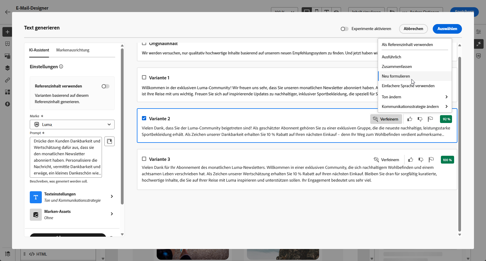
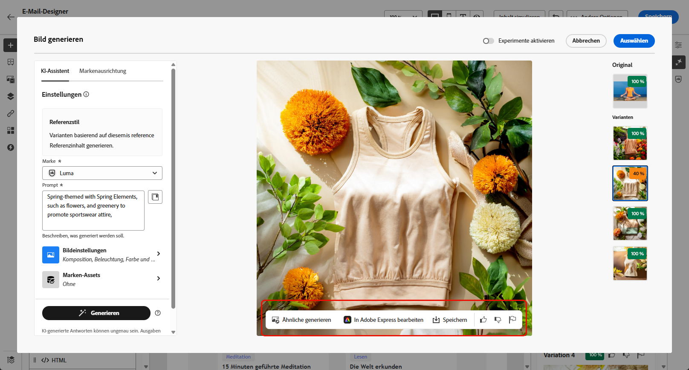

# Generierung von E-Mails mit dem KI-Assistenten {#generative-email}

>[!BEGINSHADEBOX]

**Inhaltsverzeichnis**

* [Erste Schritte mit dem KI-Assistenten](gs-generative.md)
* Generierung von E-Mails mit dem KI-Assistenten
* [SMS-Generierung mit dem KI-Assistenten](generative-sms.md)
* [Generierung von Push-Benachrichtigungen mit dem KI-Assistenten](generative-push.md)
* [Inhaltsexperiment mit dem KI-Assistenten](generative-experimentation.md)

>[!ENDSHADEBOX]

>[!NOTE]
>
>Bevor Sie mit der Verwendung dieser Funktion beginnen, lesen Sie die entsprechenden Informationen zu [Schutzmechanismen und Einschränkungen](gs-generative.md#generative-guardrails).

Nachdem Sie Ihre E-Mails erstellt und angepasst haben, können Sie Ihren Inhalt mithilfe des KI-Assistenten in Journey Optimizer, der auf generativer KI basiert, auf die nächste Stufe bringen.

Verwenden Sie den KI-Assistenten, um die Effektivität Ihrer Kampagnen zu steigern, indem Sie vollständige E-Mails, maßgeschneiderte Textfragmente und benutzerdefinierte Bilder erstellen, die direkt Ihre Zielgruppe ansprechen, wodurch Interaktionen gefördert werden.

Auf den folgenden Registerkarten erfahren Sie, wie Sie den KI-Assistenten in Journey Optimizer verwenden.

>[!BEGINTABS]

>[!TAB Vollständige E-Mail-Generierung]

Im folgenden Beispiel nutzen wir den KI-Assistenten, um eine vorhandene E-Mail-Vorlage zu verfeinern.

1. Nachdem Sie Ihre E-Mail-Kampagne erstellt und konfiguriert haben, klicken Sie auf **[!UICONTROL Inhalt bearbeiten]**.

   Weitere Informationen zur Konfiguration Ihrer E-Mail-Kampagne finden Sie auf [dieser Seite](../campaigns/create-campaign.md).

1. Personalisieren Sie Ihre E-Mail nach Bedarf und öffnen Sie das Menü **[!UICONTROL KI-Assistent]**.

   {zoomable="yes"}

1. Aktivieren Sie für den KI-Assistenten die Option **[!UICONTROL Originalinhalt verwenden]**, um neue Inhalte basierend auf dem Inhalt der Kampagne, dem Namen und der ausgewählten Zielgruppe zu personalisieren.

   Ihr Prompt muss immer an Ihren aktuellen Inhalt gebunden sein.

1. Passen Sie den Inhalt an, indem Sie im Feld **[!UICONTROL Prompt]** beschreiben, was Sie generieren möchten.

   Wenn Sie Hilfe bei der Erstellung Ihres Prompts benötigen, finden Sie in der **[!UICONTROL Prompt-Bibliothek]** eine Vielzahl von Ideen für Prompts, mit denen Sie Ihre Kampagnen verbessern können.

   {zoomable="yes"}

1. Schalten Sie die Optionen **[!UICONTROL Betreffzeile]** und **[!UICONTROL Preheader]** ein, um sie in die Variantengenerierung einzubeziehen.

1. Klicken Sie auf **[!UICONTROL Marken-Asset hochladen]**, um ein beliebiges Marken-Asset hinzuzufügen, das Inhalte enthält, die zusätzlichen Kontext für den KI-Assistenten bieten können. Wählen Sie alternativ ein zuvor hochgeladenes Asset aus.

   {zoomable="yes"}

1. Passen Sie Ihr Prompt mit den verschiedenen Optionen an:

   * **[!UICONTROL Kommunikationsstrategie]**: Wählen Sie den am besten geeigneten Kommunikationsstil für den generierten Text aus.
   * **[!UICONTROL Sprache]**: Wählen Sie die Sprache aus, in der Sie Ihre Inhalte generieren möchten.
   * **[!UICONTROL Ton]**: Der Ton der E-Mail sollte bei Ihrer Zielgruppe ankommen. Je nachdem, ob Sie informativ, humorvoll oder überzeugend klingen möchten, kann der KI-Assistent die Nachricht entsprechend anpassen.

   {zoomable="yes"}

1. Wenn das Prompt fertig ist, klicken Sie auf **[!UICONTROL Generieren]**.

1. Durchsuchen Sie die generierten **[!UICONTROL Varianten]** und klicken Sie auf **[!UICONTROL Vorschau]**, um eine Vollbildversion der ausgewählten Variante anzuzeigen.

1. Navigieren Sie im Fenster **[!UICONTROL Vorschau]** zur Option **[!UICONTROL Verfeinern]**, um auf zusätzliche Anpassungsfunktionen zuzugreifen:

   * **[!UICONTROL Umformulieren]**: Der KI-Assistent kann Ihre Nachricht auf verschiedene Arten umformulieren, sodass Ihre Texte für verschiedene Zielgruppen interessant und ansprechend klingen.

   * **[!UICONTROL Einfachere Sprache verwenden]**: Nutzen Sie den KI-Assistenten, um Ihren Text zu vereinfachen, damit er für eine breitere Zielgruppe verständlich und zugänglich ist.

   {zoomable="yes"}

1. Klicken Sie auf **[!UICONTROL Auswählen]**, sobald Sie den passenden Inhalt gefunden haben.

   Sie können auch ein Experiment für Ihren Inhalt aktivieren. [Weitere Informationen](generative-experimentation.md)

1. Fügen Sie Personalisierungsfelder ein, um Ihre E-Mail-Inhalte auf der Grundlage von Profildaten anzupassen. Klicken Sie danach auf die Schaltfläche **[!UICONTROL Inhalte simulieren]**, um das Rendern zu steuern, und überprüfen Sie die Personalisierungseinstellungen mit Testprofilen. [Weitere Informationen](../personalization/personalize.md)

Wenn Sie Inhalt, Zielgruppe und Zeitplan definiert haben, können Sie die E-Mail-Kampagne vorbereiten. [Weitere Informationen](../campaigns/review-activate-campaign.md)

>[!TAB Textgenerierung]

Im folgenden Beispiel werden wir den KI-Assistenten nutzen, um den Inhalt unserer E-Mail-Einladung zu verbessern.

1. Nachdem Sie Ihre E-Mail-Kampagne erstellt und konfiguriert haben, klicken Sie auf **[!UICONTROL Inhalt bearbeiten]**.

   Weitere Informationen zur Konfiguration Ihrer E-Mail-Kampagne finden Sie auf [dieser Seite](../email/create-email.md).

1. Wählen Sie eine **[!UICONTROL Textkomponente]**, um nur bestimmten Inhalt zu erfassen. und rufen Sie das Menü **[!UICONTROL KI-Assistent]** auf.

   {zoomable="yes"}

1. Aktivieren Sie für den KI-Assistenten die Option **[!UICONTROL Originalinhalt verwenden]**, um neue Inhalte basierend auf dem Inhalt der Kampagne, dem Namen und der ausgewählten Zielgruppe zu personalisieren.

   Ihr Prompt muss immer an Ihren aktuellen Inhalt gebunden sein.

1. Passen Sie den Inhalt an, indem Sie im Feld **[!UICONTROL Prompt]** beschreiben, was Sie generieren möchten.

   Wenn Sie Hilfe bei der Erstellung Ihres Prompts benötigen, finden Sie in der **[!UICONTROL Prompt-Bibliothek]** eine Vielzahl von Ideen für Prompts, mit denen Sie Ihre Kampagnen verbessern können.

   {zoomable="yes"}

1. Klicken Sie auf **[!UICONTROL Marken-Asset hochladen]**, um ein beliebiges Marken-Asset hinzuzufügen, das Inhalte enthält, die zusätzlichen Kontext für den KI-Assistenten bieten können.

   {zoomable="yes"}

1. Passen Sie Ihr Prompt mit den verschiedenen Optionen an:

   * **[!UICONTROL Kommunikationsstrategie]**: Wählen Sie den gewünschten Kommunikationsansatz für den erstellten Text.
   * **[!UICONTROL Sprache]**: Wählen Sie die Sprache für den Inhalt der Variante.
   * **[!UICONTROL Ton]**: Stellen Sie sicher, dass der Text für Ihre Zielgruppe und Ihren Zweck geeignet ist.
   * **[!UICONTROL Länge]**: Legen Sie die Länge Ihres Inhalts mit dem Schieberegler fest.

   {zoomable="yes"}

1. Wenn das Prompt fertig ist, klicken Sie auf **[!UICONTROL Generieren]**.

1. Durchsuchen Sie die generierten **[!UICONTROL Varianten]** und klicken Sie auf **[!UICONTROL Vorschau]**, um eine Vollbildversion der ausgewählten Variante anzuzeigen.

1. Navigieren Sie zur Option **[!UICONTROL Verfeinern]** im Fenster **[!UICONTROL Vorschau]**, um auf zusätzliche Anpassungsfunktionen zuzugreifen:

   * **[!UICONTROL Als Referenzinhalt verwenden]**: Die gewählte Variante dient hierbei als Referenzinhalt für die Generierung anderer Ergebnisse.

   * **[!UICONTROL Weiter ausführen]**: Der KI-Assistent kann Ihnen dabei helfen, genauer auf bestimmte Themen einzugehen und zusätzliche Details zum besseren Verständnis und für mehr Interaktion zu liefern.

   * **[!UICONTROL Zusammenfassen]**: Zu ausführliche Informationen können die Empfangenden einer E-Mail überfordern. Nutzen Sie den KI-Assistenten, um die wichtigsten Punkte in klaren, prägnanten Aussagen zusammenzufassen, die die Aufmerksamkeit der Leserinnen und Leser wecken und sie zum Weiterlesen anregen.

   * **[!UICONTROL Umformulieren]**: Der KI-Assistent kann Ihre Nachricht auf verschiedene Arten umformulieren, sodass Ihr Text frisch und für verschiedene Zielgruppen ansprechend bleibt.

   * **[!UICONTROL Einfachere Sprache verwenden]**: Nutzen Sie den KI-Assistenten, um Ihren Text zu vereinfachen, damit er für eine breitere Zielgruppe verständlich und zugänglich ist.

   {zoomable="yes"}

1. Klicken Sie auf **[!UICONTROL Auswählen]**, sobald Sie den passenden Inhalt gefunden haben.

   Sie können auch ein Experiment für Ihren Inhalt aktivieren. [Weitere Informationen](generative-experimentation.md)

1. Fügen Sie Personalisierungsfelder ein, um Ihre E-Mail-Inhalte auf der Grundlage von Profildaten anzupassen. Klicken Sie danach auf die Schaltfläche **[!UICONTROL Inhalte simulieren]**, um das Rendern zu steuern, und überprüfen Sie die Personalisierungseinstellungen mit Testprofilen. [Weitere Informationen](../personalization/personalize.md)

Wenn Sie Inhalt, Zielgruppe und Zeitplan definiert haben, können Sie die E-Mail-Kampagne vorbereiten. [Weitere Informationen](../campaigns/review-activate-campaign.md)

>[!TAB Bildgenerierung]

Im folgenden Beispiel erfahren Sie, wie Sie den KI-Assistenten nutzen können, um Ihre Assets zu optimieren und zu verbessern und so ein benutzerfreundlicheres Erlebnis zu gewährleisten.

1. Nachdem Sie Ihre E-Mail-Kampagne erstellt und konfiguriert haben, klicken Sie auf **[!UICONTROL Inhalt bearbeiten]**.

   Weitere Informationen zur Konfiguration Ihrer E-Mail-Kampagne finden Sie auf [dieser Seite](../email/create-email.md).

1. Geben Sie die **[!UICONTROL grundlegenden Details]** für Ihre Kampagne ein. Klicken Sie abschließend auf **[!UICONTROL E-Mail-Inhalt bearbeiten]**.

1. Wählen Sie das Asset aus, das Sie mit dem KI-Assistenten ändern möchten.

1. Wählen Sie aus dem Menü auf der rechten Seite die Option **[!UICONTROL KI-Assistent]** aus.

   {zoomable="yes"}

1. Aktivieren Sie für den KI-Assistenten die Option **[!UICONTROL Referenzstil]**, um neue Inhalte basierend auf dem Referenzinhalt zu personalisieren. Sie können auch ein Bild hochladen, um Ihrer Variante Kontext hinzuzufügen.

   Ihr Prompt muss immer an Ihren aktuellen Inhalt gebunden sein.

1. Passen Sie den Inhalt an, indem Sie im Feld **[!UICONTROL Prompt]** beschreiben, was Sie generieren möchten.

   Wenn Sie Hilfe bei der Erstellung Ihres Prompts benötigen, finden Sie in der **[!UICONTROL Prompt-Bibliothek]** eine Vielzahl von Ideen für Prompts, mit denen Sie Ihre Kampagnen verbessern können.

   {zoomable="yes"}

1. Klicken Sie auf **[!UICONTROL Marken-Asset hochladen]**, um ein beliebiges Marken-Asset hinzuzufügen, das Inhalte enthält, die zusätzlichen Kontext für den KI-Assistenten bieten können.

1. Passen Sie Ihr Prompt mit den verschiedenen Optionen an:

   * **[!UICONTROL Seitenverhältnis]**: Dadurch wird die Breite und Höhe des Assets bestimmt. Sie können aus gängigen Verhältnissen wie 16:9, 4:3, 3:2 oder 1:1 wählen oder eine benutzerdefinierte Größe eingeben.
   * **[!UICONTROL Farbe und Ton]**: Die Gesamterscheinung der Farben in einem Bild und die Stimmung oder Atmosphäre, die diese vermittelt.
   * **[!UICONTROL Inhaltstyp]**: Hiermit wird die Art des visuellen Elements kategorisiert, wobei zwischen verschiedenen Arten der visuellen Darstellung wie Fotos, Grafiken oder Kunst unterschieden wird.
   * **[!UICONTROL Beleuchtung]**: Dies bezieht sich auf die Beleuchtung in einem Bild, die dessen Atmosphäre prägt und bestimmte Elemente hervorhebt.
   * **[!UICONTROL Komposition]**: Dies bezieht sich auf die Anordnung der Elemente innerhalb des Rahmens eines Bildes.

   {zoomable="yes"}

1. Sobald Sie mit der Konfiguration der Eingabeaufforderung zufrieden sind, klicken Sie auf **[!UICONTROL Generieren]**.

1. Durchsuchen Sie die **[!UICONTROL Variantenvorschläge]**, um das gewünschte Asset zu finden.

   Klicken Sie auf **[!UICONTROL Vorschau]**, um eine Vollbildversion der ausgewählten Variante anzuzeigen.

   {zoomable="yes"}

1. Wählen Sie **[!UICONTROL Ähnliche anzeigen]**, wenn Sie verwandte Bilder zu dieser Variante anzeigen möchten.

   {zoomable="yes"}

1. Klicken Sie auf **[!UICONTROL Auswählen]**, sobald Sie den passenden Inhalt gefunden haben.

   Sie können auch ein Experiment für Ihren Inhalt aktivieren. [Weitere Informationen](generative-experimentation.md)

1. Klicken Sie nach dem Definieren des Nachrichteninhalts auf die Schaltfläche **[!UICONTROL Inhalt simulieren]**, um das Rendern zu kontrollieren und die Personalisierungseinstellungen mit Testprofilen zu überprüfen. [Weitere Informationen](../personalization/personalize.md)

1. Wenn Sie Inhalt, Zielgruppe und Zeitplan definiert haben, können Sie die E-Mail-Kampagne vorbereiten. [Weitere Informationen](../campaigns/review-activate-campaign.md)

>[!ENDTABS]

## Anleitungsvideo {#video}

Erfahren Sie, wie Sie den KI-Assistenten nutzen können, um ganze E-Mails, Texte oder Bilder zu erstellen.

>[!VIDEO](https://video.tv.adobe.com/v/3428341)
