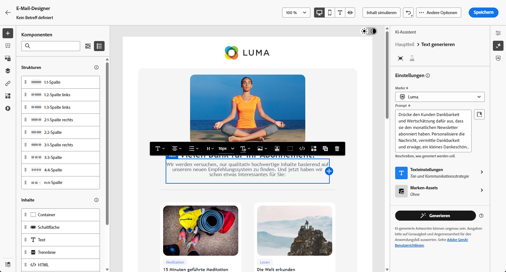
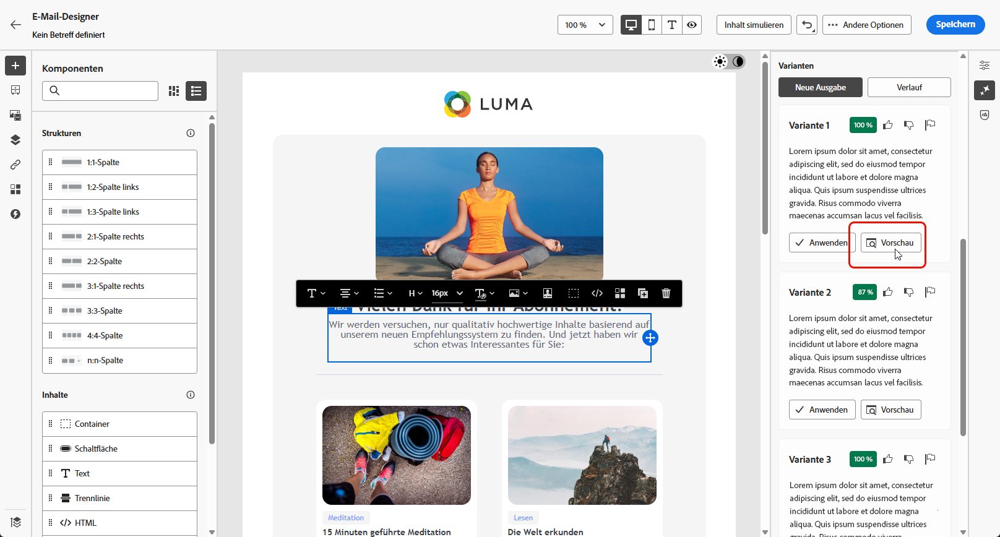
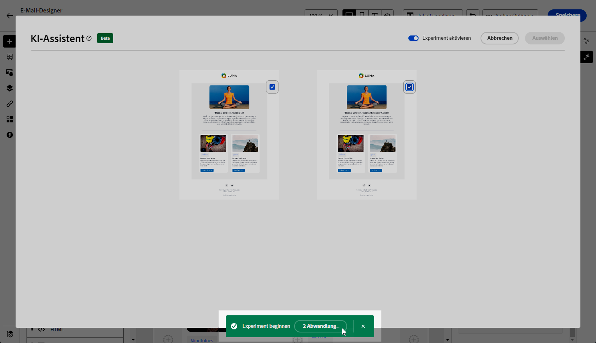

# Inhaltsexperiment mit dem KI-Assistenten{#generative-experimentation}

>[!IMPORTANT]
>
>Bevor Sie mit der Verwendung dieser Funktion beginnen, lesen Sie die entsprechenden Informationen zu [Leitlinien und Einschränkungen](gs-generative.md#generative-guardrails).
> 
>
>Sie müssen einer [Benutzervereinbarung](https://www.adobe.com/de/legal/licenses-terms/adobe-dx-gen-ai-user-guidelines.html) zustimmen, damit Sie den KI-Assistenten in Journey Optimizer verwenden können. Weitere Informationen erhalten Sie beim Adobe-Support.

Nachdem Sie Ihre Nachrichten erstellt und personalisiert haben, können Sie Ihren Inhalt mithilfe des KI-Assistenten in Adobe Journey Optimizer, der die Inhaltsexperiment-Funktion umfasst, weiterentwickeln. Mit diesem Tool können Sie mehrere Versandabwandlungen mit unterschiedlichem Inhalt definieren, um deren Leistung für Ihre Zielgruppe zu messen.

1. Erstellen Sie Ihre Kampagne und generieren Sie Varianten mit dem KI-Assistenten.

   In diesem Beispiel haben wir eine Bestätigungs-E-Mail für ein Abonnement mit einem Angebots-Code generiert.

   

1. Durchsuchen Sie die generierten **[!UICONTROL Varianten]** und klicken Sie auf **[!UICONTROL Vorschau]**, um eine Vollbildversion der ausgewählten Variante anzuzeigen.

   

1. Wählen Sie **[!UICONTROL Experiment aktivieren]** aus, um die Erstellung von **[!UICONTROL Abwandlungen]** für Ihr Experiment zu starten.

1. Wählen Sie die Varianten aus, die Sie in Ihr Experiment aufnehmen möchten.

1. Klicken Sie auf **Zu Experiment hinzufügen**.

   

1. Sie können jetzt in Ihrem Inhaltsexperiment mit der Konfiguration Ihres Inhaltsexperiments beginnen. [Weitere Informationen zu Inhaltsexperimenten](../content-management/content-experiment.md)

1. Wenn Ihr Inhaltsexperiment fertig ist, können Sie auf der Seite mit der Kampagnenübersicht auf **[!UICONTROL Zum Aktivieren überprüfen]** klicken, um eine Zusammenfassung der Kampagne anzuzeigen. Es werden Warnhinweise angezeigt, wenn Parameter falsch sind oder fehlen.  [Weitere Informationen](../content-management/content-experiment.md#treatment-experiment)

1. Überprüfen Sie vor dem Start Ihrer Kampagne, ob alle Konfigurationen korrekt sind, und klicken Sie auf **[!UICONTROL Aktivieren]**.

Nach erfolgreicher Konfiguration und Personalisierung Ihrer Kampagne können Sie die Kampagne im Kampagnenbericht verfolgen. [Weitere Informationen](../reports/campaign-global-report-cja.md)
